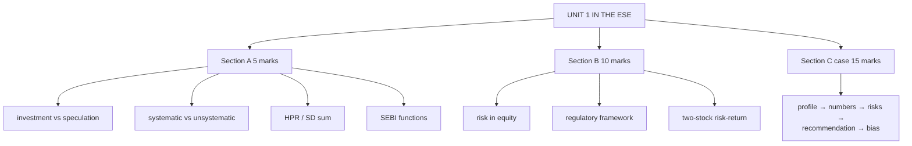

# EI-5: Unit 1 Exam Answers

Covers: what the ESE will ask from Unit 1, 5-mark and 10-mark skeletons, and a 15-mark case layout with a model answer. Numbers come from EI-1 to EI-4.

## What the test will ask

Assume Section A 3 × 5, Section B 2 × 10, one 15-mark case. Unit 1 is CO1 (key investment concepts, markets and instruments). Mostly theory, plus one standard sum (return, SD, covariance, correlation).

## Five-mark answer skeletons

**1. Investment vs speculation vs gambling (EI-1).** Table on horizon, risk, basis, return, funds, economic role; one-line conclusion: the same asset can be either.

**2. Arbitrage (EI-1).** Definition; riskless because simultaneous; worked ₹500/₹502 example; role in aligning prices.

**3. Systematic vs unsystematic risk (EI-2).** Definitions; three examples each; comparison table; only systematic is rewarded.

**4. HPR and SD sum (EI-3).** Formula → table → result → CV → interpretation.

**5. Functions of SEBI (EI-4).** Objectives; protective, regulatory, developmental functions with two examples each.

**6. Factors influencing equity decisions (EI-4).** Demographic, economic, company, goals, risk appetite, information, three behavioural biases.

## Ten-mark answer skeletons

**A. Risk in equity investment (EI-2).** Meaning and measurement → systematic (market, interest rate, inflation) → unsystematic (business, financial, liquidity) → table → managing risk.

**B. Regulatory framework of Indian equity markets (EI-4).** SEBI (objectives, functions, powers) → key laws → exchanges and their functions → clearing and depositories → investor protection.

**C. Risk-return analysis of two securities (EI-3).** Full five-year table, means, SDs, CVs, covariance, correlation, recommendation.

## Fifteen-mark case layout (investor advice)

1. **Investor profile (2):** age, goals, horizon, risk appetite; classify (conservative/moderate/aggressive).
2. **Return and risk of the candidate stocks (6):** means, SDs, CVs, correlation.
3. **Risks identified (3):** systematic vs unsystematic in the case facts (e.g. high debt = financial risk; thin trading = liquidity risk).
4. **Recommendation (3):** which stock or mix, why, linked to the profile and correlation.
5. **Behavioural caution (1):** one bias the investor shows and how to counter it.

### Model answer (sketch)

**Data (illustrative):** a 28-year-old salaried investor, 10-year horizon, says "I'll buy what my friends are buying". Stocks A and B as in EI-3; A is a highly leveraged mid-cap with low trading volume.

1. **Profile:** young, long horizon → can take moderate-to-high risk; but shows **herd behaviour**.
2. **Numbers:** A 10% / 7.48% (CV 0.75); B 8% / 3.79% (CV 0.47); ρ = 0.93.
3. **Risks:** A carries **financial risk** (high debt) and **liquidity risk** (thin trading), both unsystematic; both stocks share market risk.
4. **Recommendation:** B as the core holding (better return per unit of risk); a small A position only for growth, accepting its specific risks; because ρ = 0.93, the pair gives little diversification, so add a stock from a different sector or an index fund.
5. **Bias:** herding: base decisions on analysis and a written plan, not on friends' picks; use SIPs to avoid timing errors.

## What to remember

- Investment vs speculation vs gambling and systematic vs unsystematic are the two most predictable theory questions.
- Sum model: HPR 15.2%; A 7.48% vs B 3.79%; CV 0.75 vs 0.47; ρ 0.93.
- Case: profile → numbers → risks → recommendation → bias.

## Concept map

## Flashcards
Q: Steps of the Unit 1 investor-advice case?
A: Investor profile, return and risk numbers, risks identified, recommendation, behavioural caution.

Q: Skeleton for "investment vs speculation vs gambling"?
A: Comparison table on horizon, risk, basis, return, funds and economic role, then the line that the same asset can be either.

Q: Skeleton for a 10-mark regulatory framework answer?
A: SEBI (objectives, functions, powers), key laws, exchanges and functions, clearing and depositories, investor protection.

## Sources
- BBA301F-5 course plan, Unit 1 and assessment outline
- [[SAPM Unit 1 - Equity Investments MOC (Node Map)]]
