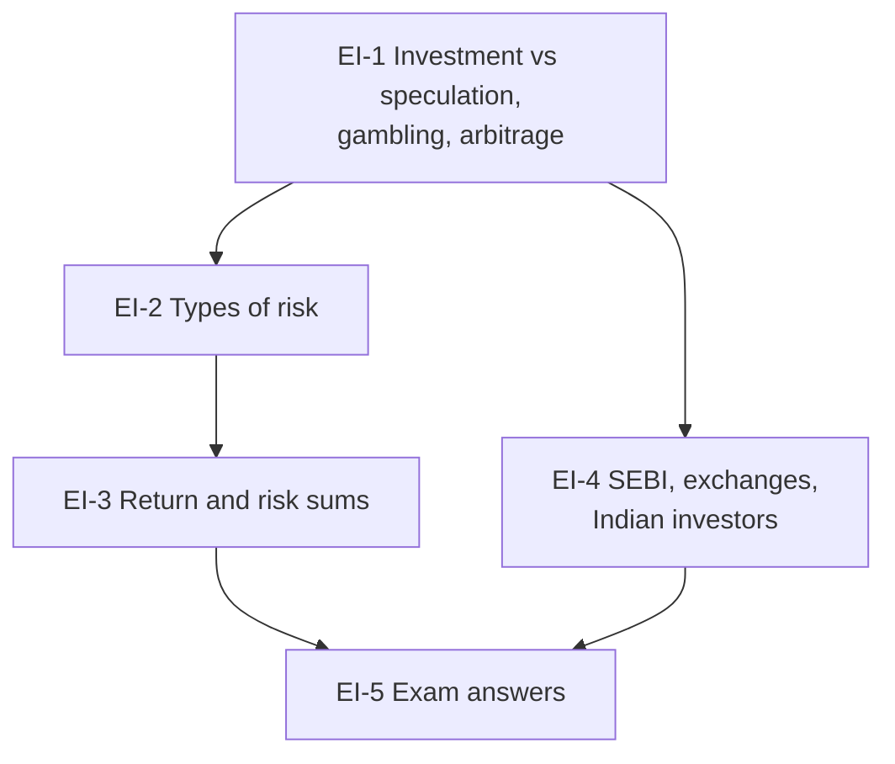

# SAPM Unit 1: Introduction to Equity Investments, node map

ESE: 50 marks, assume 3 × 5, 2 × 10, one 15-mark case. Unit 1 is CO1 (key investment concepts, markets and instruments): mostly theory plus a return-risk sum. Examples are **illustrative**; regulatory facts are from SEBI and exchange public material.

## Nodes

| Node | Topic | Deps | Minutes | Exam focus |
|---|---|---|---|---|
| EI-1 | Investment, Speculation, Gambling and Arbitrage | none | 30 | yes |
| EI-2 | Types of Risk in Equity Investment | EI-1 | 30 | yes |
| EI-3 | Single Security Return and Risk | EI-2 | 45 | yes |
| EI-4 | Regulatory Framework and Indian Investors | EI-1 | 35 | no |
| EI-5 | Unit 1 Exam Answers | EI-1 to EI-4 | 25 | yes |

Total reading time: about 165 minutes.

## Dependency graph

## Headline numbers and facts to know

- HPR: buy ₹250, dividend ₹8, sell ₹280 → 15.2%; over 2 years → 7.33% a year.
- Two stocks: A 10% / 7.48% (CV 0.75); B 8% / 3.79% (CV 0.47); covariance 26.4; correlation 0.93.
- Arbitrage ₹500 (NSE) vs ₹502 (BSE), 1,000 shares: ₹2,000 gross, ≈ ₹1,499 after 0.05% costs.
- ₹1 lakh at 12%: ₹3.1 lakh in 10 years, ₹9.6 lakh in 20.
- SEBI 1988, statutory 1992; SCRA 1956; Depositories Act 1996; T+1 settlement; NSDL and CDSL.

## Links
- [[SAPM MOC]]
