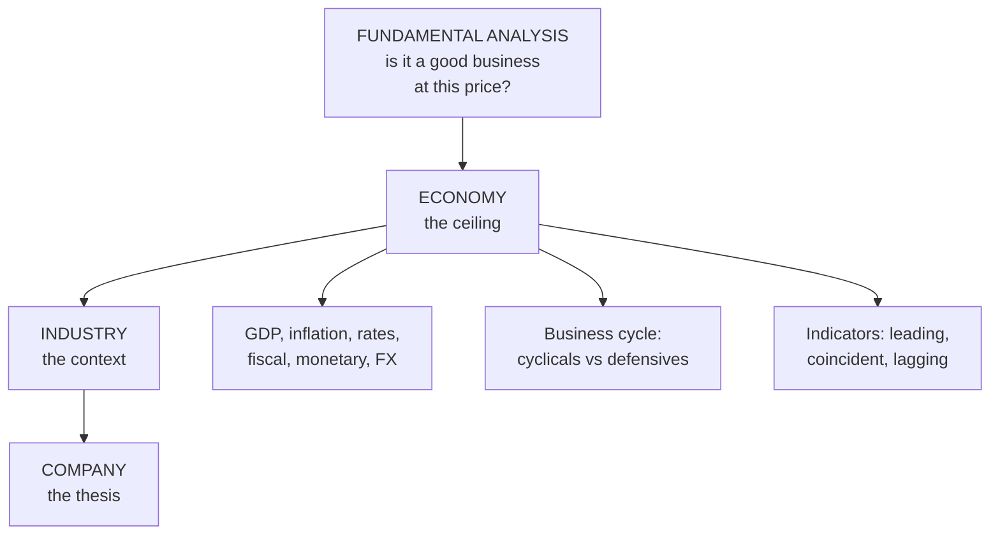

# FA-1: Concept of Fundamental Analysis and Economy Analysis

Covers: what fundamental analysis is and why it matters, the top-down EIC (economy → industry → company) framework and why it runs in that order, and economy analysis: the macro variables, the business cycle, and leading, coincident and lagging indicators. **(syllabus)**

## Where this fits in the ESE

ESE: 50 marks (assume 3 × 5, 2 × 10, one 15-mark case). Unit 2 was CIA2's whole case study and returns in the ESE (CO2). "Explain the EIC framework" and "economic factors in fundamental analysis" are standard 5- and 10-markers; the EIC paragraph opens every case answer.

## Concept and importance

**Fundamental analysis** estimates a share's **intrinsic value** by examining the factors that drive a company's earnings, growth and risk: the economy, the industry and the company itself (management, financial statements, ratios). It answers one question: **is this a good business, priced reasonably?**

**Importance:**
1. Identifies under- and overvalued shares (value vs price).
2. Basis for long-term investment decisions.
3. Assesses financial health and risk before committing money.
4. Links market prices to real economic performance.
5. Supports the margin-of-safety discipline (FA-5).

Fundamental analysis decides **what** to buy; technical analysis (Unit 3) decides **when**.

## The EIC framework (top-down)

| Level | What's assessed | Key signals |
|---|---|---|
| **Economy** | Macro environment | GDP growth, inflation, interest rates, fiscal and monetary policy |
| **Industry** | Competitive context | Life-cycle stage, entry barriers, rivalry, regulation |
| **Company** | The investment target | Management, moat, financials, valuation |

**Why in this order:** each layer is a **filter**. The economy sets the **ceiling** for every company; the industry sets the **competitive context** inside that ceiling; the company is where the actual investment thesis lives. Screening macro and structural risks first (which you can't diversify within one company) saves effort for company-specific analysis, where your work adds value. A brilliant company in a collapsing industry, in a recession, is a different investment from the same company in a growing one.

(A **bottom-up** approach starts from the company and works outwards; stock pickers use it, but the syllabus framework is top-down.)

## Economy analysis: the ceiling

| Variable | Why it moves equity value |
|---|---|
| **GDP growth** | Aggregate corporate revenue tracks national output; slow growth caps every company's topline |
| **Inflation** | Squeezes margins of firms that can't pass on costs; forces RBI to raise rates |
| **Interest rates** | The discount rate for all future cash flows: higher rates compress valuations market-wide and raise debt costs |
| **Fiscal policy** | Government spending and tax change demand by sector (infrastructure spend lifts cement and steel; tax cuts lift consumption) |
| **Monetary policy** | RBI's repo rate and liquidity: loose policy pushes money into equities, tight policy pulls it to debt |
| **Exchange rate** | A weaker rupee helps exporters (IT, pharma), hurts importers (oil marketing) |
| **Business cycle stage** | Different sectors lead at different stages |
| **Others** | Balance of payments, monsoon (for agriculture-linked demand), political stability, global growth |

The idea to hold: none of these tells you which stock to buy; they tell you whether the wind is **at your back or in your face**.

### The business cycle

| Stage | Economy | Sectors that tend to do well |
|---|---|---|
| Expansion / recovery | Output and profits rising | Cyclicals: auto, capital goods, banks, metals |
| Peak | Capacity strained, inflation rising | Commodities, energy |
| Contraction / recession | Output and profits falling | Defensives: FMCG, pharma, utilities |
| Trough | Bottoming; rates cut | Interest-sensitive sectors start recovering |

### Economic indicators

- **Leading indicators** turn **before** the economy: stock market index, new orders, PMI (purchasing managers' index), building permits, money supply, yield curve slope.
- **Coincident indicators** move **with** the economy: industrial production (IIP), GDP, employment, retail sales.
- **Lagging indicators** turn **after**: unemployment rate, CPI inflation, interest rates on loans, inventory levels.

Analysts also forecast the economy with surveys, econometric models and scenario analysis.

## What to remember

- Fundamental analysis = intrinsic value from economy, industry, company; it decides what to buy.
- EIC top-down: economy sets the ceiling, industry the context, company the thesis.
- Macro variables: GDP, inflation, interest rates, fiscal and monetary policy, exchange rate, business cycle.
- Cycle: cyclicals lead expansion; defensives hold in contraction.
- Leading (PMI, stock index), coincident (IIP, GDP), lagging (unemployment, CPI).

## Concept map

## Flashcards
Q: What question does fundamental analysis answer?
A: Is this a good business, priced reasonably? (Its intrinsic value vs market price.)

Q: State the EIC framework and why it is top-down.
A: Economy → industry → company; each layer filters out risks (macro, then structural) before company-specific analysis.

Q: How do higher interest rates affect equity valuations?
A: They raise the discount rate for all future cash flows, compressing valuations market-wide, and raise debt costs.

Q: Which sectors tend to lead in an economic expansion?
A: Cyclicals: auto, capital goods, banks, metals.

Q: Give two leading economic indicators.
A: Stock market index, PMI (also new orders, money supply, yield curve slope).

Q: Give two lagging indicators.
A: Unemployment rate, CPI inflation (also loan interest rates).

Q: How does a weaker rupee affect sectors?
A: It helps exporters such as IT and pharma and hurts importers such as oil marketing companies.

## Sources
- Split of [[Units 2-3 - How Security Analysis Actually Works]] (sections 0–2) and [[Units 2-3 - SAPM Cheat Sheet]]
- BBA301F-5 course plan, Unit 2 (concept and importance of fundamental analysis; economy analysis)
- Next node: [[SAPM Unit 2 - FA-2 Industry Analysis]]
- [[SAPM Unit 2 - Fundamental Analysis MOC (Node Map)]]
