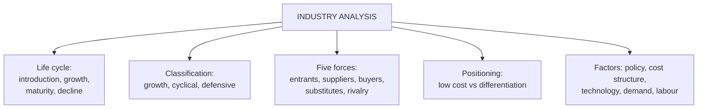

# FA-2: Industry Analysis

Covers: why industry analysis matters, industry classification by business cycle, the industry life cycle and what each stage means for investors, Porter's five forces, competitive positioning (cost vs differentiation), and the factors to check in an industry. **(syllabus)** Porter's five forces is **(textbook)** method, widely expected in this question.

## Where this fits in the ESE

A 5- or 10-mark "explain the industry life cycle" or "factors in industry analysis"; in a case, one paragraph placing the company's industry on the life cycle and the five forces.

## Why industry analysis

The industry sets **what growth is available** and how hard it is to keep profits. The same ratio means different things in different industries: a D/E of 2 is alarming for FMCG and normal for a bank; asset turnover of 0.3 is fine for a utility and terrible for a retailer.

## Classification by business cycle

- **Growth industries:** grow faster than the economy regardless of the cycle (e.g. renewable energy, digital services).
- **Cyclical industries:** rise and fall with the cycle (auto, cement, steel, real estate).
- **Defensive industries:** stable demand in any cycle (FMCG, pharma, utilities).
- **Counter-cyclical:** do better in downturns (some discount retail, debt recovery).

## The industry life cycle

| Stage | Growth | Competition | Earnings | Investment implication |
|---|---|---|---|---|
| **Introduction (pioneering)** | Low, uncertain | Few players, high entry cost | Negative or erratic | High risk, speculative |
| **Growth (expansion)** | Rapid | New entrants, expanding market | Rising, margins improving | **Best risk-reward window** |
| **Maturity (stabilisation)** | Slowing, in line with GDP | Intense, consolidation | Stable, cash-generative | Steady returns, dividend plays |
| **Decline** | Negative | Exits, shrinking demand | Falling | Avoid unless a turnaround thesis |

A cash-burning company in the introduction stage is behaving normally for its stage; a flat-revenue, dividend-paying company in maturity is healthy. **Place the industry on the curve before judging the ratios.**

## Porter's five forces (industry attractiveness)

1. **Threat of new entrants:** low if entry barriers are high (capital needs, licences, brand, scale economies).
2. **Bargaining power of suppliers:** high if few suppliers or unique inputs.
3. **Bargaining power of buyers:** high if buyers are concentrated or can switch easily.
4. **Threat of substitutes:** high if other products meet the same need.
5. **Rivalry among existing competitors:** high with many similar firms, slow growth, high fixed costs.

The weaker the five forces, the more attractive (more profitable) the industry.

## Competitive positioning (the 2×2)

Two coherent ways to win: be the **lowest-cost producer** (underprice everyone and still earn a margin) or be **differentiated** enough to command a premium price. **"Stuck in the middle"** (average cost, average product) is squeezed from both sides. In a case, ask which corner the company is in and whether that position is defensible.

## Factors to check in industry analysis

1. Past sales and earnings performance; growth prospects.
2. Life-cycle stage.
3. Competition and market structure (five forces).
4. Cost structure (fixed vs variable costs; operating leverage).
5. Government policy and regulation (licensing, subsidies, import duties, PLI schemes).
6. Labour conditions.
7. Technology and R&D; threat of disruption.
8. Raw-material availability and cost.
9. Demand outlook (domestic and export).
10. ESG and environmental rules.

## What to remember

- Industry sets available growth and what "good" ratios look like.
- Cycle classes: growth, cyclical, defensive, counter-cyclical.
- Life cycle: introduction (speculative), growth (best risk-reward), maturity (dividends), decline (avoid).
- Five forces: entrants, suppliers, buyers, substitutes, rivalry.
- Win by low cost or differentiation; avoid stuck in the middle.

## Concept map

## Flashcards
Q: Name the four stages of the industry life cycle.
A: Introduction (pioneering), growth (expansion), maturity (stabilisation), decline.

Q: Which life-cycle stage offers the best risk-reward for investors?
A: The growth stage.

Q: Name Porter's five forces.
A: Threat of new entrants, supplier power, buyer power, threat of substitutes, rivalry among competitors.

Q: What is a defensive industry? Give an example.
A: One with stable demand through the business cycle, e.g. FMCG or pharma.

Q: What does "stuck in the middle" mean?
A: Having neither the lowest cost nor a differentiated product, so being squeezed by both kinds of competitor.

Q: Why must ratios be read in industry context?
A: Normal levels differ across industries (e.g. D/E of 2 is normal for a bank, alarming for FMCG).

## Sources
- Split of [[Units 2-3 - How Security Analysis Actually Works]] (section 3) and [[Units 2-3 - SAPM Cheat Sheet]]
- BBA301F-5 course plan, Unit 2 (industry analysis); Porter, *Competitive Strategy* (1980)
- Previous: [[SAPM Unit 2 - FA-1 Fundamental Analysis and Economy Analysis]] · Next: [[SAPM Unit 2 - FA-3 Company Analysis and Financial Statements]]
- [[SAPM Unit 2 - Fundamental Analysis MOC (Node Map)]]
