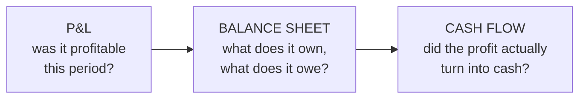
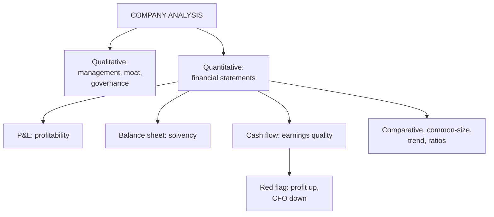

# FA-3: Company Analysis and Analysis of Financial Statements

Covers: qualitative company analysis (management, moat, governance), quantitative analysis through the three financial statements (P&L, balance sheet, cash flow), what an analyst reads off each, and the earnings-quality check. **(syllabus)**

## Where this fits in the ESE

The core of every Unit 2 case. A 10-mark "explain company analysis" or "how would you analyse a company's financial statements" is likely, and the earnings-quality red flag is a favourite case twist.

## Qualitative first: can you trust the numbers?

1. **Management quality and track record:** has the team delivered on past guidance or over-promised? Experience, succession, capital allocation record.
2. **Competitive advantage (moat):** brand, patents, switching costs, network effects, cost leadership: something that stops competitors copying the returns away.
3. **Corporate governance:** board independence, related-party transactions, promoter shareholding and **pledging**, auditor quality and resignations, minority shareholder treatment.
4. **Business model and products:** diversification, market share, pricing power.

Weak governance is exactly the condition under which reported numbers stop being reliable, so qualitative checks come **before** the ratios.

## Quantitative: the three statements, in sequence

| Statement | Key line items | What the analyst reads |
|---|---|---|
| **Profit & loss account** | Revenue, cost of goods sold, operating expenses, EBIT, interest, tax, net profit (PAT) | Profitability trend; margin trend; growth |
| **Balance sheet** | Current assets and liabilities, inventory, total debt, equity (share capital + reserves), fixed assets | Solvency, liquidity, capital structure, asset base |
| **Cash flow statement** | Cash from operating (CFO), investing (CFI) and financing (CFF) activities | Earnings quality (CFO vs PAT), capex intensity, how growth is funded, dividend capacity |

**Techniques:** comparative statements (year-on-year changes), common-size statements (each item as % of revenue or total assets), trend analysis (index numbers over 3–5 years), ratio analysis (FA-4).

## Earnings quality: cash is fact, profit is opinion

If **net profit grows but operating cash flow doesn't**, profit may be accrual-driven: receivables piling up (sales not collected), inventory build-up, aggressive revenue recognition or capitalised costs. This divergence is one of the most examinable red flags in Unit 2.

**Check:** CFO ÷ PAT. Persistently below about 0.8 needs an explanation.

*Example (illustrative):* PAT ₹150 crore, CFO ₹110 crore → CFO/PAT = **0.73**: profits only partly backed by cash; check whether debtors and inventory rose faster than sales.

**Other red flags:** rising debt with flat profits; frequent changes in accounting policy or auditor; large "other income"; contingent liabilities; promoter pledging rising; related-party transactions.

## Worked example: reading statements (illustrative company)

**Data (₹ crore):** revenue 1,200; COGS 720; operating expenses 240; interest 40; tax 25%. Total assets 1,500 (current assets 500, of which inventory 200); current liabilities 250; long-term debt 400; equity 850; CFO 110.

1. **P&L:** EBIT = 1,200 − 720 − 240 = **240**; PBT = 240 − 40 = 200; tax 50; **PAT = 150**. Operating margin 20%; net margin 12.5%.
2. **Balance sheet:** 1,500 = 250 (CL) + 400 (debt) + 850 (equity). Debt is under half of equity; current assets are twice current liabilities.
3. **Cash flow:** CFO 110 vs PAT 150 → **0.73**: a flag; investigate working capital.
Ratios on these figures are in FA-4.

## What to remember

- Qualitative before quantitative: management, moat, governance decide whether numbers are reliable.
- P&L = profitability; balance sheet = solvency and structure; cash flow = earnings quality.
- Techniques: comparative, common-size, trend, ratio analysis.
- CFO/PAT well below 1 = red flag (example 110/150 = 0.73).
- Example: EBIT 240, PAT 150; assets 1,500 = CL 250 + debt 400 + equity 850.

## Concept map

## Flashcards
Q: Why does qualitative analysis come before the numbers?
A: Management, moat and governance decide whether the reported numbers can be trusted.

Q: Name three governance red flags.
A: Rising promoter pledging, large related-party transactions, auditor resignations (also weak board independence).

Q: What does each financial statement tell the analyst?
A: P&L: profitability; balance sheet: solvency and capital structure; cash flow: whether profit turns into cash.

Q: Net profit is rising but operating cash flow is falling. Why is that a red flag?
A: Profits may be accrual-driven (uncollected sales, inventory build-up, aggressive accounting) rather than cash-backed.

Q: PAT ₹150 crore, CFO ₹110 crore. CFO/PAT?
A: 0.73: profits only partly backed by cash.

Q: What is a common-size statement?
A: A statement with each item expressed as a percentage of revenue (P&L) or total assets (balance sheet).

## Sources
- Split of [[Units 2-3 - How Security Analysis Actually Works]] (section 4) and [[Units 2-3 - SAPM Cheat Sheet]]
- BBA301F-5 course plan, Unit 2 (company analysis; analysis of financial statements)
- Previous: [[SAPM Unit 2 - FA-2 Industry Analysis]] · Next: [[SAPM Unit 2 - FA-4 Equity and Valuation Ratios]]
- [[SAPM Unit 2 - Fundamental Analysis MOC (Node Map)]]
