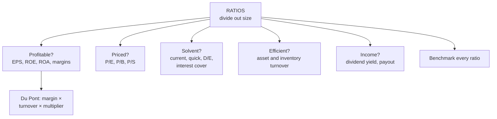

# FA-4: Equity-Focused Financial Ratios and Valuation Ratios

Covers: why ratios exist, ratios grouped by the question they answer (profitability, valuation, solvency, efficiency, income), a full worked computation on one company, Du Pont decomposition, and how to benchmark and interpret ratios. **(syllabus)**

## Where this fits in the ESE

The numerical heart of Unit 2: a 5-mark ratio sum, a 10-mark "compute and interpret", or the bulk of the 15-mark case. The CIA2 rubric rewarded "accurate interpretation of company and financial data", so every ratio needs a benchmark and a sentence of meaning.

## Why ratios

An annual report runs to 100+ pages and can't be compared across companies of different sizes as raw numbers. A ratio **divides out size**, making a ₹500 crore profit on ₹2,000 crore comparable with ₹50 crore on ₹200 crore. Group ratios by **the question they answer**, which is how examiners ask ("assess profitability", "assess solvency").

## The ratios

| Question | Ratio | Formula | Reading |
|---|---|---|---|
| **Profitable?** | EPS | PAT ÷ shares outstanding | Building block for valuation |
| | ROE | PAT ÷ shareholders' equity | Return on owners' money |
| | ROA | PAT ÷ total assets | Return on all capital |
| | Net profit margin | PAT ÷ revenue × 100 | Bottom-line profit per ₹ of sales |
| | Operating margin | EBIT ÷ revenue × 100 | Core profitability before financing and tax |
| **Fairly priced?** | P/E | Price ÷ EPS | Rupees paid per rupee of earnings |
| | P/B | Price ÷ book value per share | Price vs net worth |
| | P/S | Market cap ÷ revenue | Price vs sales (loss-makers) |
| **Solvent?** | Current ratio | CA ÷ CL | Short-term cushion |
| | Quick ratio | (CA − inventory) ÷ CL | Cushion without stock |
| | Debt-to-equity | Debt ÷ equity | Leverage, financial risk |
| | Interest coverage | EBIT ÷ interest | Ability to service debt (< 1.5× uncomfortable) |
| **Efficient?** | Asset turnover | Revenue ÷ total assets | Sales per ₹ of assets |
| | Inventory turnover | COGS ÷ average inventory | Speed of stock movement |
| **Income?** | Dividend yield | DPS ÷ price × 100 | Cash return for holding |
| | Payout ratio | DPS ÷ EPS | Share of earnings paid out |

## Du Pont decomposition

**ROE = Net profit margin × Asset turnover × Equity multiplier**
= (PAT/Revenue) × (Revenue/Total assets) × (Total assets/Equity)

It shows **why** ROE is high: profit per sale, efficiency of assets, or leverage. A high ROE driven by a high equity multiplier is **debt-driven, not operationally earned**, and riskier.

## Worked example, laid out as the exam answer

**Data (₹ crore, illustrative; from FA-3):** revenue 1,200; COGS 720; EBIT 240; interest 40; PAT 150; total assets 1,500; current assets 500 (inventory 200); current liabilities 250; debt 400; equity 850; 10 crore shares; price ₹270; DPS ₹4.50. Industry averages: ROE 15%, P/E 22, D/E 0.8, current ratio 1.5, net margin 10%.

| Ratio | Working | Value | vs industry | Reading |
|---|---|---|---|---|
| EPS | 150 ÷ 10 | **₹15** | | |
| ROE | 150 ÷ 850 | **17.6%** | 15% | Better |
| ROA | 150 ÷ 1,500 | **10.0%** | | |
| Net margin | 150 ÷ 1,200 | **12.5%** | 10% | Better |
| Operating margin | 240 ÷ 1,200 | **20.0%** | | |
| Current ratio | 500 ÷ 250 | **2.0** | 1.5 | Comfortable (check for idle assets) |
| Quick ratio | 300 ÷ 250 | **1.2** | | Comfortable |
| D/E | 400 ÷ 850 | **0.47** | 0.8 | Conservative leverage |
| Interest coverage | 240 ÷ 40 | **6.0×** | | Safe |
| Asset turnover | 1,200 ÷ 1,500 | **0.8** | | |
| Inventory turnover | 720 ÷ 200 | **3.6×** | | |
| P/E | 270 ÷ 15 | **18.0** | 22 | Cheaper than peers |
| P/B | 270 ÷ 85 | **3.18** | | BVPS = 850 ÷ 10 = ₹85 |
| P/S | 2,700 ÷ 1,200 | **2.25** | | Market cap = 270 × 10 crore |
| Dividend yield | 4.5 ÷ 270 | **1.67%** | | Payout 4.5 ÷ 15 = 30% |

**Du Pont:** 12.5% × 0.8 × (1,500 ÷ 850 = 1.765) = **17.6%**. ROE comes from good margins and moderate leverage, not from heavy debt.

<svg viewBox="0 0 680 240" width="100%" style="max-width:680px;display:block;margin:12px auto" role="img" xmlns="http://www.w3.org/2000/svg">
<title>Du Pont tree with worked numbers</title>
<desc>ROE of 17.6 percent splits into net margin 12.5 percent times asset turnover 0.8 times equity multiplier 1.765.</desc>
<rect x="220" y="16" width="240" height="58" rx="6" fill="none" stroke="#3B6D11" stroke-width="2"/>
<text font-size="14" font-weight="500" fill="currentColor" font-family="inherit" x="340" y="40" text-anchor="middle">ROE 17.6%</text>
<text font-size="12" fill="currentColor" opacity="0.7" font-family="inherit" x="340" y="62" text-anchor="middle">PAT ÷ equity = 150 ÷ 850</text>
<rect x="25" y="130" width="190" height="66" rx="6" fill="none" stroke="#5F5E5A" stroke-width="2"/>
<text font-size="14" font-weight="500" fill="currentColor" font-family="inherit" x="120" y="154" text-anchor="middle">Net margin</text>
<text font-size="12" fill="currentColor" opacity="0.7" font-family="inherit" x="120" y="178" text-anchor="middle">150 ÷ 1,200 = 12.5%</text>
<text font-size="12" fill="currentColor" opacity="0.7" font-family="inherit" x="120" y="220" text-anchor="middle">profit per ₹ of sales</text>
<polyline points="120,130 120,104" fill="none" stroke="#888780" stroke-width="2"/>
<rect x="245" y="130" width="190" height="66" rx="6" fill="none" stroke="#5F5E5A" stroke-width="2"/>
<text font-size="14" font-weight="500" fill="currentColor" font-family="inherit" x="340" y="154" text-anchor="middle">Asset turnover</text>
<text font-size="12" fill="currentColor" opacity="0.7" font-family="inherit" x="340" y="178" text-anchor="middle">1,200 ÷ 1,500 = 0.8</text>
<text font-size="12" fill="currentColor" opacity="0.7" font-family="inherit" x="340" y="220" text-anchor="middle">efficiency of assets</text>
<polyline points="340,130 340,104" fill="none" stroke="#888780" stroke-width="2"/>
<rect x="465" y="130" width="190" height="66" rx="6" fill="none" stroke="#5F5E5A" stroke-width="2"/>
<text font-size="14" font-weight="500" fill="currentColor" font-family="inherit" x="560" y="154" text-anchor="middle">Equity multiplier</text>
<text font-size="12" fill="currentColor" opacity="0.7" font-family="inherit" x="560" y="178" text-anchor="middle">1,500 ÷ 850 = 1.765</text>
<text font-size="12" fill="currentColor" opacity="0.7" font-family="inherit" x="560" y="220" text-anchor="middle">leverage: debt-driven if high</text>
<polyline points="560,130 560,104" fill="none" stroke="#888780" stroke-width="2"/>
<polyline points="340,74 340,104" fill="none" stroke="#888780" stroke-width="2"/>
<polyline points="120,104 560,104" fill="none" stroke="#888780" stroke-width="2" stroke-linejoin="round"/>
<text font-size="14" font-weight="500" fill="currentColor" font-family="inherit" x="230" y="168" text-anchor="middle">×</text>
<text font-size="14" font-weight="500" fill="currentColor" font-family="inherit" x="450" y="168" text-anchor="middle">×</text>
</svg>

**Interpretation:** more profitable than the industry (ROE 17.6% vs 15%, margin 12.5% vs 10%), with lower leverage (D/E 0.47 vs 0.8) and safe interest cover, yet it trades at a **lower P/E (18 vs 22)**. Fundamentally the share looks **undervalued relative to peers**, subject to the earnings-quality flag from FA-3 (CFO/PAT 0.73).

## Seven traps (from the cheat sheet)

0. **A ratio without a benchmark is just a number.**
1. **High ROE can be leverage:** check Du Pont and D/E.
2. **High current ratio isn't always good:** idle cash or bloated inventory.
3. **P/E is meaningless for loss-makers:** use P/B or P/S.
4. **Net income without cash flow is suspicious.**
5. **Industry context changes what "good" means.**
6. **Margin of safety needs an intrinsic value estimate first** (FA-5).

## What to remember

- Group ratios by question: profitable, priced, solvent, efficient, income.
- Du Pont: ROE = margin × turnover × equity multiplier.
- Example: EPS ₹15, ROE 17.6%, net margin 12.5%, current 2.0, quick 1.2, D/E 0.47, cover 6×, P/E 18, P/B 3.18, P/S 2.25, yield 1.67%.
- Benchmark every ratio; end with a verdict.

## Concept map

## Flashcards
Q: Write the Du Pont identity.
A: ROE = (PAT/Revenue) × (Revenue/Total assets) × (Total assets/Equity).

Q: Margin 12.5%, asset turnover 0.8, equity multiplier 1.765. ROE?
A: 17.6%.

Q: Formula for the quick ratio?
A: (Current assets − inventory) ÷ current liabilities.

Q: EBIT ₹240 crore, interest ₹40 crore. Interest coverage?
A: 6 times.

Q: Why can a high ROE be a warning sign?
A: It may come from high leverage (a large equity multiplier) rather than operating efficiency.

Q: Which valuation ratio would you use for a loss-making company?
A: P/B or P/S (P/E is meaningless with negative EPS).

Q: Price ₹270, EPS ₹15, industry P/E 22. Reading?
A: P/E 18, below peers: cheaper than the industry, subject to growth and quality checks.

## Sources
- Split of [[Units 2-3 - How Security Analysis Actually Works]] (section 5) and [[Units 2-3 - SAPM Cheat Sheet]] (ratios, Du Pont, traps)
- BBA301F-5 course plan, Unit 2 (equity-focused financial ratios and valuation ratios)
- Previous: [[SAPM Unit 2 - FA-3 Company Analysis and Financial Statements]] · Next: [[SAPM Unit 2 - FA-5 Margin of Safety]]
- [[SAPM Unit 2 - Fundamental Analysis MOC (Node Map)]]
