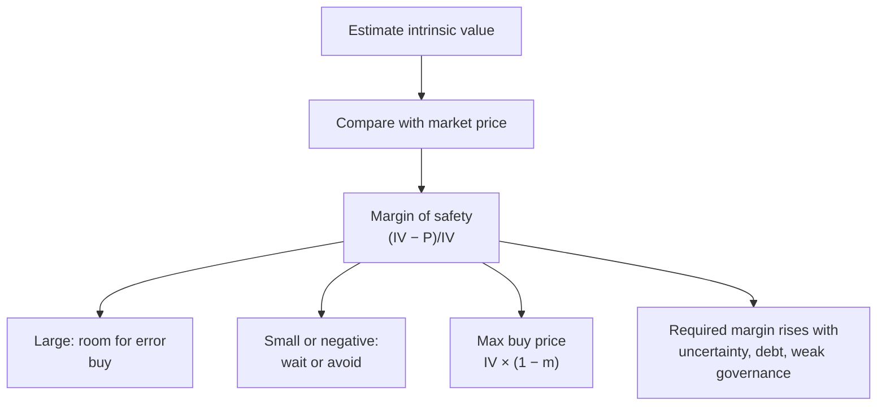

# FA-5: Margin of Safety

Covers: the margin of safety concept (Benjamin Graham), why you never buy at intrinsic value, the formula, the maximum buy price for a required margin, how large a margin to demand, and how it turns a valuation into a recommendation. **(syllabus)**

## Where this fits in the ESE

The last step of every fundamental case: "estimate intrinsic value and state the margin of safety". Also a 5-mark concept question. The cheat sheet's trap 6 applies: you need an intrinsic value estimate before you can compute a margin.

## The idea

Even if your valuation is careful, every input (growth, discount rate, margins) is an **estimate**. Buying at exactly your estimate of intrinsic value leaves **no room for error**. The **margin of safety** is the gap you deliberately leave between what you believe a share is worth and what you pay. It is **the buffer that absorbs the error in your own analysis**, not a lucky discount.

**Margin of safety % = (Intrinsic value − Market price) ÷ Intrinsic value × 100**

**Maximum buy price for a required margin m = Intrinsic value × (1 − m)**

## How large a margin?

- **Larger** for uncertain businesses: volatile earnings, cyclical industries, weak governance, high debt, young companies, or when your inputs are shaky.
- **Smaller** for stable, predictable, well-governed businesses.
- Value investors commonly look for 20–30% or more; Graham sought a large discount to conservatively estimated value.

## Worked example, laid out as the exam answer

**Data (illustrative, from FA-4):** EPS ₹15; industry P/E 22; price ₹270. The analyst wants a 25% margin for this mid-sized company.

1. **Intrinsic value** (relative method) = EPS × industry P/E = 15 × 22 = **₹330**.
2. **Margin of safety** = (330 − 270) ÷ 330 = 60 ÷ 330 = **18.2%**.
3. **Maximum buy price** for a 25% margin = 330 × 0.75 = **₹247.50**.
4. **Decision:** the share is undervalued (price below value), but the 18.2% margin is **below the 25% required**: **accumulate on dips below ₹247.50**, or buy a smaller starter position now. The earnings-quality flag (CFO/PAT 0.73, FA-3) argues for demanding the full margin.

**Contrast:** if the share traded at ₹350, margin = (330 − 350) ÷ 330 = **−6.1%**: negative, the share is overvalued: avoid.

## Why it matters

1. Protects against **estimation error**.
2. Protects against **bad luck** (events nobody could forecast).
3. Gives **upside** when price moves back to value.
4. Imposes **discipline**: forces a conclusion with a number ("buy below ₹247.50") rather than "fair value is ₹330".

## Limits

- Depends entirely on the intrinsic value estimate; a wrong estimate makes the margin meaningless.
- A cheap share can stay cheap (value trap) if the business is deteriorating.
- Waiting for a large margin can mean missing good companies that rarely trade at a discount.

## What to remember

- MoS = (IV − price) ÷ IV × 100; max buy price = IV × (1 − m).
- Demand more margin for uncertain, cyclical, leveraged or poorly governed firms.
- Example: IV ₹330, price ₹270 → 18.2%; buy below ₹247.50 for 25%.
- Negative margin = overvalued (₹350 → −6.1%).
- Always state the margin you require in the recommendation.

## Concept map

## Flashcards
Q: Who introduced the margin of safety concept?
A: Benjamin Graham.

Q: Formula for margin of safety?
A: (Intrinsic value − market price) ÷ intrinsic value × 100.

Q: Intrinsic value ₹330, price ₹270. Margin of safety?
A: 18.2%.

Q: Intrinsic value ₹330; you want a 25% margin. Maximum buy price?
A: ₹247.50.

Q: Why not buy at intrinsic value?
A: Your estimate may be wrong; the margin is the buffer that absorbs that error.

Q: When should you demand a larger margin?
A: For uncertain, cyclical, highly leveraged or poorly governed businesses.

Q: What is a value trap?
A: A share that looks cheap but stays cheap because the business is deteriorating.

## Sources
- Split of [[Units 2-3 - How Security Analysis Actually Works]] (section 6) and [[Units 2-3 - SAPM Cheat Sheet]]
- BBA301F-5 course plan, Unit 2 (margin of safety concept); Graham, *The Intelligent Investor*
- Previous: [[SAPM Unit 2 - FA-4 Equity and Valuation Ratios]] · Next: [[SAPM Unit 2 - FA-6 Unit 2 Exam Answers]]
- [[SAPM Unit 2 - Fundamental Analysis MOC (Node Map)]]
