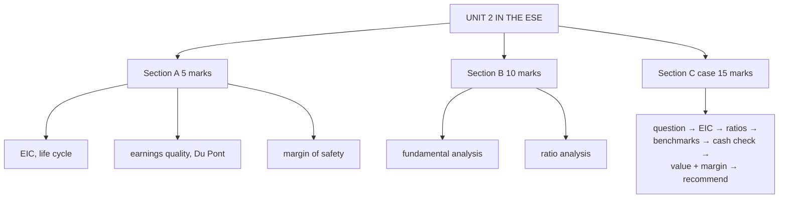

# FA-6: Unit 2 Exam Answers

Covers: what the ESE will ask from Unit 2, 5-mark and 10-mark skeletons, and the 15-mark fundamental-analysis case layout (the CIA2 format) with a model answer. Numbers come from FA-3 to FA-5.

## What the test will ask

Assume Section A 3 × 5, Section B 2 × 10, one 15-mark case. CIA2 was a compulsory case study on this unit; its rubric rewarded (1) understanding and interpretation of fundamental analysis and company/financial data, (2) accurate application of tools, and (3) **logical, data-supported conclusions with a strong investment recommendation**. Expect the same in the ESE.

## Five-mark answer skeletons

**1. EIC framework (FA-1).** Define fundamental analysis; three levels with signals; why top-down (filters).

**2. Industry life cycle (FA-2).** Four stages with growth, competition, earnings, investment implication; draw the S-curve.

**3. Earnings quality (FA-3).** Cash is fact, profit is opinion; CFO vs PAT; example 110 vs 150 = 0.73; causes; what to check.

**4. Du Pont (FA-4).** Identity; worked 12.5% × 0.8 × 1.765 = 17.6%; reading (margin- vs leverage-driven ROE).

**5. Margin of safety (FA-5).** Concept (Graham); formula; example 18.2%; max buy price ₹247.50.

## Ten-mark answer skeletons

**A. Fundamental analysis (FA-1 to FA-3).** Concept and importance → EIC (economy variables, industry life cycle and five forces, company qualitative and quantitative) → statements → ratios → valuation and margin → limitations (time-consuming, estimates, market can stay irrational).

**B. Ratio analysis for equity investors (FA-4).** Ratios grouped by question with formulas → worked table → Du Pont → benchmarks → seven traps.

## Fifteen-mark case layout (the CIA2 format)

From the cheat sheet's checklist:
1. **Identify the question:** financial health, valuation, or a full recommendation?
2. **Place the company (EIC):** economy → industry (life-cycle stage, forces) → company (management, moat, governance).
3. **Run the relevant ratios** (not all 15) and **show workings**.
4. **Benchmark every ratio** against the industry or the company's history.
5. **Check earnings quality:** CFO vs PAT.
6. **If valuation is asked:** intrinsic value and margin of safety.
7. **Recommend** with the reasoning.

"An answer that computes everything but recommends nothing scores lower than one that computes less but commits."

### Model answer, laid out as the exam answer

**Data (illustrative):** the FA-3/FA-4 company: revenue ₹1,200 crore, PAT 150, CFO 110, equity 850, debt 400, price ₹270, EPS ₹15; industry ROE 15%, P/E 22, D/E 0.8; economy: GDP growing ~6–7%, RBI on hold; industry: growth stage, moderate rivalry.

1. **Question:** full investment recommendation.
2. **EIC:** supportive macro (steady growth, stable rates); industry in the growth stage (best risk-reward), moderate competitive pressure; management with a consistent record (assumed), no pledging.
3. **Ratios:** ROE 17.6%, net margin 12.5%, D/E 0.47, interest cover 6×, current ratio 2.0, P/E 18.
4. **Benchmarks:** ROE above the industry's 15%, leverage below its 0.8, but P/E 18 below the industry's 22: better business, cheaper price.
5. **Earnings quality:** CFO/PAT 0.73: a flag; check receivables and inventory growth.
6. **Valuation:** IV = 15 × 22 = ₹330; margin of safety 18.2%.
7. **Recommendation:** **Buy / accumulate**: a fundamentally strong company trading at a discount to peers. Because of the cash-conversion flag, build the position gradually and add below ₹247.50 (25% margin); review if CFO doesn't catch up with profit next year.

## What to remember

- CIA2 rubric: interpretation, accurate tools, data-supported recommendation.
- Case checklist: question → EIC → ratios → benchmarks → earnings quality → valuation and margin → recommendation.
- Model numbers: ROE 17.6%, P/E 18 vs 22, D/E 0.47, CFO/PAT 0.73, IV ₹330, MoS 18.2%.
- Commit to a recommendation.

## Concept map

## Flashcards
Q: What did the CIA2 rubric reward most at the top band?
A: Logical, data-supported conclusions with a strong investment recommendation.

Q: List the seven steps of the Unit 2 case.
A: Identify the question, place in EIC, run relevant ratios, benchmark them, check earnings quality, value with margin of safety, recommend.

Q: Model case verdict?
A: Buy/accumulate: ROE above and P/E below industry, margin 18.2%; add below ₹247.50 given the cash-flow flag.

## Sources
- Split of [[Units 2-3 - How Security Analysis Actually Works]] (sections 7–8) and [[Units 2-3 - SAPM Cheat Sheet]] (case checklist, traps)
- BBA301F-5 course plan, CIA2 rubric
- [[SAPM Unit 2 - Fundamental Analysis MOC (Node Map)]]
