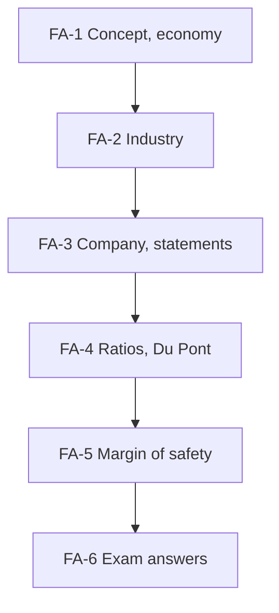

# SAPM Unit 2: Fundamental Analysis, node map

ESE: 50 marks, assume 3 × 5, 2 × 10, one 15-mark case. Unit 2 was the whole CIA2 case and returns in the ESE (CO2). These nodes split [[Units 2-3 - How Security Analysis Actually Works]] and [[Units 2-3 - SAPM Cheat Sheet]] into study-sized pieces and add worked numbers. Examples are **illustrative**.

## Nodes

| Node | Topic | Deps | Minutes | Exam focus |
|---|---|---|---|---|
| FA-1 | Fundamental Analysis and Economy Analysis | none | 30 | yes |
| FA-2 | Industry Analysis | FA-1 | 30 | yes |
| FA-3 | Company Analysis and Financial Statements | FA-2 | 35 | yes |
| FA-4 | Equity and Valuation Ratios | FA-3 | 45 | yes |
| FA-5 | Margin of Safety | FA-4 | 25 | yes |
| FA-6 | Unit 2 Exam Answers | FA-1 to FA-5 | 30 | yes |

Total reading time: about 195 minutes.

## Dependency graph

## Headline numbers to know

- Illustrative company: revenue ₹1,200 crore, EBIT 240, PAT 150, CFO 110 (CFO/PAT 0.73), assets 1,500, equity 850, debt 400.
- Ratios: EPS ₹15; ROE 17.6%; ROA 10%; net margin 12.5%; operating margin 20%; current 2.0; quick 1.2; D/E 0.47; interest cover 6×; asset turnover 0.8; P/E 18; P/B 3.18; P/S 2.25; dividend yield 1.67%.
- Du Pont: 12.5% × 0.8 × 1.765 = 17.6%.
- Intrinsic value 15 × 22 = ₹330; margin of safety at ₹270 = 18.2%; max buy price for 25% = ₹247.50.

## Links
- [[SAPM MOC]]
