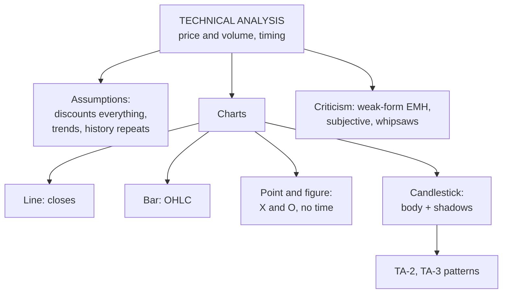

# TA-1: Introduction, Assumptions and Charting Techniques

Covers: what technical analysis is, how it differs from fundamental analysis, its assumptions, and the four chart types in the syllabus: line, bar, point and figure, and Japanese candlestick. **(syllabus)**

## Where this fits in the ESE

ESE: 50 marks (assume 3 × 5, 2 × 10, one 15-mark case). CIA2 tested technical tools in a case, and the ESE covers Unit 3 again. "Assumptions of technical analysis" and "types of charts" are classic 5-mark questions; "technical vs fundamental analysis" is a classic 10-marker.

## What technical analysis is

**Technical analysis** studies past **price and volume** data, usually through charts and indicators, to forecast future price movements and time entry and exit. It asks **when** to buy or sell; fundamental analysis (Unit 2) asks **what** to buy.

## Assumptions (Dow / Edwards & Magee)

1. **Market value is determined by supply and demand** alone.
2. **The market discounts everything:** all information (fundamental, political, psychological) is already reflected in the price.
3. **Prices move in trends** that persist for appreciable lengths of time.
4. **Trends change because of shifts in supply and demand**, and these shifts can be detected on charts.
5. **History repeats itself:** chart patterns recur because investor psychology (fear, greed) is stable.
6. Supply and demand are governed by both rational and irrational factors.

## Technical vs fundamental analysis

| Basis | Fundamental | Technical |
|---|---|---|
| Question | What to buy (value) | When to buy or sell (timing) |
| Data | Economy, industry, financial statements | Price and volume |
| Tools | Ratios, DCF, P/E | Charts, patterns, indicators |
| Horizon | Long term | Short to medium term |
| Belief | Price moves towards intrinsic value | Price already reflects everything; trends persist |
| Users | Long-term investors | Traders |

Many investors combine them: fundamentals to choose the stock, technicals to time the trade.

## Chart types

### 1. Line chart
Joins **closing prices** over time with a line. Simple; shows the trend clearly; ignores the day's high, low and open.

### 2. Bar chart (OHLC)
Each period is a vertical bar from **high to low**; a small tick on the left marks the **open**, on the right the **close**. Shows the trading range and direction for each period.

### 3. Point and figure chart
Plots only **price changes of a set size (box size)**, ignoring time and small moves. **X** columns for rising prices, **O** columns for falling prices; a new column starts only when price reverses by a set number of boxes (e.g. 3-box reversal). Filters noise; makes support, resistance and breakouts clear; but ignores time and volume.

### 4. Japanese candlestick chart
Each period is a **candle**:
- **Real body:** between open and close. **Hollow / green** if close > open (bullish); **filled / red** if close < open (bearish).
- **Upper shadow (wick):** from the body to the high.
- **Lower shadow:** from the body to the low.

Shows the same OHLC data as a bar chart, but the body's colour and size show at a glance who won the period (buyers or sellers). TA-2 and TA-3 read the patterns.

## Strengths and criticisms of technical analysis

**Strengths:** timing; works for any traded asset; captures crowd psychology; quick signals; stop-loss discipline.

**Criticisms:**
1. **Efficient market hypothesis (weak form):** past prices can't predict future prices, so charts can't earn abnormal returns.
2. Patterns are subjective; two analysts read the same chart differently.
3. Self-fulfilling prophecies: signals work because many traders act on them.
4. Signals often lag or give false breakouts (whipsaws).
5. Ignores the fundamental value of the firm.

## What to remember

- Technical = price and volume, for timing. Fundamental = value, for selection.
- Assumptions: supply and demand, market discounts everything, trends persist, history repeats.
- Charts: line (closes), bar (OHLC), point and figure (X and O, no time), candlestick (body + shadows).
- Main criticism: weak-form market efficiency.

## Concept map

## Flashcards
Q: What is technical analysis?
A: Forecasting price movements from past price and volume data, mainly to time purchases and sales.

Q: State four assumptions of technical analysis.
A: Supply and demand set prices; the market discounts everything; prices move in trends; history repeats itself.

Q: How does technical analysis differ from fundamental analysis in purpose?
A: Fundamental decides what to buy (value); technical decides when to buy or sell (timing).

Q: What does a bar chart show for each period?
A: High, low (the bar), open (left tick) and close (right tick).

Q: What is special about a point and figure chart?
A: It plots only price moves of a set box size with X and O columns and ignores time.

Q: What does a hollow (green) candlestick body mean?
A: The close was above the open: a bullish period.

Q: What is the main academic criticism of technical analysis?
A: The weak form of the efficient market hypothesis: past prices can't predict future prices.

## Sources
- BBA301F-5 course plan, Unit 3 (introduction and assumptions; charting techniques)
- Fischer & Jordan; Madhumati; Murphy, *Technical Analysis of the Financial Markets*
- Next node: [[SAPM Unit 3 - TA-2 Single Candlestick Patterns]]
- [[SAPM Unit 3 - Technical Analysis MOC (Node Map)]]
