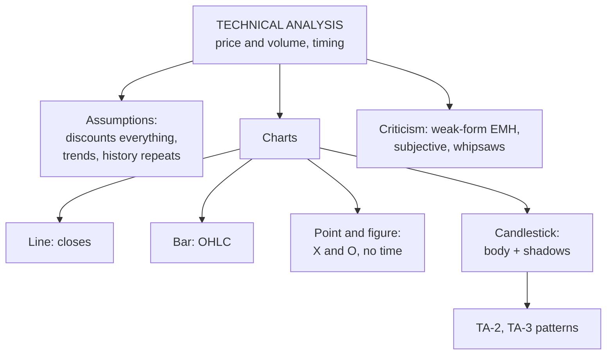

# TA-1: Introduction, Assumptions and Charting Techniques

Covers: what technical analysis is, how it differs from fundamental analysis, its assumptions, and the four chart types in the syllabus: line, bar, point and figure, and Japanese candlestick. **(syllabus)**

## Where this fits in the ESE

ESE: 50 marks (assume 3 × 5, 2 × 10, one 15-mark case). CIA2 tested technical tools in a case, and the ESE covers Unit 3 again. "Assumptions of technical analysis" and "types of charts" are classic 5-mark questions; "technical vs fundamental analysis" is a classic 10-marker.

## What technical analysis is

**Technical analysis** studies past **price and volume** data, usually through charts and indicators, to forecast future price movements and time entry and exit. It asks **when** to buy or sell; fundamental analysis (Unit 2) asks **what** to buy.

## Assumptions (Dow / Edwards & Magee)

1. **Market value is determined by supply and demand** alone.
2. **The market discounts everything:** all information (fundamental, political, psychological) is already reflected in the price.
3. **Prices move in trends** that persist for appreciable lengths of time.
4. **Trends change because of shifts in supply and demand**, and these shifts can be detected on charts.
5. **History repeats itself:** chart patterns recur because investor psychology (fear, greed) is stable.
6. Supply and demand are governed by both rational and irrational factors.

## Technical vs fundamental analysis

| Basis | Fundamental | Technical |
|---|---|---|
| Question | What to buy (value) | When to buy or sell (timing) |
| Data | Economy, industry, financial statements | Price and volume |
| Tools | Ratios, DCF, P/E | Charts, patterns, indicators |
| Horizon | Long term | Short to medium term |
| Belief | Price moves towards intrinsic value | Price already reflects everything; trends persist |
| Users | Long-term investors | Traders |

Many investors combine them: fundamentals to choose the stock, technicals to time the trade.

## Chart types

### 1. Line chart
Joins **closing prices** over time with a line. Simple; shows the trend clearly; ignores the day's high, low and open.

### 2. Bar chart (OHLC)
Each period is a vertical bar from **high to low**; a small tick on the left marks the **open**, on the right the **close**. Shows the trading range and direction for each period.

<svg width="100%" style="max-width:680px;display:block;margin:12px auto" viewBox="0 0 680 262" role="img" xmlns="http://www.w3.org/2000/svg">
<title>OHLC bar anatomy</title>
<desc>An up bar and a down bar. Each bar runs from the period low to the period high; a tick on the left marks the open and a tick on the right marks the close.</desc>
<line x1="170" y1="40" x2="170" y2="190" stroke="#3B6D11" stroke-width="3"/>
<line x1="152" y1="150" x2="170" y2="150" stroke="#3B6D11" stroke-width="3"/>
<line x1="170" y1="80" x2="188" y2="80" stroke="#3B6D11" stroke-width="3"/>
<text font-size="14" font-weight="500" fill="currentColor" font-family="inherit" x="146" y="154" text-anchor="end">Open</text>
<text font-size="14" font-weight="500" fill="currentColor" font-family="inherit" x="194" y="84" text-anchor="start">Close</text>
<text font-size="14" font-weight="500" fill="currentColor" font-family="inherit" x="180" y="44" text-anchor="start">High</text>
<text font-size="14" font-weight="500" fill="currentColor" font-family="inherit" x="180" y="194" text-anchor="start">Low</text>
<text font-size="14" font-weight="500" fill="currentColor" font-family="inherit" x="170" y="225" text-anchor="middle">Up bar</text>
<text font-size="12" fill="currentColor" opacity="0.7" font-family="inherit" x="170" y="243" text-anchor="middle">close above open: right tick higher</text>
<line x1="510" y1="40" x2="510" y2="190" stroke="#A32D2D" stroke-width="3"/>
<line x1="492" y1="80" x2="510" y2="80" stroke="#A32D2D" stroke-width="3"/>
<line x1="510" y1="150" x2="528" y2="150" stroke="#A32D2D" stroke-width="3"/>
<text font-size="14" font-weight="500" fill="currentColor" font-family="inherit" x="486" y="84" text-anchor="end">Open</text>
<text font-size="14" font-weight="500" fill="currentColor" font-family="inherit" x="534" y="154" text-anchor="start">Close</text>
<text font-size="14" font-weight="500" fill="currentColor" font-family="inherit" x="520" y="44" text-anchor="start">High</text>
<text font-size="14" font-weight="500" fill="currentColor" font-family="inherit" x="520" y="194" text-anchor="start">Low</text>
<text font-size="14" font-weight="500" fill="currentColor" font-family="inherit" x="510" y="225" text-anchor="middle">Down bar</text>
<text font-size="12" fill="currentColor" opacity="0.7" font-family="inherit" x="510" y="243" text-anchor="middle">close below open: right tick lower</text>
<text font-size="12" fill="currentColor" opacity="0.7" font-family="inherit" x="340" y="112" text-anchor="middle">bar = high-to-low range</text>
<text font-size="12" fill="currentColor" opacity="0.7" font-family="inherit" x="340" y="130" text-anchor="middle">left tick = open</text>
<text font-size="12" fill="currentColor" opacity="0.7" font-family="inherit" x="340" y="148" text-anchor="middle">right tick = close</text>
</svg>

### 3. Point and figure chart
Plots only **price changes of a set size (box size)**, ignoring time and small moves. **X** columns for rising prices, **O** columns for falling prices; a new column starts only when price reverses by a set number of boxes (e.g. 3-box reversal). Filters noise; makes support, resistance and breakouts clear; but ignores time and volume.

### 4. Japanese candlestick chart
Each period is a **candle**:
- **Real body:** between open and close. **Hollow / green** if close > open (bullish); **filled / red** if close < open (bearish).
- **Upper shadow (wick):** from the body to the high.
- **Lower shadow:** from the body to the low.

Shows the same OHLC data as a bar chart, but the body's colour and size show at a glance who won the period (buyers or sellers). TA-2 and TA-3 read the patterns.

<svg width="100%" style="max-width:680px;display:block;margin:12px auto" viewBox="0 0 680 270" role="img" xmlns="http://www.w3.org/2000/svg">
<title>Same prices as line, bar and candlestick charts</title>
<desc>Six periods of price data drawn three ways: a line through the closes, OHLC bars with open and close ticks, and candlesticks with real bodies and shadows.</desc>
<text font-size="14" font-weight="500" fill="currentColor" font-family="inherit" x="110" y="26" text-anchor="middle">Line chart</text>
<text font-size="12" fill="currentColor" opacity="0.7" font-family="inherit" x="110" y="44" text-anchor="middle">closes only</text>
<line x1="18" y1="228" x2="202" y2="228" stroke="#888780" stroke-width="1"/>
<polyline points="35,132 65,104 95,146 125,188 155,132 185,62" fill="none" stroke="#5F5E5A" stroke-width="2" stroke-linejoin="round" stroke-linecap="round"/>
<circle cx="35" cy="132" r="3.5" fill="#888780" stroke="#5F5E5A" stroke-width="1"/>
<circle cx="65" cy="104" r="3.5" fill="#888780" stroke="#5F5E5A" stroke-width="1"/>
<circle cx="95" cy="146" r="3.5" fill="#888780" stroke="#5F5E5A" stroke-width="1"/>
<circle cx="125" cy="188" r="3.5" fill="#888780" stroke="#5F5E5A" stroke-width="1"/>
<circle cx="155" cy="132" r="3.5" fill="#888780" stroke="#5F5E5A" stroke-width="1"/>
<circle cx="185" cy="62" r="3.5" fill="#888780" stroke="#5F5E5A" stroke-width="1"/>
<text font-size="14" font-weight="500" fill="currentColor" font-family="inherit" x="340" y="26" text-anchor="middle">Bar chart (OHLC)</text>
<text font-size="12" fill="currentColor" opacity="0.7" font-family="inherit" x="340" y="44" text-anchor="middle">range, open tick, close tick</text>
<line x1="248" y1="228" x2="432" y2="228" stroke="#888780" stroke-width="1"/>
<line x1="265" y1="118" x2="265" y2="188" stroke="#3B6D11" stroke-width="2.5"/>
<line x1="257" y1="174" x2="265" y2="174" stroke="#3B6D11" stroke-width="2.5"/>
<line x1="265" y1="132" x2="273" y2="132" stroke="#3B6D11" stroke-width="2.5"/>
<line x1="295" y1="90" x2="295" y2="146" stroke="#3B6D11" stroke-width="2.5"/>
<line x1="287" y1="132" x2="295" y2="132" stroke="#3B6D11" stroke-width="2.5"/>
<line x1="295" y1="104" x2="303" y2="104" stroke="#3B6D11" stroke-width="2.5"/>
<line x1="325" y1="76" x2="325" y2="160" stroke="#A32D2D" stroke-width="2.5"/>
<line x1="317" y1="104" x2="325" y2="104" stroke="#A32D2D" stroke-width="2.5"/>
<line x1="325" y1="146" x2="333" y2="146" stroke="#A32D2D" stroke-width="2.5"/>
<line x1="355" y1="132" x2="355" y2="202" stroke="#A32D2D" stroke-width="2.5"/>
<line x1="347" y1="146" x2="355" y2="146" stroke="#A32D2D" stroke-width="2.5"/>
<line x1="355" y1="188" x2="363" y2="188" stroke="#A32D2D" stroke-width="2.5"/>
<line x1="385" y1="118" x2="385" y2="202" stroke="#3B6D11" stroke-width="2.5"/>
<line x1="377" y1="188" x2="385" y2="188" stroke="#3B6D11" stroke-width="2.5"/>
<line x1="385" y1="132" x2="393" y2="132" stroke="#3B6D11" stroke-width="2.5"/>
<line x1="415" y1="48" x2="415" y2="146" stroke="#3B6D11" stroke-width="2.5"/>
<line x1="407" y1="132" x2="415" y2="132" stroke="#3B6D11" stroke-width="2.5"/>
<line x1="415" y1="62" x2="423" y2="62" stroke="#3B6D11" stroke-width="2.5"/>
<text font-size="14" font-weight="500" fill="currentColor" font-family="inherit" x="570" y="26" text-anchor="middle">Candlestick</text>
<text font-size="12" fill="currentColor" opacity="0.7" font-family="inherit" x="570" y="44" text-anchor="middle">body and shadows</text>
<line x1="478" y1="228" x2="662" y2="228" stroke="#888780" stroke-width="1"/>
<line x1="495" y1="118" x2="495" y2="188" stroke="#3B6D11" stroke-width="2"/>
<rect x="488" y="132" width="14" height="42" rx="1" fill="#639922" stroke="#3B6D11" stroke-width="1"/>
<line x1="525" y1="90" x2="525" y2="146" stroke="#3B6D11" stroke-width="2"/>
<rect x="518" y="104" width="14" height="28" rx="1" fill="#639922" stroke="#3B6D11" stroke-width="1"/>
<line x1="555" y1="76" x2="555" y2="160" stroke="#A32D2D" stroke-width="2"/>
<rect x="548" y="104" width="14" height="42" rx="1" fill="#E24B4A" stroke="#A32D2D" stroke-width="1"/>
<line x1="585" y1="132" x2="585" y2="202" stroke="#A32D2D" stroke-width="2"/>
<rect x="578" y="146" width="14" height="42" rx="1" fill="#E24B4A" stroke="#A32D2D" stroke-width="1"/>
<line x1="615" y1="118" x2="615" y2="202" stroke="#3B6D11" stroke-width="2"/>
<rect x="608" y="132" width="14" height="56" rx="1" fill="#639922" stroke="#3B6D11" stroke-width="1"/>
<line x1="645" y1="48" x2="645" y2="146" stroke="#3B6D11" stroke-width="2"/>
<rect x="638" y="62" width="14" height="70" rx="1" fill="#639922" stroke="#3B6D11" stroke-width="1"/>
<text font-size="12" fill="currentColor" opacity="0.7" font-family="inherit" x="340" y="256" text-anchor="middle">same six periods in every panel</text>
</svg>

## Strengths and criticisms of technical analysis

**Strengths:** timing; works for any traded asset; captures crowd psychology; quick signals; stop-loss discipline.

**Criticisms:**
1. **Efficient market hypothesis (weak form):** past prices can't predict future prices, so charts can't earn abnormal returns.
2. Patterns are subjective; two analysts read the same chart differently.
3. Self-fulfilling prophecies: signals work because many traders act on them.
4. Signals often lag or give false breakouts (whipsaws).
5. Ignores the fundamental value of the firm.

## What to remember

- Technical = price and volume, for timing. Fundamental = value, for selection.
- Assumptions: supply and demand, market discounts everything, trends persist, history repeats.
- Charts: line (closes), bar (OHLC), point and figure (X and O, no time), candlestick (body + shadows).
- Main criticism: weak-form market efficiency.

## Concept map

## Flashcards
Q: What is technical analysis?
A: Forecasting price movements from past price and volume data, mainly to time purchases and sales.

Q: State four assumptions of technical analysis.
A: Supply and demand set prices; the market discounts everything; prices move in trends; history repeats itself.

Q: How does technical analysis differ from fundamental analysis in purpose?
A: Fundamental decides what to buy (value); technical decides when to buy or sell (timing).

Q: What does a bar chart show for each period?
A: High, low (the bar), open (left tick) and close (right tick).

Q: What is special about a point and figure chart?
A: It plots only price moves of a set box size with X and O columns and ignores time.

Q: What does a hollow (green) candlestick body mean?
A: The close was above the open: a bullish period.

Q: What is the main academic criticism of technical analysis?
A: The weak form of the efficient market hypothesis: past prices can't predict future prices.

## Sources
- BBA301F-5 course plan, Unit 3 (introduction and assumptions; charting techniques)
- Fischer & Jordan; Madhumati; Murphy, *Technical Analysis of the Financial Markets*
- Next node: [[SAPM Unit 3 - TA-2 Single Candlestick Patterns]]
- [[SAPM Unit 3 - Technical Analysis MOC (Node Map)]]
