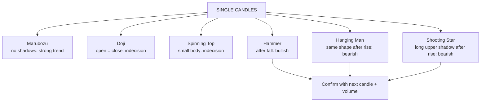

# TA-2: Single Candlestick Patterns

Covers: the six single-candle patterns in the syllabus: Marubozu, Doji, Spinning Top, Hammer, Hanging Man and Shooting Star; how to recognise each, what it signals, where it must appear to count, and how to confirm it. **(syllabus)**

## Where this fits in the ESE

Expect "draw and explain any four single candlestick patterns" (5 or 10 marks), or a case with a described candle ("long lower shadow after a fall") to interpret. **Draw each candle** in the answer: a labelled sketch earns marks.

## Reading one candle

- **Body** = open to close. Long body = strong conviction; short body = indecision.
- **Colour:** green/hollow = close > open (buyers won); red/filled = close < open (sellers won).
- **Upper shadow** = how far buyers pushed price above the body before being pushed back.
- **Lower shadow** = how far sellers pushed price down before buyers recovered it.

**Context rule:** a single candle signals a reversal only at the **end of a trend**. The same shape means different things after a rise and after a fall (Hammer vs Hanging Man).

**Confirmation rule:** wait for the **next candle** to move in the signalled direction (and ideally rising volume) before acting.

## The six patterns

### 1. Marubozu ("bald head")
Long body with **no (or tiny) shadows**.
- **Bullish (green) Marubozu:** open = low, close = high. Buyers controlled the whole session: strong bullish continuation or start of an up-move.
- **Bearish (red) Marubozu:** open = high, close = low. Sellers controlled the session: strong bearish signal.

### 2. Doji
**Open ≈ close**, so the body is a thin line; shadows can be any length.
- Signal: **indecision**; buyers and sellers balanced. After a strong trend it warns the trend may be tiring.
- Variants: long-legged doji (long shadows both sides), dragonfly doji (long lower shadow, open = close = high: bullish after a fall), gravestone doji (long upper shadow, open = close = low: bearish after a rise).

### 3. Spinning Top
**Small body** with upper and lower shadows longer than the body.
- Signal: **indecision**, like a doji but weaker; neither side in control. Treated as a possible pause or reversal warning; needs confirmation.

### 4. Hammer (bullish reversal)
Appears **after a downtrend**. Small body at the **top** of the range, **lower shadow at least twice the body**, little or no upper shadow.
- Story: sellers drove price sharply lower, but buyers pushed it back up to close near the high: selling is being absorbed.
- Body colour matters less (green is slightly stronger).
- Confirm with a higher close next day.

### 5. Hanging Man (bearish reversal)
**Same shape as a hammer** but appears **after an uptrend**.
- Story: during the session sellers pushed price well below the open, showing that selling pressure is emerging even though buyers recovered by the close.
- Bearish warning; confirm with a lower close next day.

### 6. Shooting Star (bearish reversal)
Appears **after an uptrend**. Small body at the **bottom** of the range, **long upper shadow (at least twice the body)**, little or no lower shadow.
- Story: buyers pushed price sharply higher but sellers drove it back down to close near the low: the rally was rejected.
- Its mirror after a downtrend is the **inverted hammer** (bullish).

## Summary table

| Pattern | Shape | Where | Signal |
|---|---|---|---|
| Bullish Marubozu | Long green body, no shadows | Anywhere | Strong bullish |
| Bearish Marubozu | Long red body, no shadows | Anywhere | Strong bearish |
| Doji | Open ≈ close | After a trend | Indecision; possible reversal |
| Spinning Top | Small body, both shadows | After a trend | Indecision |
| Hammer | Small body on top, long lower shadow | After a fall | Bullish reversal |
| Hanging Man | Same as hammer | After a rise | Bearish reversal |
| Shooting Star | Small body at bottom, long upper shadow | After a rise | Bearish reversal |

## Traps

- **Calling a hammer in an uptrend bullish.** In an uptrend that shape is a Hanging Man (bearish).
- **Acting without confirmation.**
- **Ignoring volume:** a reversal candle on low volume is weak.

## What to remember

- Marubozu = no shadows, full control; Doji = open ≈ close, indecision; Spinning Top = small body, indecision.
- Hammer (after fall, bullish) and Hanging Man (after rise, bearish) look identical; context decides.
- Shooting Star = long upper shadow after a rise, bearish.
- Lower or upper shadow ≥ 2 × body for hammer-type and star patterns.
- Confirm with the next candle and volume.

## Concept map

## Flashcards
Q: What is a Marubozu?
A: A long-bodied candle with no shadows; the buyers (green) or sellers (red) controlled the whole session.

Q: What does a Doji show?
A: Open and close are almost equal: indecision, a possible reversal after a strong trend.

Q: Describe a hammer and where it appears.
A: Small body near the top, lower shadow at least twice the body; after a downtrend; bullish reversal.

Q: How does a hanging man differ from a hammer?
A: Same shape, but it appears after an uptrend and is bearish.

Q: Describe a shooting star.
A: Small body near the low, long upper shadow, after an uptrend: buyers' rally rejected, bearish.

Q: What is a spinning top?
A: A small body with shadows on both sides longer than the body: indecision.

Q: Why wait for confirmation?
A: A single candle can be noise; the next candle moving in the signalled direction, ideally on higher volume, confirms the reversal.

## Sources
- BBA301F-5 course plan, Unit 3 (single candlestick patterns: Marubozu, Doji, Spinning Top, Hammer, Hanging Man, Shooting Star)
- Nison, *Japanese Candlestick Charting Techniques*
- Previous: [[SAPM Unit 3 - TA-1 Assumptions and Chart Types]] · Next: [[SAPM Unit 3 - TA-3 Multiple Candlestick Patterns and Gaps]]
- [[SAPM Unit 3 - Technical Analysis MOC (Node Map)]]
