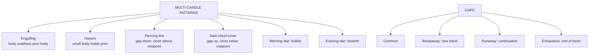

# TA-3: Multiple Candlestick Patterns and Gaps

Covers: the two-candle patterns (bullish and bearish engulfing, bullish and bearish harami, piercing line, dark cloud cover), gaps and their types, and the three-candle morning star and evening star. **(syllabus)**

## Where this fits in the ESE

"Explain any four multiple candlestick patterns with diagrams" is a typical 10-marker; a case may describe two or three candles for you to name and interpret. Draw each pattern.

## Two-candle patterns

<svg width="100%" style="max-width:680px;display:block;margin:12px auto" viewBox="0 0 680 510" role="img" xmlns="http://www.w3.org/2000/svg">
<title>Multiple candlestick patterns</title>
<desc>Top row bullish reversals after a fall: bullish engulfing, bullish harami, piercing line, morning star. Bottom row bearish reversals after a rise: bearish engulfing, bearish harami, dark cloud cover, evening star.</desc>
<line x1="66" y1="105" x2="66" y2="145" stroke="#A32D2D" stroke-width="2"/>
<rect x="55" y="110" width="22" height="30" rx="1" fill="#E24B4A" stroke="#A32D2D" stroke-width="1"/>
<line x1="104" y1="95" x2="104" y2="160" stroke="#3B6D11" stroke-width="2"/>
<rect x="93" y="100" width="22" height="55" rx="1" fill="#639922" stroke="#3B6D11" stroke-width="1"/>
<text font-size="14" font-weight="500" fill="currentColor" font-family="inherit" x="85" y="225" text-anchor="middle">Bullish engulfing</text>
<text font-size="12" fill="currentColor" opacity="0.7" font-family="inherit" x="85" y="243" text-anchor="middle">green body swallows red</text>
<line x1="236" y1="62" x2="236" y2="168" stroke="#A32D2D" stroke-width="2"/>
<rect x="225" y="70" width="22" height="90" rx="1" fill="#E24B4A" stroke="#A32D2D" stroke-width="1"/>
<line x1="274" y1="98" x2="274" y2="137" stroke="#3B6D11" stroke-width="2"/>
<rect x="263" y="105" width="22" height="25" rx="1" fill="#639922" stroke="#3B6D11" stroke-width="1"/>
<text font-size="14" font-weight="500" fill="currentColor" font-family="inherit" x="255" y="225" text-anchor="middle">Bullish harami</text>
<text font-size="12" fill="currentColor" opacity="0.7" font-family="inherit" x="255" y="243" text-anchor="middle">small body inside big red</text>
<line x1="406" y1="64" x2="406" y2="158" stroke="#A32D2D" stroke-width="2"/>
<rect x="395" y="70" width="22" height="80" rx="1" fill="#E24B4A" stroke="#A32D2D" stroke-width="1"/>
<line x1="388" y1="110" x2="462" y2="110" stroke="#888780" stroke-width="1" stroke-dasharray="3 3"/>
<line x1="444" y1="90" x2="444" y2="176" stroke="#3B6D11" stroke-width="2"/>
<rect x="433" y="95" width="22" height="75" rx="1" fill="#639922" stroke="#3B6D11" stroke-width="1"/>
<text font-size="12" fill="currentColor" opacity="0.7" font-family="inherit" x="466" y="114">mid</text>
<text font-size="14" font-weight="500" fill="currentColor" font-family="inherit" x="425" y="225" text-anchor="middle">Piercing line</text>
<text font-size="12" fill="currentColor" opacity="0.7" font-family="inherit" x="425" y="243" text-anchor="middle">gap down, close above mid</text>
<line x1="555" y1="55" x2="555" y2="148" stroke="#A32D2D" stroke-width="2"/>
<rect x="545" y="60" width="20" height="80" rx="1" fill="#E24B4A" stroke="#A32D2D" stroke-width="1"/>
<line x1="583" y1="152" x2="583" y2="176" stroke="#5F5E5A" stroke-width="2"/>
<rect x="575" y="160" width="16" height="8" rx="1" fill="#888780" stroke="#5F5E5A" stroke-width="1"/>
<line x1="610" y1="80" x2="610" y2="156" stroke="#3B6D11" stroke-width="2"/>
<rect x="600" y="85" width="20" height="65" rx="1" fill="#639922" stroke="#3B6D11" stroke-width="1"/>
<text font-size="14" font-weight="500" fill="currentColor" font-family="inherit" x="595" y="225" text-anchor="middle">Morning star</text>
<text font-size="12" fill="currentColor" opacity="0.7" font-family="inherit" x="595" y="243" text-anchor="middle">red, star, strong green</text>
<line x1="20" y1="265" x2="660" y2="265" stroke="#B4B2A9" stroke-width="0.5" stroke-dasharray="4 4"/>
<line x1="66" y1="345" x2="66" y2="385" stroke="#3B6D11" stroke-width="2"/>
<rect x="55" y="350" width="22" height="30" rx="1" fill="#639922" stroke="#3B6D11" stroke-width="1"/>
<line x1="104" y1="330" x2="104" y2="395" stroke="#A32D2D" stroke-width="2"/>
<rect x="93" y="335" width="22" height="55" rx="1" fill="#E24B4A" stroke="#A32D2D" stroke-width="1"/>
<text font-size="14" font-weight="500" fill="currentColor" font-family="inherit" x="85" y="475" text-anchor="middle">Bearish engulfing</text>
<text font-size="12" fill="currentColor" opacity="0.7" font-family="inherit" x="85" y="493" text-anchor="middle">red body swallows green</text>
<line x1="236" y1="322" x2="236" y2="428" stroke="#3B6D11" stroke-width="2"/>
<rect x="225" y="330" width="22" height="90" rx="1" fill="#639922" stroke="#3B6D11" stroke-width="1"/>
<line x1="274" y1="353" x2="274" y2="392" stroke="#A32D2D" stroke-width="2"/>
<rect x="263" y="360" width="22" height="25" rx="1" fill="#E24B4A" stroke="#A32D2D" stroke-width="1"/>
<text font-size="14" font-weight="500" fill="currentColor" font-family="inherit" x="255" y="475" text-anchor="middle">Bearish harami</text>
<text font-size="12" fill="currentColor" opacity="0.7" font-family="inherit" x="255" y="493" text-anchor="middle">small body inside big green</text>
<line x1="406" y1="332" x2="406" y2="426" stroke="#3B6D11" stroke-width="2"/>
<rect x="395" y="340" width="22" height="80" rx="1" fill="#639922" stroke="#3B6D11" stroke-width="1"/>
<line x1="388" y1="380" x2="462" y2="380" stroke="#888780" stroke-width="1" stroke-dasharray="3 3"/>
<line x1="444" y1="314" x2="444" y2="400" stroke="#A32D2D" stroke-width="2"/>
<rect x="433" y="320" width="22" height="75" rx="1" fill="#E24B4A" stroke="#A32D2D" stroke-width="1"/>
<text font-size="12" fill="currentColor" opacity="0.7" font-family="inherit" x="466" y="384">mid</text>
<text font-size="14" font-weight="500" fill="currentColor" font-family="inherit" x="425" y="475" text-anchor="middle">Dark cloud cover</text>
<text font-size="12" fill="currentColor" opacity="0.7" font-family="inherit" x="425" y="493" text-anchor="middle">gap up, close below mid</text>
<line x1="555" y1="342" x2="555" y2="435" stroke="#3B6D11" stroke-width="2"/>
<rect x="545" y="350" width="20" height="80" rx="1" fill="#639922" stroke="#3B6D11" stroke-width="1"/>
<line x1="583" y1="314" x2="583" y2="338" stroke="#5F5E5A" stroke-width="2"/>
<rect x="575" y="322" width="16" height="8" rx="1" fill="#888780" stroke="#5F5E5A" stroke-width="1"/>
<line x1="610" y1="334" x2="610" y2="410" stroke="#A32D2D" stroke-width="2"/>
<rect x="600" y="340" width="20" height="65" rx="1" fill="#E24B4A" stroke="#A32D2D" stroke-width="1"/>
<text font-size="14" font-weight="500" fill="currentColor" font-family="inherit" x="595" y="475" text-anchor="middle">Evening star</text>
<text font-size="12" fill="currentColor" opacity="0.7" font-family="inherit" x="595" y="493" text-anchor="middle">green, star, strong red</text>
</svg>

### Bullish engulfing (after a downtrend)
Day 1: small **red** candle. Day 2: large **green** candle whose body **completely engulfs** day 1's body (opens below day 1's close, closes above day 1's open).
- Story: sellers were in charge, then buyers overwhelmed them in one session. Strong bullish reversal.

### Bearish engulfing (after an uptrend)
Day 1: small **green** candle. Day 2: large **red** body that engulfs day 1's body.
- Strong bearish reversal.

### Bullish harami (after a downtrend)
"Harami" = pregnant. Day 1: large **red** candle. Day 2: small candle (often green) whose body sits **inside** day 1's body.
- Story: selling momentum has stalled. Weaker than engulfing; needs confirmation. A **harami cross** has a doji as day 2 (stronger).

### Bearish harami (after an uptrend)
Day 1: large **green** candle. Day 2: small body inside it.
- Buying momentum stalling; bearish warning.

### Piercing line / piercing pattern (bullish, after a downtrend)
Day 1: long **red** candle. Day 2: **opens below day 1's low** (gap down), then rallies to **close above the midpoint** of day 1's body (but not above its open).
- The deeper the close into day 1's body, the stronger. (If it closes above day 1's open, it is a bullish engulfing.)

### Dark cloud cover (bearish, after an uptrend)
Mirror of the piercing line. Day 1: long **green** candle. Day 2: **opens above day 1's high**, then falls to **close below the midpoint** of day 1's body.
- A "dark cloud" over the rally: bearish reversal.

## Gaps

A **gap** is a price range where no trading took place: today's low is above yesterday's high (**gap up**) or today's high is below yesterday's low (**gap down**). Gaps usually follow overnight news.

| Gap type | Where | Meaning |
|---|---|---|
| **Common gap** | Inside a trading range | Little significance; usually filled soon |
| **Breakaway gap** | Price breaks out of a range or pattern, on high volume | Start of a new trend |
| **Runaway (continuation / measuring) gap** | Middle of a strong trend | Trend continuing; often near the halfway point of the move |
| **Exhaustion gap** | Near the end of a long trend | Last burst before reversal; often filled quickly |
| **Island reversal** | Exhaustion gap then a breakaway gap in the other direction | Price "island" isolated: strong reversal |

<svg width="100%" style="max-width:680px;display:block;margin:12px auto" viewBox="0 0 680 315" role="img" xmlns="http://www.w3.org/2000/svg">
<title>Types of price gaps on one chart</title>
<desc>A price path moving from a sideways range with a common gap, a breakaway gap starting an uptrend, a runaway gap mid-trend, an exhaustion gap near the top, an island of three bars, then a breakaway gap down.</desc>
<rect x="90" y="222" width="44" height="4" fill="#EF9F27" stroke="#BA7517" stroke-width="1" opacity="0.5"/>
<rect x="210" y="205" width="44" height="17" fill="#EF9F27" stroke="#BA7517" stroke-width="1" opacity="0.5"/>
<rect x="330" y="142" width="44" height="10" fill="#EF9F27" stroke="#BA7517" stroke-width="1" opacity="0.5"/>
<rect x="450" y="80" width="44" height="12" fill="#EF9F27" stroke="#BA7517" stroke-width="1" opacity="0.5"/>
<rect x="540" y="78" width="44" height="17" fill="#EF9F27" stroke="#BA7517" stroke-width="1" opacity="0.5"/>
<rect x="30" y="228" width="14" height="22" rx="1" fill="#888780" stroke="#5F5E5A" stroke-width="1"/>
<rect x="60" y="232" width="14" height="22" rx="1" fill="#888780" stroke="#5F5E5A" stroke-width="1"/>
<rect x="90" y="226" width="14" height="20" rx="1" fill="#888780" stroke="#5F5E5A" stroke-width="1"/>
<rect x="120" y="212" width="14" height="10" rx="1" fill="#888780" stroke="#5F5E5A" stroke-width="1"/>
<rect x="150" y="220" width="14" height="20" rx="1" fill="#888780" stroke="#5F5E5A" stroke-width="1"/>
<rect x="180" y="226" width="14" height="22" rx="1" fill="#888780" stroke="#5F5E5A" stroke-width="1"/>
<rect x="210" y="222" width="14" height="22" rx="1" fill="#888780" stroke="#5F5E5A" stroke-width="1"/>
<rect x="240" y="180" width="14" height="25" rx="1" fill="#639922" stroke="#3B6D11" stroke-width="1"/>
<rect x="270" y="170" width="14" height="22" rx="1" fill="#639922" stroke="#3B6D11" stroke-width="1"/>
<rect x="300" y="160" width="14" height="22" rx="1" fill="#639922" stroke="#3B6D11" stroke-width="1"/>
<rect x="330" y="152" width="14" height="20" rx="1" fill="#639922" stroke="#3B6D11" stroke-width="1"/>
<rect x="360" y="120" width="14" height="22" rx="1" fill="#639922" stroke="#3B6D11" stroke-width="1"/>
<rect x="390" y="110" width="14" height="22" rx="1" fill="#639922" stroke="#3B6D11" stroke-width="1"/>
<rect x="420" y="100" width="14" height="22" rx="1" fill="#639922" stroke="#3B6D11" stroke-width="1"/>
<rect x="450" y="92" width="14" height="20" rx="1" fill="#639922" stroke="#3B6D11" stroke-width="1"/>
<rect x="480" y="60" width="14" height="20" rx="1" fill="#888780" stroke="#5F5E5A" stroke-width="1"/>
<rect x="510" y="55" width="14" height="20" rx="1" fill="#888780" stroke="#5F5E5A" stroke-width="1"/>
<rect x="540" y="58" width="14" height="20" rx="1" fill="#888780" stroke="#5F5E5A" stroke-width="1"/>
<rect x="570" y="95" width="14" height="23" rx="1" fill="#E24B4A" stroke="#A32D2D" stroke-width="1"/>
<rect x="600" y="105" width="14" height="23" rx="1" fill="#E24B4A" stroke="#A32D2D" stroke-width="1"/>
<rect x="630" y="115" width="14" height="23" rx="1" fill="#E24B4A" stroke="#A32D2D" stroke-width="1"/>
<rect x="472" y="47" width="90" height="38" rx="6" fill="none" stroke="#888780" stroke-width="1" stroke-dasharray="4 3"/>
<text font-size="14" font-weight="500" fill="currentColor" font-family="inherit" x="517" y="38" text-anchor="middle">Island reversal</text>
<text font-size="12" fill="currentColor" opacity="0.7" font-family="inherit" x="112" y="272" text-anchor="middle">Common gap</text>
<text font-size="12" fill="currentColor" opacity="0.7" font-family="inherit" x="232" y="272" text-anchor="middle">Breakaway gap</text>
<text font-size="12" fill="currentColor" opacity="0.7" font-family="inherit" x="352" y="196" text-anchor="middle">Runaway gap</text>
<text font-size="12" fill="currentColor" opacity="0.7" font-family="inherit" x="440" y="70" text-anchor="end">Exhaustion gap</text>
<text font-size="12" fill="currentColor" opacity="0.7" font-family="inherit" x="590" y="88">Breakaway</text>
<text font-size="12" fill="currentColor" opacity="0.7" font-family="inherit" x="20" y="302">Each bar = one day's high-to-low range. Shaded bands = gaps, prices where no trade happened.</text>
</svg>

Old saying: "gaps tend to be filled": price often returns to cover the gap, except breakaway and runaway gaps in strong trends.

## Three-candle patterns

### Morning star (bullish reversal, after a downtrend)
1. Long **red** candle (sellers in charge).
2. Small-bodied candle (star; can be a doji), ideally **gapping down** below day 1's body: indecision.
3. Long **green** candle closing **well into day 1's body** (above its midpoint).
- Story: selling exhausted (day 2), buyers take control (day 3). The "star" before sunrise.

### Evening star (bearish reversal, after an uptrend)
1. Long **green** candle.
2. Small-bodied star gapping **above** day 1's body.
3. Long **red** candle closing **well into day 1's body**.
- The star before nightfall. With a doji as day 2: **evening doji star** (stronger).

## Summary table

| Pattern | Candles | Trend before | Signal |
|---|---|---|---|
| Bullish engulfing | 2 | Down | Bullish (strong) |
| Bearish engulfing | 2 | Up | Bearish (strong) |
| Bullish harami | 2 | Down | Bullish (weak; confirm) |
| Bearish harami | 2 | Up | Bearish (weak; confirm) |
| Piercing line | 2 | Down | Bullish |
| Dark cloud cover | 2 | Up | Bearish |
| Morning star | 3 | Down | Bullish |
| Evening star | 3 | Up | Bearish |

## What to remember

- Engulfing: day 2's body swallows day 1's: strong reversal.
- Harami: day 2's small body sits inside day 1's: momentum stalling.
- Piercing line: gap down, close above day 1's midpoint (bullish). Dark cloud: gap up, close below midpoint (bearish).
- Gaps: common, breakaway, runaway, exhaustion; island reversal.
- Morning star (bullish) and evening star (bearish): long candle, star, long opposite candle into the first body.

## Concept map

## Flashcards
Q: Describe a bullish engulfing pattern.
A: After a downtrend, a small red candle followed by a large green candle whose body completely covers the red body.

Q: What does a harami signal, and how strong is it?
A: A small body inside the previous large body: momentum stalling; weaker than engulfing, needs confirmation.

Q: What is a piercing line?
A: After a downtrend, a long red candle then a green candle that opens below the prior low and closes above the midpoint of the red body.

Q: What is dark cloud cover?
A: After an uptrend, a long green candle then a red candle that opens above the prior high and closes below the midpoint of the green body.

Q: Name the four types of gaps.
A: Common, breakaway, runaway (continuation/measuring), exhaustion.

Q: What does an exhaustion gap signal?
A: The last burst of a long trend, often followed by a reversal and a quick fill.

Q: Describe a morning star.
A: After a downtrend: long red candle, small star gapping down, long green candle closing well into the first candle's body; bullish reversal.

## Sources
- BBA301F-5 course plan, Unit 3 (multiple candlestick patterns: engulfing, harami, piercing, dark cloud cover, gaps, morning star, evening star)
- Nison; Murphy, *Technical Analysis of the Financial Markets*
- Previous: [[SAPM Unit 3 - TA-2 Single Candlestick Patterns]] · Next: [[SAPM Unit 3 - TA-4 Dow Theory Trend Support and Resistance]]
- [[SAPM Unit 3 - Technical Analysis MOC (Node Map)]]
