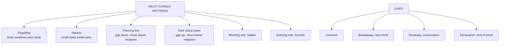

# TA-3: Multiple Candlestick Patterns and Gaps

Covers: the two-candle patterns (bullish and bearish engulfing, bullish and bearish harami, piercing line, dark cloud cover), gaps and their types, and the three-candle morning star and evening star. **(syllabus)**

## Where this fits in the ESE

"Explain any four multiple candlestick patterns with diagrams" is a typical 10-marker; a case may describe two or three candles for you to name and interpret. Draw each pattern.

## Two-candle patterns

### Bullish engulfing (after a downtrend)
Day 1: small **red** candle. Day 2: large **green** candle whose body **completely engulfs** day 1's body (opens below day 1's close, closes above day 1's open).
- Story: sellers were in charge, then buyers overwhelmed them in one session. Strong bullish reversal.

### Bearish engulfing (after an uptrend)
Day 1: small **green** candle. Day 2: large **red** body that engulfs day 1's body.
- Strong bearish reversal.

### Bullish harami (after a downtrend)
"Harami" = pregnant. Day 1: large **red** candle. Day 2: small candle (often green) whose body sits **inside** day 1's body.
- Story: selling momentum has stalled. Weaker than engulfing; needs confirmation. A **harami cross** has a doji as day 2 (stronger).

### Bearish harami (after an uptrend)
Day 1: large **green** candle. Day 2: small body inside it.
- Buying momentum stalling; bearish warning.

### Piercing line / piercing pattern (bullish, after a downtrend)
Day 1: long **red** candle. Day 2: **opens below day 1's low** (gap down), then rallies to **close above the midpoint** of day 1's body (but not above its open).
- The deeper the close into day 1's body, the stronger. (If it closes above day 1's open, it is a bullish engulfing.)

### Dark cloud cover (bearish, after an uptrend)
Mirror of the piercing line. Day 1: long **green** candle. Day 2: **opens above day 1's high**, then falls to **close below the midpoint** of day 1's body.
- A "dark cloud" over the rally: bearish reversal.

## Gaps

A **gap** is a price range where no trading took place: today's low is above yesterday's high (**gap up**) or today's high is below yesterday's low (**gap down**). Gaps usually follow overnight news.

| Gap type | Where | Meaning |
|---|---|---|
| **Common gap** | Inside a trading range | Little significance; usually filled soon |
| **Breakaway gap** | Price breaks out of a range or pattern, on high volume | Start of a new trend |
| **Runaway (continuation / measuring) gap** | Middle of a strong trend | Trend continuing; often near the halfway point of the move |
| **Exhaustion gap** | Near the end of a long trend | Last burst before reversal; often filled quickly |
| **Island reversal** | Exhaustion gap then a breakaway gap in the other direction | Price "island" isolated: strong reversal |

Old saying: "gaps tend to be filled": price often returns to cover the gap, except breakaway and runaway gaps in strong trends.

## Three-candle patterns

### Morning star (bullish reversal, after a downtrend)
1. Long **red** candle (sellers in charge).
2. Small-bodied candle (star; can be a doji), ideally **gapping down** below day 1's body: indecision.
3. Long **green** candle closing **well into day 1's body** (above its midpoint).
- Story: selling exhausted (day 2), buyers take control (day 3). The "star" before sunrise.

### Evening star (bearish reversal, after an uptrend)
1. Long **green** candle.
2. Small-bodied star gapping **above** day 1's body.
3. Long **red** candle closing **well into day 1's body**.
- The star before nightfall. With a doji as day 2: **evening doji star** (stronger).

## Summary table

| Pattern | Candles | Trend before | Signal |
|---|---|---|---|
| Bullish engulfing | 2 | Down | Bullish (strong) |
| Bearish engulfing | 2 | Up | Bearish (strong) |
| Bullish harami | 2 | Down | Bullish (weak; confirm) |
| Bearish harami | 2 | Up | Bearish (weak; confirm) |
| Piercing line | 2 | Down | Bullish |
| Dark cloud cover | 2 | Up | Bearish |
| Morning star | 3 | Down | Bullish |
| Evening star | 3 | Up | Bearish |

## What to remember

- Engulfing: day 2's body swallows day 1's: strong reversal.
- Harami: day 2's small body sits inside day 1's: momentum stalling.
- Piercing line: gap down, close above day 1's midpoint (bullish). Dark cloud: gap up, close below midpoint (bearish).
- Gaps: common, breakaway, runaway, exhaustion; island reversal.
- Morning star (bullish) and evening star (bearish): long candle, star, long opposite candle into the first body.

## Concept map

## Flashcards
Q: Describe a bullish engulfing pattern.
A: After a downtrend, a small red candle followed by a large green candle whose body completely covers the red body.

Q: What does a harami signal, and how strong is it?
A: A small body inside the previous large body: momentum stalling; weaker than engulfing, needs confirmation.

Q: What is a piercing line?
A: After a downtrend, a long red candle then a green candle that opens below the prior low and closes above the midpoint of the red body.

Q: What is dark cloud cover?
A: After an uptrend, a long green candle then a red candle that opens above the prior high and closes below the midpoint of the green body.

Q: Name the four types of gaps.
A: Common, breakaway, runaway (continuation/measuring), exhaustion.

Q: What does an exhaustion gap signal?
A: The last burst of a long trend, often followed by a reversal and a quick fill.

Q: Describe a morning star.
A: After a downtrend: long red candle, small star gapping down, long green candle closing well into the first candle's body; bullish reversal.

## Sources
- BBA301F-5 course plan, Unit 3 (multiple candlestick patterns: engulfing, harami, piercing, dark cloud cover, gaps, morning star, evening star)
- Nison; Murphy, *Technical Analysis of the Financial Markets*
- Previous: [[SAPM Unit 3 - TA-2 Single Candlestick Patterns]] · Next: [[SAPM Unit 3 - TA-4 Dow Theory Trend Support and Resistance]]
- [[SAPM Unit 3 - Technical Analysis MOC (Node Map)]]
