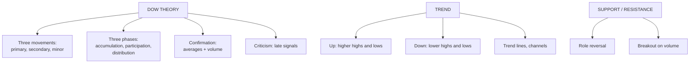

# TA-4: Dow Theory, Trend Analysis, Support and Resistance

Covers: Dow theory (its tenets, the three movements, the three phases, confirmation by the averages, criticisms), trend analysis (uptrend, downtrend, sideways, trend lines, channels), and support and resistance (meaning, role reversal, breakouts). **(syllabus)**

## Where this fits in the ESE

"Explain Dow theory" is one of the most-asked technical questions (10 marks). Support and resistance often appears in a case: "the stock has bounced off ₹480 three times; advise".

## Dow theory

Developed from Charles Dow's Wall Street Journal editorials (1900–1902), formalised by Hamilton and Rhea. It is the foundation of modern technical analysis.

### Tenets
1. **The averages discount everything.**
2. **The market has three movements:**
   - **Primary trend:** the main tide, lasting **one to several years** (bull or bear market).
   - **Secondary reaction:** corrections against the primary trend, lasting **three weeks to three months**, typically retracing **one-third to two-thirds** of the prior move.
   - **Minor (daily) fluctuations:** ripples lasting hours to a few weeks; mostly noise and open to manipulation.
3. **Primary trends have three phases:**
   - *Bull market:* accumulation (informed investors buy quietly) → public participation (rising earnings, trend followers join) → excess/distribution (speculation, everyone buys, informed investors sell).
   - *Bear market:* distribution → panic (public sells) → despair / discouraged selling.
4. **The averages must confirm each other:** originally the Industrial and Rail (now Transportation) averages. A bull signal needs both to make new highs. (In India analysts apply the idea to Nifty and Sensex or to broad and sectoral indices.)
5. **Volume must confirm the trend:** volume rises in the direction of the primary trend.
6. **A trend continues until a definite reversal signal appears.**

<svg width="100%" style="max-width:680px;display:block;margin:12px auto" viewBox="0 0 680 336" role="img" xmlns="http://www.w3.org/2000/svg">
<title>Dow theory: three movements and three phases</title>
<desc>A rising bull market drawn as a zigzag. The dashed line is the primary trend, one amber band marks a secondary reaction against it, small ripples are minor fluctuations, and dashed vertical lines split the move into accumulation, public participation and distribution.</desc>
<line x1="230" y1="58" x2="230" y2="300" stroke="#888780" stroke-width="1" stroke-dasharray="4 4"/>
<line x1="450" y1="58" x2="450" y2="300" stroke="#888780" stroke-width="1" stroke-dasharray="4 4"/>
<text font-size="14" font-weight="500" fill="currentColor" font-family="inherit" x="135" y="28" text-anchor="middle">1 Accumulation</text>
<text font-size="12" fill="currentColor" opacity="0.7" font-family="inherit" x="135" y="46" text-anchor="middle">informed investors buy quietly</text>
<text font-size="14" font-weight="500" fill="currentColor" font-family="inherit" x="340" y="28" text-anchor="middle">2 Public participation</text>
<text font-size="12" fill="currentColor" opacity="0.7" font-family="inherit" x="340" y="46" text-anchor="middle">trend followers join, earnings rise</text>
<text font-size="14" font-weight="500" fill="currentColor" font-family="inherit" x="555" y="28" text-anchor="middle">3 Distribution</text>
<text font-size="12" fill="currentColor" opacity="0.7" font-family="inherit" x="555" y="46" text-anchor="middle">speculation, informed sell</text>
<rect x="340" y="180" width="50" height="72" fill="#EF9F27" fill-opacity="0.5" stroke="#BA7517" stroke-width="1"/>
<line x1="50" y1="286" x2="645" y2="170" stroke="#5F5E5A" stroke-width="2" stroke-dasharray="6 4"/>
<polyline points="50,270 65,280 80,266 95,276 110,262 125,272 140,260 155,270 170,258 185,266 200,252 215,262 230,248 245,236 255,244 270,222 285,230 300,206 312,214 325,190 340,190 350,204 358,198 370,222 378,216 388,238 400,226 410,232 425,200 435,208 450,178 462,186 472,170 485,182 498,160 510,172 525,150 540,164 555,148 570,160 585,146 600,158 615,150 630,164 645,158" fill="none" stroke="#3B6D11" stroke-width="2" stroke-linejoin="round" stroke-linecap="round"/>
<text font-size="14" font-weight="500" fill="currentColor" font-family="inherit" x="365" y="165" text-anchor="middle">Secondary reaction</text>
<text font-size="12" fill="currentColor" opacity="0.7" font-family="inherit" x="365" y="272" text-anchor="middle">3 weeks to 3 months</text>
<text font-size="12" fill="currentColor" opacity="0.7" font-family="inherit" x="365" y="290" text-anchor="middle">retraces 1/3 to 2/3</text>
<text font-size="12" fill="currentColor" opacity="0.7" font-family="inherit" x="60" y="232" text-anchor="start">Minor ripples: hours to weeks</text>
<text font-size="12" fill="currentColor" opacity="0.7" font-family="inherit" x="60" y="318" text-anchor="start">Dashed line: primary trend, one to several years</text>
</svg>

### Bull and bear signals
- Uptrend: a series of **higher highs and higher lows**.
- Downtrend: **lower highs and lower lows**.
- A primary bull trend is signalled to have reversed when a rally fails to make a new high and the following decline breaks below the previous low (and the other average confirms).

### Criticisms
- Signals come **late**: a large part of the move is over before confirmation.
- Doesn't forecast how long or how far a trend will run.
- Subjective in distinguishing secondary reactions from primary reversals.
- Built for industrial and rail averages in a different era.
- Says little about individual stocks.

## Trend analysis

- **Uptrend:** higher highs and higher lows. Draw an **up trend line** joining at least two (better three) rising lows; it acts as support.
- **Downtrend:** lower highs and lower lows. Draw a **down trend line** joining falling highs; it acts as resistance.
- **Sideways (horizontal) trend:** price moves in a range.
- **Channel:** a parallel line drawn through the highs of an uptrend (or lows of a downtrend); traders buy near the lower line and sell near the upper.
- **Trend line break:** a close beyond the line, ideally on higher volume, warns that the trend may be ending.

<svg width="100%" style="max-width:680px;display:block;margin:12px auto" viewBox="0 0 680 326" role="img" xmlns="http://www.w3.org/2000/svg">
<title>Uptrend and downtrend</title>
<desc>Left: an uptrend with higher highs and higher lows, a trend line under the lows acting as support and a dashed channel line through the highs. Right: a downtrend with lower highs and lower lows, a trend line over the highs acting as resistance and a dashed channel line through the lows.</desc>
<text font-size="14" font-weight="500" fill="currentColor" font-family="inherit" x="160" y="26" text-anchor="middle">Uptrend</text>
<text font-size="12" fill="currentColor" opacity="0.7" font-family="inherit" x="160" y="44" text-anchor="middle">higher highs, higher lows</text>
<line x1="30" y1="254" x2="290" y2="176" stroke="#5F5E5A" stroke-width="2"/>
<line x1="30" y1="200" x2="290" y2="122" stroke="#888780" stroke-width="1.5" stroke-dasharray="6 4"/>
<polyline points="30,254 80,185 125,225 180,155 225,195 280,125" fill="none" stroke="#3B6D11" stroke-width="2" stroke-linejoin="round" stroke-linecap="round"/>
<circle cx="80" cy="185" r="3.5" fill="#639922" stroke="#3B6D11" stroke-width="1"/>
<circle cx="180" cy="155" r="3.5" fill="#639922" stroke="#3B6D11" stroke-width="1"/>
<circle cx="280" cy="125" r="3.5" fill="#639922" stroke="#3B6D11" stroke-width="1"/>
<circle cx="125" cy="225" r="3.5" fill="#639922" stroke="#3B6D11" stroke-width="1"/>
<circle cx="225" cy="195" r="3.5" fill="#639922" stroke="#3B6D11" stroke-width="1"/>
<text font-size="12" fill="currentColor" font-family="inherit" x="180" y="142" text-anchor="middle">HH</text>
<text font-size="12" fill="currentColor" font-family="inherit" x="280" y="112" text-anchor="middle">HH</text>
<text font-size="12" fill="currentColor" font-family="inherit" x="225" y="214" text-anchor="middle">HL</text>
<text font-size="12" fill="currentColor" opacity="0.7" font-family="inherit" x="160" y="292" text-anchor="middle">Up trend line joins the lows: support</text>
<text font-size="12" fill="currentColor" opacity="0.7" font-family="inherit" x="160" y="310" text-anchor="middle">Dashed channel line runs through the highs</text>
<text font-size="14" font-weight="500" fill="currentColor" font-family="inherit" x="500" y="26" text-anchor="middle">Downtrend</text>
<text font-size="12" fill="currentColor" opacity="0.7" font-family="inherit" x="500" y="44" text-anchor="middle">lower highs, lower lows</text>
<line x1="370" y1="122" x2="630" y2="200" stroke="#5F5E5A" stroke-width="2"/>
<line x1="370" y1="175.5" x2="630" y2="253.5" stroke="#888780" stroke-width="1.5" stroke-dasharray="6 4"/>
<polyline points="380,125 435,195 480,155 535,225 580,185 630,254" fill="none" stroke="#A32D2D" stroke-width="2" stroke-linejoin="round" stroke-linecap="round"/>
<circle cx="380" cy="125" r="3.5" fill="#E24B4A" stroke="#A32D2D" stroke-width="1"/>
<circle cx="480" cy="155" r="3.5" fill="#E24B4A" stroke="#A32D2D" stroke-width="1"/>
<circle cx="580" cy="185" r="3.5" fill="#E24B4A" stroke="#A32D2D" stroke-width="1"/>
<circle cx="435" cy="195" r="3.5" fill="#E24B4A" stroke="#A32D2D" stroke-width="1"/>
<circle cx="535" cy="225" r="3.5" fill="#E24B4A" stroke="#A32D2D" stroke-width="1"/>
<circle cx="630" cy="254" r="3.5" fill="#E24B4A" stroke="#A32D2D" stroke-width="1"/>
<text font-size="12" fill="currentColor" font-family="inherit" x="480" y="142" text-anchor="middle">LH</text>
<text font-size="12" fill="currentColor" font-family="inherit" x="580" y="172" text-anchor="middle">LH</text>
<text font-size="12" fill="currentColor" font-family="inherit" x="535" y="243" text-anchor="middle">LL</text>
<text font-size="12" fill="currentColor" font-family="inherit" x="630" y="272" text-anchor="middle">LL</text>
<text font-size="12" fill="currentColor" opacity="0.7" font-family="inherit" x="500" y="292" text-anchor="middle">Down trend line joins the highs: resistance</text>
<text font-size="12" fill="currentColor" opacity="0.7" font-family="inherit" x="500" y="310" text-anchor="middle">Dashed channel line runs through the lows</text>
</svg>

"The trend is your friend": trade with the primary trend, not against it.

## Support and resistance

- **Support:** a price level where **demand is strong enough to stop a fall**: buyers step in (earlier lows, round numbers, moving averages).
- **Resistance:** a price level where **supply is strong enough to stop a rise**: sellers step in (earlier highs, round numbers).
- Why they work: market memory. Investors who missed buying at ₹480 buy if it returns there; investors who bought at ₹560 and saw a loss sell to break even when it returns.

**Role reversal:** once broken decisively, **resistance becomes support** and **support becomes resistance**.

**Breakout:** a close above resistance (or below support) on high volume signals a new move; a **false breakout** reverses quickly (a whipsaw). Many traders wait for a close 2–3% beyond the level, or two closes, before acting.

### Worked example (case-style)
A stock has bounced from **₹480** three times in six months and failed at **₹560** twice. Today it closes at **₹575** on twice the average volume.
- ₹480 = support, ₹560 = resistance.
- The close above ₹560 on high volume is a **breakout**; ₹560 should now act as **support** (role reversal).
- Action: **buy**, with a stop-loss just below ₹560 (e.g. ₹550). A simple measured-move target is range height added to the breakout: 560 + (560 − 480) = **₹640**.

<svg width="100%" style="max-width:680px;display:block;margin:12px auto" viewBox="0 0 680 302" role="img" xmlns="http://www.w3.org/2000/svg">
<title>Support, resistance and breakout: worked example</title>
<desc>Price bounces three times off support at 480 and is rejected twice at resistance 560, then closes at 575 on high volume. It pulls back to retest 560 from above, which now acts as support, and heads for the 640 target. A stop-loss sits at 550.</desc>
<rect x="40" y="164" width="600" height="12" fill="#EF9F27" fill-opacity="0.5" stroke="#BA7517" stroke-width="1"/>
<line x1="40" y1="270" x2="640" y2="270" stroke="#5F5E5A" stroke-width="1.5" stroke-dasharray="6 4"/>
<line x1="520" y1="70" x2="640" y2="70" stroke="#3B6D11" stroke-width="1.5" stroke-dasharray="6 4"/>
<line x1="470" y1="182.5" x2="640" y2="182.5" stroke="#A32D2D" stroke-width="1.5" stroke-dasharray="6 4"/>
<polyline points="50,222 95,270 140,195 170,171 215,270 255,200 285,172 330,270 375,190 415,151 450,169 490,125 520,138 600,74" fill="none" stroke="#3B6D11" stroke-width="2" stroke-linejoin="round" stroke-linecap="round"/>
<circle cx="95" cy="270" r="4" fill="#888780" stroke="#5F5E5A" stroke-width="1"/>
<circle cx="215" cy="270" r="4" fill="#888780" stroke="#5F5E5A" stroke-width="1"/>
<circle cx="330" cy="270" r="4" fill="#888780" stroke="#5F5E5A" stroke-width="1"/>
<circle cx="170" cy="171" r="4" fill="#888780" stroke="#5F5E5A" stroke-width="1"/>
<circle cx="285" cy="172" r="4" fill="#888780" stroke="#5F5E5A" stroke-width="1"/>
<circle cx="415" cy="151" r="5" fill="#639922" stroke="#3B6D11" stroke-width="1"/>
<circle cx="450" cy="169" r="4" fill="#639922" stroke="#3B6D11" stroke-width="1"/>
<text font-size="14" font-weight="500" fill="currentColor" font-family="inherit" x="45" y="157" text-anchor="start">Resistance 560: rejected twice</text>
<text font-size="14" font-weight="500" fill="currentColor" font-family="inherit" x="640" y="262" text-anchor="end">Support 480: three bounces</text>
<text font-size="12" fill="currentColor" opacity="0.7" font-family="inherit" x="95" y="290" text-anchor="middle">bounce 1</text>
<text font-size="12" fill="currentColor" opacity="0.7" font-family="inherit" x="215" y="290" text-anchor="middle">bounce 2</text>
<text font-size="12" fill="currentColor" opacity="0.7" font-family="inherit" x="330" y="290" text-anchor="middle">bounce 3</text>
<text font-size="14" font-weight="500" fill="currentColor" font-family="inherit" x="405" y="140" text-anchor="end">Breakout: close 575 on 2x volume</text>
<text font-size="14" font-weight="500" fill="currentColor" font-family="inherit" x="640" y="157" text-anchor="end">Now support</text>
<text font-size="12" fill="currentColor" opacity="0.7" font-family="inherit" x="480" y="225" text-anchor="middle">retest from above holds: role reversal</text>
<text font-size="14" font-weight="500" fill="#A32D2D" font-family="inherit" x="640" y="198" text-anchor="end">Stop-loss 550</text>
<text font-size="14" font-weight="500" fill="#3B6D11" font-family="inherit" x="640" y="60" text-anchor="end">Target 640 = 560 + 80</text>
</svg>

## What to remember

- Dow: averages discount everything; primary (1+ years), secondary (3 weeks–3 months, ⅓–⅔ retracement), minor movements; three phases; averages and volume confirm.
- Uptrend = higher highs and lows; downtrend = lower highs and lows.
- Support stops falls (demand); resistance stops rises (supply); broken levels swap roles.
- Breakout example: range 480–560, close 575 on high volume → buy, stop ₹550, target ₹640.

## Concept map

## Flashcards
Q: Name the three movements in Dow theory and their durations.
A: Primary (one to several years), secondary reaction (three weeks to three months), minor (hours to weeks).

Q: How much does a secondary reaction usually retrace?
A: One-third to two-thirds of the preceding primary move.

Q: Name the three phases of a bull market under Dow theory.
A: Accumulation, public participation, excess (distribution).

Q: What must confirm a trend under Dow theory?
A: The two averages (industrial and transportation) and rising volume in the trend's direction.

Q: Main criticism of Dow theory?
A: Signals come late, after much of the move is over.

Q: What is support?
A: A price level where demand is strong enough to stop a fall.

Q: What is role reversal?
A: Once broken, resistance becomes support and support becomes resistance.

Q: Range ₹480–560; close at ₹575 on high volume. Measured target?
A: 560 + (560 − 480) = ₹640.

## Sources
- BBA301F-5 course plan, Unit 3 (Dow theory and trend analysis; support and resistance)
- Fischer & Jordan; Murphy, *Technical Analysis of the Financial Markets*
- Previous: [[SAPM Unit 3 - TA-3 Multiple Candlestick Patterns and Gaps]] · Next: [[SAPM Unit 3 - TA-5 RSI and ROC]]
- [[SAPM Unit 3 - Technical Analysis MOC (Node Map)]]
