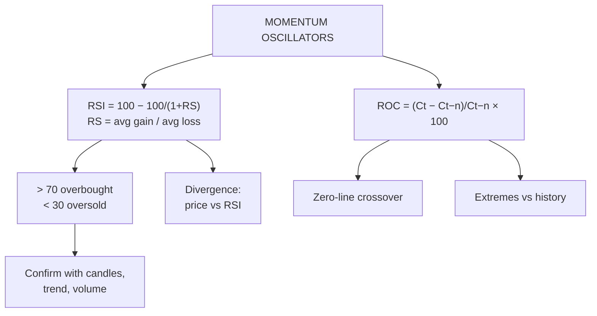

# TA-5: RSI and ROC (Practical Problems)

Covers: what oscillators and momentum indicators are, the Relative Strength Index (formula, step-by-step computation, overbought/oversold, divergence), and the Rate of Change (formula, computation, interpretation). The syllabus names **practical problems** for both, so the computation is examinable. **(syllabus)**

## Where this fits in the ESE

A 5-mark or 10-mark sum: "compute the 14-day RSI from the following closing prices and interpret", or "compute the 5-day and 10-day ROC". CIA2 rewarded "applies technical tools and indicators with clear analytical reasoning", so always end with an interpretation line.

## Oscillators and momentum

An **oscillator** moves within a range (RSI between 0 and 100) or around a centre line (ROC around 0). It measures **momentum**: the speed of price change. Momentum often turns before price does, so oscillators help spot overbought or oversold markets and weakening trends.

## Relative Strength Index (Wilder, 1978)

**RSI = 100 − 100 ÷ (1 + RS)**
**RS = Average gain over n days ÷ Average loss over n days** (n is usually 14)

Steps:
1. Compute each day's change (close − previous close).
2. Separate gains (positive changes) and losses (negative changes, written as positive numbers).
3. Average gain = sum of gains ÷ n; average loss = sum of losses ÷ n.
4. RS = average gain ÷ average loss.
5. RSI = 100 − 100 ÷ (1 + RS).

(Wilder's later RSI values smooth the averages: new avg gain = [previous avg gain × 13 + today's gain] ÷ 14. In exams, the simple average above is the usual method unless told otherwise.)

**Interpretation:**
- **RSI > 70: overbought**: the rise may be overextended; watch for a correction (sell signal when it turns back down below 70).
- **RSI < 30: oversold**: the fall may be overextended; watch for a bounce (buy signal when it rises back above 30).
- **50 line:** above 50 bullish momentum, below 50 bearish.
- **Divergence:** price makes a new high but RSI makes a lower high (**bearish divergence**): momentum weakening, reversal possible. Price makes a new low but RSI a higher low (**bullish divergence**).
- In strong trends RSI can stay overbought or oversold for a long time; don't sell a strong uptrend just because RSI is 72.

### Worked example: 14-day RSI, laid out as the exam answer

**Question (illustrative):** closing prices over 15 days: 100, 102, 101, 104, 106, 105, 107, 110, 108, 111, 113, 112, 115, 114, 117. Compute the 14-day RSI and interpret.

| Day | Close | Change | Gain | Loss |
|---|---|---|---|---|
| 1 | 100 | | | |
| 2 | 102 | +2 | 2 | |
| 3 | 101 | −1 | | 1 |
| 4 | 104 | +3 | 3 | |
| 5 | 106 | +2 | 2 | |
| 6 | 105 | −1 | | 1 |
| 7 | 107 | +2 | 2 | |
| 8 | 110 | +3 | 3 | |
| 9 | 108 | −2 | | 2 |
| 10 | 111 | +3 | 3 | |
| 11 | 113 | +2 | 2 | |
| 12 | 112 | −1 | | 1 |
| 13 | 115 | +3 | 3 | |
| 14 | 114 | −1 | | 1 |
| 15 | 117 | +3 | 3 | |
| **Total** | | | **23** | **6** |

1. Average gain = 23 ÷ 14 = 1.643; average loss = 6 ÷ 14 = 0.429.
2. RS = 1.643 ÷ 0.429 = 23 ÷ 6 = **3.833**.
3. RSI = 100 − 100 ÷ (1 + 3.833) = 100 − 100 ÷ 4.833 = 100 − 20.69 = **79.31**.

**Interpretation:** RSI 79.3 is above 70: the stock is **overbought**. The uptrend is strong, but the risk of a short-term pullback is high. A trader should avoid fresh buying, consider booking partial profits, and sell if RSI turns back below 70 or a bearish candle (e.g. shooting star) appears.

## Rate of Change (ROC)

**ROC = (Cₜ − Cₜ₋ₙ) ÷ Cₜ₋ₙ × 100**
where Cₜ is today's close and Cₜ₋ₙ is the close n periods ago. (A variant, the momentum indicator, uses Cₜ − Cₜ₋ₙ in rupees.)

**Interpretation:**
- ROC > 0: price higher than n days ago (bullish momentum); rising ROC = accelerating.
- ROC < 0: bearish momentum.
- **Zero-line crossover:** crossing above 0 is a buy signal; below 0 a sell signal.
- Extreme high or low ROC relative to the stock's own history signals overbought or oversold.
- Divergence with price warns of a reversal.

### Worked example: ROC

Using the same prices (day 15 close 117):
- **10-day ROC** = (117 − 106) ÷ 106 × 100 = **+10.38%** (day 5 close was 106).
- **5-day ROC** = (117 − 111) ÷ 111 × 100 = **+5.41%** (day 10 close was 111).

**Interpretation:** both are positive, so momentum is bullish. The 5-day ROC (5.41%) is about half the 10-day (10.38%), so the pace of the rise has been steady rather than accelerating. Combined with RSI 79, the picture is a strong but stretched uptrend.

## Traps

- **Including the first day's close as a change.** 15 closes give 14 changes.
- **Writing losses as negative numbers** in the average loss. Use absolute values.
- **Dividing by days with a gain only.** Average gain and loss both divide by n (14).
- **Interpreting without context:** RSI 75 in a strong trend may stay overbought.

## What to remember

- RSI = 100 − 100/(1 + RS); RS = avg gain/avg loss over 14 days.
- > 70 overbought, < 30 oversold; divergence warns of reversal.
- Example: gains 23, losses 6, RS 3.833, RSI 79.31: overbought.
- ROC = (Cₜ − Cₜ₋ₙ)/Cₜ₋ₙ × 100; zero-line crossovers.
- Example: 10-day ROC +10.38%, 5-day +5.41%.

## Concept map

## Flashcards
Q: Write the RSI formula.
A: RSI = 100 − 100 ÷ (1 + RS), where RS = average gain ÷ average loss over n (usually 14) days.

Q: What RSI levels signal overbought and oversold?
A: Above 70 overbought; below 30 oversold.

Q: Gains total 23 and losses total 6 over 14 days. RSI?
A: RS = 3.833; RSI = 79.31.

Q: What is a bearish RSI divergence?
A: Price makes a higher high but RSI makes a lower high: momentum weakening.

Q: Write the ROC formula.
A: (Cₜ − Cₜ₋ₙ) ÷ Cₜ₋ₙ × 100.

Q: Close today ₹117, ten days ago ₹106. 10-day ROC?
A: +10.38%.

Q: What does ROC crossing above zero signal?
A: Momentum turning positive: a buy signal.

## Sources
- BBA301F-5 course plan, Unit 3 (RSI and ROC practical problems)
- Wilder, *New Concepts in Technical Trading Systems* (1978); Murphy
- Previous: [[SAPM Unit 3 - TA-4 Dow Theory Trend Support and Resistance]] · Next: [[SAPM Unit 3 - TA-6 Moving Averages and MACD]]
- [[SAPM Unit 3 - Technical Analysis MOC (Node Map)]]
