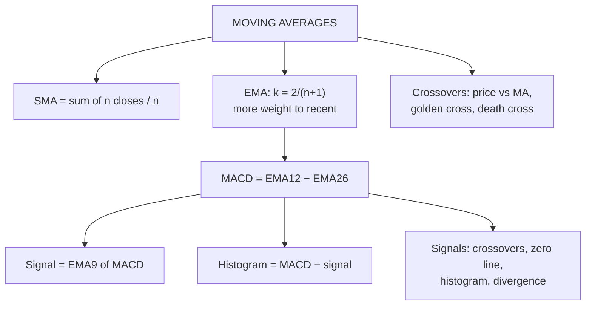

# TA-6: Moving Averages (SMA and EMA) and MACD

Covers: simple and exponential moving averages (formulas, step-by-step computation, interpretation), moving-average crossovers (golden cross, death cross), and MACD (components and interpretation only, as the syllabus says). **(syllabus)**

## Where this fits in the ESE

SMA and EMA are "practical problems" in the syllabus: expect a 5- or 10-mark sum ("compute the 5-day SMA and EMA and interpret"). MACD is **interpretation only**: know its parts and its signals, no computation.

## Simple Moving Average (SMA)

**SMA(n) = (C₁ + C₂ + … + Cₙ) ÷ n**: the average of the last n closes. Each day, drop the oldest close and add the newest ("moving").

## Exponential Moving Average (EMA)

Gives **more weight to recent prices**, so it reacts faster than the SMA.

**EMA today = (Close today − EMA yesterday) × k + EMA yesterday**, with **k = 2 ÷ (n + 1)**
(equivalently EMA = Close × k + EMA_prev × (1 − k)).

The first EMA is usually seeded with the SMA of the first n closes.

## Worked example, laid out as the exam answer

**Question (illustrative):** closing prices over 10 days: 50, 52, 51, 53, 55, 54, 56, 58, 57, 60. Compute the 5-day SMA and 5-day EMA from day 5 to day 10 and interpret.

k = 2 ÷ (5 + 1) = **1/3 (0.3333)**.

| Day | Close | 5-day SMA | 5-day EMA |
|---|---|---|---|
| 1 | 50 | | |
| 2 | 52 | | |
| 3 | 51 | | |
| 4 | 53 | | |
| 5 | 55 | (50+52+51+53+55)/5 = **52.20** | seed = **52.20** |
| 6 | 54 | (52+51+53+55+54)/5 = **53.00** | (54 − 52.20)/3 + 52.20 = **52.80** |
| 7 | 56 | (51+53+55+54+56)/5 = **53.80** | (56 − 52.80)/3 + 52.80 = **53.87** |
| 8 | 58 | (53+55+54+56+58)/5 = **55.20** | (58 − 53.87)/3 + 53.87 = **55.24** |
| 9 | 57 | (55+54+56+58+57)/5 = **56.00** | (57 − 55.24)/3 + 55.24 = **55.83** |
| 10 | 60 | (54+56+58+57+60)/5 = **57.00** | (60 − 55.83)/3 + 55.83 = **57.22** |

**Interpretation:**
- Both averages rise every day: the **short-term trend is up**.
- The price (60) is **above both** averages: bullish.
- On day 10 the EMA (57.22) is above the SMA (57.00) because it weights the latest jump to 60 more heavily; on day 9 the EMA (55.83) was below the SMA (56.00) because it had also reacted to the dip to 57. **The EMA responds faster to new prices.**
- A trader would stay long while price holds above the 5-day EMA, and exit on a close below it.

## Using moving averages

1. **Trend direction:** a rising MA = uptrend; falling = downtrend.
2. **Price crossover:** price crossing **above** its MA = buy; **below** = sell.
3. **Two-MA crossover:** short MA crossing above long MA = buy; below = sell.
   - **Golden cross:** 50-day MA crosses **above** the 200-day MA: long-term bullish.
   - **Death cross:** 50-day MA crosses **below** the 200-day MA: long-term bearish.
4. **Dynamic support and resistance:** in uptrends price often bounces off the 50- or 200-day MA.

<svg width="100%" style="max-width:680px;display:block;margin:12px auto" viewBox="0 0 680 276" role="img" xmlns="http://www.w3.org/2000/svg">
<title>Golden cross and death cross</title>
<desc>A price line with a faster 50-day average and a slower 200-day average. Where the 50-day crosses up through the 200-day a green dot marks the golden cross, and where it later crosses down through the 200-day a red dot marks the death cross.</desc>
<line x1="46" y1="28" x2="76" y2="28" stroke="#5F5E5A" stroke-width="2"/>
<text font-size="12" fill="currentColor" font-family="inherit" x="82" y="32" text-anchor="start">Price</text>
<line x1="140" y1="28" x2="170" y2="28" stroke="#1D9E75" stroke-width="2"/>
<text font-size="12" fill="currentColor" font-family="inherit" x="176" y="32" text-anchor="start">50-day MA</text>
<line x1="270" y1="28" x2="300" y2="28" stroke="#7F77DD" stroke-width="2"/>
<text font-size="12" fill="currentColor" font-family="inherit" x="306" y="32" text-anchor="start">200-day MA</text>
<polyline points="40,207.7 60,195.3 80,215 100,195.7 120,206.3 140,185 160,194.5 180,174 200,181 220,155 240,159.7 260,136.3 280,144 300,125.7 320,136.3 340,118 360,127.7 380,107.3 400,120 420,112.7 440,131.3 460,118 480,143 500,143 520,168 540,163 560,189 580,189 600,209 620,206 640,218" fill="none" stroke="#5F5E5A" stroke-width="1.5" stroke-linejoin="round" stroke-linecap="round"/>
<polyline points="40,170 140,176 240,170 340,150 440,142 540,152 640,170" fill="none" stroke="#7F77DD" stroke-width="2" stroke-linejoin="round" stroke-linecap="round"/>
<polyline points="40,200 100,205 160,195 200,182 240,160 300,138 360,122 420,115 480,126 520,148 560,172 600,196 640,210" fill="none" stroke="#1D9E75" stroke-width="2" stroke-linejoin="round" stroke-linecap="round"/>
<circle cx="219.8" cy="171.2" r="6" fill="#639922" stroke="#3B6D11" stroke-width="1"/>
<line x1="219.8" y1="179.2" x2="219.8" y2="222" stroke="#888780" stroke-width="1" stroke-dasharray="3 3"/>
<text font-size="14" font-weight="500" fill="currentColor" font-family="inherit" x="219.8" y="240" text-anchor="middle">Golden cross</text>
<text font-size="12" fill="currentColor" opacity="0.7" font-family="inherit" x="219.8" y="258" text-anchor="middle">50-day rises above 200-day: bullish</text>
<circle cx="523.8" cy="150.4" r="6" fill="#E24B4A" stroke="#A32D2D" stroke-width="1"/>
<line x1="523.8" y1="158.4" x2="523.8" y2="222" stroke="#888780" stroke-width="1" stroke-dasharray="3 3"/>
<text font-size="14" font-weight="500" fill="currentColor" font-family="inherit" x="523.8" y="240" text-anchor="middle">Death cross</text>
<text font-size="12" fill="currentColor" opacity="0.7" font-family="inherit" x="523.8" y="258" text-anchor="middle">50-day falls below 200-day: bearish</text>
</svg>

**SMA vs EMA:** SMA is smoother and gives fewer false signals but lags; EMA reacts faster but gives more whipsaws. Short-term traders favour EMAs; long-term investors watch the 50- and 200-day SMAs.

**Limitation:** all moving averages **lag** price; they work in trending markets and give repeated false signals (whipsaws) in sideways markets.

## MACD (interpretation only)

**Moving Average Convergence Divergence** (Gerald Appel):
- **MACD line** = 12-day EMA − 26-day EMA.
- **Signal line** = 9-day EMA of the MACD line.
- **Histogram** = MACD line − signal line.

**Interpretation:**
1. **Signal-line crossover:** MACD crosses **above** the signal line = **buy**; **below** = **sell**.
2. **Zero-line crossover:** MACD crosses above zero (the 12-day EMA moves above the 26-day) = bullish trend confirmation; below zero = bearish.
3. **Histogram:** bars growing = momentum strengthening; shrinking bars = momentum fading, often before a crossover.
4. **Divergence:** price makes a new high but MACD a lower high = bearish divergence (and vice versa).
5. "Convergence" = the two EMAs moving closer (momentum slowing); "divergence" = moving apart (momentum building).

<svg width="100%" style="max-width:680px;display:block;margin:12px auto" viewBox="0 0 680 334" role="img" xmlns="http://www.w3.org/2000/svg">
<title>MACD line, signal line and histogram</title>
<desc>A MACD panel with a zero line. A teal MACD line oscillates around zero, a purple signal line follows it with a lag, and histogram bars show the gap between them. Green dots mark MACD crossing above the signal line (buy) and red dots mark it crossing below (sell). Open circles mark zero-line crossings.</desc>
<line x1="46" y1="24" x2="76" y2="24" stroke="#1D9E75" stroke-width="2"/>
<text font-size="12" fill="currentColor" font-family="inherit" x="82" y="28" text-anchor="start">MACD line</text>
<line x1="170" y1="24" x2="200" y2="24" stroke="#7F77DD" stroke-width="2"/>
<text font-size="12" fill="currentColor" font-family="inherit" x="206" y="28" text-anchor="start">Signal line</text>
<rect x="300" y="18" width="12" height="12" fill="#639922" fill-opacity="0.5" stroke="none" stroke-width="1"/>
<rect x="314" y="18" width="12" height="12" fill="#E24B4A" fill-opacity="0.5" stroke="none" stroke-width="1"/>
<text font-size="12" fill="currentColor" font-family="inherit" x="332" y="28" text-anchor="start">Histogram = MACD minus signal</text>
<rect x="46" y="175" width="8" height="0" fill="#639922" fill-opacity="0.5" stroke="none" stroke-width="1"/>
<rect x="61" y="175" width="8" height="3.1" fill="#E24B4A" fill-opacity="0.5" stroke="none" stroke-width="1"/>
<rect x="76" y="175" width="8" height="11.4" fill="#E24B4A" fill-opacity="0.5" stroke="none" stroke-width="1"/>
<rect x="91" y="175" width="8" height="23" fill="#E24B4A" fill-opacity="0.5" stroke="none" stroke-width="1"/>
<rect x="106" y="175" width="8" height="36" fill="#E24B4A" fill-opacity="0.5" stroke="none" stroke-width="1"/>
<rect x="121" y="175" width="8" height="48.9" fill="#E24B4A" fill-opacity="0.5" stroke="none" stroke-width="1"/>
<rect x="136" y="175" width="8" height="60.2" fill="#E24B4A" fill-opacity="0.5" stroke="none" stroke-width="1"/>
<rect x="151" y="175" width="8" height="68.6" fill="#E24B4A" fill-opacity="0.5" stroke="none" stroke-width="1"/>
<rect x="166" y="175" width="8" height="73.3" fill="#E24B4A" fill-opacity="0.5" stroke="none" stroke-width="1"/>
<rect x="181" y="175" width="8" height="73.8" fill="#E24B4A" fill-opacity="0.5" stroke="none" stroke-width="1"/>
<rect x="196" y="175" width="8" height="69.8" fill="#E24B4A" fill-opacity="0.5" stroke="none" stroke-width="1"/>
<rect x="211" y="175" width="8" height="61.4" fill="#E24B4A" fill-opacity="0.5" stroke="none" stroke-width="1"/>
<rect x="226" y="175" width="8" height="49.1" fill="#E24B4A" fill-opacity="0.5" stroke="none" stroke-width="1"/>
<rect x="241" y="175" width="8" height="33.8" fill="#E24B4A" fill-opacity="0.5" stroke="none" stroke-width="1"/>
<rect x="256" y="175" width="8" height="16.3" fill="#E24B4A" fill-opacity="0.5" stroke="none" stroke-width="1"/>
<rect x="271" y="172.8" width="8" height="2.2" fill="#639922" fill-opacity="0.5" stroke="none" stroke-width="1"/>
<rect x="286" y="154.5" width="8" height="20.5" fill="#639922" fill-opacity="0.5" stroke="none" stroke-width="1"/>
<rect x="301" y="137.8" width="8" height="37.2" fill="#639922" fill-opacity="0.5" stroke="none" stroke-width="1"/>
<rect x="316" y="123.6" width="8" height="51.4" fill="#639922" fill-opacity="0.5" stroke="none" stroke-width="1"/>
<rect x="331" y="113" width="8" height="62" fill="#639922" fill-opacity="0.5" stroke="none" stroke-width="1"/>
<rect x="346" y="106.6" width="8" height="68.4" fill="#639922" fill-opacity="0.5" stroke="none" stroke-width="1"/>
<rect x="361" y="104.9" width="8" height="70.1" fill="#639922" fill-opacity="0.5" stroke="none" stroke-width="1"/>
<rect x="376" y="108" width="8" height="67" fill="#639922" fill-opacity="0.5" stroke="none" stroke-width="1"/>
<rect x="391" y="115.7" width="8" height="59.3" fill="#639922" fill-opacity="0.5" stroke="none" stroke-width="1"/>
<rect x="406" y="127.4" width="8" height="47.6" fill="#639922" fill-opacity="0.5" stroke="none" stroke-width="1"/>
<rect x="421" y="142.4" width="8" height="32.6" fill="#639922" fill-opacity="0.5" stroke="none" stroke-width="1"/>
<rect x="436" y="159.6" width="8" height="15.4" fill="#639922" fill-opacity="0.5" stroke="none" stroke-width="1"/>
<rect x="451" y="175" width="8" height="2.9" fill="#E24B4A" fill-opacity="0.5" stroke="none" stroke-width="1"/>
<rect x="466" y="175" width="8" height="21" fill="#E24B4A" fill-opacity="0.5" stroke="none" stroke-width="1"/>
<rect x="481" y="175" width="8" height="37.6" fill="#E24B4A" fill-opacity="0.5" stroke="none" stroke-width="1"/>
<rect x="496" y="175" width="8" height="51.7" fill="#E24B4A" fill-opacity="0.5" stroke="none" stroke-width="1"/>
<rect x="511" y="175" width="8" height="62.3" fill="#E24B4A" fill-opacity="0.5" stroke="none" stroke-width="1"/>
<rect x="526" y="175" width="8" height="68.6" fill="#E24B4A" fill-opacity="0.5" stroke="none" stroke-width="1"/>
<rect x="541" y="175" width="8" height="70.2" fill="#E24B4A" fill-opacity="0.5" stroke="none" stroke-width="1"/>
<rect x="556" y="175" width="8" height="67.1" fill="#E24B4A" fill-opacity="0.5" stroke="none" stroke-width="1"/>
<rect x="571" y="175" width="8" height="59.4" fill="#E24B4A" fill-opacity="0.5" stroke="none" stroke-width="1"/>
<rect x="586" y="175" width="8" height="47.6" fill="#E24B4A" fill-opacity="0.5" stroke="none" stroke-width="1"/>
<rect x="601" y="175" width="8" height="32.6" fill="#E24B4A" fill-opacity="0.5" stroke="none" stroke-width="1"/>
<rect x="616" y="175" width="8" height="15.4" fill="#E24B4A" fill-opacity="0.5" stroke="none" stroke-width="1"/>
<rect x="631" y="172.1" width="8" height="2.9" fill="#639922" fill-opacity="0.5" stroke="none" stroke-width="1"/>
<line x1="40" y1="175" x2="640" y2="175" stroke="#888780" stroke-width="1" stroke-dasharray="6 4"/>
<text font-size="12" fill="currentColor" opacity="0.7" font-family="inherit" x="646" y="179" text-anchor="start">0</text>
<polyline points="50,120 65,121.9 80,127.4 95,136.1 110,147.5 125,160.8 140,175 155,189.2 170,202.5 185,213.9 200,222.6 215,228.1 230,230 245,228.1 260,222.6 275,213.9 290,202.5 305,189.2 320,175 335,160.8 350,147.5 365,136.1 380,127.4 395,121.9 410,120 425,121.9 440,127.4 455,136.1 470,147.5 485,160.8 500,175 515,189.2 530,202.5 545,213.9 560,222.6 575,228.1 590,230 605,228.1 620,222.6 635,213.9" fill="none" stroke="#1D9E75" stroke-width="2" stroke-linejoin="round" stroke-linecap="round"/>
<polyline points="50,120 65,120.5 80,122.2 95,125.7 110,131.1 125,138.5 140,147.7 155,158 170,169.2 185,180.3 200,190.9 215,200.2 230,207.7 245,212.8 260,215.2 275,214.9 290,211.8 305,206.2 320,198.4 335,189 350,178.6 365,168 380,157.8 395,148.8 410,141.6 425,136.7 440,134.4 455,134.8 470,138 485,143.7 500,151.5 515,160.9 530,171.3 545,182 560,192.1 575,201.1 590,208.3 605,213.3 620,215.6 635,215.2" fill="none" stroke="#7F77DD" stroke-width="2" stroke-linejoin="round" stroke-linecap="round"/>
<circle cx="273.2" cy="214.9" r="5" fill="#639922" stroke="#3B6D11" stroke-width="1"/>
<text font-size="14" font-weight="500" fill="currentColor" font-family="inherit" x="273.2" y="238.9" text-anchor="middle">Buy</text>
<circle cx="452.6" cy="134.7" r="5" fill="#E24B4A" stroke="#A32D2D" stroke-width="1"/>
<text font-size="14" font-weight="500" fill="currentColor" font-family="inherit" x="452.6" y="120.7" text-anchor="middle">Sell</text>
<circle cx="632.6" cy="215.3" r="5" fill="#639922" stroke="#3B6D11" stroke-width="1"/>
<text font-size="14" font-weight="500" fill="currentColor" font-family="inherit" x="632.6" y="239.3" text-anchor="middle">Buy</text>
<circle cx="140" cy="175" r="3.5" fill="none" stroke="#5F5E5A" stroke-width="1"/>
<circle cx="320" cy="175" r="3.5" fill="none" stroke="#5F5E5A" stroke-width="1"/>
<circle cx="500" cy="175" r="3.5" fill="none" stroke="#5F5E5A" stroke-width="1"/>
<text font-size="12" fill="currentColor" opacity="0.7" font-family="inherit" x="340" y="300" text-anchor="middle">Green dot: MACD crosses above signal, buy. Red dot: crosses below, sell.</text>
<text font-size="12" fill="currentColor" opacity="0.7" font-family="inherit" x="340" y="318" text-anchor="middle">Open circles: MACD crosses the zero line (12-day EMA crosses the 26-day EMA).</text>
</svg>

**Limitation:** MACD is built from moving averages, so it also lags and whipsaws in ranges.

## Traps

- **k for EMA:** 2/(n + 1), not 1/n. For 5 days k = 1/3; for 10 days k = 2/11.
- **Sliding the SMA window:** drop the oldest close each day.
- **Computing MACD:** the syllabus says interpretation only; explain, don't calculate, unless figures are given.

## What to remember

- SMA = average of last n closes. EMA = (C − EMA_prev) × 2/(n+1) + EMA_prev.
- Example (5-day): SMA 52.20 → 57.00; EMA 52.20 → 57.22.
- EMA reacts faster; SMA smoother.
- Golden cross (50 above 200) bullish; death cross bearish.
- MACD = 12 EMA − 26 EMA; signal = 9 EMA of MACD; crossovers, zero line, histogram, divergence.

## Concept map

## Flashcards
Q: Formula for a simple moving average?
A: Sum of the last n closing prices ÷ n.

Q: Formula for the EMA smoothing constant?
A: k = 2 ÷ (n + 1).

Q: Previous 5-day EMA 55.83, today's close 60. Today's EMA?
A: (60 − 55.83) × 1/3 + 55.83 = 57.22.

Q: Why does the EMA react faster than the SMA?
A: It gives more weight to the most recent prices.

Q: What is a golden cross?
A: The 50-day MA crossing above the 200-day MA: a long-term bullish signal.

Q: How is the MACD line defined?
A: 12-day EMA minus 26-day EMA.

Q: What is the MACD signal line, and what is the basic signal?
A: The 9-day EMA of MACD; MACD crossing above it is a buy, below it a sell.

Q: Main limitation of moving-average signals?
A: They lag and give whipsaws in sideways markets.

## Sources
- BBA301F-5 course plan, Unit 3 (moving averages SMA and EMA practical problems; MACD interpretation only)
- Appel, *Technical Analysis: Power Tools for Active Investors*; Murphy
- Previous: [[SAPM Unit 3 - TA-5 RSI and ROC]] · Next: [[SAPM Unit 3 - TA-7 Unit 3 Exam Answers]]
- [[SAPM Unit 3 - Technical Analysis MOC (Node Map)]]
