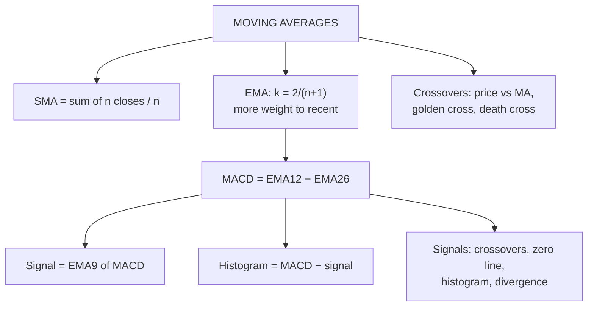

# TA-6: Moving Averages (SMA and EMA) and MACD

Covers: simple and exponential moving averages (formulas, step-by-step computation, interpretation), moving-average crossovers (golden cross, death cross), and MACD (components and interpretation only, as the syllabus says). **(syllabus)**

## Where this fits in the ESE

SMA and EMA are "practical problems" in the syllabus: expect a 5- or 10-mark sum ("compute the 5-day SMA and EMA and interpret"). MACD is **interpretation only**: know its parts and its signals, no computation.

## Simple Moving Average (SMA)

**SMA(n) = (C₁ + C₂ + … + Cₙ) ÷ n**: the average of the last n closes. Each day, drop the oldest close and add the newest ("moving").

## Exponential Moving Average (EMA)

Gives **more weight to recent prices**, so it reacts faster than the SMA.

**EMA today = (Close today − EMA yesterday) × k + EMA yesterday**, with **k = 2 ÷ (n + 1)**
(equivalently EMA = Close × k + EMA_prev × (1 − k)).

The first EMA is usually seeded with the SMA of the first n closes.

## Worked example, laid out as the exam answer

**Question (illustrative):** closing prices over 10 days: 50, 52, 51, 53, 55, 54, 56, 58, 57, 60. Compute the 5-day SMA and 5-day EMA from day 5 to day 10 and interpret.

k = 2 ÷ (5 + 1) = **1/3 (0.3333)**.

| Day | Close | 5-day SMA | 5-day EMA |
|---|---|---|---|
| 1 | 50 | | |
| 2 | 52 | | |
| 3 | 51 | | |
| 4 | 53 | | |
| 5 | 55 | (50+52+51+53+55)/5 = **52.20** | seed = **52.20** |
| 6 | 54 | (52+51+53+55+54)/5 = **53.00** | (54 − 52.20)/3 + 52.20 = **52.80** |
| 7 | 56 | (51+53+55+54+56)/5 = **53.80** | (56 − 52.80)/3 + 52.80 = **53.87** |
| 8 | 58 | (53+55+54+56+58)/5 = **55.20** | (58 − 53.87)/3 + 53.87 = **55.24** |
| 9 | 57 | (55+54+56+58+57)/5 = **56.00** | (57 − 55.24)/3 + 55.24 = **55.83** |
| 10 | 60 | (54+56+58+57+60)/5 = **57.00** | (60 − 55.83)/3 + 55.83 = **57.22** |

**Interpretation:**
- Both averages rise every day: the **short-term trend is up**.
- The price (60) is **above both** averages: bullish.
- On day 10 the EMA (57.22) is above the SMA (57.00) because it weights the latest jump to 60 more heavily; on day 9 the EMA (55.83) was below the SMA (56.00) because it had also reacted to the dip to 57. **The EMA responds faster to new prices.**
- A trader would stay long while price holds above the 5-day EMA, and exit on a close below it.

## Using moving averages

1. **Trend direction:** a rising MA = uptrend; falling = downtrend.
2. **Price crossover:** price crossing **above** its MA = buy; **below** = sell.
3. **Two-MA crossover:** short MA crossing above long MA = buy; below = sell.
   - **Golden cross:** 50-day MA crosses **above** the 200-day MA: long-term bullish.
   - **Death cross:** 50-day MA crosses **below** the 200-day MA: long-term bearish.
4. **Dynamic support and resistance:** in uptrends price often bounces off the 50- or 200-day MA.

**SMA vs EMA:** SMA is smoother and gives fewer false signals but lags; EMA reacts faster but gives more whipsaws. Short-term traders favour EMAs; long-term investors watch the 50- and 200-day SMAs.

**Limitation:** all moving averages **lag** price; they work in trending markets and give repeated false signals (whipsaws) in sideways markets.

## MACD (interpretation only)

**Moving Average Convergence Divergence** (Gerald Appel):
- **MACD line** = 12-day EMA − 26-day EMA.
- **Signal line** = 9-day EMA of the MACD line.
- **Histogram** = MACD line − signal line.

**Interpretation:**
1. **Signal-line crossover:** MACD crosses **above** the signal line = **buy**; **below** = **sell**.
2. **Zero-line crossover:** MACD crosses above zero (the 12-day EMA moves above the 26-day) = bullish trend confirmation; below zero = bearish.
3. **Histogram:** bars growing = momentum strengthening; shrinking bars = momentum fading, often before a crossover.
4. **Divergence:** price makes a new high but MACD a lower high = bearish divergence (and vice versa).
5. "Convergence" = the two EMAs moving closer (momentum slowing); "divergence" = moving apart (momentum building).

**Limitation:** MACD is built from moving averages, so it also lags and whipsaws in ranges.

## Traps

- **k for EMA:** 2/(n + 1), not 1/n. For 5 days k = 1/3; for 10 days k = 2/11.
- **Sliding the SMA window:** drop the oldest close each day.
- **Computing MACD:** the syllabus says interpretation only; explain, don't calculate, unless figures are given.

## What to remember

- SMA = average of last n closes. EMA = (C − EMA_prev) × 2/(n+1) + EMA_prev.
- Example (5-day): SMA 52.20 → 57.00; EMA 52.20 → 57.22.
- EMA reacts faster; SMA smoother.
- Golden cross (50 above 200) bullish; death cross bearish.
- MACD = 12 EMA − 26 EMA; signal = 9 EMA of MACD; crossovers, zero line, histogram, divergence.

## Concept map

## Flashcards
Q: Formula for a simple moving average?
A: Sum of the last n closing prices ÷ n.

Q: Formula for the EMA smoothing constant?
A: k = 2 ÷ (n + 1).

Q: Previous 5-day EMA 55.83, today's close 60. Today's EMA?
A: (60 − 55.83) × 1/3 + 55.83 = 57.22.

Q: Why does the EMA react faster than the SMA?
A: It gives more weight to the most recent prices.

Q: What is a golden cross?
A: The 50-day MA crossing above the 200-day MA: a long-term bullish signal.

Q: How is the MACD line defined?
A: 12-day EMA minus 26-day EMA.

Q: What is the MACD signal line, and what is the basic signal?
A: The 9-day EMA of MACD; MACD crossing above it is a buy, below it a sell.

Q: Main limitation of moving-average signals?
A: They lag and give whipsaws in sideways markets.

## Sources
- BBA301F-5 course plan, Unit 3 (moving averages SMA and EMA practical problems; MACD interpretation only)
- Appel, *Technical Analysis: Power Tools for Active Investors*; Murphy
- Previous: [[SAPM Unit 3 - TA-5 RSI and ROC]] · Next: [[SAPM Unit 3 - TA-7 Unit 3 Exam Answers]]
- [[SAPM Unit 3 - Technical Analysis MOC (Node Map)]]
