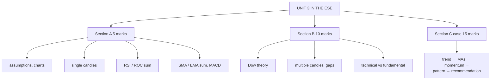

# TA-7: Unit 3 Exam Answers

Covers: what the ESE will ask from Unit 3, 5-mark and 10-mark skeletons, and a 15-mark technical-analysis case layout with a model answer. Numbers come from TA-1 to TA-6.

## What the test will ask

Assume Section A 3 × 5, Section B 2 × 10, one 15-mark case. Unit 3 is CO2 (apply fundamental and technical analysis). The CIA2 rubric rewarded: "accurately applies technical tools and indicators with clear analytical reasoning" and "highly logical, data-supported conclusions and strong investment recommendation". Expect the same in the ESE: compute the indicator, then **say what to do**.

## Five-mark answer skeletons

**1. Assumptions of technical analysis (TA-1).** Definition; five assumptions; one line on the EMH criticism.

**2. Types of charts (TA-1).** Line, bar, point and figure, candlestick: what each plots and one advantage, with a mini-sketch of a bar and a candle.

**3. Any four single candlestick patterns (TA-2).** Sketch, shape rule, where it appears, signal. Always note hammer vs hanging man context.

**4. RSI or ROC sum (TA-5).** Formula → table → result → overbought/oversold reading → action.

**5. SMA and EMA sum (TA-6).** k = 2/(n+1) → table → which reacts faster → price vs MA → action.

**6. MACD interpretation (TA-6).** Three components; four signals (signal-line crossover, zero line, histogram, divergence).

## Ten-mark answer skeletons

**A. Dow theory (TA-4).** Origin → six tenets → three movements with durations → three phases of bull and bear markets → confirmation by averages and volume → signals (higher highs/lows) → criticisms.

**B. Multiple candlestick patterns (TA-3).** Engulfing, harami, piercing/dark cloud, morning/evening star: sketch, rule, signal for each; then gaps (four types).

**C. Technical vs fundamental analysis (TA-1).** Definitions → comparison table (question, data, tools, horizon, belief, users) → strengths and criticisms of each → conclusion: combine them.

## Fifteen-mark case layout (technical call on a stock)

1. **Trend (3):** higher highs and lows? Support and resistance levels from the data.
2. **Moving averages (3):** price vs SMA/EMA; crossover?
3. **Momentum (4):** RSI and ROC computed and read.
4. **Candles / patterns (2):** name any pattern described.
5. **Recommendation (3):** buy / hold / sell, entry, stop-loss, target, and one line on what would change the view.

### Model answer, laid out as the exam answer

**Data (illustrative):** 15 closes 100 → 117 (TA-5 table); 5-day SMA 57.00 and EMA 57.22 on a related 10-day series (TA-6); the last candle is a long green Marubozu; earlier support at ₹105 and resistance at ₹115, now broken.

1. **Trend:** higher highs and higher lows throughout; **uptrend**. Resistance at ₹115 broken by today's close at ₹117; by role reversal ₹115 becomes support.
2. **Moving averages:** price above both the SMA and EMA, both rising: bullish.
3. **Momentum:** RSI(14) = 100 − 100/(1 + 23/6) = **79.31**, overbought. 10-day ROC = (117 − 106)/106 = **+10.38%**, positive.
4. **Candle:** a bullish Marubozu at the breakout: buyers in full control.
5. **Recommendation:** **hold / buy on a dip**, not chase. The trend and breakout are bullish, but RSI above 70 warns of a near-term pullback. Entry near ₹115 (new support); stop-loss below ₹113; target ₹125 (range 105–115 projected from the breakout: 115 + 10). The view changes if price closes back below ₹115 or a bearish engulfing/shooting star appears with RSI falling below 70.

Close with: *technical signals are probabilities, not certainties; combine them with fundamentals and a stop-loss.*

## Time rule

If time is short: compute RSI (or the MAs), state the trend, and give a one-line recommendation with a stop-loss. Interpretation lines carry the most marks per minute.

## What to remember

- Every indicator answer ends with an action.
- RSI 79.31 (overbought), ROC +10.38%, SMA 57.00 vs EMA 57.22 (EMA faster).
- Dow theory and multiple candles are the likely Section B choices.
- Case order: trend → MAs → momentum → pattern → recommendation with stop-loss.

## Concept map

## Flashcards
Q: What did the CIA2 rubric reward for technical analysis?
A: Accurate application of tools and indicators with clear reasoning, and data-supported conclusions with a strong recommendation.

Q: Steps of the 15-mark technical case?
A: Trend and support/resistance, moving averages, momentum (RSI, ROC), patterns, recommendation with entry, stop-loss and target.

Q: Uptrend with RSI 79. Recommendation?
A: Hold or buy on dips rather than chase; overbought momentum warns of a pullback; use a stop-loss.

Q: Skeleton for a 10-mark Dow theory answer?
A: Origin, tenets, three movements, three phases, confirmation by averages and volume, signals, criticisms.

## Sources
- BBA301F-5 course plan, Unit 3 and CIA2 rubric
- [[SAPM Unit 3 - Technical Analysis MOC (Node Map)]]
