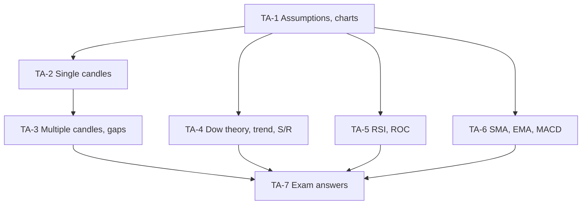

# SAPM Unit 3: Technical Analysis, node map

ESE: 50 marks, assume 3 × 5, 2 × 10, one 15-mark case. Unit 3 is CO2 (apply fundamental and technical analysis). RSI, ROC and SMA/EMA are "practical problems" in the syllabus; MACD is "interpretation only". All examples are **illustrative textbook numbers**.

## Nodes

| Node | Topic | Deps | Minutes | Exam focus |
|---|---|---|---|---|
| TA-1 | Assumptions and Chart Types | none | 30 | yes |
| TA-2 | Single Candlestick Patterns | TA-1 | 35 | yes |
| TA-3 | Multiple Candlestick Patterns and Gaps | TA-2 | 35 | yes |
| TA-4 | Dow Theory, Trend, Support and Resistance | TA-1 | 35 | yes |
| TA-5 | RSI and ROC | TA-1 | 45 | yes |
| TA-6 | Moving Averages and MACD | TA-1 | 45 | yes |
| TA-7 | Unit 3 Exam Answers | TA-1 to TA-6 | 30 | yes |

Total reading time: about 255 minutes.

## Dependency graph

## Headline numbers to know

- RSI(14) on closes 100 → 117: gains 23, losses 6, RS 3.833, **RSI 79.31** (overbought).
- ROC: 10-day (117 vs 106) **+10.38%**; 5-day (117 vs 111) **+5.41%**.
- 5-day SMA (closes 50 … 60): 52.20, 53.00, 53.80, 55.20, 56.00, **57.00**; EMA (k = 1/3): 52.20, 52.80, 53.87, 55.24, 55.83, **57.22**.
- Breakout: range ₹480–560, close ₹575 on high volume → stop ₹550, target ₹640.
- Dow: primary 1+ years; secondary 3 weeks–3 months, retracing ⅓–⅔.

## Links
- [[SAPM MOC]]
