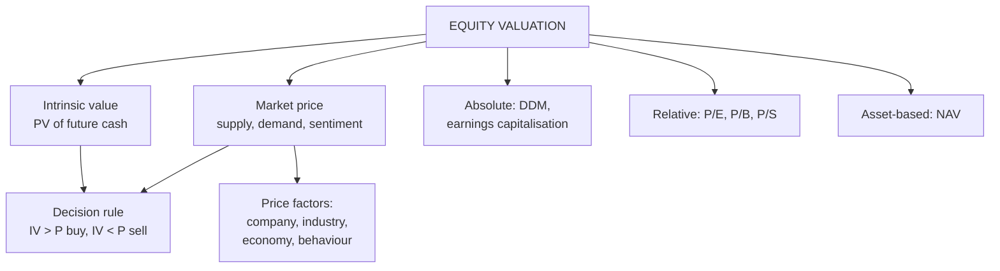

# EV-1: Equity Valuation, Intrinsic Value and Price Factors

Covers: the concept of equity valuation, intrinsic value vs market price, the decision rule, the main approaches to valuation (absolute and relative), and the factors that influence equity prices. **(syllabus)**

## Where this fits in the ESE

ESE: 50 marks (assume 3 × 5, 2 × 10, one 15-mark case). This node is the vocabulary for Unit 4: a 5-mark "explain intrinsic value and the factors influencing share prices" comes straight from here, and every valuation sum in EV-2 to EV-5 ends with the decision rule below.

## Equity valuation and intrinsic value

**Equity valuation** is estimating what a share is really worth, so the investor can compare it with what the market is asking.

**Intrinsic value** is the value of a share justified by its fundamentals: the **present value of the cash it will deliver to shareholders** (dividends, or earnings capacity), discounted at the return investors require for its risk. It is an estimate, so two analysts can reach different values.

**Market price** is what the share trades at today, set by supply and demand, sentiment and information.

**Decision rule:**

| Comparison | Verdict | Action |
|---|---|---|
| Intrinsic value > market price | Undervalued | Buy / hold |
| Intrinsic value < market price | Overvalued | Sell / avoid |
| Intrinsic value ≈ market price | Fairly valued | Hold |

Link to Unit 2: **margin of safety** = (intrinsic value − price) ÷ intrinsic value. Buy only when it is large enough to absorb estimation error.

## Approaches to valuation

1. **Absolute (discounted cash flow) models:** value from the company's own cash flows.
   - Dividend discount models: zero growth, constant growth (EV-4).
   - Earnings capitalisation (EV-2).
   - Free cash flow models (textbook extension).
2. **Relative valuation (multiples):** value by comparison with similar firms.
   - P/E (EV-2), P/B and P/S (EV-3), EV/EBITDA (extension).
3. **Asset-based:** net asset value per share, used for holding companies and liquidation.

Absolute models answer "what is it worth on its own?"; relative models answer "is it cheap compared with its peers?". Use both and reconcile.

## Factors influencing equity prices

**Company-specific (fundamental):**
1. Earnings and earnings growth (EPS trend).
2. Dividend policy and payout.
3. Quality of management and corporate governance.
4. Capital structure and financial risk (debt levels).
5. Competitive position, products, market share.
6. Corporate actions: bonus issues, splits, buybacks, mergers.

**Industry factors:** industry life-cycle stage, competition, regulation, input costs (Unit 2's industry analysis).

**Economy and market factors:**
1. Interest rates: higher rates raise the required return and lower values.
2. Inflation.
3. GDP growth and the business cycle.
4. Government policy, taxation, budget announcements.
5. FII/FPI and DII flows, liquidity.
6. Exchange rates and global markets.

**Behavioural and technical factors:** investor sentiment, herd behaviour, news and rumours, speculation, demand-supply in the short run (Unit 3's technical view).

The long-run driver is earnings and cash flow (fundamentals); the short-run driver is sentiment and flows. That's why price can sit away from intrinsic value for a while.

## What to remember

- Intrinsic value = PV of future cash to shareholders at the required return.
- IV > price: undervalued, buy. IV < price: overvalued, sell.
- Approaches: absolute (DDM, earnings capitalisation), relative (P/E, P/B, P/S), asset-based.
- Price factors: company, industry, economy/market, behavioural.

## Concept map

## Flashcards
Q: What is intrinsic value?
A: The value of a share justified by fundamentals: the present value of the cash it will deliver to shareholders, at the required return.

Q: Intrinsic value ₹420, market price ₹350. Verdict?
A: Undervalued: buy or hold.

Q: Name the two broad approaches to equity valuation.
A: Absolute (discounted cash flow, e.g. dividend discount models) and relative (multiples such as P/E, P/B, P/S).

Q: How does a rise in interest rates affect equity values?
A: It raises the required return, so the present value of future cash, and the share's value, falls.

Q: Name three company-specific factors that affect share prices.
A: Earnings growth, dividend policy, management and governance (also capital structure, competitive position, corporate actions).

Q: Why can market price differ from intrinsic value for a long time?
A: In the short run, sentiment, flows and speculation drive prices; fundamentals pull price towards value only over time.

## Sources
- BBA301F-5 course plan, Unit 4 (concept of equity valuation and intrinsic value; factors influencing equity prices)
- Bhalla, *Investment Management*; Fischer & Jordan
- Next node: [[SAPM Unit 4 - EV-2 Earnings Model and PE Ratio]]
- [[SAPM Unit 4 - Equity Valuation MOC (Node Map)]]
