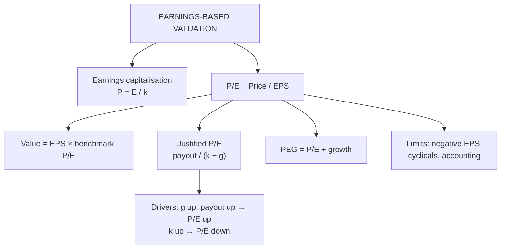

# EV-2: Earnings Valuation Model and P/E Ratio Analysis

Covers: the earnings capitalisation model, the P/E ratio and how to value a share with it, the justified P/E from the dividend model, what drives P/E, the PEG ratio, and the limits of P/E analysis. **(syllabus)**

## Where this fits in the ESE

P/E valuation is a near-certain 5-mark sum and part of almost every Unit 4 case. CIA3 also asked for P/E-based intrinsic values, so expect the ESE to test it as well.

## Earnings capitalisation model

If a firm pays out all its earnings and doesn't grow, the share is a perpetuity of earnings:

**P₀ = E₁ ÷ k**

*Example:* EPS ₹30, required return 12%: P₀ = 30 ÷ 0.12 = **₹250**.

Equivalently, the **earnings yield** E/P = k for a no-growth firm. If a company's earnings yield is well above k, the share is cheap.

## P/E ratio

**P/E = Market price per share ÷ Earnings per share**

It says how many rupees investors pay for one rupee of earnings. A P/E of 20 means the market pays ₹20 for each ₹1 of EPS (or, read the other way, a 5% earnings yield).

**Valuing a share with P/E:**
**Intrinsic value = Expected EPS × Appropriate (benchmark) P/E**

The benchmark can be the industry average, the peer group's P/E, the company's own historical average, or the justified P/E below.

*Example:* forward EPS ₹24; peer average P/E 15. Value = 24 × 15 = **₹360**. Market price ₹320, so **undervalued by ₹40 (11.1% margin of safety)**: buy.

## Justified P/E (from the constant-growth model)

From Gordon's model P₀ = D₁ ÷ (k − g) and D₁ = E₁ × payout:

- **Forward (leading) P/E = P₀ ÷ E₁ = payout ratio ÷ (k − g)**
- **Trailing P/E = P₀ ÷ E₀ = payout × (1 + g) ÷ (k − g)**

*Example:* payout 40%, k 14%, g 8%. Forward P/E = 0.40 ÷ 0.06 = **6.67**; trailing P/E = 0.40 × 1.08 ÷ 0.06 = **7.2**.

**What drives P/E** (read off the formula):
- **Higher growth (g)** → higher P/E.
- **Higher payout** (holding g constant) → higher P/E.
- **Higher risk (k)** → lower P/E.
So a high P/E is not automatically "expensive": it can reflect high expected growth or low risk.

## PEG ratio

**PEG = P/E ÷ expected EPS growth rate (in %)**

*Example:* P/E 20, growth 16% → PEG = **1.25**. PEG ≈ 1 is often read as fairly priced for its growth; below 1 cheap, above 1 expensive. It corrects P/E for growth when comparing a fast grower with a slow one.

## Uses and limitations of P/E analysis

**Uses:** simple and widely quoted; links price to earnings power; easy peer comparison; quick screen for value vs growth stocks.

**Limitations:**
1. Meaningless when EPS is negative or near zero.
2. Earnings can be manipulated or distorted by one-off items.
3. Cyclical firms show low P/E at peak earnings (looks cheap just before a fall) and high P/E at troughs.
4. Ignores differences in capital structure and risk unless the peers are truly comparable.
5. Accounting policies differ across firms.
6. Benchmark choice is subjective.

## Traps

- **Using trailing EPS with a forward-looking benchmark P/E** (or vice versa). Match them.
- **Calling a high P/E overvalued** without checking growth (PEG) or risk.
- **Earnings capitalisation for a growth company.** P₀ = E/k assumes no growth.

## What to remember

- P₀ = E₁ ÷ k for a no-growth firm (₹30 at 12% gives ₹250).
- Value = EPS × benchmark P/E (₹24 × 15 = ₹360 vs ₹320: buy).
- Forward P/E = payout ÷ (k − g); trailing = payout(1+g) ÷ (k − g) (6.67 and 7.2).
- P/E rises with growth and payout, falls with risk.
- PEG = P/E ÷ growth (20 ÷ 16 = 1.25).

## Concept map

## Flashcards
Q: Formula for the earnings capitalisation model?
A: P₀ = E₁ ÷ k (no growth, full payout).

Q: How do you value a share using P/E?
A: Expected EPS × appropriate benchmark P/E (industry, peers, history or justified).

Q: Forward EPS ₹24, peer P/E 15, price ₹320. Verdict?
A: Value ₹360, undervalued by ₹40: buy.

Q: Formula for the justified forward P/E?
A: Payout ratio ÷ (k − g).

Q: Payout 40%, k 14%, g 8%. Justified trailing P/E?
A: 0.40 × 1.08 ÷ 0.06 = 7.2.

Q: What three things drive P/E?
A: Growth (up), payout (up) and risk / required return (down).

Q: What is the PEG ratio?
A: P/E divided by expected EPS growth in %; around 1 is read as fair for growth.

Q: Why is P/E unreliable for cyclical companies?
A: Peak earnings make P/E look low just before earnings fall, and trough earnings make it look high.

## Sources
- BBA301F-5 course plan, Unit 4 (earnings valuation model and P/E ratio analysis)
- Bhalla, *Investment Management*; Reilly & Brown
- Previous: [[SAPM Unit 4 - EV-1 Intrinsic Value and Price Factors]] · Next: [[SAPM Unit 4 - EV-3 Relative Valuation PB and PS]]
- [[SAPM Unit 4 - Equity Valuation MOC (Node Map)]]
