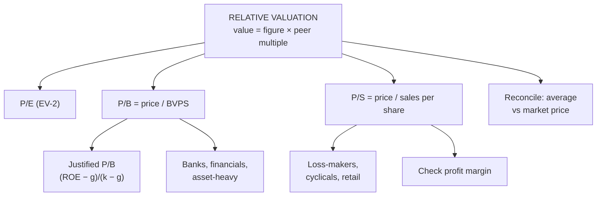

# EV-3: Relative Valuation, P/B and P/S Ratios

Covers: the logic of relative valuation, the price-to-book ratio (calculation, valuation, justified P/B, when to use it), the price-to-sales ratio (calculation, valuation, when to use it), and a comparison of P/E, P/B and P/S. **(syllabus)**

## Where this fits in the ESE

A 5-mark sum ("value the share using P/B and P/S and comment") or one step of the 15-mark valuation case, where you value the same share three ways and reconcile.

## The logic of relative valuation

Similar assets should sell at similar prices. So value a share by applying a **peer group's multiple** to the company's own figure:

**Value per share = Company's per-share figure × Benchmark multiple**

Steps: (1) choose comparable firms (same industry, size, growth, risk); (2) compute their multiple; (3) take the average or median; (4) apply it; (5) adjust for differences in growth, risk and profitability.

## Price-to-book (P/B)

**P/B = Market price per share ÷ Book value per share**
Book value per share (BVPS) = (equity share capital + reserves) ÷ number of shares.

**Valuation:** value = BVPS × peer P/B.
*Example:* BVPS ₹180, peer P/B 2.2. Value = 180 × 2.2 = **₹396**.

**Justified P/B** (from the constant-growth model): **P/B = (ROE − g) ÷ (k − g)**
*Example:* ROE 18%, k 13%, g 8%: P/B = 10 ÷ 5 = **2.0**.
Read: a firm whose ROE exceeds its cost of equity should trade above book (P/B > 1); a firm earning below k should trade below book.

**Best for:** banks, NBFCs, insurers (assets are financial and carried near market value); asset-heavy firms; loss-making firms (book value is still positive).
**Weak for:** service and tech firms with few tangible assets (brands, people and software aren't on the balance sheet); firms with big buybacks or write-offs distorting book value.

## Price-to-sales (P/S)

**P/S = Market price per share ÷ Sales (revenue) per share**
(or market capitalisation ÷ total sales).

**Valuation:** value = sales per share × peer P/S.
*Example:* sales per share ₹450, peer P/S 0.9. Value = 450 × 0.9 = **₹405**.

**Best for:** start-ups and loss-making firms (no earnings for P/E); cyclical firms (sales are steadier than earnings); retailers and consumer businesses.
**Weak:** ignores profitability and costs: a firm with ₹100 of sales and a 2% margin is worth far less than one with a 20% margin. Always check margins alongside P/S.

## Comparing the three multiples

| Basis | P/E | P/B | P/S |
|---|---|---|---|
| Denominator | Earnings | Book equity | Sales |
| Works when earnings are negative? | No | Yes | Yes |
| Hard to manipulate? | Least | Medium | Most robust |
| Best for | Stable profitable firms | Banks, financials, asset-heavy | Start-ups, cyclicals, retail |
| Key driver | Growth, payout, risk | ROE vs k | Profit margin |

## Worked example: reconciling the multiples

**Question (illustrative):** a share trades at ₹350. EPS ₹24 (peer P/E 15), BVPS ₹180 (peer P/B 2.2), sales per share ₹450 (peer P/S 0.9). Value it and advise.

| Method | Working | Value (₹) |
|---|---|---|
| P/E | 24 × 15 | 360 |
| P/B | 180 × 2.2 | 396 |
| P/S | 450 × 0.9 | 405 |
| **Simple average** | (360 + 396 + 405) ÷ 3 | **387** |

**Verdict:** all three values exceed the ₹350 price, and the average ₹387 gives a margin of safety of (387 − 350) ÷ 387 = **9.6%**. **Undervalued: buy**, with the caveat that the peers must be truly comparable.

## What to remember

- Value = company figure × peer multiple.
- P/B = price ÷ BVPS; justified P/B = (ROE − g) ÷ (k − g) (18/13/8 gives 2.0).
- P/S = price ÷ sales per share; robust but ignores margins.
- P/B for banks and financials; P/S for loss-makers and cyclicals.
- Worked: P/E ₹360, P/B ₹396, P/S ₹405, average ₹387 vs ₹350: buy.

## Concept map

## Flashcards
Q: What is the logic of relative valuation?
A: Similar assets should sell at similar prices, so apply a peer group's multiple to the company's own figure.

Q: Formula for the P/B ratio?
A: Market price per share ÷ book value per share.

Q: BVPS ₹180, peer P/B 2.2. Value?
A: ₹396.

Q: Formula for the justified P/B?
A: (ROE − g) ÷ (k − g).

Q: When should a firm trade below book value?
A: When its ROE is below its cost of equity.

Q: For which firms is P/S most useful?
A: Start-ups and loss-making firms, cyclicals, retailers: wherever earnings are negative or volatile.

Q: Main weakness of P/S?
A: It ignores profitability; two firms with the same sales can have very different margins.

Q: For which sector is P/B the standard multiple?
A: Banks and other financial firms.

## Sources
- BBA301F-5 course plan, Unit 4 (relative valuation: P/B and P/S ratios)
- Reilly & Brown; Damodaran, *Investment Valuation*
- Previous: [[SAPM Unit 4 - EV-2 Earnings Model and PE Ratio]] · Next: [[SAPM Unit 4 - EV-4 Dividend Discount Models]]
- [[SAPM Unit 4 - Equity Valuation MOC (Node Map)]]
