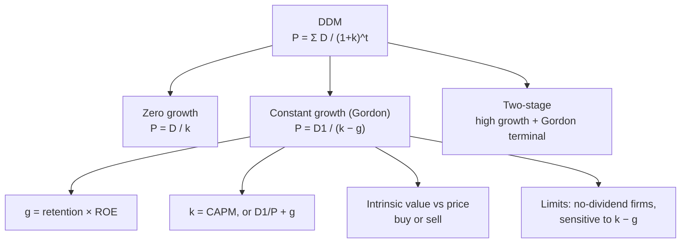

# EV-4: Dividend Discount Models

Covers: the general dividend discount model, the zero-growth model, the constant-growth (Gordon) model, estimating g and k, estimating the intrinsic value of equity shares, the two-stage model as a textbook extension, and the assumptions and limits of the DDM. **(syllabus)**

## Where this fits in the ESE

The most numerical topic in Unit 4: expect a 5-mark Gordon-model sum, a 10-mark "explain the DDMs with examples", and a DDM step in the 15-mark case (often with CAPM supplying k, from Unit 5's PM-3).

## The general model

A share is worth the present value of all future dividends:

**P₀ = D₁/(1+k) + D₂/(1+k)² + D₃/(1+k)³ + …**

k is the investor's required return (cost of equity). Even if you plan to sell, the buyer's price is itself the PV of later dividends, so the infinite stream is what matters.

## Zero-growth model

Dividends stay constant forever (a perpetuity):

**P₀ = D ÷ k**

*Example:* constant dividend ₹12, k = 15%: P₀ = 12 ÷ 0.15 = **₹80**.
Used for: preference shares; mature firms that pay out all earnings and don't grow.

## Constant-growth (Gordon) model

Dividends grow at a constant rate g forever, with k > g:

**P₀ = D₁ ÷ (k − g)**, where **D₁ = D₀ (1 + g)**

*Example:* last dividend D₀ = ₹10, g = 6%, k = 14%.
D₁ = 10 × 1.06 = 10.60; P₀ = 10.60 ÷ (0.14 − 0.06) = **₹132.50**.

Rearranged, the **required (or expected) return** = dividend yield + growth: **k = D₁ ÷ P₀ + g**.

### Estimating g and k

- **Sustainable growth g = b × ROE**, where b = retention ratio = 1 − payout.
  *Example:* retention 60%, ROE 15%: g = 0.60 × 15 = **9%**.
- **k from CAPM** (Unit 5): k = R_f + β(R_m − R_f).
  *Example:* R_f 6%, β 1.2, R_m 13%: k = 6 + 1.2 × 7 = **14.4%**.

### Worked example: estimation of intrinsic value, laid out as the exam answer

**Question (illustrative):** a company just paid ₹5 per share. It retains 60% of earnings and its ROE is 15%. Its beta is 1.2; R_f = 6%, R_m = 13%. The share trades at ₹92. Advise.

1. g = b × ROE = 0.60 × 15% = **9%**.
2. k = 6 + 1.2 × (13 − 6) = **14.4%**.
3. D₁ = 5 × 1.09 = **₹5.45**.
4. P₀ = 5.45 ÷ (0.144 − 0.09) = 5.45 ÷ 0.054 = **₹100.93**.
5. Intrinsic value ₹100.93 > price ₹92: **undervalued**; margin of safety = (100.93 − 92) ÷ 100.93 = **8.8%**. **Buy.**

**Sensitivity note:** because k − g is small (5.4%), a 1-point error in g changes the value a lot. With g = 8%, P₀ = 5.40 ÷ 0.064 = ₹84.38, and the verdict flips. Always state the assumptions.

## Two-stage model (textbook extension)

For a firm growing fast now and settling later: PV of dividends in the high-growth years + PV of the terminal price from the Gordon model at the start of stable growth.

*Example:* D₀ = ₹4, 20% growth for 3 years, then 8% forever, k = 14%.
- D₁ 4.80, D₂ 5.76, D₃ 6.912; PV = 4.80/1.14 + 5.76/1.14² + 6.912/1.14³ = 4.211 + 4.432 + 4.665 = **13.31**
- D₄ = 6.912 × 1.08 = 7.465; P₃ = 7.465 ÷ 0.06 = 124.42; PV = 124.42 ÷ 1.14³ = **83.98**
- **P₀ = 13.31 + 83.98 = ₹97.29**

## Assumptions and limitations

**Gordon's assumptions:** dividends grow at a constant rate forever; k > g; k and g constant; the firm is all-equity financed (or its risk is stable); retention is reinvested at a constant ROE.

**Limitations:**
1. Useless for firms that pay no dividends (many growth and tech firms).
2. Very sensitive to k − g.
3. Constant growth forever is unrealistic for young firms (use the two-stage model).
4. Fails when g ≥ k.
5. Ignores buybacks as a way of returning cash.

## Traps

- **Using D₀ instead of D₁** in Gordon's formula. Grow it first.
- **Using g ≥ k.** The formula breaks: it gives a negative or infinite price.
- **Percentages vs decimals** in k − g.
- **Zero-growth model for a growing firm.**

## What to remember

- General: P₀ = Σ Dₜ/(1+k)ᵗ.
- Zero growth: P₀ = D/k (₹12 at 15% gives ₹80).
- Gordon: P₀ = D₁/(k − g), D₁ = D₀(1+g) (₹10, 6%, 14% gives ₹132.50).
- g = b × ROE; k via CAPM; k = D₁/P₀ + g.
- Worked: g 9%, k 14.4%, D₁ 5.45, value ₹100.93 vs ₹92: buy.
- Two-stage: ₹97.29.

## Concept map

## Flashcards
Q: Write the zero-growth dividend model.
A: P₀ = D ÷ k.

Q: Write Gordon's constant-growth model.
A: P₀ = D₁ ÷ (k − g), with D₁ = D₀(1 + g).

Q: D₀ ₹10, g 6%, k 14%. Value?
A: D₁ = 10.60; P₀ = 10.60 ÷ 0.08 = ₹132.50.

Q: How do you estimate g from accounts?
A: g = retention ratio × ROE.

Q: Retention 60%, ROE 15%. Growth?
A: 9%.

Q: Rearrange Gordon's model for the required return.
A: k = D₁ ÷ P₀ + g (dividend yield plus growth).

Q: Why does Gordon's model fail when g ≥ k?
A: The denominator becomes zero or negative, giving an infinite or negative price.

Q: Name two limitations of the DDM.
A: Can't value non-dividend payers; highly sensitive to k − g (also unrealistic constant growth, ignores buybacks).

## Sources
- BBA301F-5 course plan, Unit 4 (dividend valuation models: zero growth, constant growth; estimation of intrinsic value)
- Gordon (1962); Bhalla, *Investment Management*
- Previous: [[SAPM Unit 4 - EV-3 Relative Valuation PB and PS]] · Next: [[SAPM Unit 4 - EV-5 Forecasting Equity Prices]]
- [[SAPM Unit 4 - Equity Valuation MOC (Node Map)]]
