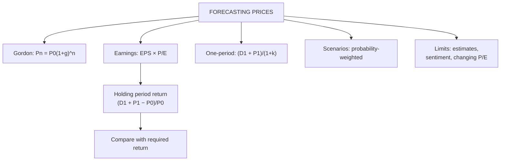

# EV-5: Forecasting Future Equity Prices

Covers: forecasting a future price with the constant-growth model, the earnings (EPS × P/E) approach, the one-period valuation model, scenario (probability-weighted) forecasts, expected holding period return, and the limits of price forecasting. **(syllabus)**

## Where this fits in the ESE

A 5-mark sum ("estimate the price after three years" or "find the target price and expected return") or the last step of the valuation case: value today, forecast the price, and give a recommendation.

## Method 1: constant-growth model

Under Gordon's assumptions the price grows at g:

**Pₙ = P₀ (1 + g)ⁿ = Dₙ₊₁ ÷ (k − g)**

*Example:* P₀ = ₹132.50 (D₀ 10, g 6%, k 14%). Price in 3 years = 132.50 × 1.06³ = 132.50 × 1.191016 = **₹157.81**. Check: D₄ = 10 × 1.06⁴ = 12.6248; P₃ = 12.6248 ÷ 0.08 = **₹157.81**.

## Method 2: earnings approach (target price)

**Target price = Forecast EPS × Expected P/E**

*Example:* EPS this year ₹24, expected growth 12%, expected P/E next year 16, dividend next year ₹5, current price ₹380.
1. Forecast EPS = 24 × 1.12 = **₹26.88**.
2. Target price = 26.88 × 16 = **₹430.08**.
3. Expected holding period return = (D₁ + P₁ − P₀) ÷ P₀ = (5 + 430.08 − 380) ÷ 380 = **14.5%**.
Compare with the required return (e.g. CAPM 14.4%): roughly fair; a small expected excess.

## Method 3: one-period valuation model

If you hold for one year:

**P₀ = (D₁ + P₁) ÷ (1 + k)**

*Example:* expected dividend ₹6, expected price next year ₹140, k = 15%: P₀ = 146 ÷ 1.15 = **₹126.96**. If the share trades below this, the expected return beats 15%.

## Method 4: scenario (probability-weighted) forecast

| Scenario | Probability | Price in 1 year |
|---|---|---|
| Bull | 0.25 | ₹500 |
| Base | 0.50 | ₹420 |
| Bear | 0.25 | ₹300 |

Expected price = 0.25(500) + 0.5(420) + 0.25(300) = **₹410**. Reporting a range (₹300 to ₹500) is more honest than one number.

## Other inputs to a forecast

- **Analysts' consensus** target prices and EPS estimates.
- **Technical analysis** (Unit 3): support and resistance levels for timing.
- **Economic forecasts**: GDP, interest rates, inflation (rates up → k up → prices down).
- **Industry outlook** and company guidance.

## Limits of forecasting

1. Growth, P/E and k are estimates; small changes move the forecast a lot.
2. Market sentiment and unexpected news dominate short-run prices.
3. P/E multiples themselves change with the market cycle.
4. Constant growth is an approximation.
So present a forecast with assumptions and a range, and act on the margin of safety, not on a point estimate.

## What to remember

- Pₙ = P₀(1+g)ⁿ = Dₙ₊₁/(k − g): ₹132.50 grows to ₹157.81 in 3 years.
- Target price = forecast EPS × expected P/E: 26.88 × 16 = ₹430.08; HPR 14.5%.
- One-period: P₀ = (D₁ + P₁)/(1 + k): (6 + 140)/1.15 = ₹126.96.
- Scenario forecast: expected ₹410.
- Always give assumptions and a range.

## Concept map

## Flashcards
Q: Under Gordon's model, how does the price grow?
A: At the dividend growth rate g: Pₙ = P₀(1 + g)ⁿ.

Q: P₀ ₹132.50, g 6%. Price in 3 years?
A: 132.50 × 1.06³ = ₹157.81.

Q: How is a target price found with the earnings approach?
A: Forecast EPS × expected P/E.

Q: Formula for the one-period valuation model?
A: P₀ = (D₁ + P₁) ÷ (1 + k).

Q: D₁ ₹6, P₁ ₹140, k 15%. Value today?
A: 146 ÷ 1.15 = ₹126.96.

Q: Formula for the expected holding period return?
A: (D₁ + P₁ − P₀) ÷ P₀.

Q: Why give a price range rather than one number?
A: Inputs are estimates and sentiment moves short-run prices; a range shows the uncertainty.

## Sources
- BBA301F-5 course plan, Unit 4 (forecasting future equity prices)
- Bhalla, *Investment Management*
- Previous: [[SAPM Unit 4 - EV-4 Dividend Discount Models]] · Next: [[SAPM Unit 4 - EV-6 Unit 4 Exam Answers]]
- [[SAPM Unit 4 - Equity Valuation MOC (Node Map)]]
