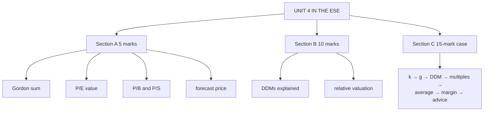

# EV-6: Unit 4 Exam Answers

Covers: what the ESE will ask from Unit 4, 5-mark and 10-mark skeletons, and the 15-mark valuation case layout with a model answer. Numbers come from EV-1 to EV-5.

## What the test will ask

Assume Section A 3 × 5, Section B 2 × 10, Section C one 15-mark case (confirm the SAPM pattern with Dr Nijumon). Unit 4 is CO3 (pricing and valuation), which carried 20 marks in the plan's CO table. The case is most likely **"value this share by several methods and advise"**: a DDM step, a multiples step and a recommendation.

## Five-mark answer skeletons

**1. Intrinsic value and price factors (EV-1).** Define intrinsic value (PV of future cash at required return); decision rule table; four groups of price factors with two examples each.

**2. Gordon model sum (EV-4).** Formula; D₁ = D₀(1+g); substitute (₹10, 6%, 14% gives ₹132.50); compare with price; decision.

**3. P/E valuation (EV-2).** Formula; value = EPS × benchmark P/E (₹24 × 15 = ₹360); compare with price; one limitation.

**4. P/B and P/S (EV-3).** Formula of each; value with each; when each suits; one-line reconciliation.

**5. Forecast price (EV-5).** Pₙ = P₀(1+g)ⁿ or EPS × P/E; HPR; compare with required return.

## Ten-mark answer skeletons

**A. Dividend discount models.** General model → zero growth (formula, ₹80 example, preference shares) → Gordon (formula, ₹132.50 example) → estimating g (b × ROE) and k (CAPM) → assumptions → limitations → two-stage as the fix for non-constant growth.

**B. Relative valuation.** Logic → steps → P/E, P/B, P/S each with formula and best use → comparison table → reconciliation example → limitations (choice of peers, market-wide mispricing).

**C. Approaches to equity valuation.** Absolute vs relative vs asset-based, one example each, strengths and weaknesses, and why analysts use more than one.

## Fifteen-mark case layout (multi-method valuation)

1. **Assumptions (1):** constant growth from now; k from CAPM; peers comparable; no taxes.
2. **Required return via CAPM (2).**
3. **Growth from b × ROE (1).**
4. **DDM value (3).**
5. **P/E value (2), P/B and P/S values (2).**
6. **Summary table and average value; margin of safety (2).**
7. **Recommendation with one forecast line and two qualitative checks (2).**

### Model answer, laid out as the exam answer

**Data (illustrative):** last dividend ₹5; retention 60%; ROE 15%; β 1.2; R_f 6%; R_m 13%; current price ₹92. EPS next year ₹12.50 (peer P/E 8); BVPS ₹50 (peer P/B 1.9); sales per share ₹160 (peer P/S 0.6).

1. **Assumptions:** constant growth; CAPM k; peers comparable.
2. **k** = 6 + 1.2 × 7 = **14.4%**.
3. **g** = 0.60 × 15 = **9%**.
4. **DDM:** D₁ = 5 × 1.09 = 5.45; P₀ = 5.45 ÷ 0.054 = **₹100.93**.
5. **Multiples:** P/E 12.50 × 8 = **₹100.00**; P/B 50 × 1.9 = **₹95.00**; P/S 160 × 0.6 = **₹96.00**.
6. **Summary:**

| Method | Value (₹) |
|---|---|
| DDM | 100.93 |
| P/E | 100.00 |
| P/B | 95.00 |
| P/S | 96.00 |
| **Average** | **97.98** |

Margin of safety = (97.98 − 92) ÷ 97.98 = **6.1%**.

7. **Recommendation:** every method values the share above ₹92: **mildly undervalued, buy** (accumulate). Price in one year under Gordon ≈ 100.93 × 1.09 = ₹110.01. Checks: the DDM is sensitive to g (at 8% it gives ₹84.38), so confirm ROE and payout are sustainable; and confirm the peers have similar growth and risk.

Close with: *the value holds only under the stated growth, required return and peer assumptions.*

## Time rule

If short of time: CAPM k, Gordon value, one multiple, the comparison with price and the decision sentence. That carries most of the marks.

## What to remember

- Case order: k (CAPM) → g (b × ROE) → DDM → multiples → table → margin of safety → recommendation.
- Model numbers: ₹132.50 (Gordon), ₹80 (zero growth), ₹360 (P/E), ₹396 (P/B), ₹405 (P/S), ₹100.93 (CAPM + b × ROE).
- Always show sensitivity: the DDM swings with g.

## Concept map

## Flashcards
Q: What is the order of steps in the multi-method valuation case?
A: Assumptions, k via CAPM, g via b × ROE, DDM value, multiple values, summary and average, margin of safety, recommendation.

Q: Model case: DDM ₹100.93, P/E ₹100, P/B ₹95, P/S ₹96, price ₹92. Verdict?
A: Average ₹97.98; margin of safety 6.1%; mildly undervalued, buy.

Q: Skeleton for a 10-mark DDM answer?
A: General model, zero growth, Gordon, estimating g and k, assumptions, limitations, two-stage.

Q: What sensitivity should every DDM answer mention?
A: Value is very sensitive to k − g; a 1-point change in g can flip the decision.

## Sources
- BBA301F-5 course plan, Unit 4 and assessment outline
- [[SAPM Unit 4 - Equity Valuation MOC (Node Map)]]
