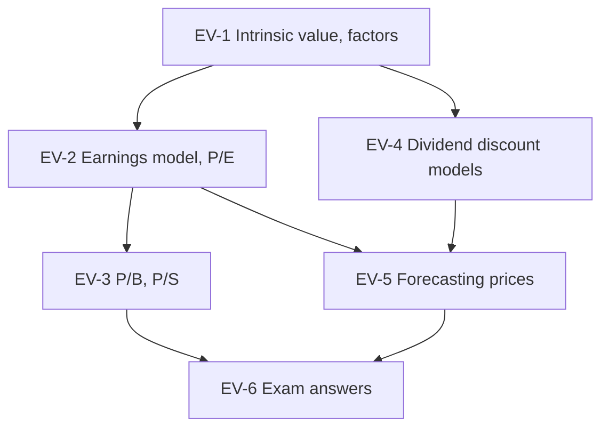

# SAPM Unit 4: Equity Valuation and Pricing, node map

ESE: 50 marks, assume 3 × 5, 2 × 10 and one compulsory 15-mark case. Unit 4 is CO3 (security pricing and valuation). The case is most likely a multi-method valuation with a buy/sell recommendation. All examples are **illustrative textbook numbers**.

## Nodes

| Node | Topic | Deps | Minutes | Exam focus |
|---|---|---|---|---|
| EV-1 | Intrinsic Value and Price Factors | none | 25 | no |
| EV-2 | Earnings Model and P/E Ratio | EV-1 | 35 | yes |
| EV-3 | Relative Valuation P/B and P/S | EV-2 | 30 | yes |
| EV-4 | Dividend Discount Models | EV-1 | 45 | yes |
| EV-5 | Forecasting Equity Prices | EV-2, EV-4 | 30 | yes |
| EV-6 | Unit 4 Exam Answers | EV-1 to EV-5 | 30 | yes |

Total reading time: about 195 minutes.

## Dependency graph

## Headline numbers to know

- Earnings capitalisation: ₹30 at 12% = ₹250. P/E value: 24 × 15 = ₹360 vs ₹320, buy.
- Justified P/E (payout 40%, k 14%, g 8%): forward 6.67, trailing 7.2. PEG 20 ÷ 16 = 1.25.
- P/B: 180 × 2.2 = ₹396; justified P/B (ROE 18, k 13, g 8) = 2.0. P/S: 450 × 0.9 = ₹405.
- Zero growth ₹12 at 15% = ₹80. Gordon: D₀ 10, g 6%, k 14% gives ₹132.50.
- g = 0.6 × 15% = 9%; k = 14.4%; D₁ 5.45; value ₹100.93 vs ₹92, buy. Two-stage: ₹97.29.
- Forecast: ₹132.50 → ₹157.81 in 3 years; target 26.88 × 16 = ₹430.08 (HPR 14.5%); one-period ₹126.96.

## Links
- [[SAPM MOC]]
