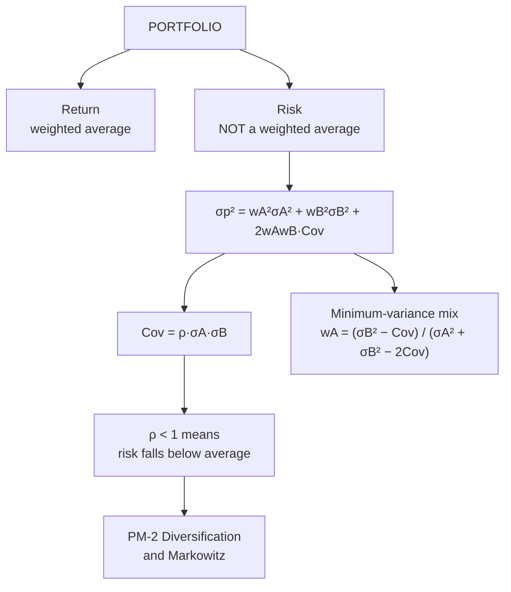

# PM-1: Portfolio Return and Risk

Covers: the meaning and objectives of equity portfolio management, expected return of a portfolio, portfolio variance and standard deviation for two assets, covariance and correlation, and the minimum-variance portfolio. **(syllabus)** topics, **(textbook)** method.

## Where this fits in the ESE

The ESE is 50 marks: Section A three 5-mark questions (internal choice), Section B two 10-mark questions (internal choice), Section C one compulsory 15-mark case. Two-asset portfolio risk is the most likely 5-mark sum in Unit 5 and the first step of almost every 15-mark portfolio case. Everything later in the unit (Markowitz, CAPM, Sharpe's index model, the evaluation ratios) uses the numbers this node teaches you to produce.

## Meaning and objectives of equity portfolio management

**Portfolio management** is choosing a combination of securities, and revising it over time, so that the investor gets the highest return for the risk they are willing to bear.

Objectives (write any five):
1. **Return**: a steady return in line with the investor's goal.
2. **Capital growth**: appreciation of the invested capital over time.
3. **Safety of principal**: avoid permanent loss through diversification.
4. **Liquidity**: hold securities that can be sold quickly without a large price cut.
5. **Risk control**: keep total risk at the level the investor can bear.
6. **Tax efficiency**: use tax-efficient holding periods and instruments.
7. **Marketability and flexibility**: the portfolio can be revised as conditions change.

The process: (1) define objectives and constraints, (2) security analysis, (3) portfolio construction, (4) portfolio revision, (5) portfolio evaluation. PM-2 to PM-4 cover construction; PM-5 covers evaluation.

## Expected return of a portfolio

The portfolio return is the **weighted average** of the securities' returns. Weights are the share of money in each security and add to 1.

**E(Rp) = Σ wᵢ E(Rᵢ)**

Return averages. Risk does not, and that gap is the whole reason diversification works.

## Expected return and risk of a single security from scenarios

When returns are given by state of the economy with probabilities:

- **E(R) = Σ pᵢ Rᵢ**
- **σ² = Σ pᵢ (Rᵢ − E(R))²**, **σ = √σ²**
- **Cov(A,B) = Σ pᵢ (R_Aᵢ − E(R_A))(R_Bᵢ − E(R_B))**
- **ρ_AB = Cov(A,B) ÷ (σ_A σ_B)**, always between −1 and +1.

## Two-asset portfolio risk

**σp² = w_A² σ_A² + w_B² σ_B² + 2 w_A w_B Cov(A,B)**
and Cov(A,B) = ρ_AB σ_A σ_B.

The covariance term is where diversification lives. If ρ is below +1, σp is less than the weighted average of the two SDs.

**Minimum-variance weight in A:**
**w_A = (σ_B² − Cov) ÷ (σ_A² + σ_B² − 2 Cov)**, and w_B = 1 − w_A.

## Worked example 1 (scenario data), laid out as the exam answer

**Question (illustrative):** returns of Stock A and Stock B in three states. Find the expected return and SD of each, the covariance and correlation, and the return and risk of a 50:50 portfolio.

| State | Probability | A | B |
|---|---|---|---|
| Boom | 0.3 | 25% | 6% |
| Normal | 0.5 | 15% | 12% |
| Recession | 0.2 | −5% | 14% |

1. E(R_A) = 0.3(25) + 0.5(15) + 0.2(−5) = 7.5 + 7.5 − 1 = **14%**.
   E(R_B) = 0.3(6) + 0.5(12) + 0.2(14) = 1.8 + 6 + 2.8 = **10.6%**.
2. Deviations and products (in decimals):

| State | p | d_A | d_B | p·d_A² | p·d_B² | p·d_A·d_B |
|---|---|---|---|---|---|---|
| Boom | 0.3 | 0.11 | −0.046 | 0.003630 | 0.000635 | −0.001518 |
| Normal | 0.5 | 0.01 | 0.014 | 0.000050 | 0.000098 | 0.000070 |
| Recession | 0.2 | −0.19 | 0.034 | 0.007220 | 0.000231 | −0.001292 |
| **Total** | | | | **0.010900** | **0.000964** | **−0.002740** |

3. σ_A = √0.0109 = **10.44%**; σ_B = √0.000964 = **3.10%**.
4. Cov(A,B) = **−0.00274**; ρ = −0.00274 ÷ (0.1044 × 0.0310) = **−0.85**.
5. 50:50 portfolio: E(Rp) = 0.5(14) + 0.5(10.6) = **12.3%**.
   σp² = 0.25(0.0109) + 0.25(0.000964) + 2(0.25)(−0.00274) = 0.002725 + 0.000241 − 0.00137 = 0.001596; σp = **3.99%**.

**Interpretation:** the portfolio earns 12.3%, well above B's 10.6%, at roughly B's risk (3.99% against 3.10%) and far below A's 10.44%. Strong negative correlation (−0.85) means the two stocks' bad years cancel. That is diversification in one table.

## Worked example 2 (given SDs and correlation)

**Question:** A: E(R) 15%, σ 20%. B: E(R) 10%, σ 12%. ρ = 0.3. Invest 60% in A. Find portfolio return and risk, and the minimum-variance mix.

1. E(Rp) = 0.6(15) + 0.4(10) = **13%**.
2. Cov = 0.3 × 0.20 × 0.12 = 0.0072.
3. σp² = 0.36(0.04) + 0.16(0.0144) + 2(0.6)(0.4)(0.0072) = 0.0144 + 0.002304 + 0.003456 = 0.02016; σp = **14.20%**.
   Weighted average SD would be 0.6(20) + 0.4(12) = 16.8%, so diversification has cut 2.6 points of risk.
4. Minimum variance: w_A = (0.0144 − 0.0072) ÷ (0.04 + 0.0144 − 0.0144) = 0.0072 ÷ 0.04 = **0.18**, w_B = 0.82. Return = 0.18(15) + 0.82(10) = **10.9%**, σ = **11.45%**, below B's own 12%.

<svg width="100%" style="max-width:680px;display:block;margin:12px auto" viewBox="0 0 680 350" role="img" xmlns="http://www.w3.org/2000/svg">
<title>Portfolio SD against weight in A</title>
<desc>Chart of portfolio standard deviation against the weight in stock A, for A with 20% SD and B with 12% SD at correlation 0.3. A dashed straight line is the weighted-average SD, which is what correlation +1 would give. The actual curve lies below it, with a minimum of 11.45% at 18% in A, below B alone. At 60% in A the SD is 14.20% against 16.8% on the straight line.</desc>
<line x1="70" y1="290" x2="70" y2="40" stroke="#888780" stroke-width="1.5"/>
<line x1="70" y1="290" x2="630" y2="290" stroke="#888780" stroke-width="1.5"/>
<line x1="66" y1="290" x2="70" y2="290" stroke="#888780" stroke-width="1.5"/>
<text font-size="12" fill="currentColor" opacity="0.7" font-family="inherit" x="60" y="294" text-anchor="end">10</text>
<line x1="66" y1="165" x2="70" y2="165" stroke="#888780" stroke-width="1.5"/>
<text font-size="12" fill="currentColor" opacity="0.7" font-family="inherit" x="60" y="169" text-anchor="end">15</text>
<line x1="66" y1="40" x2="70" y2="40" stroke="#888780" stroke-width="1.5"/>
<text font-size="12" fill="currentColor" opacity="0.7" font-family="inherit" x="60" y="44" text-anchor="end">20</text>
<line x1="70" y1="290" x2="70" y2="294" stroke="#888780" stroke-width="1.5"/>
<text font-size="12" fill="currentColor" opacity="0.7" font-family="inherit" x="70" y="310" text-anchor="middle">0</text>
<line x1="182" y1="290" x2="182" y2="294" stroke="#888780" stroke-width="1.5"/>
<text font-size="12" fill="currentColor" opacity="0.7" font-family="inherit" x="182" y="310" text-anchor="middle">0.2</text>
<line x1="294" y1="290" x2="294" y2="294" stroke="#888780" stroke-width="1.5"/>
<text font-size="12" fill="currentColor" opacity="0.7" font-family="inherit" x="294" y="310" text-anchor="middle">0.4</text>
<line x1="406" y1="290" x2="406" y2="294" stroke="#888780" stroke-width="1.5"/>
<text font-size="12" fill="currentColor" opacity="0.7" font-family="inherit" x="406" y="310" text-anchor="middle">0.6</text>
<line x1="518" y1="290" x2="518" y2="294" stroke="#888780" stroke-width="1.5"/>
<text font-size="12" fill="currentColor" opacity="0.7" font-family="inherit" x="518" y="310" text-anchor="middle">0.8</text>
<line x1="630" y1="290" x2="630" y2="294" stroke="#888780" stroke-width="1.5"/>
<text font-size="12" fill="currentColor" opacity="0.7" font-family="inherit" x="630" y="310" text-anchor="middle">1</text>
<text font-size="14" font-weight="500" fill="currentColor" font-family="inherit" x="70" y="26" text-anchor="start">Portfolio SD (%)</text>
<text font-size="14" font-weight="500" fill="currentColor" font-family="inherit" x="350" y="336" text-anchor="middle">Weight in A (0 = all B, 1 = all A)</text>
<line x1="70" y1="240" x2="630" y2="40" stroke="#888780" stroke-width="2" stroke-dasharray="6 4"/>
<polyline points="70,240 84,243.5 98,246.5 112,249 126,251 140,252.5 154,253.4 168,253.8 182,253.6 196,252.9 210,251.7 224,249.9 238,247.6 252,244.8 266,241.5 280,237.7 294,233.4 308,228.7 322,223.6 336,218 350,212.1 364,205.8 378,199.2 392,192.3 406,185 420,177.5 434,169.7 448,161.6 462,153.3 476,144.8 490,136.1 504,127.2 518,118.1 532,108.8 546,99.4 560,89.8 574,80.1 588,70.3 602,60.3 616,50.2 630,40" fill="none" stroke="#7F77DD" stroke-width="2" stroke-linejoin="round" stroke-linecap="round"/>
<line x1="90" y1="62" x2="120" y2="62" stroke="#888780" stroke-width="2" stroke-dasharray="6 4"/>
<text font-size="12" fill="currentColor" opacity="0.7" font-family="inherit" x="128" y="66" text-anchor="start">Weighted-average SD (what correlation +1 gives)</text>
<line x1="90" y1="84" x2="120" y2="84" stroke="#7F77DD" stroke-width="2"/>
<text font-size="12" fill="currentColor" opacity="0.7" font-family="inherit" x="128" y="88" text-anchor="start">Actual SD at correlation 0.3</text>
<line x1="406" y1="120" x2="406" y2="185" stroke="#888780" stroke-width="1.5" stroke-dasharray="4 3"/>
<circle cx="406" cy="120" r="5" fill="#888780" stroke="#5F5E5A" stroke-width="2"/>
<circle cx="406" cy="185" r="5" fill="#7F77DD" stroke="#7F77DD" stroke-width="2"/>
<text font-size="12" fill="currentColor" opacity="0.7" font-family="inherit" x="416" y="136" text-anchor="start">16.8% weighted average</text>
<text font-size="12" fill="currentColor" opacity="0.7" font-family="inherit" x="416" y="162" text-anchor="start">2.6 points lower</text>
<text font-size="14" font-weight="500" fill="currentColor" font-family="inherit" x="416" y="210" text-anchor="start">60:40 gives 14.20%</text>
<circle cx="170.8" cy="253.8" r="6" fill="#639922" stroke="#3B6D11" stroke-width="2"/>
<text font-size="14" font-weight="500" fill="currentColor" font-family="inherit" x="180.8" y="278" text-anchor="start">Minimum variance: 18% in A, 11.45%</text>
<circle cx="70" cy="240" r="4" fill="#888780" stroke="#5F5E5A" stroke-width="2"/>
<circle cx="630" cy="40" r="4" fill="#888780" stroke="#5F5E5A" stroke-width="2"/>
<text font-size="12" fill="currentColor" opacity="0.7" font-family="inherit" x="60" y="244" text-anchor="end">B 12%</text>
<text font-size="12" fill="currentColor" opacity="0.7" font-family="inherit" x="640" y="44" text-anchor="start">A 20%</text>
</svg>

## Traps

- **Averaging SDs.** Portfolio SD is never the weighted average of SDs unless ρ = +1.
- **Forgetting the 2** in 2·w_A·w_B·Cov.
- **Mixing percentages and decimals** inside the variance formula. Work in decimals, convert at the end.
- **Variance is not risk in the answer line.** Report σ in %, not σ².
- **Correlation outside −1 to +1** means an arithmetic slip. Recheck.

## What to remember

- E(Rp) = Σ wE(R). σp² = w_A²σ_A² + w_B²σ_B² + 2w_Aw_B·ρσ_Aσ_B.
- Covariance = Σ p·d_A·d_B; correlation = Cov ÷ (σ_Aσ_B).
- Minimum variance w_A = (σ_B² − Cov) ÷ (σ_A² + σ_B² − 2Cov).
- Example 1: A 14% / 10.44%, B 10.6% / 3.10%, ρ −0.85, 50:50 gives 12.3% / 3.99%.
- Example 2: 60:40 gives 13% / 14.20%; minimum variance 18% in A, 10.9% / 11.45%.

## Concept map

## Flashcards
Q: Define portfolio management in one line.
A: Choosing and revising a combination of securities to get the highest return for the risk the investor will bear.

Q: Name five objectives of portfolio management.
A: Return, capital growth, safety of principal, liquidity, risk control (also tax efficiency, marketability).

Q: Formula for expected portfolio return?
A: E(Rp) = Σ wᵢ E(Rᵢ), weights summing to 1.

Q: Formula for two-asset portfolio variance?
A: σp² = w_A²σ_A² + w_B²σ_B² + 2w_Aw_B Cov(A,B), with Cov = ρσ_Aσ_B.

Q: When does portfolio SD equal the weighted average of SDs?
A: Only when ρ = +1.

Q: Formula for the minimum-variance weight in A?
A: w_A = (σ_B² − Cov) ÷ (σ_A² + σ_B² − 2Cov).

Q: A 15%/20%, B 10%/12%, ρ 0.3, 60% in A. Portfolio return and SD?
A: 13% and 14.20%.

Q: How do you compute covariance from scenario data?
A: Σ p × (R_A − E(R_A)) × (R_B − E(R_B)).

## Sources
- BBA301F-5 course plan, Unit 5
- Fischer & Jordan, *Security Analysis and Portfolio Management*; Madhumati, *Investment Analysis and Portfolio Management*
- Next node: [[SAPM Unit 5 - PM-2 Diversification and Markowitz]]
- [[SAPM Unit 5 - Portfolio Management MOC (Node Map)]]
