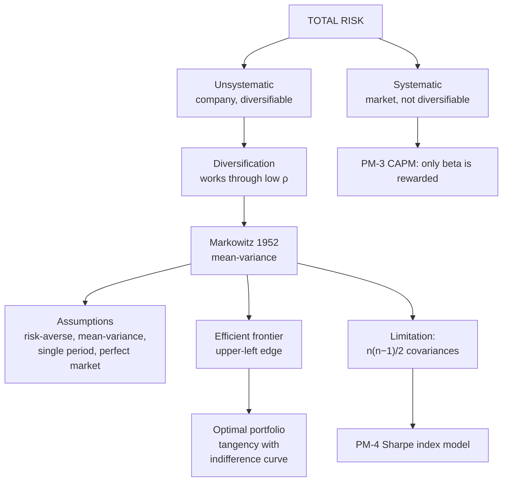

# PM-2: Diversification and Markowitz

Covers: diversification and the risk-return trade-off, systematic vs unsystematic risk in a portfolio, the effect of correlation, Harry Markowitz's contribution (Modern Portfolio Theory), its assumptions, the efficient frontier and the optimal portfolio. **(syllabus)**

## Where this fits in the ESE

A classic 10-mark Section B question: "Explain Markowitz's portfolio theory with the efficient frontier" or "How does diversification reduce risk?". In a 15-mark case it is the theory paragraph that justifies why you mixed the stocks. Pair the theory with the correlation table below and you have both the concept and the numbers.

## Diversification and the risk-return trade-off

- **Total risk = systematic risk + unsystematic risk.**
- **Unsystematic (diversifiable, company-specific)**: strikes, a failed product, management fraud. Adding more stocks that don't move together washes it out.
- **Systematic (non-diversifiable, market)**: interest rates, inflation, recession, policy. Every stock is exposed, so diversification can't remove it.
- As stocks are added, portfolio SD falls quickly at first and then flattens at the market-risk floor. Most of the benefit comes in the first 15 to 20 well-chosen stocks.
- **Trade-off**: an investor who wants a higher expected return must accept higher (systematic) risk. Diversification gives you the lowest risk for each level of return; it doesn't give you free return.

Because unsystematic risk can be diversified away for free, the market pays no premium for it. That is the bridge to CAPM (PM-3): only beta is rewarded.

## The effect of correlation, the table to draw

A: 15% return, σ 20%. B: 10% return, σ 12%. Portfolio 50:50, so E(Rp) = 12.5% in every row.

| ρ | σp | What it shows |
|---|---|---|
| +1 | 16.00% | No benefit: σp is the weighted average |
| +0.5 | 14.00% | Some benefit |
| 0 | 11.66% | Below both the average and A's risk |
| −0.5 | 8.72% | Large benefit |
| −1 | 4.00% | Maximum benefit |

With ρ = −1 the risk can be made zero: w_A = σ_B ÷ (σ_A + σ_B) = 12 ÷ 32 = **37.5%** in A, 62.5% in B.

**The lower the correlation, the greater the risk reduction.** Markowitz's point is that a security's contribution to portfolio risk depends on how it co-moves with the rest, not on its own SD.

## Markowitz: Modern Portfolio Theory (1952)

**Contribution:** before Markowitz, investors picked individually attractive stocks and assumed "more stocks = safer". Markowitz showed that risk must be measured at the portfolio level using variances **and covariances**, and gave a method (mean-variance optimisation) to find the best combinations. He won the Nobel Prize in 1990.

**Assumptions** (write five or six):
1. Investors are rational and **risk-averse**: for the same return they choose lower risk.
2. Investors decide on **expected return and variance (SD)** only.
3. Returns are normally distributed.
4. Investors want to maximise utility and prefer more return to less.
5. Single-period horizon.
6. Markets are perfect: no taxes or transaction costs, assets are divisible.

**Dominance rule:** portfolio X dominates Y if X has (a) higher return for the same risk, or (b) lower risk for the same return.

## The efficient frontier

Plot every possible portfolio of the available stocks on a graph of return (y-axis) against risk σ (x-axis). The set forms a region. Its **upper-left edge** is the efficient frontier: portfolios that give the highest return for each level of risk.

- Portfolios **on** the frontier are efficient.
- Portfolios **inside** the region are inefficient: another portfolio gives more return for the same risk.
- Portfolios **below the minimum-variance point** on the lower edge are dominated.
- The **minimum-variance portfolio** is the leftmost point.

Draw it as a curve bulging to the upper-left, with the minimum-variance point marked, a few dominated dots inside, and the efficient segment bold.

## The optimal portfolio

The investor's **indifference curves** (combinations of risk and return giving equal satisfaction) slope upward and are steeper for more risk-averse investors. The **optimal portfolio** is where the highest attainable indifference curve **touches** the efficient frontier. A conservative investor's tangency is near the minimum-variance end; an aggressive investor's is further up the frontier.

(Extension, textbook: once a risk-free asset is added, the best line from Rf touches the frontier at the market portfolio. That line is the Capital Market Line, and it leads to CAPM.)

## Limitations of Markowitz

- Needs a huge number of inputs: n returns, n variances and n(n−1)/2 covariances. For 100 stocks that is 4,950 covariances. (Sharpe's index model, PM-4, fixes this.)
- Relies on historical estimates that may not hold.
- Assumes normal returns and rational investors; real markets show fat tails and behavioural biases.
- Ignores transaction costs and taxes.
- Single period only.

## What to remember

- Total risk = systematic + unsystematic. Only unsystematic can be diversified away.
- Lower correlation means more risk reduction; at ρ = −1, risk can reach zero.
- 50:50 A/B table: 16.00, 14.00, 11.66, 8.72, 4.00% for ρ = +1, 0.5, 0, −0.5, −1.
- Markowitz: risk-averse investors, mean-variance, covariance matters, efficient frontier.
- Optimal portfolio = tangency of the highest indifference curve with the frontier.
- Main limitation: n(n−1)/2 covariances, which Sharpe's index model solves.

## Concept map

## Flashcards
Q: Which risk can diversification remove, and which can it not?
A: It removes unsystematic (company-specific) risk; systematic (market) risk remains.

Q: What happens to portfolio risk as correlation falls?
A: It falls; at ρ = −1 it can be reduced to zero with the right weights.

Q: Zero-risk weight in A when ρ = −1?
A: w_A = σ_B ÷ (σ_A + σ_B).

Q: Name four assumptions of Markowitz's theory.
A: Risk-averse rational investors; decisions on mean and variance only; single period; perfect markets with no taxes or costs (also normal returns).

Q: What is the efficient frontier?
A: The upper-left edge of all possible portfolios: the highest return for each level of risk.

Q: How is the optimal portfolio chosen?
A: Where the investor's highest attainable indifference curve is tangent to the efficient frontier.

Q: What is the dominance rule?
A: X dominates Y if it gives more return for the same risk, or less risk for the same return.

Q: Biggest practical limitation of Markowitz?
A: The number of inputs: n(n−1)/2 covariances, 4,950 for 100 stocks.

## Sources
- BBA301F-5 course plan, Unit 5 (Modern Portfolio Theory, efficient frontier, optimal equity portfolio)
- Markowitz, H. (1952), "Portfolio Selection", *Journal of Finance*
- Previous: [[SAPM Unit 5 - PM-1 Portfolio Return and Risk]] · Next: [[SAPM Unit 5 - PM-3 CAPM and Beta]]
- [[SAPM Unit 5 - Portfolio Management MOC (Node Map)]]
