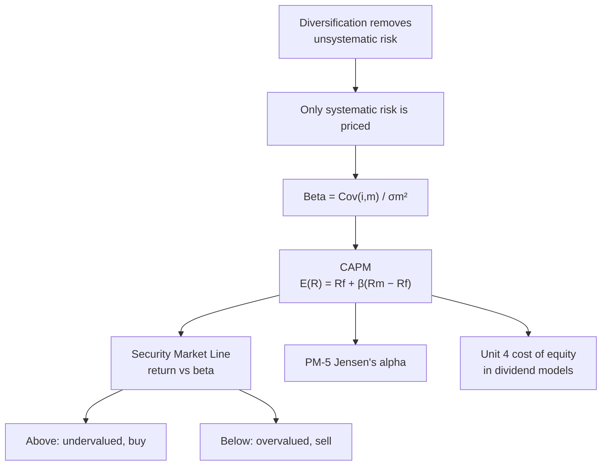

# PM-3: CAPM and Beta

Covers: the Capital Asset Pricing Model, its assumptions, beta as the measure of systematic risk, computing beta from returns, portfolio beta, the Security Market Line, and using CAPM to decide whether a stock is under- or overvalued. **(syllabus)**

## Where this fits in the ESE

CAPM is the single most examinable formula in Unit 5. Expect a 5-mark sum (required return, or beta from five years of returns), a 10-mark "explain CAPM, assumptions and limitations", and a CAPM step inside the 15-mark case (required return feeds Jensen's alpha in PM-5 and the cost of equity in Unit 4's dividend models).

## The idea in one paragraph

PM-2 showed that unsystematic risk can be diversified away for free. So in equilibrium the market pays a premium **only for systematic risk**, and beta measures systematic risk. A stock's required return is therefore the risk-free rate plus a premium proportional to its beta.

## The formula

**E(Rᵢ) = R_f + βᵢ (R_m − R_f)**

- R_f: risk-free rate (91-day T-bill or 10-year G-sec yield in India).
- R_m: expected market return (Nifty 50 / Sensex).
- (R_m − R_f): **market risk premium**.
- βᵢ(R_m − R_f): the stock's risk premium.

## Beta

**β = Cov(Rᵢ, R_m) ÷ σ_m²**  (also β = ρ_im σᵢ ÷ σ_m)

| Beta | Meaning | Type |
|---|---|---|
| β > 1 | Moves more than the market | Aggressive (e.g. metals, realty) |
| β = 1 | Moves with the market | Market-like (an index fund) |
| 0 < β < 1 | Moves less than the market | Defensive (FMCG, pharma) |
| β = 0 | No market co-movement | Risk-free asset |
| β < 0 | Moves against the market | Rare (gold at times) |

A β of 1.5 means: if the market rises 10%, the stock is expected to rise 15%; if it falls 10%, the stock is expected to fall 15%.

**Portfolio beta** is the weighted average of the stocks' betas: **βp = Σ wᵢ βᵢ**. (Unlike SD, beta does average.)

## Assumptions of CAPM

1. Investors are risk-averse and diversify (Markowitz investors).
2. They can borrow and lend unlimited amounts at the risk-free rate.
3. Homogeneous expectations: all investors agree on returns, variances and covariances.
4. Single-period horizon.
5. Perfect markets: no taxes, no transaction costs, assets divisible, information free.
6. No investor can influence prices (price-takers).

## Security Market Line (SML)

Plot required return (y-axis) against **beta** (x-axis). The SML starts at R_f (β = 0) and passes through the market (β = 1, R_m). Its slope is the market risk premium.

- A stock whose expected return plots **above** the SML gives more than the required return for its beta: **undervalued, buy**.
- **Below** the SML: **overvalued, sell or avoid**.
- **On** the line: fairly priced.

(Don't confuse with the CML, which plots return against **total risk σ** and holds only for efficient portfolios. The SML holds for every security.)

## Worked example 1: required return and valuation decision

**Question (illustrative):** R_f = 6%, R_m = 13%. Stock P has β = 1.2; it trades at ₹200, is expected to pay a dividend of ₹6 and to trade at ₹230 in a year. Stock Q has β = 0.8 and an analyst's expected return of 10%. Advise.

1. Market risk premium = 13 − 6 = 7%.
2. P: required return = 6 + 1.2 × 7 = **14.4%**.
   Expected return = (6 + 230 − 200) ÷ 200 = 36 ÷ 200 = **18%**.
   18% > 14.4%, so P plots above the SML: **undervalued, buy**.
3. Q: required return = 6 + 0.8 × 7 = **11.6%**. Expected 10% < 11.6%, so Q plots below the SML: **overvalued, avoid or sell**.

## Worked example 2: beta from returns

**Question:** returns over five years:

| Year | Market R_m | Stock R_i |
|---|---|---|
| 1 | 10% | 14% |
| 2 | 4% | 2% |
| 3 | 16% | 22% |
| 4 | −2% | −6% |
| 5 | 12% | 18% |

1. Means: R̄_m = 40 ÷ 5 = 8%; R̄_i = 50 ÷ 5 = 10%.
2. Deviations (in %):

| Year | d_m | d_i | d_m × d_i | d_m² |
|---|---|---|---|---|
| 1 | 2 | 4 | 8 | 4 |
| 2 | −4 | −8 | 32 | 16 |
| 3 | 8 | 12 | 96 | 64 |
| 4 | −10 | −16 | 160 | 100 |
| 5 | 4 | 8 | 32 | 16 |
| **Total** | | | **328** | **200** |

3. Cov = 328 ÷ 5 = 65.6; σ_m² = 200 ÷ 5 = 40 (dividing by n − 1 instead gives the same β, because the divisor cancels).
4. **β = 65.6 ÷ 40 = 1.64.** An aggressive stock: it moves about 1.64 times the market.

## Uses and limitations

**Uses:** required return / cost of equity; screening under- and overvalued stocks; setting hurdle rates; benchmark for performance (Jensen's alpha, PM-5).

**Limitations:** beta is estimated from the past and is unstable; the market portfolio can't be observed (Nifty is a proxy); unlimited risk-free borrowing is unrealistic; empirical tests show low-beta stocks earning more than CAPM predicts; ignores other factors (size, value, momentum) that APT and multi-factor models include.

## Traps

- **Using R_m instead of (R_m − R_f)** as the premium. 6 + 1.2 × 13 is wrong.
- **Treating total SD as the risk CAPM prices.** CAPM prices beta only.
- **Reading "above the SML" as overvalued.** Above = return too high for the risk = price too low = undervalued.
- **Averaging SDs but not betas.** Portfolio beta *is* the weighted average.

## What to remember

- E(R) = R_f + β(R_m − R_f). β = Cov(i,m) ÷ σ_m².
- βp = Σ wβ.
- Above SML = undervalued (buy); below = overvalued.
- Example 1: P required 14.4% vs expected 18%, buy; Q required 11.6% vs 10%, avoid.
- Example 2: β = 328 ÷ 200 = 1.64.

## Concept map

## Flashcards
Q: Write the CAPM formula.
A: E(Rᵢ) = R_f + βᵢ(R_m − R_f).

Q: How is beta calculated?
A: β = Cov(Rᵢ, R_m) ÷ Var(R_m), or ρ × σᵢ ÷ σ_m.

Q: What does a beta of 0.7 mean?
A: A defensive stock: it is expected to move 0.7% for every 1% market move.

Q: R_f 6%, R_m 13%, β 1.2. Required return?
A: 6 + 1.2 × 7 = 14.4%.

Q: A stock plots above the SML. Buy or sell?
A: Buy: it offers more return than its beta requires, so it is undervalued.

Q: What is the difference between the SML and the CML?
A: The SML plots return against beta and holds for every security; the CML plots return against total risk σ and holds only for efficient portfolios.

Q: How is portfolio beta found?
A: The weighted average of the individual betas.

Q: Name three limitations of CAPM.
A: Unstable historical beta; unobservable market portfolio; unrealistic risk-free borrowing and other assumptions (also ignores other factors).

## Sources
- BBA301F-5 course plan, Unit 5 (CAPM, beta and systematic risk, application in equity decisions)
- Sharpe (1964), Lintner (1965); Reilly & Brown, *Investment Analysis & Portfolio Management*
- Previous: [[SAPM Unit 5 - PM-2 Diversification and Markowitz]] · Next: [[SAPM Unit 5 - PM-4 Sharpe Single Index Model]]
- [[SAPM Unit 5 - Portfolio Management MOC (Node Map)]]
