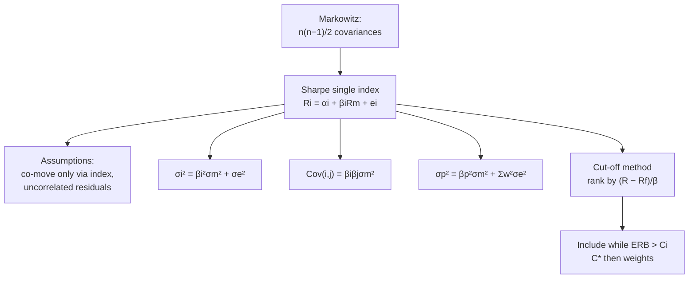

# PM-4: Sharpe's Single Index Model

Covers: why the single index model exists, the model equation, its assumptions, splitting total risk into systematic and unsystematic parts, portfolio return and risk under the model, and its relevance in portfolio construction (the cut-off method for choosing stocks and weights). The syllabus names "assumptions and relevance"; the cut-off method is the **(textbook)** way that relevance is examined in problems.

## Where this fits in the ESE

A 5-mark theory question ("State the assumptions of Sharpe's single index model") or a 10-mark sum (risk split, or the cut-off ranking). It also answers the classic Section B pairing: "Markowitz needs too many inputs; how does Sharpe solve this?"

## Why it exists

Markowitz (PM-2) needs n expected returns, n variances and **n(n−1)/2 covariances**. For 100 stocks, that is 5,150 inputs. Sharpe (1963) assumed that stocks co-move **only because they all respond to one common factor, the market index**. Then each stock needs just α, β and its residual variance, plus the market's return and variance: **3n + 2 inputs**, or 302 for 100 stocks.

## The model

**Rᵢ = αᵢ + βᵢ R_m + eᵢ**

- αᵢ: the stock's return independent of the market.
- βᵢ: sensitivity to the market index.
- eᵢ: random, company-specific error with mean zero and variance σ²_eᵢ.

**Expected return:** E(Rᵢ) = αᵢ + βᵢ E(R_m).

**Total risk split:**
**σᵢ² = βᵢ² σ_m² + σ²_eᵢ**
  = systematic risk + unsystematic (residual) risk.

**Covariance between two stocks:** Cov(i, j) = βᵢ βⱼ σ_m². This is how one index replaces all the pairwise covariances.

## Assumptions

1. Securities are related **only through their common response to the market index**.
2. The error terms of different stocks are uncorrelated: Cov(eᵢ, eⱼ) = 0.
3. The error term is uncorrelated with the market: Cov(eᵢ, R_m) = 0.
4. The mean of each error term is zero.
5. Investors are risk-averse and judge portfolios on return and variance (inherited from Markowitz).
6. A broad index (Nifty 50, Sensex) is a good proxy for the market.

## Portfolio under the model

- **αp = Σ wᵢ αᵢ**, **βp = Σ wᵢ βᵢ**
- **E(Rp) = αp + βp E(R_m)**
- **σp² = βp² σ_m² + Σ wᵢ² σ²_eᵢ**

As the number of stocks grows, Σ wᵢ² σ²_eᵢ shrinks towards zero (each wᵢ² is tiny), leaving only βp² σ_m². This is diversification in index-model form.

## Worked example 1: risk split and a two-stock portfolio

**Question (illustrative):** E(R_m) = 12%, σ_m = 15%. Stock A: α 2%, β 1.2, σ²_e 0.01. Stock B: α 1%, β 0.8, σ²_e 0.006. Find each stock's expected return and total risk, the share of A's risk that is systematic, and the return and risk of a 50:50 portfolio.

1. σ_m² = 0.15² = 0.0225.
2. A: E(R) = 2 + 1.2 × 12 = **16.4%**. Systematic = 1.2² × 0.0225 = 0.0324; total σ² = 0.0324 + 0.01 = 0.0424; σ = **20.59%**. Systematic share = 0.0324 ÷ 0.0424 = **76.4%**.
3. B: E(R) = 1 + 0.8 × 12 = **10.6%**. Total σ² = 0.64 × 0.0225 + 0.006 = 0.0144 + 0.006 = 0.0204; σ = **14.28%**.
4. Portfolio: βp = 0.5(1.2) + 0.5(0.8) = 1.0; αp = 1.5%. E(Rp) = 1.5 + 1.0 × 12 = **13.5%**.
   σp² = 1.0² × 0.0225 + 0.25 × 0.01 + 0.25 × 0.006 = 0.0225 + 0.0025 + 0.0015 = 0.0265; σp = **16.28%**.

**Interpretation:** most of A's risk (76%) is market risk that diversification can't touch; the residual 24% is what combining stocks reduces.

## Worked example 2: the cut-off method (choosing stocks and weights)

**Rule:** rank stocks by **excess return to beta**, ERB = (Rᵢ − R_f) ÷ βᵢ. Add them one by one and compute the running cut-off:

**Cᵢ = σ_m² Σ[(Rⱼ − R_f) βⱼ ÷ σ²_eⱼ] ÷ (1 + σ_m² Σ[βⱼ² ÷ σ²_eⱼ])**, sums over stocks ranked 1 to i.

Include a stock while its ERB > Cᵢ. The last Cᵢ that passes is **C\***. Weights: **Zᵢ = (βᵢ ÷ σ²_eᵢ)(ERBᵢ − C\*)**, then **wᵢ = Zᵢ ÷ ΣZ**.

**Question (illustrative):** R_f = 6%, σ_m² = 10 (in %²).

| Stock | Rᵢ % | β | σ²_e | ERB | (R−R_f)β/σ²_e | β²/σ²_e | Running Σ₁ | Running Σ₂ | Cᵢ |
|---|---|---|---|---|---|---|---|---|---|
| S1 | 19 | 1.0 | 20 | 13.00 | 0.6500 | 0.0500 | 0.6500 | 0.0500 | 4.33 |
| S2 | 23 | 1.5 | 40 | 11.33 | 0.6375 | 0.0563 | 1.2875 | 0.1063 | 6.24 |
| S3 | 11 | 0.5 | 10 | 10.00 | 0.2500 | 0.0250 | 1.5375 | 0.1313 | 6.65 |
| S4 | 25 | 2.0 | 40 | 9.50 | 0.9500 | 0.1000 | 2.4875 | 0.2313 | 7.51 |
| S5 | 13 | 1.0 | 20 | 7.00 | 0.3500 | 0.0500 | 2.8375 | 0.2813 | 7.44 |

1. S1 to S4 each have ERB above their Cᵢ. S5's ERB (7.00) is below 7.44, so **S5 is excluded**. **C\* = 7.51** (at S4).
2. Z: S1 = (1/20)(13 − 7.51) = 0.2745; S2 = (1.5/40)(11.33 − 7.51) = 0.1434; S3 = (0.5/10)(10 − 7.51) = 0.1245; S4 = (2/40)(9.5 − 7.51) = 0.0995. ΣZ = 0.6420.
3. **Weights: S1 42.8%, S2 22.3%, S3 19.4%, S4 15.5%.**

**Interpretation:** the method keeps a stock only if its reward per unit of market risk beats the portfolio-wide hurdle C\*, and gives more weight to stocks with high ERB and low residual risk.

## Relevance (write as the 5-mark answer)

1. Cuts inputs from n(n−1)/2 covariances to 3n + 2.
2. Splits risk into systematic and unsystematic, which shows how much diversification can still help.
3. Gives beta, the input to CAPM (PM-3) and Treynor/Jensen (PM-5).
4. The cut-off method gives a simple, rankable rule for selecting stocks and weights.
5. Practical with index data available from NSE and BSE.

**Limitations:** one factor can't capture industry effects (two banks co-move more than the index explains); residuals are often correlated in reality; beta is unstable; results depend on the index chosen.

## What to remember

- Rᵢ = αᵢ + βᵢR_m + eᵢ. σᵢ² = βᵢ²σ_m² + σ²_e. Cov(i,j) = βᵢβⱼσ_m².
- Inputs: 3n + 2 instead of n(n−1)/2 covariances.
- Portfolio: σp² = βp²σ_m² + Σwᵢ²σ²_eᵢ.
- Example 1: A 16.4% / 20.59% (76.4% systematic), B 10.6% / 14.28%, 50:50 13.5% / 16.28%.
- Cut-off: rank by ERB, include while ERB > Cᵢ; C\* = 7.51; weights 42.8 / 22.3 / 19.4 / 15.5%.

## Concept map

## Flashcards
Q: Write Sharpe's single index model equation.
A: Rᵢ = αᵢ + βᵢR_m + eᵢ.

Q: How does the model split total risk?
A: σᵢ² = βᵢ²σ_m² (systematic) + σ²_eᵢ (unsystematic).

Q: How many inputs does the single index model need for n stocks?
A: 3n + 2 (α, β, σ²_e per stock, plus market return and variance).

Q: Covariance between two stocks under the model?
A: βᵢβⱼσ_m².

Q: State the key assumption of the model.
A: Stocks co-move only through their common response to the market index; residuals are uncorrelated.

Q: How are stocks ranked in the cut-off method?
A: By excess return to beta, (Rᵢ − R_f) ÷ βᵢ, highest first.

Q: When is a stock included in the optimal portfolio?
A: While its ERB exceeds the running cut-off Cᵢ.

Q: Formula for portfolio variance under the model?
A: σp² = βp²σ_m² + Σwᵢ²σ²_eᵢ.

## Sources
- BBA301F-5 course plan, Unit 5 (Sharpe's single index model: assumptions and relevance)
- Sharpe (1963), "A Simplified Model for Portfolio Analysis"; Elton, Gruber & Padberg (1976) cut-off method
- Previous: [[SAPM Unit 5 - PM-3 CAPM and Beta]] · Next: [[SAPM Unit 5 - PM-5 Sharpe Treynor and Jensen]]
- [[SAPM Unit 5 - Portfolio Management MOC (Node Map)]]
