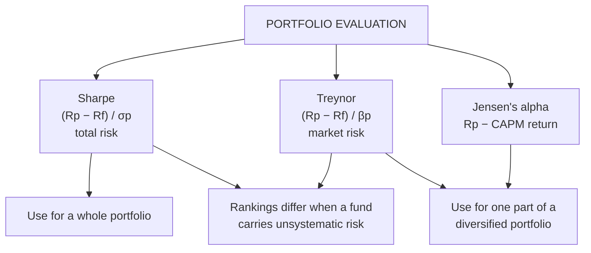

# PM-5: Sharpe, Treynor and Jensen

Covers: why portfolio evaluation needs risk-adjusted measures, the Sharpe ratio, the Treynor ratio, Jensen's alpha, how to rank funds, why the rankings can disagree, and which measure to use when. **(syllabus)**

## Where this fits in the ESE

This is the most likely 15-mark case in SAPM: three or four mutual funds with return, SD and beta, "rank them on Sharpe, Treynor and Jensen and advise". It also makes a 5-mark sum (one ratio) or a 10-mark "compare the three measures". CO5 is evaluation, and the ESE carries marks for it.

## Why raw return is not enough

A fund that earned 17% with SD 25% may be worse than one that earned 13% with SD 12%. Evaluation must ask **return per unit of risk taken**, and against what benchmark. Each measure picks a different risk.

## The three measures

| Measure | Formula | Risk used | Read as |
|---|---|---|---|
| **Sharpe ratio** | (R_p − R_f) ÷ σ_p | Total risk (SD) | Excess return per unit of total risk |
| **Treynor ratio** | (R_p − R_f) ÷ β_p | Systematic risk (beta) | Excess return per unit of market risk |
| **Jensen's alpha** | α = R_p − [R_f + β_p(R_m − R_f)] | Systematic risk via CAPM | Return above what CAPM says the beta deserved |

- Higher Sharpe and Treynor are better. Compare each fund with the **market's** ratio: beating it means the fund outperformed.
- Market Sharpe = (R_m − R_f) ÷ σ_m. Market Treynor = R_m − R_f (since β_m = 1).
- Positive alpha = superior performance (manager skill or luck); negative = underperformed CAPM.

## Which measure when

- **Sharpe** when the fund is the investor's **whole** portfolio (or a large part): total risk matters because nothing else diversifies it.
- **Treynor and Jensen** when the fund is **one of many** holdings in a well-diversified portfolio: only its beta adds to the investor's risk.
- If a fund is poorly diversified, Sharpe ranks it lower than Treynor does (its σ includes unsystematic risk that beta ignores). **That is why the rankings can disagree.**

## Worked example: the classic case, laid out as the exam answer

**Question (illustrative):** R_f = 6%. Market: return 12%, σ 14%, β 1. Evaluate three funds.

| Fund | Return | σ | β |
|---|---|---|---|
| X | 15% | 18% | 1.1 |
| Y | 13% | 12% | 0.9 |
| Z | 17% | 25% | 1.4 |

**1. Sharpe ratio**
- X = (15 − 6) ÷ 18 = **0.500**
- Y = (13 − 6) ÷ 12 = **0.583**
- Z = (17 − 6) ÷ 25 = **0.440**
- Market = (12 − 6) ÷ 14 = **0.429**
Rank: Y, X, Z. All beat the market.

**2. Treynor ratio** (in %)
- X = 9 ÷ 1.1 = **8.18**
- Y = 7 ÷ 0.9 = **7.78**
- Z = 11 ÷ 1.4 = **7.86**
- Market = 6 ÷ 1 = **6.00**
Rank: X, Z, Y. All beat the market.

**3. Jensen's alpha**
- X: CAPM return = 6 + 1.1 × 6 = 12.6; α = 15 − 12.6 = **+2.4%**
- Y: 6 + 0.9 × 6 = 11.4; α = 13 − 11.4 = **+1.6%**
- Z: 6 + 1.4 × 6 = 14.4; α = 17 − 14.4 = **+2.6%**
Rank: Z, X, Y.

**4. Summary table**

| Fund | Sharpe | Rank | Treynor | Rank | Jensen | Rank |
|---|---|---|---|---|---|---|
| X | 0.500 | 2 | 8.18 | 1 | 2.4 | 2 |
| Y | 0.583 | 1 | 7.78 | 3 | 1.6 | 3 |
| Z | 0.440 | 3 | 7.86 | 2 | 2.6 | 1 |
| Market | 0.429 | | 6.00 | | 0 | |

**5. Interpretation and advice**
- All three funds beat the market on every measure.
- **Y is best on Sharpe** but last on Treynor and Jensen: its low SD makes it the best stand-alone holding; its beta-adjusted excess return is the smallest.
- **Z is last on Sharpe** but first on Jensen: it earns the largest absolute alpha, but its SD (25%) is far above what its beta implies, so it carries a lot of unsystematic risk.
- **X is consistently near the top** (2, 1, 2).
- **Advice:** an investor putting all their money in one fund should pick **Y** (Sharpe). An investor adding one fund to an already diversified portfolio should pick **X** (best Treynor, good alpha). Z suits only an investor who can diversify away its residual risk and wants the highest alpha.

*Closing line:* the ranking depends on which risk is relevant to the investor; state it before you advise.

<svg width="100%" style="max-width:680px;display:block;margin:12px auto" viewBox="0 0 680 372" role="img" xmlns="http://www.w3.org/2000/svg">
<title>Sharpe ratio as the slope from the risk-free rate</title>
<desc>Chart of return against standard deviation. Straight lines run from the risk-free rate of 6% at zero risk to each fund. The slope of each line is its Sharpe ratio: Y 0.583 is steepest, then X 0.500, then Z 0.440, with the market at 0.429. Steeper means more excess return per unit of total risk.</desc>
<line x1="70" y1="300" x2="70" y2="36" stroke="#888780" stroke-width="1.5"/>
<line x1="70" y1="300" x2="640" y2="300" stroke="#888780" stroke-width="1.5"/>
<text font-size="14" font-weight="500" fill="currentColor" font-family="inherit" x="70" y="26" text-anchor="start">Return (%)</text>
<text font-size="14" font-weight="500" fill="currentColor" font-family="inherit" x="355" y="350" text-anchor="middle">Risk: standard deviation (%)</text>
<line x1="66" y1="300" x2="70" y2="300" stroke="#888780" stroke-width="1.5"/>
<text font-size="12" fill="currentColor" opacity="0.7" font-family="inherit" x="60" y="304" text-anchor="end">0</text>
<line x1="66" y1="240" x2="70" y2="240" stroke="#888780" stroke-width="1.5"/>
<text font-size="12" fill="currentColor" opacity="0.7" font-family="inherit" x="60" y="244" text-anchor="end">5</text>
<line x1="66" y1="180" x2="70" y2="180" stroke="#888780" stroke-width="1.5"/>
<text font-size="12" fill="currentColor" opacity="0.7" font-family="inherit" x="60" y="184" text-anchor="end">10</text>
<line x1="66" y1="120" x2="70" y2="120" stroke="#888780" stroke-width="1.5"/>
<text font-size="12" fill="currentColor" opacity="0.7" font-family="inherit" x="60" y="124" text-anchor="end">15</text>
<line x1="66" y1="60" x2="70" y2="60" stroke="#888780" stroke-width="1.5"/>
<text font-size="12" fill="currentColor" opacity="0.7" font-family="inherit" x="60" y="64" text-anchor="end">20</text>
<line x1="70" y1="300" x2="70" y2="304" stroke="#888780" stroke-width="1.5"/>
<text font-size="12" fill="currentColor" opacity="0.7" font-family="inherit" x="70" y="320" text-anchor="middle">0</text>
<line x1="170" y1="300" x2="170" y2="304" stroke="#888780" stroke-width="1.5"/>
<text font-size="12" fill="currentColor" opacity="0.7" font-family="inherit" x="170" y="320" text-anchor="middle">5</text>
<line x1="270" y1="300" x2="270" y2="304" stroke="#888780" stroke-width="1.5"/>
<text font-size="12" fill="currentColor" opacity="0.7" font-family="inherit" x="270" y="320" text-anchor="middle">10</text>
<line x1="370" y1="300" x2="370" y2="304" stroke="#888780" stroke-width="1.5"/>
<text font-size="12" fill="currentColor" opacity="0.7" font-family="inherit" x="370" y="320" text-anchor="middle">15</text>
<line x1="470" y1="300" x2="470" y2="304" stroke="#888780" stroke-width="1.5"/>
<text font-size="12" fill="currentColor" opacity="0.7" font-family="inherit" x="470" y="320" text-anchor="middle">20</text>
<line x1="570" y1="300" x2="570" y2="304" stroke="#888780" stroke-width="1.5"/>
<text font-size="12" fill="currentColor" opacity="0.7" font-family="inherit" x="570" y="320" text-anchor="middle">25</text>
<line x1="70" y1="228" x2="430" y2="120" stroke="#5F5E5A" stroke-width="2"/>
<line x1="70" y1="228" x2="570" y2="96" stroke="#A32D2D" stroke-width="2"/>
<line x1="70" y1="228" x2="310" y2="144" stroke="#3B6D11" stroke-width="2"/>
<line x1="70" y1="228" x2="350" y2="156" stroke="#5F5E5A" stroke-width="2" stroke-dasharray="6 4"/>
<circle cx="70" cy="228" r="5" fill="#888780" stroke="#5F5E5A" stroke-width="2"/>
<text font-size="12" fill="currentColor" opacity="0.7" font-family="inherit" x="80" y="246" text-anchor="start">Rf 6%</text>
<circle cx="350" cy="156" r="5" fill="none" stroke="#5F5E5A" stroke-width="2"/>
<circle cx="430" cy="120" r="5" fill="#888780" stroke="#5F5E5A" stroke-width="2"/>
<circle cx="570" cy="96" r="5" fill="#E24B4A" stroke="#A32D2D" stroke-width="2"/>
<circle cx="310" cy="144" r="5" fill="#639922" stroke="#3B6D11" stroke-width="2"/>
<text font-size="14" font-weight="500" fill="currentColor" font-family="inherit" x="300" y="140" text-anchor="end">Y 0.583</text>
<text font-size="14" font-weight="500" fill="currentColor" font-family="inherit" x="420" y="110" text-anchor="end">X 0.500</text>
<text font-size="14" font-weight="500" fill="currentColor" font-family="inherit" x="580" y="101" text-anchor="start">Z 0.440</text>
<text font-size="14" font-weight="500" fill="currentColor" font-family="inherit" x="360" y="178" text-anchor="start">Market 0.429</text>
<text font-size="12" fill="currentColor" opacity="0.7" font-family="inherit" x="355" y="366" text-anchor="middle">Slope of each line = (Rp - Rf) / SD = Sharpe ratio. Steeper is better.</text>
</svg>

<svg width="100%" style="max-width:680px;display:block;margin:12px auto" viewBox="0 0 680 372" role="img" xmlns="http://www.w3.org/2000/svg">
<title>Jensen alpha as distance above the security market line</title>
<desc>Chart of return against beta with the security market line from 6% at beta 0 with slope 6. The market sits on it at beta 1 and 12%. Funds X at beta 1.1, Y at 0.9 and Z at 1.4 all sit above the line. Jensen alpha is the vertical distance from the line: X plus 2.4, Y plus 1.6, Z plus 2.6 percentage points.</desc>
<line x1="70" y1="300" x2="70" y2="36" stroke="#888780" stroke-width="1.5"/>
<line x1="70" y1="300" x2="640" y2="300" stroke="#888780" stroke-width="1.5"/>
<text font-size="14" font-weight="500" fill="currentColor" font-family="inherit" x="70" y="26" text-anchor="start">Return (%)</text>
<text font-size="14" font-weight="500" fill="currentColor" font-family="inherit" x="355" y="350" text-anchor="middle">Beta</text>
<line x1="66" y1="300" x2="70" y2="300" stroke="#888780" stroke-width="1.5"/>
<text font-size="12" fill="currentColor" opacity="0.7" font-family="inherit" x="60" y="304" text-anchor="end">0</text>
<line x1="66" y1="240" x2="70" y2="240" stroke="#888780" stroke-width="1.5"/>
<text font-size="12" fill="currentColor" opacity="0.7" font-family="inherit" x="60" y="244" text-anchor="end">5</text>
<line x1="66" y1="180" x2="70" y2="180" stroke="#888780" stroke-width="1.5"/>
<text font-size="12" fill="currentColor" opacity="0.7" font-family="inherit" x="60" y="184" text-anchor="end">10</text>
<line x1="66" y1="120" x2="70" y2="120" stroke="#888780" stroke-width="1.5"/>
<text font-size="12" fill="currentColor" opacity="0.7" font-family="inherit" x="60" y="124" text-anchor="end">15</text>
<line x1="66" y1="60" x2="70" y2="60" stroke="#888780" stroke-width="1.5"/>
<text font-size="12" fill="currentColor" opacity="0.7" font-family="inherit" x="60" y="64" text-anchor="end">20</text>
<line x1="70" y1="300" x2="70" y2="304" stroke="#888780" stroke-width="1.5"/>
<text font-size="12" fill="currentColor" opacity="0.7" font-family="inherit" x="70" y="320" text-anchor="middle">0</text>
<line x1="245" y1="300" x2="245" y2="304" stroke="#888780" stroke-width="1.5"/>
<text font-size="12" fill="currentColor" opacity="0.7" font-family="inherit" x="245" y="320" text-anchor="middle">0.5</text>
<line x1="420" y1="300" x2="420" y2="304" stroke="#888780" stroke-width="1.5"/>
<text font-size="12" fill="currentColor" opacity="0.7" font-family="inherit" x="420" y="320" text-anchor="middle">1</text>
<line x1="595" y1="300" x2="595" y2="304" stroke="#888780" stroke-width="1.5"/>
<text font-size="12" fill="currentColor" opacity="0.7" font-family="inherit" x="595" y="320" text-anchor="middle">1.5</text>
<polyline points="70,228 630,112.8" fill="none" stroke="#5F5E5A" stroke-width="2" stroke-linejoin="round" stroke-linecap="round"/>
<text font-size="12" fill="currentColor" opacity="0.7" font-family="inherit" x="638" y="116.8" text-anchor="start">SML</text>
<circle cx="70" cy="228" r="5" fill="#888780" stroke="#5F5E5A" stroke-width="2"/>
<text font-size="12" fill="currentColor" opacity="0.7" font-family="inherit" x="80" y="246" text-anchor="start">Rf 6%</text>
<circle cx="420" cy="156" r="5" fill="none" stroke="#5F5E5A" stroke-width="2"/>
<text font-size="12" fill="currentColor" opacity="0.7" font-family="inherit" x="428" y="178" text-anchor="start">Market: beta 1, 12%</text>
<line x1="455" y1="120" x2="455" y2="148.8" stroke="#3B6D11" stroke-width="2"/>
<circle cx="455" cy="148.8" r="4" fill="none" stroke="#5F5E5A" stroke-width="2"/>
<circle cx="455" cy="120" r="6" fill="#639922" stroke="#3B6D11" stroke-width="2"/>
<line x1="385" y1="144" x2="385" y2="163.2" stroke="#3B6D11" stroke-width="2"/>
<circle cx="385" cy="163.2" r="4" fill="none" stroke="#5F5E5A" stroke-width="2"/>
<circle cx="385" cy="144" r="6" fill="#639922" stroke="#3B6D11" stroke-width="2"/>
<line x1="560" y1="96" x2="560" y2="127.2" stroke="#3B6D11" stroke-width="2"/>
<circle cx="560" cy="127.2" r="4" fill="none" stroke="#5F5E5A" stroke-width="2"/>
<circle cx="560" cy="96" r="6" fill="#639922" stroke="#3B6D11" stroke-width="2"/>
<text font-size="14" font-weight="500" fill="currentColor" font-family="inherit" x="375" y="148" text-anchor="end">Y: alpha +1.6</text>
<text font-size="14" font-weight="500" fill="currentColor" font-family="inherit" x="465" y="118" text-anchor="start">X: alpha +2.4</text>
<text font-size="14" font-weight="500" fill="currentColor" font-family="inherit" x="570" y="100" text-anchor="start">Z: alpha +2.6</text>
<text font-size="12" fill="currentColor" opacity="0.7" font-family="inherit" x="355" y="366" text-anchor="middle">Alpha = fund return minus the SML return at its beta. Hollow dot = CAPM return.</text>
</svg>

## Other measures (one line each, for a 10-mark answer)

- **M² (Modigliani-Modigliani)**: Sharpe ratio rescaled to the market's SD, in % return: M² = R_f + Sharpe_p × σ_m − R_m. Same ranking as Sharpe, easier to explain.
- **Information ratio**: (R_p − R_benchmark) ÷ tracking error. Measures active managers against their benchmark.
- **Fama's decomposition**: splits return into reward for risk and reward for selectivity.

## Traps

- **Dividing by β for Sharpe or by σ for Treynor.** Sharpe uses σ; Treynor uses β.
- **Forgetting to subtract R_f** in the numerator.
- **Using R_m instead of (R_m − R_f)** in Jensen's CAPM line.
- **Ranking without the market benchmark.** Always compute the market's Sharpe and Treynor; "beat the market" is a scored line.
- **Not explaining rank differences.** Disagreement is the examiner's point; explain it with diversification.

## What to remember

- Sharpe = (R_p − R_f)/σ_p; Treynor = (R_p − R_f)/β_p; α = R_p − [R_f + β(R_m − R_f)].
- Sharpe for the whole portfolio, Treynor/Jensen for one part of a diversified portfolio.
- Rankings differ when a fund is poorly diversified.
- Example: Sharpe Y > X > Z; Treynor X > Z > Y; Jensen Z > X > Y; market Sharpe 0.429, Treynor 6.

## Concept map

## Flashcards
Q: Formula for the Sharpe ratio?
A: (R_p − R_f) ÷ σ_p.

Q: Formula for the Treynor ratio?
A: (R_p − R_f) ÷ β_p.

Q: Formula for Jensen's alpha?
A: α = R_p − [R_f + β_p(R_m − R_f)].

Q: When should you prefer Sharpe over Treynor?
A: When the fund is the investor's whole portfolio, so total risk matters.

Q: Why can Sharpe and Treynor rank funds differently?
A: A poorly diversified fund has high σ relative to its β; Sharpe penalises that unsystematic risk, Treynor ignores it.

Q: Fund return 15%, β 1.1, R_f 6%, R_m 12%. Jensen's alpha?
A: 15 − (6 + 1.1 × 6) = +2.4%.

Q: What is the market's Treynor ratio?
A: R_m − R_f, because the market's beta is 1.

Q: What does a negative alpha mean?
A: The fund earned less than CAPM required for its beta: it underperformed.

## Sources
- BBA301F-5 course plan, Unit 5 (equity portfolio evaluation: Sharpe, Treynor, Jensen)
- Sharpe (1966), Treynor (1965), Jensen (1968); Reilly & Brown ch. on performance evaluation
- Previous: [[SAPM Unit 5 - PM-4 Sharpe Single Index Model]] · Next: [[SAPM Unit 5 - PM-6 Active and Passive Strategies]]
- [[SAPM Unit 5 - Portfolio Management MOC (Node Map)]]
