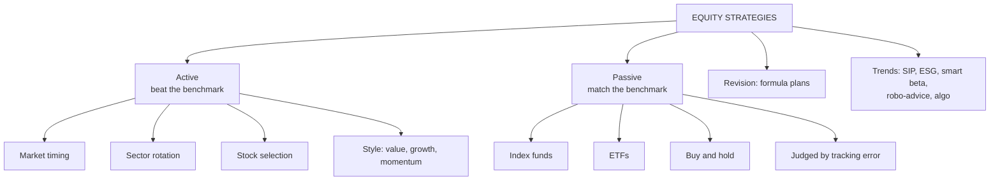

# PM-6: Active and Passive Strategies, and Emerging Trends

Covers: active equity investment strategies, passive equity investment strategies, active vs passive compared, portfolio revision (formula plans), and emerging trends in equity portfolio management. **(syllabus)** Formula plans are **(textbook)** background for "portfolio revision".

## Where this fits in the ESE

Theory only: a 5-mark "distinguish active and passive strategies" or a 10-mark "explain active and passive strategies with emerging trends". Also the recommendation paragraph of the 15-mark case ("a passive investor should…").

## Active strategies

The manager tries to **beat** a benchmark (positive alpha) by deviating from it. Based on the belief that markets are not fully efficient.

1. **Market timing**: shift between equity and cash/debt ahead of market moves (raise beta before rallies, cut it before falls).
2. **Sector rotation**: overweight sectors expected to lead in the coming phase of the business cycle (e.g. capital goods early in a recovery, FMCG in slowdowns).
3. **Stock selection (security picking)**: buy undervalued stocks found by fundamental analysis (Unit 2), valuation (Unit 4) or SML screening (PM-3).
4. **Style investing**: value (low P/E, P/B), growth (high earnings growth), momentum, quality, small-cap.
5. **Technical trading**: use charts and indicators (Unit 3) to time entries and exits.
6. **Contrarian investing**: buy what the crowd is selling, on the view that markets overreact.

Costs: research, higher turnover, higher expense ratios, taxes on frequent gains, and the risk of underperforming the benchmark.

## Passive strategies

The manager tries to **match** a benchmark, not beat it. Based on the efficient market view that beating the market consistently after costs is unlikely.

1. **Index funds**: hold the index stocks in index weights (Nifty 50, Sensex index funds).
2. **Exchange-traded funds (ETFs)**: index baskets that trade on the exchange like a share (Nifty BeES, Bharat 22 ETF, CPSE ETF).
3. **Buy and hold**: buy a diversified portfolio and hold it, revising rarely.
4. **Smart-beta / factor indices** (sit between active and passive): rule-based indices weighted by factors such as low volatility, quality or equal weight.

Measured by **tracking error**: the SD of the difference between fund and index returns. Lower is better.

## Active vs passive (the comparison table)

| Basis | Active | Passive |
|---|---|---|
| Objective | Beat the benchmark (alpha) | Match the benchmark |
| Belief | Markets are inefficient | Markets are efficient |
| Research | Heavy | Minimal |
| Turnover | High | Low |
| Cost (expense ratio) | Higher (often 1–2%) | Low (often 0.05–0.5%) |
| Risk of underperforming | High | Low (only tracking error) |
| Measured by | Alpha, Sharpe, Treynor, information ratio | Tracking error |
| Suits | Investors who trust a manager's skill | Long-term, cost-conscious investors |

## Portfolio revision and formula plans

Revision = changing the portfolio as conditions or goals change. Formula plans are mechanical rules that stop emotions driving revision:
- **Constant rupee value plan**: keep a fixed rupee amount in equity; sell the excess when it rises, top up when it falls.
- **Constant ratio plan**: keep a fixed ratio (e.g. 60:40) of equity to debt; rebalance when it drifts.
- **Variable ratio plan**: raise the equity share when the market is low and cut it when high, by pre-set zones.
- **Rupee cost averaging (SIP)**: invest a fixed amount at fixed intervals, so more units are bought when prices are low.

## Emerging trends in equity portfolio management

1. **Passive boom in India**: index funds and ETFs growing fast; EPFO invests in ETFs.
2. **SIPs and retail participation**: monthly SIP flows at record levels; millions of new demat accounts since 2020.
3. **ESG and sustainable investing**: ESG funds, SEBI's BRSR reporting for the top 1,000 listed companies.
4. **Smart beta and factor investing**: low-volatility, momentum, quality, equal-weight indices.
5. **Robo-advisors and fintech platforms**: algorithm-based allocation, zero-commission brokers.
6. **Algorithmic and quantitative investing**: rule-based and AI-driven strategies.
7. **Direct plans and fee pressure**: SEBI-mandated direct plans with lower expense ratios.
8. **Global diversification**: international funds and the GIFT City route.
9. **Behavioural finance awareness**: recognising biases (overconfidence, herding, loss aversion) in decisions.

## What to remember

- Active = beat the benchmark (timing, sector rotation, stock picking, style, technical, contrarian).
- Passive = match the benchmark (index funds, ETFs, buy and hold), judged by tracking error.
- The difference is a belief about market efficiency, then cost, turnover and risk.
- Formula plans: constant rupee value, constant ratio, variable ratio, rupee cost averaging.
- Trends: passive growth, SIPs, ESG, smart beta, robo-advisors, algorithmic investing.

## Concept map

## Flashcards
Q: What is the objective of an active strategy?
A: To beat the benchmark and earn positive alpha.

Q: Name four active strategies.
A: Market timing, sector rotation, stock selection, style investing (also technical trading, contrarian).

Q: Name three passive strategies.
A: Index funds, ETFs, buy and hold.

Q: What measures how well a passive fund does its job?
A: Tracking error: the SD of the difference between fund and index returns.

Q: What belief separates active from passive investing?
A: Whether markets are efficient enough that beating them after costs is unlikely.

Q: What is a constant ratio plan?
A: Keep a fixed equity-to-debt ratio and rebalance when it drifts.

Q: Name four emerging trends in equity portfolio management.
A: Growth of passive funds, SIPs and retail participation, ESG investing, smart beta, robo-advisors, algorithmic investing.

## Sources
- BBA301F-5 course plan, Unit 5 (active and passive strategies, emerging trends)
- Reilly & Brown, *Investment Analysis & Portfolio Management*; Madhumati, *Investment Analysis and Portfolio Management*
- Previous: [[SAPM Unit 5 - PM-5 Sharpe Treynor and Jensen]] · Next: [[SAPM Unit 5 - PM-7 Unit 5 Exam Answers]]
- [[SAPM Unit 5 - Portfolio Management MOC (Node Map)]]
