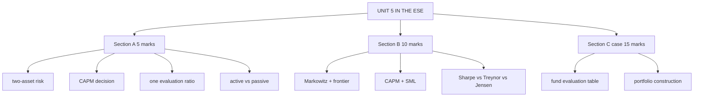

# PM-7: Unit 5 Exam Answers

Covers: what the ESE will ask from Unit 5, 5-mark and 10-mark answer skeletons, and the 15-mark case layout with a model answer. Numbers come from PM-1 to PM-6.

## What the test will ask

The SAPM course plan gives the ESE as 50 marks (scaled to 30) but not its pattern. The Bond Market plan for the same semester gives Section A 3 × 5 (internal choice), Section B 2 × 10 (internal choice), Section C one compulsory 15-mark case; assume the same. Confirm with Dr Nijumon.

Unit 5 is the most numerical SAPM unit. The case is most likely **fund evaluation** (Sharpe, Treynor, Jensen) or **portfolio construction** (two-asset risk plus CAPM). Learn the PM-5 layout cold.

## Five-mark answer skeletons

**1. Two-asset portfolio risk (PM-1).** Formula σp² = w_A²σ_A² + w_B²σ_B² + 2w_Aw_Bρσ_Aσ_B. Substitute, solve (60:40, 20% and 12%, ρ 0.3 gives 14.20%). One line: below the weighted average 16.8% because ρ < 1.

**2. Systematic vs unsystematic risk (PM-2).** Define each with two examples. Table: source, diversifiable?, measured by (β vs residual σ), rewarded? Close: only systematic risk earns a premium.

**3. CAPM required return and decision (PM-3).** Formula, substitute (6 + 1.2 × 7 = 14.4%), compare with expected return (18%), SML position, buy/sell decision.

**4. Assumptions of Sharpe's single index model (PM-4).** Model equation, then four assumptions (co-move only via index; uncorrelated residuals; residual uncorrelated with market; mean residual zero). One line on 3n + 2 inputs.

**5. One evaluation ratio (PM-5).** Formula, substitute, compare with market's ratio, one line of interpretation.

**6. Active vs passive (PM-6).** Definition of each, then a 5-row comparison (objective, belief, cost, turnover, measure).

## Ten-mark answer skeletons

**A. Markowitz portfolio theory (PM-2).** Contribution (portfolio-level risk using covariance) → six assumptions → diversification and correlation (the ρ table) → efficient frontier diagram (labelled: efficient, inefficient, minimum-variance point) → optimal portfolio via indifference curve → three limitations, leading to Sharpe's model.

**B. CAPM (PM-3).** Logic (only systematic risk is priced) → formula with each term defined → beta and its interpretation table → SML diagram and the buy/sell rule → assumptions (four) → limitations (four) → one worked line.

**C. Compare Sharpe, Treynor and Jensen (PM-5).** Formula and risk measure for each in a table → which to use when → why rankings differ → worked mini-example.

**D. Sharpe's single index model (PM-4).** Why it exists (input count) → equation → risk split → assumptions → relevance (five points) → limitations.

## Fifteen-mark case layout (fund evaluation)

1. **Data restated and assumptions (1):** R_f, market return, σ_m; β_m = 1; returns are annual.
2. **Sharpe for each fund and the market (3).**
3. **Treynor for each fund and the market (3).**
4. **Jensen's alpha via CAPM (3).**
5. **Summary ranking table (2).**
6. **Interpretation and advice (3):** who beats the market; why rankings differ (diversification); which fund for a whole-portfolio investor (Sharpe) and which for a diversified investor (Treynor/Jensen).

Close with: *the choice depends on whether the fund is the investor's whole portfolio or one part of a diversified one.*

### Model answer, laid out as the exam answer

**Data (illustrative):** R_f 6%; market 12%, σ 14%. Funds: X 15% / 18% / β 1.1; Y 13% / 12% / 0.9; Z 17% / 25% / 1.4.

| Fund | Sharpe | Treynor | CAPM return | Jensen α |
|---|---|---|---|---|
| X | 9/18 = 0.500 | 9/1.1 = 8.18 | 12.6 | +2.4 |
| Y | 7/12 = 0.583 | 7/0.9 = 7.78 | 11.4 | +1.6 |
| Z | 11/25 = 0.440 | 11/1.4 = 7.86 | 14.4 | +2.6 |
| Market | 6/14 = 0.429 | 6.00 | 12.0 | 0 |

Ranks: Sharpe Y > X > Z; Treynor X > Z > Y; Jensen Z > X > Y.

**Advice:** all three beat the market. For an investor's whole portfolio choose Y (best return per unit of total risk). For an investor adding a fund to a diversified portfolio choose X (best Treynor, consistent across measures). Z's high SD relative to its beta shows unsystematic risk; it ranks first on Jensen only because it took the most market risk and earned a large alpha.

## Fifteen-mark case layout (portfolio construction)

1. Expected return and SD of each stock (scenario table) (4).
2. Covariance and correlation (2).
3. Portfolio return and SD at the given weights (3).
4. Minimum-variance weights, or CAPM required return for each stock and an SML verdict (3).
5. Recommendation with diversification reasoning (3).

## Time rule

If time is short in the evaluation case, compute Sharpe and Treynor for every fund and the market, rank them, and write the "rankings differ because…" sentence. That alone earns most of the marks.

## What to remember

- Learn the fund-evaluation table layout cold: Sharpe, Treynor, CAPM return, alpha, market row.
- Always compute the market's ratios.
- Model numbers: 60:40 two-asset 14.20%; CAPM 14.4% vs 18% (buy); β = 1.64; SIM 16.4% / 20.59%; cut-off C\* 7.51.
- Section B favourites: Markowitz with the frontier diagram; CAPM with the SML diagram.

## Concept map

## Flashcards
Q: What is the most likely Unit 5 case?
A: Fund evaluation with Sharpe, Treynor and Jensen, or two-asset portfolio construction with CAPM.

Q: List the steps of the fund-evaluation case.
A: Data and assumptions, Sharpe, Treynor, Jensen via CAPM, ranking table, interpretation and advice.

Q: What row must every evaluation table include?
A: The market's own Sharpe (R_m − R_f)/σ_m and Treynor (R_m − R_f).

Q: Skeleton for a 10-mark Markowitz answer?
A: Contribution, assumptions, correlation and diversification, efficient frontier diagram, optimal portfolio, limitations.

Q: Skeleton for a 10-mark CAPM answer?
A: Logic, formula, beta table, SML diagram and rule, assumptions, limitations, a worked line.

Q: What is the closing sentence of the evaluation case?
A: The choice depends on whether the fund is the investor's whole portfolio or one part of a diversified one.

## Sources
- BBA301F-5 course plan, Unit 5 and assessment outline
- [[SAPM Unit 5 - Portfolio Management MOC (Node Map)]]
