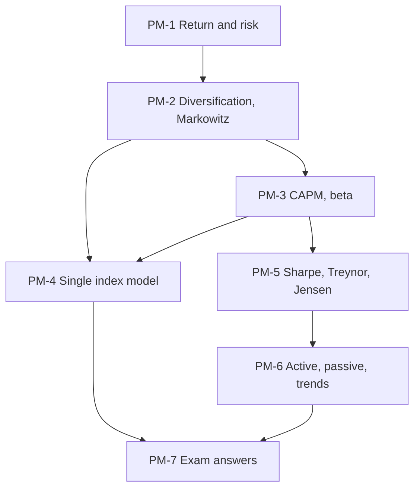

# SAPM Unit 5: Equity Portfolio Management and Evaluation, node map

The ESE is 50 marks: assume three 5-mark questions, two 10-mark questions and one compulsory 15-mark case (the SAPM plan doesn't give the pattern; the same semester's Bond Market plan does). Unit 5 is the most numerical unit in SAPM, and the case is most likely fund evaluation (Sharpe, Treynor, Jensen). All examples here are **illustrative textbook numbers**, not class material.

## Nodes

| Node | Topic | Deps | Minutes | Exam focus |
|---|---|---|---|---|
| PM-1 | Portfolio Return and Risk | none | 40 | yes |
| PM-2 | Diversification and Markowitz | PM-1 | 40 | yes |
| PM-3 | CAPM and Beta | PM-2 | 45 | yes |
| PM-4 | Sharpe Single Index Model | PM-2, PM-3 | 45 | yes |
| PM-5 | Sharpe, Treynor and Jensen | PM-3 | 45 | yes |
| PM-6 | Active and Passive Strategies | PM-5 | 30 | no |
| PM-7 | Unit 5 Exam Answers | PM-1 to PM-6 | 35 | yes |

Total reading time: about 280 minutes.

## Dependency graph

## Headline numbers to know

- Two-asset (15%/20%, 10%/12%, ρ 0.3, 60:40): return 13%, SD 14.20%; minimum variance 18% in A, 10.9% / 11.45%.
- Scenario example: A 14% / 10.44%, B 10.6% / 3.10%, ρ −0.85; 50:50 gives 12.3% / 3.99%.
- Correlation table (50:50): 16.00, 14.00, 11.66, 8.72, 4.00% for ρ = +1, 0.5, 0, −0.5, −1.
- CAPM: 6 + 1.2 × 7 = 14.4% vs expected 18%, undervalued; beta from returns 328 ÷ 200 = 1.64.
- Single index: A 16.4% / 20.59% (76.4% systematic); cut-off C\* 7.51, weights 42.8 / 22.3 / 19.4 / 15.5%.
- Funds X/Y/Z: Sharpe 0.500 / 0.583 / 0.440 (market 0.429); Treynor 8.18 / 7.78 / 7.86 (market 6); alpha 2.4 / 1.6 / 2.6.

## Links
- [[SAPM MOC]]
