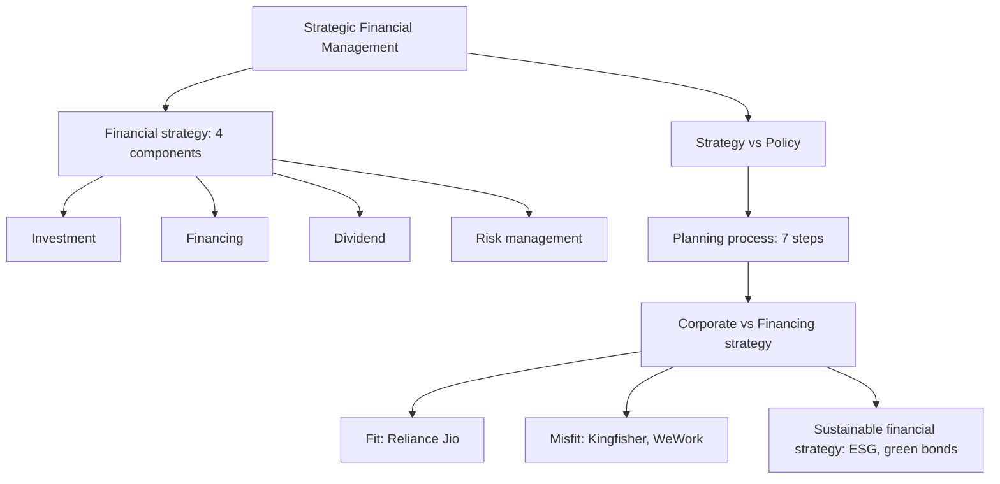

# CB-1: Strategy and Financial Strategy

Covers: strategy versus policy, why good products still fail, the five eras of strategic thinking, objectives, the four components of financial strategy, the 7-step planning process, corporate versus financing strategy, and sustainable financial strategy. Mostly **(class)**. The fit-check example is **(textbook)** and uses illustrative numbers.

## Where this fits in the exam

If Unit I is examined (scope to be confirmed with faculty: the formula sheet puts CIA3 at Units IV and V only), the 5-mark theory questions come mostly from this node (strategy vs policy, components, planning steps, corporate vs financing strategy). Skeletons are in CB-7. The risk techniques that sit under "investment decisions" start in CB-2.

## What SFM is (class)

SFM is the management of financial resources to support long-term goals and competitive advantage. It goes beyond recording and reporting into decisions on **investment, financing, growth, risk and sustainability**.

**Correction to your SFM Index.** Your note lists the objectives (profit maximisation, revenue growth, expansion, survival, cost reduction, liquidity, risk minimisation, sustainability, market value) under the heading "Financial Security" (probably meant "Financial Strategy") and does not name wealth maximisation. The class made **shareholder wealth maximisation** the *primary* objective and the rest secondary. Write it first, in every answer on objectives.

## Strategy versus policy (class)

Strategy comes from the Greek *strategos*, the art of the general: a comprehensive long-term plan to achieve goals and competitive advantage. Policy is a guideline that keeps decisions consistent while the strategy is implemented.

| | Strategy | Policy |
|---|---|---|
| Nature | Long-term direction | Guideline |
| Answers | "What" | "How" |
| Focus | Objectives | Implementation |
| Stability | Dynamic | Relatively stable |

Example for the exam: strategy = enter electric vehicles; policy = capex approval limits and hurdle rates. Close with "policy implements strategy".

## Why a good product is not enough (class)

- Kodak invented the digital camera in 1975, stayed with film, and went bankrupt in 2012.
- Nokia lost the smartphone shift.
- Housing.com spent aggressively on marketing without a sustainable revenue model, had leadership issues, and was acquired by PropTiger in 2017.
- Byju's: aggressive acquisitions, debt, funding dependence, governance failures.
- OYO is the correction story: consolidation, operational rationalisation, technology-led efficiency, a shift from growth-at-all-costs towards profitability **[VERIFY current status]**.

Use these qualitatively. Do not attach figures to them.

## Evolution of strategic thinking (class)

| Era | Years | Focus | Example |
|---|---|---|---|
| Production | 1900-1950 | Mass production, cost control | Ford Model T |
| Marketing | 1950-1970 | Customer satisfaction, sales growth | Coke vs Pepsi |
| Competitive | 1970-1990 | Competitive advantage, profitability | Nike vs Adidas |
| Strategic | 1990-2010 | Long-term planning, wealth maximisation | Amazon |
| Sustainable | 2010 to present | ESG, sustainable value creation | Tesla |

Firms that adapted: Netflix, Amazon, Apple, Reliance, Microsoft. Firms that failed to: Nokia, Kodak, BlackBerry, Kingfisher, Byju's.

## Importance, objectives and the four components (class)

Strategies give long-term direction, efficient allocation of resources, a response to competition, a way to manage uncertainty, better decisions, sustainable growth and shareholder value.

Financial strategy answers three questions: where will the money come from, where to invest it, and how to maximise value. Class examples: Apple's cash reserves, and Netflix borrowing to fund original content while accepting short-term losses.

**Four components of financial strategy**
1. Investment decisions (capital budgeting).
2. Financing decisions (capital structure, sources, cost of capital).
3. Dividend decisions.
4. Risk management decisions.

Components 1 and 4 are developed in CB-2 to CB-6. Component 3 is Unit 2 (DV nodes).

## Strategic planning process, 7 steps (class)

**Vision, Mission, Environmental analysis, Goal setting, Strategy formulation, Strategy implementation, Evaluation and control.** Memory hook: **V-M-E-G-F-I-E**. It is a loop: evaluation and control feeds back into environmental analysis and goals.

## Corporate strategy versus financing strategy (class)

Corporate strategy decides **what to do**: which business, which markets, how to compete. Financing strategy decides **how to fund it**: sources, cost of capital, debt-equity mix. The two must fit.

- Success: Reliance Jio, funded by debt, equity and strategic partnerships to match a very large rollout.
- Failure: Kingfisher Airlines, where excess debt created an interest burden, cash shortage and collapse. WeWork expanded rapidly on external funding without profits.

## Sustainable financial strategies (class)

Built on ESG and long-term value rather than short-term earnings. Examples: Tesla, Unilever, and green bonds that finance solar, wind, water and sustainable infrastructure.

## Worked example: testing strategy-financing fit (textbook, illustrative)

**Question (illustrative data):** A firm's expansion strategy needs ₹1,000 crore. After expansion, EBIT is expected to be ₹120 crore a year. Plan A funds ₹800 crore by 12% debt. Plan B funds ₹320 crore by 12% debt and the rest by equity. Which financing fits the strategy?

1. Test: interest cover = EBIT ÷ interest. A thin cover means the financing strategy can sink the corporate strategy.
2. Interest: Plan A = 12% × 800 = ₹96 crore. Plan B = 12% × 320 = ₹38.4 crore.
3. Cover: Plan A = 120 ÷ 96; Plan B = 120 ÷ 38.4.

| | Plan A (80% debt) | Plan B (32% debt) |
|---|---|---|
| Debt (₹ crore) | 800 | 320 |
| Interest (₹ crore) | 96.0 | 38.4 |
| EBIT (₹ crore) | 120 | 120 |
| Interest cover | 1.25 times | 3.13 times |
| EBIT left after interest (₹ crore) | 24.0 | 81.6 |

**Decision line and interpretation:** Plan B fits. Under Plan A a fall of just 20% in EBIT (to ₹96 crore) wipes out all cover, which is the Kingfisher pattern: strategy sound on paper, financing too fragile to survive a bad year. Plan B costs more equity and dilutes owners, but it keeps the strategy alive through a downturn. The fit rule: size the debt to what the *downside* EBIT can service, not the base case.

## What to remember

- Strategy = long-term "what"; policy = stable "how". Policy implements strategy.
- Four components: investment, financing, dividend, risk management. Primary aim: shareholder wealth maximisation.
- Seven steps: V-M-E-G-F-I-E, run as a loop.
- Corporate strategy = what to do; financing strategy = how to fund it. Jio fits, Kingfisher and WeWork do not.
- Five eras: production, marketing, competitive, strategic, sustainable.
- Use class company examples qualitatively. Never invent figures for them.

## Concept map

## Flashcards
Q: What is strategy, and what is policy?
A: Strategy is the comprehensive long-term plan to achieve goals and competitive advantage (the "what"). Policy is the guideline for consistent decisions during implementation (the "how").

Q: What are the four components of financial strategy?
A: Investment, financing, dividend and risk management decisions.

Q: List the seven steps of strategic planning.
A: Vision, Mission, Environmental analysis, Goal setting, Strategy formulation, Strategy implementation, Evaluation and control (V-M-E-G-F-I-E).

Q: What is the primary objective of financial strategy?
A: Shareholder wealth maximisation. Profit, growth, survival, liquidity, risk minimisation and sustainability are secondary.

Q: Corporate strategy versus financing strategy?
A: Corporate strategy decides what to do (businesses, markets, how to compete). Financing strategy decides how to fund it (sources, cost of capital, debt-equity mix). They must fit.

Q: Give one success and one failure of strategy-financing fit.
A: Success: Reliance Jio (debt, equity, partnerships). Failure: Kingfisher Airlines (excess debt, interest burden, cash shortage, collapse).

Q: Name the five eras of strategic thinking.
A: Production, Marketing, Competitive, Strategic, Sustainable.

Q: Why did Kodak fail though it invented the digital camera?
A: It stayed with film. A good product without the strategy to commercialise it does not protect a firm.

Q: Interest cover when EBIT is ₹120 crore and interest ₹96 crore (illustrative)?
A: 120 ÷ 96 = 1.25 times, too thin. At interest ₹38.4 crore the cover is 3.13 times.

Q: What do sustainable financial strategies rest on?
A: ESG and long-term value rather than short-term earnings, for example green bonds financing solar, wind and water projects.

## Sources
- Faculty class notes, Unit I Part A (strategy and financial strategy)
- Student note: SFM Index
- Vault note: `SFM CIA3 - Unit I Strategy and Risk in Capital Budgeting` (Part A)
- Next node: [[SFM Unit 1 - CB-2 Risk Sources and Risk Adjusted Discount Rate]]
- [[SFM Unit 1 - Capital Budgeting MOC (Node Map)]]
