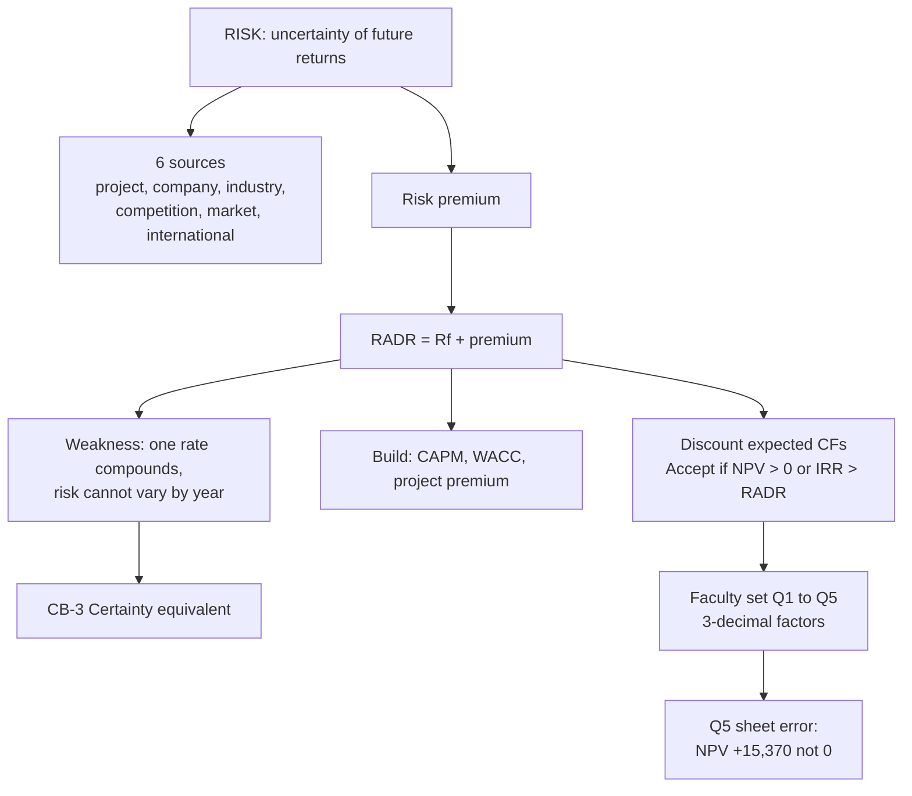

# CB-2: Risk Sources and Risk Adjusted Discount Rate

Covers: what risk is, the six sources of risk, the map of techniques for risky projects, the RADR rule, how to build a defensible RADR, the class EV-plant example, and the five faculty RADR problems with a rounding note and one sheet error.

## Risk and its sources (class)

Risk is uncertainty about future cash flows or returns: actual may differ from expected. Higher risk demands higher return (the risk-return trade-off). The extra return demanded is the **risk premium**.

**Your note is incomplete.** Your Risk - SFM note defines risk correctly (two factors: expected return and risk) but lists only two types (competition, industry) and stops. The class list has six:

| Source | Class example |
|---|---|
| Project-specific | Tata Power solar plant delay |
| Company-specific | Infosys losing AI executives |
| Industry-specific | Pharma drug approvals; auto shift to EVs |
| Competition | Netflix vs Prime, Disney+, JioHotstar |
| Market | RBI rate hike, inflation, GDP, tax, FX |
| International | Apple supply chain, trade restrictions |

Hook: **P-C-I-C-M-I** (project, company, industry, competition, market, international). Use the examples qualitatively.

**Background (textbook).** Strictly, *risk* means the outcomes and their probabilities are known; *uncertainty* means the probabilities are not known. The class uses "risk" for both. In the exam, give the class definition first and add this distinction in one line only if the question asks.

## Technique map (class)

| Technique | Purpose | How risk enters | Node |
|---|---|---|---|
| EMV / EPV | Probability-weighted value | Weights outcomes by probability | CB-4 |
| SD, Coefficient of Variation | Measure spread | Statistical dispersion | CB-4 |
| RADR | Value risky flows | Raise the discount rate | CB-2 |
| CEA | Value risky flows | Shrink the cash flows, discount at risk-free | CB-3 |
| Sensitivity | See which input matters | Change one variable at a time | CB-6 |
| Scenario | See combined outcomes | Change several variables together | CB-6 |
| Decision tree | Sequential decisions | Roll back EMVs | CB-5 |
| Monte Carlo | Full NPV distribution | Random sampling of inputs | CB-6 |

## RADR rule (class)

**RADR = Rf + risk premium.** Discount the *expected* cash flows at the RADR. Accept if NPV > 0, which is the same as IRR > RADR. In India Rf is the G-Sec or T-bill yield.

NPV = Σ CF_t ÷ (1 + k)^t − I, with k the RADR.

**Class example (EV plant).** Invest ₹8,00,000; receive ₹10,00,000 after 1 year; Rf 6% + premium 4% = 10%.
PV = 10,00,000 ÷ 1.10 = **₹9,09,091**. NPV = **₹1,09,091**. Accept.

**Arithmetic note.** The class line "10,00,000 × 0.909 = 9,09,091" does not multiply out: 10,00,000 × 0.909 = ₹9,09,000 (NPV ₹1,09,000). The exact figure is ₹9,09,091. Quote the factor you used. With a 3-decimal table write 9,09,000; with a calculator write 9,09,091.

## Building the RADR defensibly (textbook + CIA1 method)

Do not assert a rate. Show three steps, because the derivation is markable.

1. **Cost of equity (CAPM):** ke = Rf + β(Rm − Rf).
2. **WACC:** ke × E/V + kd(1 − t) × D/V.
3. **Project premium over WACC.** WACC suits a project of average firm risk. A particular project rarely is. Add a premium and tie each increment to a named risk.

| Risk source | Typical premium (illustrative) | When it applies |
|---|---|---|
| Greenfield vs brownfield | +1% to +3% | New site, no operations to lean on |
| New geography | +1% to +2% | Different regulation and currency |
| Unproven technology | +2% to +4% | First of its kind at this scale |
| Execution slippage | +1% to +3% | Cost or time already overrun |
| Long ramp-up | +1% to +2% | Revenue not at steady state for years |

The premium is a judgement; say so. Link every premium component to a risk named in the risk section (see the six sources above).

**Structural weakness to state.** Because k enters as (1 + k)^t, RADR makes the risk adjustment **compound at a constant rate**. It cannot show a project that is risky early and safe later (construction then operation). That is why the syllabus pairs RADR with the certainty equivalent method (CB-3).

**Errors that cost marks:** using unadjusted WACC as the RADR; discounting certain (CE) flows at the RADR; treating depreciation as a cash outflow; ignoring working capital; including sunk costs.

## Faculty RADR problem set (class)

The faculty sheet uses **3-decimal discount factors**, so its answers differ from calculator-exact values by a few rupees. Factors used: 12%: 0.893, 0.797, 0.712, 0.636, 0.567. 11%: 0.901, 0.812, 0.731, 0.659, 0.593. 10%: 0.909, 0.826, 0.751, 0.683, 0.621.

| Q | Invest (₹) | Cash flows (₹'000) | Rate | PV with table factors | NPV | Decision |
|---|---|---|---|---|---|---|
| 1 | 2,00,000 | 50, 60, 70, 80, 90 | 8% + 4% = 12% | 2,44,220 | +44,220 | Accept |
| 2 | 3,00,000 | 60, 70, 80, 90, 100 | 6% + 5% = 11% | sheet 2,88,000; table sum **2,87,990** | sheet -12,000; table **-12,010** | Reject |
| 3 | 4,00,000 | 90, 100, 110, 120, 130 | 7% + 3% = 10% | 4,09,710 | +9,710 | Accept |
| 4 | 5,00,000 | 100, 120, 130, 140, 150 | 5% + 5% = 10% | 4,76,420 | -23,580 | Reject |
| 5 | 2,50,000 | 70,000 for 5 years | 8% + 2% = 10% | sheet assumes 2,50,000; computed **2,65,370** | sheet 0; computed **+15,370** | Accept (see below) |

Calculator-exact values for reference: Q1 PV 2,44,209; Q2 2,87,994; Q3 4,09,789; Q4 4,76,514; Q5 about 2,65,355 (annuity factor 3.7908). None of these differences changes a decision. Quote the table figures.

**Q2 rounding.** The sheet prints 2,88,000 and -12,000. The 3-decimal sum is 2,87,990, so the sheet is rounded to the nearest thousand. Keep the sheet answer visible and show the exact line.

**Q5, the sheet error.** The sheet assumes PV = ₹2,50,000, so NPV = 0 ("indifferent"). That contradicts its own data. Cash flows are equal, so use the annuity factor (10%, 5 years = 3.791): PV = 70,000 × 3.791 = **₹2,65,370**; NPV = **+₹15,370**; accept. The annual cash flow that would give NPV exactly zero is 2,50,000 ÷ 3.791 = about **₹65,946**. This is a data point the sheet assumed rather than gave. **[VERIFY]** with faculty which version they expect. Exam fallback: write the NPV = 0 rule (the project earns exactly the required return, so it is indifferent), then show the computed +15,370 and say "using the data given".

## Worked example, laid out as the exam answer (faculty Q1)

**Question:** Invest ₹2,00,000. Cash flows ₹50,000, 60,000, 70,000, 80,000, 90,000 over 5 years. Rf 8%, risk premium 4%. Evaluate.

1. RADR = Rf + premium = 8% + 4% = **12%**.
2. Formula: NPV = Σ CF_t × DF_t − I, factors from the 12% table.
3. Table:

| Year | Cash flow (₹) | DF at 12% | PV (₹) |
|---|---|---|---|
| 1 | 50,000 | 0.893 | 44,650 |
| 2 | 60,000 | 0.797 | 47,820 |
| 3 | 70,000 | 0.712 | 49,840 |
| 4 | 80,000 | 0.636 | 50,880 |
| 5 | 90,000 | 0.567 | 51,030 |
| **Total PV** | | | **2,44,220** |
| Less investment | | | 2,00,000 |
| **NPV** | | | **+44,220** |

**Decision line and interpretation:** NPV is positive at ₹44,220, so **accept**. The project earns more than the 12% required for its risk; equivalently, its IRR exceeds 12%. The cushion is ₹44,220 on ₹2,00,000 (about 22%), so the decision survives a modest rise in the premium. Add one line: RADR bundles all risk into one rate, so the answer is only as good as the 4% premium.

## What to remember

- Risk is uncertainty about future returns. Six sources: project, company, industry, competition, market, international.
- RADR = Rf + risk premium. Discount expected cash flows at it. Accept if NPV > 0 or IRR > RADR.
- Build the rate in steps (CAPM, WACC, premium) and tie each premium to a named risk.
- RADR compounds one rate over time, so it cannot show risk that changes shape across years.
- Faculty sheet answers use 3-decimal factors. Q2 is rounded; Q5 wrongly assumes PV 2,50,000 (computed NPV +15,370).
- Equal cash flows mean use the annuity factor.

## Concept map

## Flashcards
Q: What is risk, in the class definition?
A: Uncertainty about future cash flows or returns: actual may differ from expected. Higher risk demands higher return; the extra is the risk premium.

Q: Name the six sources of risk.
A: Project-specific, company-specific, industry-specific, competition, market, international (P-C-I-C-M-I).

Q: What is RADR?
A: Risk-free rate plus a risk premium. Expected cash flows are discounted at it; accept if NPV > 0 or IRR > RADR.

Q: Class EV-plant example: invest 8,00,000, receive 10,00,000 after 1 year, Rf 6% + 4%. NPV?
A: PV = 10,00,000 ÷ 1.10 = 9,09,091; NPV = ₹1,09,091; accept.

Q: Faculty Q1 (2,00,000; 50 to 90 thousand; 12%): NPV?
A: PV 2,44,220, NPV +₹44,220, accept.

Q: Faculty Q5 (2,50,000; 70,000 for 5 years; 10%): correct NPV?
A: 70,000 × 3.791 = 2,65,370, NPV +₹15,370, accept. The sheet shows NPV 0 by assuming PV 2,50,000, which contradicts its data. [VERIFY with faculty; in the exam write the computed +15,370 and note the sheet's 0.]

Q: What is the main structural weakness of RADR?
A: One rate compounds over time, so it implies risk rises steadily and cannot represent risk that is high early and low later.

Q: Why is unadjusted WACC a poor RADR?
A: WACC prices the firm's average risk, not the specific project's. Add a project premium.

Q: What do you do when cash flows are equal each year?
A: Use the annuity factor (10%, 5 years = 3.791) instead of year-by-year factors.

Q: Why do faculty RADR answers differ from calculator answers by a few rupees?
A: The faculty sheet uses 3-decimal discount factors; calculators use exact factors. Quote the table figures.

## Sources
- Faculty class notes, Unit I (risk, RADR, problem set)
- Student note: Risk - SFM
- CIA1 method note on building RADR (textbook method)
- Vault note: `SFM CIA3 - Unit I Strategy and Risk in Capital Budgeting` (Part B, section 1)
- Next node: [[SFM Unit 1 - CB-3 Certainty Equivalent and RADR vs CE]]
- [[SFM Unit 1 - Capital Budgeting MOC (Node Map)]]
