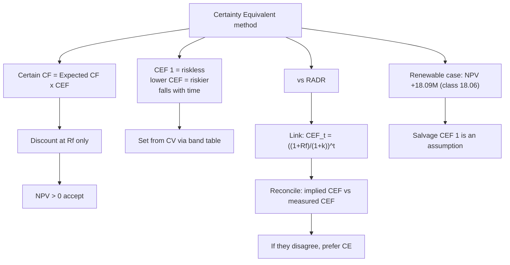

# CB-3: Certainty Equivalent and RADR vs CE

Covers: the certainty equivalent (CE) rule, the class example, the renewable-energy case with a corrected decision line, RADR versus CE, the formula that links the two, how to set the CEF from the coefficient of variation, and a worked reconciliation.

## CE rule (class)

**Certain cash flow = expected cash flow × CEF.** CEF = 1 means no risk; a lower CEF means a riskier flow. Discount the certain flows at the **risk-free rate**. Accept if NPV > 0.

NPV = Σ (CF_t × CEF_t) ÷ (1 + Rf)^t − I

Risk is handled in the **numerator**. Discounting CE flows at a risk-adjusted rate charges for the same risk twice. That is the most common error.

**Class example.** Invest ₹70,000; expected ₹1,00,000 in 1 year; CEF 0.80; Rf 10%.
Certain CF = 80,000. PV = 80,000 ÷ 1.10 = ₹72,727. NPV = **₹2,727**. Accept.

## Renewable-energy case (class, student's note)

Investment ₹150M. Rf 8%. Salvage ₹20M at the end of year 5.

| Year | Expected CF (₹M) | CEF | Certain CF (₹M) | DF at 8% | PV (₹M) |
|---|---|---|---|---|---|
| 1 | 40 | 0.95 | 38.0 | 0.926 | 35.19 |
| 2 | 45 | 0.90 | 40.5 | 0.857 | 34.71 |
| 3 | 50 | 0.80 | 40.0 | 0.794 | 31.76 |
| 4 | 55 | 0.70 | 38.5 | 0.735 | 28.30 |
| 5 | 60 | 0.60 | 36.0 | 0.681 | 24.52 |
| **Total** | **250** | | **193.0** | | **154.47** |
| Salvage (CEF 1 assumed) | 20 | 1.00 | 20.0 | 0.681 | 13.62 |
| **Total PV** | | | | | **168.09** |
| Less investment | | | | | 150.00 |
| **NPV** | | | | | **+18.09** |

**Rounding note.** Your class note uses 4-decimal factors (0.9259, 0.8573, 0.7938, 0.7350, 0.6806) and gets PV 154.45, salvage 13.61, total 168.06, **NPV 18.06**. Exact arithmetic gives 18.07. With the 3-decimal table convention used elsewhere in this unit the answer is 18.09. All three give the same decision. Keep your class figure (18.06) visible if the faculty marks against it, and state the table you used.

**Your note's decision section is blank.** It reads only "Certain cashflows is at 193, with salvage is 20". Add the decision: NPV is +₹18.09M (class: ₹18.06M), so **accept**, because the project creates value even after cutting every flow to its certain equivalent.

**Salvage assumption.** Giving the ₹20M salvage a CEF of 1 is an **assumption**, not data. Salvage five years out is itself uncertain. A CEF of 0.6 on it would cut PV by 20 × 0.4 × 0.681 = ₹5.45M and leave NPV at about +₹12.6M, still positive. State the assumption in the exam.

**Cushion.** PV of certain inflows can fall by 18.09 ÷ 168.09 = **10.8%** before NPV reaches zero.

## RADR versus CE (textbook)

| Point | RADR | CE |
|---|---|---|
| What is adjusted | The denominator (discount rate) | The numerator (cash flows) |
| Discount rate | Rf + premium (higher) | Rf only |
| Risk over time | One rate compounds, so risk is implicitly assumed to rise steadily | A separate CEF each year, so risk can vary freely |
| Subjectivity | Choosing the premium | Choosing the CEF for each year |
| Ease | Simple, widely used by practitioners | More logical, harder to estimate CEFs |
| Weakness | Cannot handle front-loaded risk or risk that falls later | Many judgement inputs |

**Link between the two.** The methods give the same value when

**CEF_t = [(1 + Rf) ÷ (1 + k)]^t**, where k is the RADR.

Example, Rf 8%, k 12%: implied CEF = 0.964, 0.930, 0.897, 0.865, 0.834 for years 1 to 5. So RADR at 12% equals a CEF that declines by about 3.6% a year. The class CEFs (0.95 down to 0.60) fall much faster, so the CE case is more cautious than a 12% RADR would be.

**Course note.** The CIA1 classroom brief used RADR and CE only. Adding a short reconciliation of the two (most groups omit it) is a cheap way to stand out.

## Setting the CEF from risk (textbook convention, via CIA1 method)

Three routes, from weakest to strongest: management judgement; expected value from a probability distribution; coefficient of variation mapped through a band table.

CV_t = σ_t ÷ expected CF_t, then:

| Coefficient of variation | CEF |
|---|---|
| 0.00 to 0.07 | 1.00 |
| 0.08 to 0.15 | 0.95 |
| 0.16 to 0.23 | 0.90 |
| 0.24 to 0.32 | 0.85 |
| 0.33 to 0.42 | 0.80 |
| 0.43 to 0.54 | 0.75 |
| Above 0.54 | 0.70 |

This table is a **convention, not a law**. Cite it as a stated assumption. CEF should normally decline with time; if yours rises, give a reason (for example risk that resolves after commissioning).

## Worked example, laid out as the exam answer (RADR vs CE reconciliation, illustrative)

**Question (illustrative data):** Outlay ₹1,000. Expected cash flow ₹300 a year for 5 years. Rf 6.94%, RADR 13%. CEFs from the risk analysis: 0.95, 0.88, 0.80, 0.70, 0.60. Evaluate by both methods and reconcile.

1. RADR method: NPV = 300 × annuity factor (13%, 5 years) − 1,000.
2. CE method: NPV = Σ 300 × CEF_t ÷ 1.0694^t − 1,000.
3. Implied CEF from RADR: [(1.0694) ÷ (1.13)]^t.

| Method | NPV (₹) | Verdict |
|---|---|---|
| No risk adjustment (Rf only) | +232.0 (CIA1 note says 232.1; exact 232.04) | Not a decision basis |
| RADR at 13% | +55.2 | Accept |
| CE with the measured CEFs | -17.1 | Reject |

| Year | CEF implied by 13% RADR | CEF from risk analysis |
|---|---|---|
| 1 | 0.946 | 0.95 |
| 2 | 0.896 | 0.88 |
| 3 | 0.848 | 0.80 |
| 4 | 0.802 | 0.70 |
| 5 | 0.759 | 0.60 |

**Decision line and interpretation:** the methods disagree, so **prefer CE and reject** (or modify). The 13% RADR asserts that the year-5 cash flow is 76% certain; the risk analysis says 60%. The RADR is too generous in the back half of the life. The rate that would reproduce the CE answer is about 16%, so the measured risk is worth roughly three points of discount that the 13% never charged. Justify the preference: CE separates the time value of money from the price of risk and lets risk vary by year. If a question says "modify", name a change that lifts the CEFs (an offtake contract, phasing the capex) and re-run the NPV.

**Direction caveat.** The divergence can run either way. If measured CEFs fall *slower* than the implied path (a long-lived asset with steady operating risk), RADR is the harsher method. Compute the direction; do not assume it.

## Exam fallback

If a question gives CEFs but no Rf, state an assumed Rf (a G-Sec yield) and label it an assumption. If it gives expected flows and a premium but no CEFs, do RADR and then derive implied CEFs to show you understand the link.

## What to remember

- CE: certain CF = expected CF × CEF. Discount at Rf. Accept if NPV > 0.
- CEF = 1 is risk-free; lower is riskier. Normally CEF falls with time.
- Never discount CE flows at the RADR (double-counts risk).
- RADR adjusts the rate, CE adjusts the flows. Link: CEF_t = [(1+Rf)/(1+k)]^t.
- Renewable case: certain flows ₹193M, PV ₹168.09M with salvage (class 168.06), NPV +₹18.09M (class 18.06), accept. Salvage CEF of 1 is an assumption.
- When the methods disagree, prefer CE and say why.

## Concept map

## Flashcards
Q: How does the Certainty Equivalent method work?
A: Certain CF = expected CF × CEF; discount the certain flows at the risk-free rate; accept if NPV > 0.

Q: What does a CEF of 1 mean?
A: The cash flow is risk-free. The lower the CEF, the riskier the flow.

Q: Class CE example: invest 70,000, expected 1,00,000, CEF 0.80, Rf 10%. NPV?
A: 80,000 ÷ 1.10 = 72,727; NPV = ₹2,727; accept.

Q: Renewable case: total PV and NPV?
A: Certain flows ₹193M. PV of operating flows ₹154.45M (class), plus salvage ₹13.61M = ₹168.06M. NPV = +₹18.06M (class, 4-decimal factors; 18.09 with 3-decimal). Accept.

Q: What assumption did the renewable case make on salvage, and what is its effect?
A: Salvage ₹20M was given CEF = 1 (certain). A CEF of 0.6 would cut PV by about ₹5.45M and NPV would still be positive.

Q: Link between CEF and RADR?
A: CEF_t = [(1 + Rf) ÷ (1 + k)]^t, where k is the RADR.

Q: Implied CEFs for Rf 8% and RADR 12%, years 1 and 5?
A: 0.964 in year 1 and 0.834 in year 5.

Q: Main difference between RADR and CE?
A: RADR adjusts the discount rate and implies risk grows steadily with time. CE adjusts the cash flows year by year and discounts at Rf.

Q: Most common error in CE questions?
A: Discounting the certain cash flows at the RADR instead of Rf, which counts risk twice.

Q: If RADR and CE give different decisions, which do you prefer and why?
A: CE, because it separates the time value of money from the price of risk and allows risk to vary by year.

Q: How can the CEF be linked to the coefficient of variation?
A: Use a stated band table, for example CV 0.16 to 0.23 gives CEF 0.90. It is a convention, so cite it as an assumption.

## Sources
- Faculty class notes, Unit I (CE method and example)
- Student note: Case - Renewable Energy
- CIA1 method note (CV bands, reconciliation; illustrative figures)
- Vault note: `SFM CIA3 - Unit I Strategy and Risk in Capital Budgeting` (sections 2 and 3)
- Next node: [[SFM Unit 1 - CB-4 Expected NPV Standard Deviation and Normal Distribution]]
- [[SFM Unit 1 - Capital Budgeting MOC (Node Map)]]
