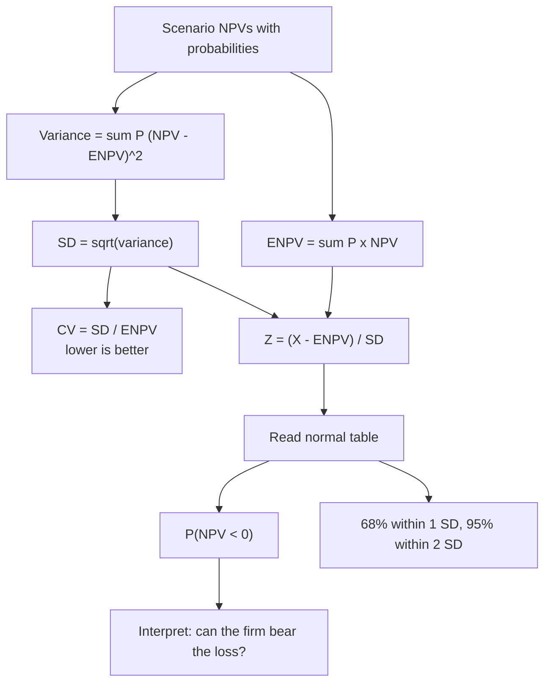

# CB-4: Expected NPV, Standard Deviation and Normal Distribution

Covers: expected NPV, standard deviation of NPV, coefficient of variation, the full scenario-to-probability-of-loss worked example, the class normal-distribution example, and a short note on SD over several years. The ENPV and SD definitions and the two class examples are **(class)**. CV, the worked example and the multi-year note are **(textbook)**.

## Expected NPV (class)

**ENPV = Σ P × NPV.** The probability-weighted average NPV.

Class example: Good (P 0.30) NPV ₹5 lakh; Average (0.50) ₹3 lakh; Poor (0.20) -₹1 lakh.
ENPV = 0.30 × 5 + 0.50 × 3 + 0.20 × (-1) = 1.5 + 1.5 - 0.2 = **₹2.8 lakh**.

Probabilities must sum to 1. State their basis (management estimate, history, judgement).

## Standard deviation of NPV (class)

**σ = √[Σ P (NPV − ENPV)²].** Higher σ means a riskier project.

Class example: A has ENPV ₹100 lakh and σ ₹15 lakh. B has ENPV ₹100 lakh and σ ₹40 lakh. Same expected return, so **B is riskier** and A is preferred.

## Coefficient of variation (textbook)

**CV = σ ÷ ENPV**: risk per rupee of expected return. Use it when ENPVs differ, because SD alone misleads.

| Project | ENPV (₹ lakh) | σ (₹ lakh) | CV | Rank (lower is better) |
|---|---|---|---|---|
| A | 80 | 20 | 0.25 | 2 |
| B | 150 | 60 | 0.40 | 3 |
| C | 50 | 10 | 0.20 | 1 |

B has the highest SD and the highest ENPV, but also the highest CV. C has the least risk per rupee of return. Trap: the biggest ENPV is not automatically best. Compare CV, then ask whether the firm can bear B's absolute risk.

## Normal distribution and probability of loss (class method)

Treat NPV as normally distributed with mean ENPV and standard deviation σ. Then:

**Z = (X − ENPV) ÷ σ**, and P(NPV < X) is the area to the left of Z in the standard normal table. P(NPV > X) = 1 − that area.

Z-table values to remember: Z = -2.0 → 0.0228; -1.0 → 0.1587; -0.55 → 0.2912; 0 → 0.5000; +1.0 → 0.8413; +2.0 → 0.9772.

Rule of thumb: about 68% of outcomes lie within ENPV ± 1σ and about 95% within ± 2σ.

**Class normal-distribution example** (ENPV ₹100 lakh, σ ₹20 lakh; the class gave no answers, these are computed):

| Question | Z | Probability |
|---|---|---|
| P(NPV < 0) | (0 − 100) ÷ 20 = -5.0 | essentially zero |
| P(NPV < 80) | -1.0 | 0.1587 (15.87%) |
| P(NPV > 120) | +1.0 | 1 − 0.8413 = 0.1587 (15.87%) |
| P(NPV < 60) | -2.0 | 0.0228 (2.28%) |

Within ± 1σ: ₹80 to ₹120 lakh (68%). Within ± 2σ: ₹60 to ₹140 lakh (95%). Reading: loss is practically impossible; the realistic range of outcomes is wide enough that there is about a one-in-six chance of 80 lakh or less.

**Steps to write in the exam:** state ENPV and σ; compute Z; read the table; convert to a probability; interpret in one sentence.

## Worked example, laid out as the exam answer (scenarios to P(NPV < 0))

**Question (illustrative data):** A project has three scenarios. Optimistic: probability 0.25, NPV ₹60 lakh. Base: 0.50, ₹20 lakh. Pessimistic: 0.25, -₹30 lakh. Find ENPV, σ, CV and the probability of a loss, and comment.

1. ENPV = Σ P × NPV.
2. Variance = Σ P (NPV − ENPV)².
3. σ = √variance; CV = σ ÷ ENPV; Z = (0 − ENPV) ÷ σ.

| Scenario | P | NPV (₹ lakh) | P × NPV | Deviation | P × deviation² |
|---|---|---|---|---|---|
| Optimistic | 0.25 | 60 | 15.00 | 42.5 | 451.56 |
| Base | 0.50 | 20 | 10.00 | 2.5 | 3.13 |
| Pessimistic | 0.25 | -30 | -7.50 | -47.5 | 564.06 |
| **Total** | 1.00 | | **ENPV 17.5** | | **Variance 1,018.75** |

σ = √1,018.75 = **₹31.92 lakh**. CV = 31.92 ÷ 17.5 = **1.82**. Z = (0 − 17.5) ÷ 31.92 = **-0.55**. Table area to the left of -0.55 = **0.2912**.

**Decision line and interpretation:** ENPV is positive at ₹17.5 lakh, but P(NPV < 0) is about **29%**, roughly 3 chances in 10 of losing money, and a CV of 1.82 says the risk is large relative to the return. Accept only if the firm can absorb a loss of up to ₹30 lakh and has no safer project with a lower CV. Note the approximation: treating a three-point distribution as normal is rough, as the exam method does.

## SD over several years (textbook, gap-fill)

If the question gives the SD of each year's cash flow rather than scenario NPVs, the SD of NPV depends on how the yearly flows move together.

- **Independent flows:** σ_NPV = √[Σ σ_t² ÷ (1 + r)^(2t)].
- **Perfectly correlated flows:** σ_NPV = Σ σ_t ÷ (1 + r)^t.

Illustrative check: yearly SDs ₹20, 30, 40 lakh at 10%. Independent: √(330.58 + 614.71 + 903.16) = **₹42.99 lakh**. Perfectly correlated: 18.18 + 24.79 + 30.05 = **₹73.03 lakh**. Real flows lie in between, so the independent figure understates and the correlated figure overstates the risk. Use whichever the question states; if silent, say which you assume. **[VERIFY]** whether faculty cover this form.

## What to remember

- ENPV = Σ P × NPV. σ = √Σ P(NPV − ENPV)². Higher σ, riskier.
- CV = σ ÷ ENPV compares projects with different ENPVs. Lower CV is better.
- Probability of loss: Z = (0 − ENPV) ÷ σ, read the left tail. Say that NPV is assumed normal.
- Class normal example (100, 20): P(<80) = 15.87%, P(>120) = 15.87%, P(<60) = 2.28%, loss ~0.
- Worked set: ENPV 17.5, σ 31.92, CV 1.82, Z -0.55, P(loss) ≈ 29%.
- A positive ENPV can still hide a large chance of loss. Always interpret.

## Concept map

## Flashcards
Q: Formula for expected NPV and standard deviation of NPV?
A: ENPV = Σ P × NPV; σ = √Σ P (NPV − ENPV)².

Q: Class ENPV example: Good 0.30 at ₹5L, Average 0.50 at ₹3L, Poor 0.20 at -₹1L?
A: 1.5 + 1.5 - 0.2 = ₹2.8 lakh.

Q: A and B both have ENPV ₹100L; σ is ₹15L for A and ₹40L for B. Which is preferred?
A: A. Same return with lower risk, so B is riskier.

Q: Why use the coefficient of variation?
A: CV = σ ÷ ENPV gives risk per rupee of return, so it ranks projects with different ENPVs. Lower is better.

Q: How do you find P(NPV < 0)?
A: Z = (0 − ENPV) ÷ σ, then read the left-tail area from the normal table (for example Z = -1.0 gives 0.1587).

Q: ENPV ₹100L, σ ₹20L: P(NPV < 0)?
A: Z = -5, so the probability is essentially zero.

Q: ENPV ₹100L, σ ₹20L: P(NPV > 120)?
A: Z = +1, so 1 − 0.8413 = 0.1587 (15.87%).

Q: Scenarios 0.25/60, 0.50/20, 0.25/-30 (₹ lakh): ENPV, σ, CV?
A: ENPV 17.5, variance 1,018.75, σ 31.92, CV 1.82.

Q: For that set, what is P(NPV < 0) and what does it tell you?
A: Z = -0.55, area 0.2912, about 29%. Positive ENPV but about a 3 in 10 chance of loss, and a high CV.

Q: What proportions of outcomes lie within 1σ and 2σ of the mean?
A: About 68% and 95%.

Q: SD of NPV for independent yearly flows versus perfectly correlated flows?
A: Independent: √[Σ σ_t² ÷ (1+r)^(2t)]. Perfectly correlated: Σ σ_t ÷ (1+r)^t.

## Sources
- Faculty class notes, Unit I (ENPV, SD, normal distribution)
- Textbook method: Prasanna Chandra, I M Pandey (CV, multi-period SD)
- CIA1 method note on scenario distribution and normal add-on
- Vault note: `SFM CIA3 - Unit I Strategy and Risk in Capital Budgeting` (section 4)
- Next node: [[SFM Unit 1 - CB-5 Decision Tree Analysis]]
- [[SFM Unit 1 - Capital Budgeting MOC (Node Map)]]
