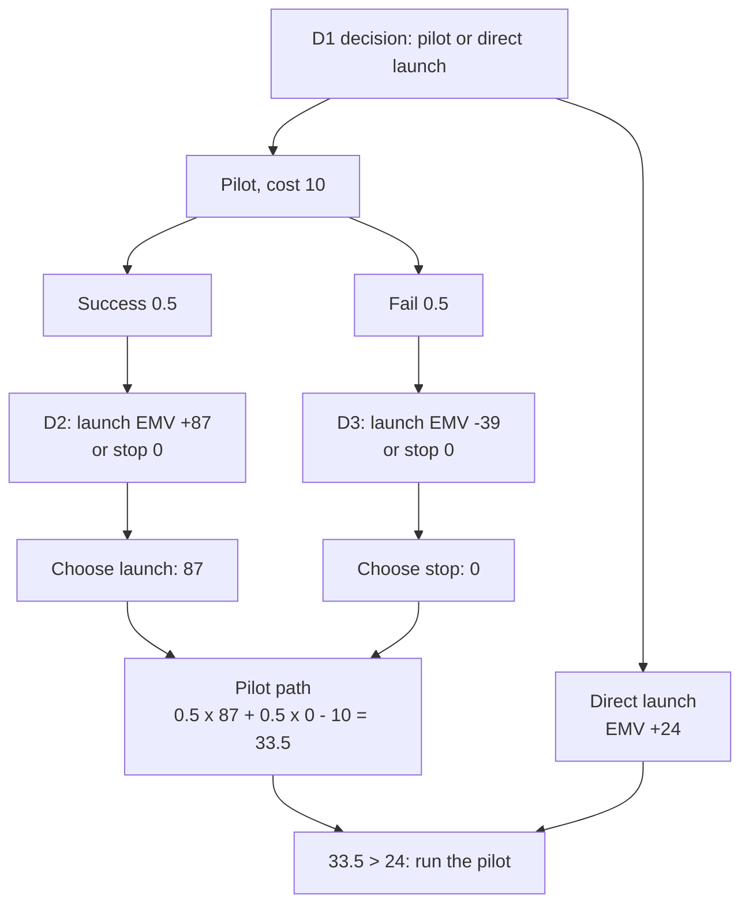

# CB-5: Decision Tree Analysis

Covers: decision and chance nodes, the roll-back rule, a full pilot-then-launch worked example with the value of the pilot, and the errors that lose marks. Symbols and steps are **(class)**. The numerical example is **(textbook)** and illustrative.

## Symbols and steps (class)

- **Square = decision node.** You choose a branch.
- **Circle = chance node.** Nature decides; branches carry probabilities that sum to 1.
- Terminal values are NPVs (or cash flows) of each path.

Steps: draw the tree; put cash flows and probabilities on the branches; compute the **EMV at each chance node** (Σ probability × value); **roll back from right to left**; at each **decision node take the highest EMV and cut off the rest** (decision nodes take the maximum, never the average).

Class illustration (no numbers): pharma R&D, then trials, then approval, then production, then market success.

## Why it matters

A single-shot NPV assumes the firm commits the whole outlay today and receives whatever happens. A staged project is not like that: commit phase 1, observe the outcome, then decide on phase 2. The right to stop has value that a static NPV misses. When the tree value exceeds the naive NPV, the finding is "restructure into stages", which is the quantified form of a "modify" verdict.

## Worked example, laid out as the exam answer

**Question (illustrative, ₹ lakh):** A firm can run a **pilot costing 10**. Full launch needs **100**. 
- Pilot succeeds (probability 0.5): demand is high with probability 0.7 (PV of inflows 250) or low with 0.3 (PV of inflows 40).
- Pilot fails (0.5): high demand 0.1, low demand 0.9.
- Alternative: skip the pilot and launch directly.

Launch NPV: high = 250 − 100 = **+150**; low = 40 − 100 = **-60**.

**Tree in words**
- D1 (square): Pilot or direct launch?
  - Pilot (cost 10), then chance node:
    - Success 0.5, then D2: Launch (chance: high 0.7 → +150, low 0.3 → -60) or Stop (0).
    - Fail 0.5, then D3: Launch (chance: high 0.1 → +150, low 0.9 → -60) or Stop (0).
  - Direct launch: chance node with P(high) = 0.5 × 0.7 + 0.5 × 0.1 = **0.40** → +150; low 0.60 → -60.

**Roll back**

| Node | Working | EMV | Choice |
|---|---|---|---|
| D2 launch (after success) | 0.7(150) + 0.3(-60) = 105 − 18 | **+87** | Launch (87 > 0) |
| D3 launch (after failure) | 0.1(150) + 0.9(-60) = 15 − 54 | **-39** | Stop (0 > -39) |
| Pilot path | 0.5(87) + 0.5(0) − 10 | **+33.5** | |
| Direct launch | 0.4(150) + 0.6(-60) = 60 − 36 | **+24** | |

**Decision line and interpretation:** run the pilot, since 33.5 > 24. The pilot gives a gross benefit of 43.5 − 24 = 19.5, costs 10, and so adds net 9.5 over launching blind. It pays because a failed pilot lets the firm **stop and avoid an expected loss of 39** (the average result of launching after failure). Time value is ignored for simplicity; in the exam, discount later-stage flows if the question gives a rate, and say that you have not.

## Where marks are lost

- Probabilities that do not sum to 1 at a chance node.
- Using the average at a decision node. Decisions take the **maximum**.
- Forgetting to subtract the pilot cost (it is paid whichever way the pilot goes).
- Double-counting risk: discounting at a RADR and also using pessimistic branch cash flows. Pick the rate deliberately and say why.
- Drawing the tree and never interpreting it. The finding is the surviving strategy and the value of waiting.

## What to remember

- Square = decision (take the max); circle = chance (take the probability-weighted EMV).
- Roll back from right to left; cut off the losing branches.
- Pilot example: after success launch +87; after failure stop 0 (launch would be -39); pilot path 33.5; direct launch 24.
- Run the pilot: net benefit 9.5 over direct launch after its cost of 10.
- Staged commitment has value because it lets you stop. A tree value above the static NPV means "modify" (stage it).
- Always say whether time value was ignored.

## Concept map

## Flashcards
Q: What do the square and circle represent in a decision tree?
A: Square = decision node (you choose). Circle = chance node (nature decides, branches carry probabilities).

Q: How do you solve a decision tree?
A: Compute EMV at each chance node, roll back right to left, and at each decision node take the highest EMV and cut off the rest.

Q: What is taken at a decision node, the average or the maximum?
A: The maximum. Using the average is the classic error.

Q: Pilot example: EMV of launching after pilot success (0.7 high at +150, 0.3 low at -60)?
A: 0.7(150) + 0.3(-60) = 105 − 18 = +87 lakh.

Q: Pilot example: EMV of launching after pilot failure (0.1 high, 0.9 low)?
A: 0.1(150) + 0.9(-60) = 15 − 54 = -39, so stop and take 0.

Q: Pilot example: what is the EMV of the pilot path?
A: 0.5(87) + 0.5(0) − 10 = ₹33.5 lakh.

Q: Pilot example: EMV of direct launch and the overall P(high demand)?
A: P(high) = 0.5 × 0.7 + 0.5 × 0.1 = 0.40. EMV = 0.4(150) + 0.6(-60) = ₹24 lakh.

Q: Decision for the pilot example, and why?
A: Run the pilot (33.5 > 24). It lets the firm stop after a failed pilot and avoid an expected loss of 39.

Q: What does a decision tree capture that a static NPV does not?
A: The value of the option to stop or defer after learning more, which supports staging a project ("modify").

Q: Name two ways to lose marks on a decision-tree answer.
A: Probabilities not summing to 1 at a chance node, and averaging at a decision node. Also forgetting the pilot cost or not interpreting the tree.

## Sources
- Faculty class notes, Unit I (decision tree symbols and steps)
- Textbook method for the pilot-then-launch example
- CIA1 method note on decision trees and common errors
- Vault note: `SFM CIA3 - Unit I Strategy and Risk in Capital Budgeting` (section 5)
- Next node: [[SFM Unit 1 - CB-6 Sensitivity Scenario and Monte Carlo]]
- [[SFM Unit 1 - Capital Budgeting MOC (Node Map)]]
