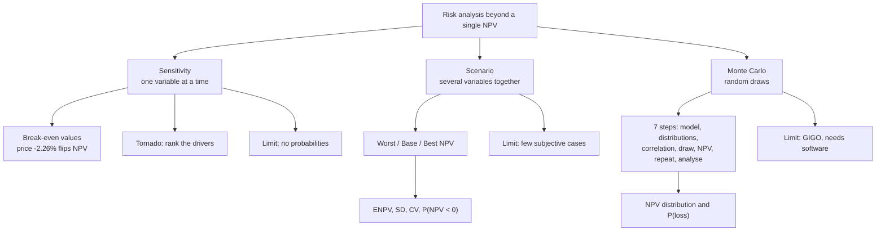

# CB-6: Sensitivity, Scenario and Monte Carlo

Covers: sensitivity analysis with break-even values, scenario analysis with probabilities, Monte Carlo simulation steps and a mechanical illustration, and how the three differ. The class names these techniques in its map **(class)**; the method and the running project below are **(textbook)** and illustrative.

## Running project (illustrative)

Investment ₹10,00,000; life 5 years; discount rate 12%; no tax. Sales 10,000 units at ₹100; variable cost ₹60; fixed cash cost ₹1,00,000 a year.

Annual cash flow = 10,000 × (100 − 60) − 1,00,000 = **₹3,00,000**.
Annuity factor (12%, 5 years) = **3.605** (table). Base NPV = 3,00,000 × 3.605 − 10,00,000 = **+₹81,500**.

**Rounding note.** The vault source quotes base NPV +₹81,433 and a break-even cash flow of ₹2,77,410. Those come from the exact factor 3.6048 although the source states 3.605. With the table factor 3.605 the figures are the ones in this node (base +81,500; break-even ₹2,77,393). Differences are small; state the factor you use.

## Sensitivity analysis

**What it does:** change **one variable at a time**, hold everything else at base, and see how NPV moves. It finds the variable whose small change flips the decision.

**Break-even cash flow:** 10,00,000 ÷ 3.605 = ₹2,77,393. So annual cash flow can fall by 3,00,000 − 2,77,393 = **₹22,607** before NPV hits zero.

| Variable | Base | Break-even value (NPV = 0) | Adverse change that flips the decision |
|---|---|---|---|
| Selling price | ₹100 | ₹97.74 | **-2.26%** |
| Variable cost | ₹60 | ₹62.26 | +3.77% |
| Sales volume | 10,000 | 9,435 units | -5.65% |
| Fixed cost | ₹1,00,000 | ₹1,22,607 | +22.61% |
| Discount rate | 12% | 15.24% (the IRR) | +27.0% (3.24 percentage points) |

Workings: price falls by 22,607 ÷ 10,000 = ₹2.26; variable cost rises by the same ₹2.26; volume falls by 22,607 ÷ 40 = 565 units; fixed cost rises by ₹22,607.

**NPV after a 10% adverse move (table factor 3.605):**

| Variable moved 10% against the firm | New NPV (₹) | NPV fall per 1% move (as % of base NPV) |
|---|---|---|
| Price -10% (₹90) | -2,79,000 | 44.2% |
| Variable cost +10% (₹66) | -1,34,800 | 26.5% |
| Volume -10% (9,000) | -62,700 | 17.7% |
| Fixed cost +10% (₹1,10,000) | +45,450 | 4.4% |
| Discount rate +10% (to 13.2%) | about +50,041 (exact factor) | 3.9% |

**Decision line and interpretation:** the most sensitive variable is **selling price**; a 2.26% fall kills the project. Management should focus on price protection (contracts, brand, cost pass-through) before anything else. Fixed cost and the discount rate matter much less.

**Tornado chart (CIA1 method):** list drivers down the page, bars for the NPV swing, widest on top. Switching values are best written in business terms ("price can fall only ₹2.26 from ₹100 before the project fails"), not as statistical values.

**Advantages:** simple, shows critical variables, needs no probabilities, shows where to gather better information. **Limitations:** changes one variable though real variables move together (price and volume are linked); gives no probabilities; does not say how likely each change is; results depend on the range chosen.

## Scenario analysis

**What it does:** change **several variables together** into a coherent best, base and worst story, and compute NPV for each. Each scenario needs a one-line narrative (a demand collapse, a tariff, a competitor adding capacity). A worst case where volume falls but nothing else changes is just a sensitivity run.

| | Worst | Base | Best |
|---|---|---|---|
| Volume | 8,000 | 10,000 | 12,000 |
| Price | ₹92 | ₹100 | ₹105 |
| Variable cost | ₹64 | ₹60 | ₹57 |
| Fixed cost | ₹1,10,000 | ₹1,00,000 | ₹95,000 |
| Annual cash flow | ₹1,14,000 | ₹3,00,000 | ₹4,81,000 |
| **NPV (× 3.605 − 10,00,000)** | **-₹5,89,030** | **+₹81,500** | **+₹7,34,005** |

Cash flows: worst 8,000 × 28 − 1,10,000 = 1,14,000; best 12,000 × 48 − 95,000 = 4,81,000. (Vault source, exact factor: -5,89,056 / +81,433 / +7,33,897.)

With probabilities 0.25 / 0.50 / 0.25:
- ENPV = 0.25(-5,89,030) + 0.50(81,500) + 0.25(7,34,005) = **₹76,994**.
- σ = **₹4,67,785**. CV = 4,67,785 ÷ 76,994 = **6.08**.
- Z = (0 − 76,994) ÷ 4,67,785 = -0.16, so P(NPV < 0) ≈ **44%** (table area for -0.16 is 0.4364; exact Z -0.165 gives 43.5%).

**Decision line and interpretation:** ENPV is small beside the spread (CV 6.08) and a loss is nearly as likely as not. The worst case loses about 59% of the investment. This is a gamble, not a safe accept; proceed only if the firm can bear a ₹5.9 lakh loss and the price risk can be hedged or contracted.

**How it differs from sensitivity:** sensitivity moves one variable and finds the critical one; scenario moves a bundle and gives a range of outcomes. **Advantages:** realistic combined effects, shows the downside, feeds ENPV and σ. **Limitations:** only a few discrete scenarios, scenario choice is subjective, probabilities are guessed, outcomes between the scenarios are ignored.

## Monte Carlo simulation

**Concept:** a computer repeats the NPV calculation thousands of times, each time drawing the uncertain inputs at random from their probability distributions, to build a full distribution of NPV.

**Steps**
1. Build the model: NPV as a function of the inputs.
2. Identify the key uncertain variables and assign each a probability distribution (normal, triangular, discrete).
3. Allow for correlation between variables.
4. Draw a random number for each variable and convert it to a value.
5. Compute NPV for that draw and record it.
6. Repeat many times (usually 1,000 to 10,000).
7. Analyse: ENPV, σ, histogram, probability of loss P(NPV < 0), percentiles.

**Illustration of the mechanics (not real data).** Volume and price random; other items fixed (variable cost ₹60, fixed ₹1,00,000, 12%, 5 years, investment ₹10,00,000). Two-digit random numbers 00 to 99:
- Volume: 00-19 → 8,000 (20%); 20-69 → 10,000 (50%); 70-99 → 12,000 (30%).
- Price: 00-29 → ₹90 (30%); 30-79 → ₹100 (50%); 80-99 → ₹110 (20%).

| Iteration | RN volume | RN price | Volume | Price | Annual CF (₹) | NPV (₹) |
|---|---|---|---|---|---|---|
| 1 | 14 | 62 | 8,000 | 100 | 2,20,000 | -2,06,900 |
| 2 | 83 | 41 | 12,000 | 100 | 3,80,000 | +3,69,900 |
| 3 | 57 | 95 | 10,000 | 110 | 4,00,000 | +4,42,000 |
| 4 | 08 | 22 | 8,000 | 90 | 1,40,000 | -4,95,300 |
| 5 | 71 | 88 | 12,000 | 110 | 5,00,000 | +8,02,500 |

The average of these 5 draws is ₹1,82,440 and 2 of 5 are negative. Five draws prove nothing. A real run uses thousands of iterations; then P(NPV < 0) is the fraction of iterations with a negative NPV. The table shows only the mechanics.

**Advantages:** uses the full range of inputs, gives a whole distribution and the probability of loss, handles many variables and correlations. **Limitations:** needs a computer and software, needs well-estimated distributions (garbage in, garbage out), hard to explain, assumes the model structure is right, can give false confidence.

## Choosing between the three

| | Sensitivity | Scenario | Monte Carlo |
|---|---|---|---|
| Variables moved | One at a time | A bundle together | All, randomly |
| Output | Critical variable, break-even | Best, base, worst NPV | Full NPV distribution |
| Probabilities | None | Subjective, few | Distributions for each input |
| Effort | Low | Medium | High (software) |

## What to remember

- Sensitivity: one variable at a time; find the one that flips NPV first. Price was most sensitive (-2.26%).
- Scenario: a coherent bundle with a narrative; gives ENPV 76,994, σ 4,67,785, CV 6.08, P(loss) about 43 to 44% for the project.
- Monte Carlo: random draws from input distributions, thousands of runs, gives a distribution and P(NPV < 0). Seven steps.
- Break-even cash flow = investment ÷ annuity factor (10,00,000 ÷ 3.605 = 2,77,393).
- Each technique has a limit: sensitivity ignores correlation, scenario uses few cases, Monte Carlo needs good inputs.
- Always end with the decision and the interpretation, not just the table.

## Concept map

## Flashcards
Q: What does sensitivity analysis do?
A: Changes one variable at a time, holding the rest at base, to see how NPV moves and which variable flips the decision.

Q: Sensitivity versus scenario analysis?
A: Sensitivity changes one variable to find the critical input. Scenario changes several variables together into best, base and worst stories to show the range of outcomes.

Q: Running project: base annual cash flow and NPV?
A: 10,000 × 40 − 1,00,000 = ₹3,00,000. NPV = 3,00,000 × 3.605 − 10,00,000 = +₹81,500.

Q: Running project: how far can annual cash flow fall before NPV is zero?
A: Break-even cash flow = 10,00,000 ÷ 3.605 = ₹2,77,393, a fall of ₹22,607.

Q: Running project: which variable is most sensitive and by how much does it flip the decision?
A: Selling price. A 2.26% fall (₹100 to ₹97.74) makes NPV zero.

Q: Running project: NPV in the worst and best scenarios?
A: Worst -₹5,89,030 (cash flow 1,14,000); best +₹7,34,005 (cash flow 4,81,000). Base +₹81,500.

Q: Scenario probabilities 0.25/0.50/0.25: ENPV, σ, CV?
A: ENPV ₹76,994; σ ₹4,67,785; CV 6.08. P(NPV < 0) is about 43 to 44%, so the project is a gamble.

Q: List the steps of Monte Carlo simulation.
A: Build the model, assign distributions to uncertain inputs, allow for correlation, draw random numbers, compute NPV, repeat thousands of times, analyse the NPV distribution and P(NPV < 0).

Q: Name two limitations of Monte Carlo.
A: It needs software and well-estimated input distributions (garbage in, garbage out), and it can give false confidence if the model is wrong.

Q: Name two limitations of sensitivity analysis.
A: It changes one variable though real variables move together, and it attaches no probabilities to the changes.

Q: How is a switching (break-even) value best written in the exam?
A: In business terms, for example "price can fall only ₹2.26 from ₹100 before the project fails", not as a bare number.

## Sources
- Faculty technique map, Unit I
- Textbook method (Prasanna Chandra, I M Pandey) with one running project, recomputed
- CIA1 method note on sensitivity, scenario and tornado charts
- Vault note: `SFM CIA3 - Unit I Strategy and Risk in Capital Budgeting` (sections 6 to 8)
- Next node: [[SFM Unit 1 - CB-7 Unit 1 Exam Answers]]
- [[SFM Unit 1 - Capital Budgeting MOC (Node Map)]]
