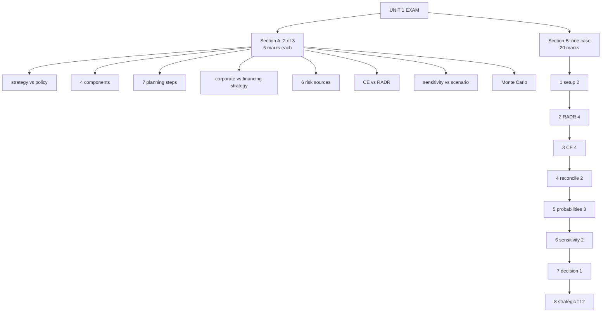

# CB-7: Unit 1 Exam Answers

Covers: what the paper will ask, eight 5-mark answer skeletons, the 20-mark risky-project case layout with marks, and a full model answer built on the class renewable-energy case. The renewable case is **(class)**. The RADR premium used in the model answer is an assumption, flagged below.

## What the paper will ask

The course plan gives a 1-hour, 30-mark paper: Section A, two of three questions at 5 marks; Section B, one 20-mark case. The vault formula sheet records CIA3 as covering Units IV and V only, so Units I and II are more likely tested at the end-semester exam **[VERIFY the date and scope with faculty]**. Unit I feeds both sections: the 5-markers come from strategy (CB-1) and technique definitions (CB-2 to CB-6); the 20-marker is almost certainly a risky-project appraisal with RADR, CE, ENPV, SD, maybe a tree.

## Five-mark answer skeletons

Write each as a short definition, 3 to 5 points and one example. Aim for about 120 to 150 words.

1. **Strategy vs policy (CB-1).** Define each; table of nature, answers (what vs how), focus, stability; example: strategy = enter EVs, policy = capex approval limits; close with "policy implements strategy".
2. **Components of financial strategy (CB-1).** Four: investment, financing, dividend, risk management; one line each; tie to wealth maximisation; example Apple's cash reserves or Netflix funding content.
3. **Strategic planning process (CB-1).** Seven steps (vision to evaluation and control), one line each; note the loop; example Jio.
4. **Corporate vs financing strategy (CB-1).** Corporate = what to do, financing = how to fund; must align; success Reliance Jio, failure Kingfisher (excess debt, interest burden, collapse) and WeWork.
5. **Sources of risk (CB-2).** Six: project, company, industry, competition, market, international; one class example each; link to risk premium.
6. **CE vs RADR (CB-3).** Define each; table: what is adjusted, discount rate used, treatment of time, subjectivity; give the link CEF_t = [(1+Rf)/(1+k)]^t; one worked line (CE: 80,000 ÷ 1.10 = 72,727, NPV 2,727; or EV plant 9,09,091).
7. **Sensitivity vs scenario (CB-6).** One variable vs several together; critical variable vs range of outcomes; advantages and limits; small example (price -2.26% flips the decision).
8. **Monte Carlo (CB-6).** Concept; seven steps; advantages (full distribution, P(loss)); limitations (software, distribution inputs, GIGO).

Also possible: ENPV/SD/CV with a normal-table probability (CB-4) and a short decision tree (CB-5). Learn both layouts.

## 20-mark case layout (risky project appraisal)

About 3 minutes per block.

| Block | Marks | Content |
|---|---|---|
| 1 Setup | 2 | Project, investment, life, cash flows, assumptions (tax, working capital, salvage). State Rf and premium; RADR = Rf + premium |
| 2 NPV by RADR | 4 | Table: year, cash flow, DF (3 decimals), PV; total PV; NPV. Annuity factor if flows are equal. IRR vs RADR if asked |
| 3 NPV by CE | 4 | Table: year, expected CF, CEF, certain CF, DF at Rf, PV; NPV. Comment on the salvage assumption |
| 4 Compare and reconcile | 2 | Agree or not; why (RADR one rate, CE year by year). Prefer CE when risk varies by year |
| 5 Probabilistic block | 3 | If probabilities are given: ENPV, variance, σ, CV, Z and P(NPV < 0), naming the table values |
| 6 Sensitivity line | 2 | Most sensitive variable, its break-even percentage, one sentence |
| 7 Decision | 1 | Accept or reject with the NPV, in one sentence |
| 8 Strategic fit | 2 | Link to corporate strategy, financing strategy, sustainability (ESG, regulation, green finance); one risk source of the six; what would change the decision |

Presentation checks: ₹ units on every figure, 3-decimal discount factors, the formula written before substitution, a one-line conclusion at the end.

## Model answer: the renewable-energy case (class), laid out as the exam answer

**Question (class data plus an assumed RADR premium):** Investment ₹150M. Expected cash flows ₹40M, 45M, 50M, 55M, 60M over 5 years with CEFs 0.95, 0.90, 0.80, 0.70, 0.60. Salvage ₹20M at the end of year 5. Rf 8%. Evaluate by CE and RADR and recommend.

**1. Setup and assumptions.**
- Rf = 8% (given). Salvage treated as certain (CEF 1) under CE: an assumption.
- The question gives **no risk premium**, so for the RADR comparison I assume a premium of **4%**, RADR = 12%. This is my assumption, not data. Fallback in the exam: state it, then say the RADR conclusion holds for any premium up to about 12.6% (the IRR of the expected flows including salvage is about 20.6%).
- 3-decimal factors; tax and working capital ignored (none given).

**2. NPV by CE (discount at 8%).**

| Year | Expected CF (₹M) | CEF | Certain CF (₹M) | DF at 8% | PV (₹M) |
|---|---|---|---|---|---|
| 1 | 40 | 0.95 | 38.0 | 0.926 | 35.19 |
| 2 | 45 | 0.90 | 40.5 | 0.857 | 34.71 |
| 3 | 50 | 0.80 | 40.0 | 0.794 | 31.76 |
| 4 | 55 | 0.70 | 38.5 | 0.735 | 28.30 |
| 5 | 60 | 0.60 | 36.0 | 0.681 | 24.52 |
| Salvage | 20 | 1.00 | 20.0 | 0.681 | 13.62 |
| **Total PV** | | | | | **168.09** |

NPV (CE) = 168.09 − 150 = **+₹18.09M**. (Class 4-decimal factors: 168.06 and +18.06.)

**3. NPV by RADR (expected flows at 12%).**

| Year | Expected CF (₹M) | DF at 12% | PV (₹M) |
|---|---|---|---|
| 1 | 40 | 0.893 | 35.72 |
| 2 | 45 | 0.797 | 35.87 |
| 3 | 50 | 0.712 | 35.60 |
| 4 | 55 | 0.636 | 34.98 |
| 5 | 60 | 0.567 | 34.02 |
| Salvage | 20 | 0.567 | 11.34 |
| **Total PV** | | | **187.53** |

NPV (RADR) = 187.53 − 150 = **+₹37.53M**.

**4. Reconcile.** Implied CEF from a 12% RADR with Rf 8% is 0.964, 0.930, 0.897, 0.865, 0.834 (years 1 to 5). The class CEFs are 0.95, 0.90, 0.80, 0.70, 0.60: lower in every year and falling much faster. So the CE method is the harsher one here, and its NPV (18.09) is about half the RADR NPV (37.53). The RADR that would give the CE answer is about **16.1%**, i.e. a premium of roughly 8%.

**5. Probabilistic block.** No probabilities are given, so none is computed. (If given, use the CB-4 layout: ENPV, σ, CV, Z, P(NPV < 0).)

**6. Sensitivity line.** The PV of certain inflows can fall by 18.09 ÷ 168.09 = **10.8%** before CE-NPV reaches zero. A CEF of 0.6 on the salvage would remove 20 × 0.4 × 0.681 = ₹5.45M and leave NPV at about +₹12.6M, still positive.

**7. Decision.** **Accept.** NPV is positive under both methods; on the more cautious CE basis it is +₹18.09M (class ₹18.06M).

**8. Strategic fit and implications.** A renewable plant fits a sustainability-led corporate strategy and can be funded through green financing; the financing must not be so geared that a delay (a project-specific risk, as with a solar plant slipping) breaks cover. The cushion is only about 11% of PV, so the decision would change if market risk (tariff or rate moves) cut the realised flows by more than that, or if salvage proves uncertain. A power-purchase agreement fixing the tariff would raise the CEFs and widen the margin.

**Closing line:** "Accept the project; the recommendation holds on the stated CEFs and the assumed 4% premium, and it is robust to a 10.8% fall in the PV of certain flows."

## Time rule

If time runs short: finish steps 2, 3 and 7 (both NPVs and the decision), then write two lines on reconciliation and one on strategic fit.

## What to remember

- Section A: pick two of three. Definition, 3 to 5 points, one example, about 130 words.
- Case order: setup, RADR, CE, reconcile, probabilities (if given), sensitivity line, decision, strategic fit.
- Renewable model: CE NPV +18.09 (class 18.06), RADR NPV +37.53 at an assumed 12%, accept; CE is the harsher method.
- When data is missing (a premium, a salvage CEF), state the assumption and your fallback.
- Every table ends in a decision sentence with an interpretation.
- Faculty RADR sheet: Q1 +44,220, Q5 computes to +15,370, sheet says 0 [VERIFY with faculty; write both].

## Concept map

## Flashcards
Q: What is the probable format of the Unit I paper (assumption, scope unconfirmed)?
A: If Unit I is tested in the course-plan format: 1 hour, 30 marks: Section A two of three questions at 5 marks, Section B one 20-mark case. Confirm the date and scope with faculty.

Q: What is the Unit I 20-mark case most likely to be?
A: A risky-project appraisal using RADR and CE, possibly with ENPV, SD, a tree or a sensitivity line.

Q: How are the 20 marks split in the risky-project case?
A: Setup 2, RADR 4, CE 4, reconcile 2, probabilistic block 3, sensitivity 2, decision 1, strategic fit 2.

Q: Skeleton for "CE vs RADR" in 5 marks?
A: Define each, table (what is adjusted, discount rate, treatment of time, subjectivity), the CEF link formula, one worked line.

Q: Skeleton for "Sources of risk" in 5 marks?
A: Six sources (project, company, industry, competition, market, international), one class example each, link to the risk premium.

Q: Renewable case: CE and RADR NPVs (RADR at an assumed 12%)?
A: CE: +₹18.09M (class 18.06). RADR: +₹37.53M. Both accept; CE is the harsher method.

Q: Why is CE harsher than a 12% RADR in the renewable case?
A: The class CEFs (0.95 down to 0.60) fall much faster than the CEFs implied by a 12% RADR (0.964 down to 0.834).

Q: What do you do if the question gives no risk premium?
A: State an assumed premium, label it an assumption, and show the conclusion's sensitivity to it.

Q: What goes in the strategic fit paragraph?
A: Link to corporate and financing strategy and sustainability; name one of the six risk sources; state what would change the decision.

Q: What if time runs short in the case?
A: Finish both NPVs and the decision, then two lines on reconciliation and one on strategic fit.

Q: What is the closing sentence of a risky-project case?
A: The recommendation, with the NPV, and the assumptions on which it holds.

## Sources
- Course plan exam pattern; vault note `SFM CIA3 - MOC and Formula Sheet`
- Faculty class case: renewable energy (CE) with the RADR comparison added using an assumed premium
- Vault note: `SFM CIA3 - Unit I Strategy and Risk in Capital Budgeting` (sections 9 and 10)
- [[SFM Unit 1 - Capital Budgeting MOC (Node Map)]]
