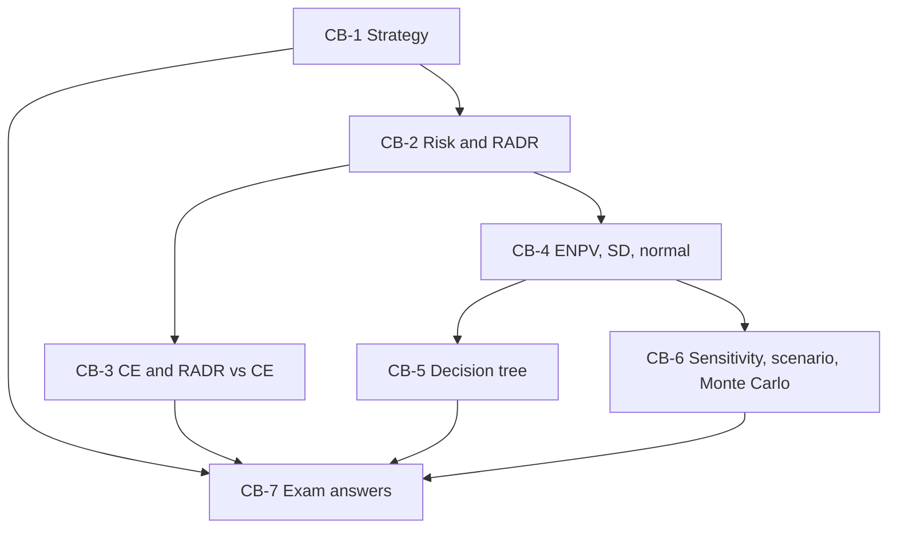

# SFM Unit 1: Strategy and Risk in Capital Budgeting, node map

The course plan gives a 1-hour, 30-mark paper: two of three 5-mark answers plus one 20-mark case. The vault formula sheet records CIA3 as covering Units IV and V only, so Units I and II are more likely tested at the end-semester exam **[VERIFY the date and scope with faculty]**. For this unit the case is most likely a risky-project appraisal (RADR, CE, ENPV, SD, maybe a tree). The strategy notes, the RADR problem set and the renewable-energy CE case are **faculty class material**. The sensitivity, scenario, decision-tree and Monte Carlo examples are textbook method with illustrative figures.

## Nodes

| Node | Topic | Deps | Minutes | Exam focus |
|---|---|---|---|---|
| CB-1 | Strategy and Financial Strategy | none | 30 | yes |
| CB-2 | Risk Sources and Risk Adjusted Discount Rate | CB-1 | 40 | yes |
| CB-3 | Certainty Equivalent and RADR vs CE | CB-2 | 40 | yes |
| CB-4 | Expected NPV Standard Deviation and Normal Distribution | CB-2 | 40 | yes |
| CB-5 | Decision Tree Analysis | CB-4 | 30 | yes |
| CB-6 | Sensitivity Scenario and Monte Carlo | CB-4 | 45 | yes |
| CB-7 | Unit 1 Exam Answers | CB-1, CB-3, CB-5, CB-6 | 35 | yes |

Total reading time: about 260 minutes.

## Dependency graph

## Headline numbers to know

- Class EV plant (RADR): PV ₹9,09,091, NPV ₹1,09,091. Class CE example: 80,000 ÷ 1.10 = 72,727, NPV ₹2,727.
- Faculty RADR set: Q1 +44,220; Q2 -12,000 (table sum -12,010); Q3 +9,710; Q4 -23,580; Q5 sheet 0 but computed +15,370.
- Renewable CE case (class): certain flows ₹193M, PV ₹168.06M (168.09 on 3-decimal factors), NPV +₹18.06M (+18.09). RADR comparison at an assumed 12%: +₹37.53M.
- ENPV example 2.8 lakh. Scenario set: ENPV 17.5, σ 31.92, CV 1.82, Z -0.55, P(loss) about 29%. Normal (100, 20): P(<80) = 15.87%.
- Decision tree: after pilot success +87, after failure stop, pilot path 33.5 against direct launch 24.
- Running project: base NPV +₹81,500; price break-even -2.26%; scenario ENPV ₹76,994, σ ₹4,67,785, CV 6.08.
