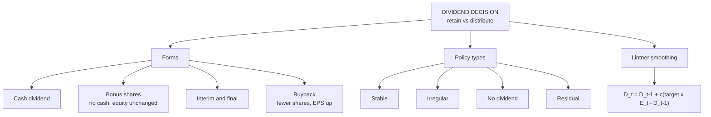

# DV-1: Dividend Decision, Forms and Policy Types

Covers: what the dividend decision is, payout and retention ratios, the forms of dividend (cash, bonus, interim, final, buyback) with worked illustrations, the four policy types, and Lintner's smoothing model. The opening definition is **(class)**; the rest is **(textbook)**. The class notes cover only the decision and the Walter and MM models, so this node fills the gap.

## The dividend decision (class)

The dividend decision is the choice between how much profit after tax is **retained** and how much is **distributed** to shareholders. Your class note adds the key link: if internal funds are not enough for a large expansion, external sources must be raised, so paying dividends stunts internal capacity. Every rupee paid out is a rupee not available for reinvestment.

That link between dividend, investment and financing is why dividend policy is a finance decision at all. It affects share price, the signal sent to investors, liquidity and dependence on external finance.

**Key ratios**
- **Payout ratio** = DPS ÷ EPS. **Retention ratio b** = 1 − payout.
- **Growth from retention** g = b × r (r = return on reinvested funds).

## Forms of dividend (textbook)

| Form | What happens | Cash leaves? | Total equity |
|---|---|---|---|
| Cash dividend | Paid from profits or free reserves | Yes | Falls by the dividend |
| Stock dividend (bonus shares) | Reserves are capitalised into share capital | No | Unchanged; only the number of shares rises |
| Interim dividend | Declared by the board during the year | Yes | Falls |
| Final dividend | Recommended by the board, approved by shareholders at the AGM | Yes | Falls |
| Buyback | Firm repurchases its own shares | Yes | Falls; fewer shares |

### Worked illustration: bonus issue (illustrative)

A firm has 10,00,000 shares of ₹10 face value, profit ₹50,00,000 (EPS ₹5) and market price ₹120. It issues bonus shares 1 for every 5 held.

1. New shares = 10,00,000 ÷ 5 = **2,00,000**. Reserves capitalised = 2,00,000 × 10 = ₹20,00,000. Shares after = **12,00,000**.
2. EPS after = 50,00,000 ÷ 12,00,000 = **₹4.17**.
3. Theoretical ex-bonus price = 120 × 10,00,000 ÷ 12,00,000 = **₹100**.
4. An investor with 100 shares: before 100 × 120 = ₹12,000; after 120 shares × 100 = ₹12,000.

**Interpretation:** a bonus changes the number of shares, not the value of the firm or of any holder. Its use is signalling and affordability (lower price per share, a sign management expects earnings to grow), not cash return. In practice the market sometimes rewards it, which is a signalling effect.

### Worked illustration: buyback versus dividend (illustrative, no taxes)

A firm has 10,00,000 shares at ₹100 (market value ₹10 crore) and ₹1 crore of surplus cash, earnings ₹1 crore (EPS ₹10).

| | Cash dividend of ₹10 a share | Buyback of 1,00,000 shares at ₹100 |
|---|---|---|
| Cash paid out | ₹1 crore | ₹1 crore |
| Shares after | 10,00,000 | 9,00,000 |
| Price after | ₹90 (ex-dividend) | ₹100 (₹9 crore ÷ 9,00,000) |
| Holder of 100 shares who does not sell | 100 × 90 + ₹1,000 cash = ₹10,000 | 100 × 100 = ₹10,000 |
| EPS after (earnings unchanged) | ₹10 | ₹11.11 |

**Interpretation:** a buyback raises EPS but not wealth. Under perfect markets the investor is indifferent, which is the MM argument (DV-5). The practical difference is **tax and signalling**, covered in DV-2 and DV-6. Buyback rules: Companies Act s.68 and SEBI buyback regulations, with a cap on size and a cooling-off period **[VERIFY limits]**.

## Types of dividend policy (textbook)

| Policy | Meaning | When a firm uses it |
|---|---|---|
| Stable / regular | Fixed rupee DPS, or steady growth in DPS | Mature firms with steady earnings; investors like it |
| Irregular | Paid when profit allows, no commitment | Volatile earnings |
| No dividend | All profit retained | High-growth firm with many projects above the cost of capital |
| Residual | Pay out only what is left after funding every project that beats the cost of capital | Firms for which investment policy drives the payout |

In the **class vocabulary** (Walter, DV-3): growing firms (r > Ko) retain; "stabling" (normal) firms (r = Ko) can do either; mature firms (r < Ko) distribute. Your note spells these "Growing, Stabling, Mature".

**Residual illustration (illustrative).** Profit ₹10 crore; projects above the cost of capital need ₹6 crore; financed by retaining. Dividend = 10 − 6 = **₹4 crore** (payout 40%). If the profitable projects needed ₹12 crore, dividend would be nil. The dividend swings with investment needs, which is its weakness: investors dislike an erratic payout.

## Lintner's model (textbook)

Firms have a **target payout ratio** but move toward it slowly, so dividends are smoothed:

**D_t = D_(t−1) + c × (Target payout × E_t − D_(t−1))**, where c is the speed of adjustment (0 < c ≤ 1).

### Worked example, laid out as the exam answer

**Question (illustrative):** Last dividend ₹4, target payout 50%, speed of adjustment c = 0.5. EPS is ₹10, then ₹12, then ₹8. Find the dividend each year.

1. Formula: D_t = D_(t−1) + c (target × E_t − D_(t−1)).
2. Year 1: target dividend = 0.5 × 10 = 5. D = 4 + 0.5 × (5 − 4) = **4.50**.
3. Year 2: target = 0.5 × 12 = 6. D = 4.50 + 0.5 × (6 − 4.50) = **5.25**.
4. Year 3: target = 0.5 × 8 = 4. D = 5.25 + 0.5 × (4 − 5.25) = **4.625**.

| Year | EPS (₹) | Target dividend (₹) | Actual DPS (₹) | Actual payout |
|---|---|---|---|---|
| 1 | 10 | 5.00 | 4.50 | 45.0% |
| 2 | 12 | 6.00 | 5.25 | 43.8% |
| 3 | 8 | 4.00 | 4.625 | 57.8% |

**Decision line and interpretation:** EPS fell 33% in year 3 (12 to 8) but the dividend fell only 12% (5.25 to 4.625), and the payout rose to about 58%. Dividends lag earnings both ways, so they are rarely cut. That is why managers treat a dividend cut as a serious signal and why a dividend increase is made only when earnings look durable.

## What to remember

- The dividend decision is retain versus distribute; paying out reduces internal funds, so external finance may be needed.
- Payout = DPS ÷ EPS; retention b = 1 − payout; growth g = b × r.
- Bonus shares: no cash out, equity unchanged, shares rise. Buyback: cash out, fewer shares, EPS rises.
- Four policy types: stable, irregular, no dividend, residual.
- Lintner: D_t = D_(t−1) + c(target × E_t − D_(t−1)); dividends smoothed. Worked: 4.50, 5.25, 4.625.
- Class terms: growing (r > Ko), stabling (r = Ko), mature (r < Ko).

## Concept map

## Flashcards
Q: What is the dividend decision?
A: The choice between distributing profit as dividend and retaining it for reinvestment.

Q: Why does paying a dividend matter for investment?
A: Retained earnings are internal funds. Paying them out may force the firm to raise external finance for large expansion.

Q: Payout ratio, retention ratio and growth from retention?
A: Payout = DPS ÷ EPS; retention b = 1 − payout; g = b × r.

Q: Stock dividend (bonus shares) versus cash dividend?
A: Bonus capitalises reserves, so no cash leaves and total equity is unchanged; cash dividend reduces reserves and cash.

Q: Bonus 1:5 on 10,00,000 shares at ₹120 (EPS ₹5): new shares, EPS and ex-bonus price?
A: 2,00,000 new shares (12,00,000 total); EPS ₹4.17; price ₹100. A holder's value is unchanged.

Q: Interim versus final dividend?
A: Interim is declared by the board during the year; final is recommended by the board and approved by shareholders at the AGM.

Q: Residual dividend policy?
A: Fund every project with return above the cost of capital first and pay out only what remains.

Q: Four types of dividend policy?
A: Stable (regular), irregular, no dividend, residual.

Q: Lintner's model in one line?
A: Firms move gradually toward a target payout ratio: D_t = D_(t−1) + c(target × E_t − D_(t−1)), so dividends are smoothed and rarely cut.

Q: Lintner: last dividend ₹4, target 50%, c = 0.5, EPS ₹10. Dividend?
A: 4 + 0.5 × (5 − 4) = ₹4.50.

Q: In the class terms, what do growing, stabling and mature firms do?
A: Growing (r > Ko) retain; stabling (r = Ko) may pay or retain; mature (r < Ko) pay out.

## Sources
- Student class note: Dividend Policy
- Vault note: `SFM CIA3 - Unit II Dividend Theory and Policy` (section 1)
- Textbook method: Prasanna Chandra, I M Pandey (Lintner, forms, buyback)
- Next node: [[SFM Unit 2 - DV-2 Determinants and Dividend Analysis in Practice]]
- [[SFM Unit 2 - Dividend Policy MOC (Node Map)]]
