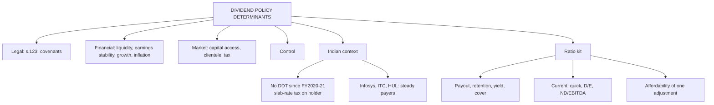

# DV-2: Determinants and Dividend Analysis in Practice

Covers: the ten determinants of dividend policy, the Indian legal and tax context, and a ratio kit for judging a company's dividend (payout, yield, cover, liquidity, solvency, affordability) with a worked example. The determinants are **(textbook)**; the ratio kit follows the CIA2 dividend-analysis brief **(class assignment)**. Company references are qualitative. Law and tax details carry **[VERIFY]** tags.

## Determinants of dividend policy (textbook)

| Factor | How it pushes the decision |
|---|---|
| Legal restrictions | Companies Act 2013, s.123: dividend only from current profit after depreciation, or free reserves, or both, after transfers to reserves where required; paid within 30 days of declaration; unclaimed dividend goes to the Investor Education and Protection Fund after 7 years **[VERIFY sections and periods]** |
| Liquidity | Profit is not cash. A profitable firm short of cash cannot pay |
| Stability of earnings | Steady earnings support a high, stable payout; volatile earnings force caution |
| Growth opportunities | Many projects with r > k means retain; few projects means distribute |
| Access to capital markets | Cheap, easy external funds reduce the need to retain; a small unlisted firm retains more |
| Shareholder preference (clientele) | Retirees want income; high-bracket investors prefer gains |
| Taxation | Relative tax on dividend versus capital gain |
| Inflation | Replacing assets costs more, so more profit is retained |
| Control | Raising equity dilutes holders, so promoters may retain instead |
| Contractual restrictions | Loan covenants often cap dividends while leverage or coverage ratios are breached |

**Grouping for a 5-mark answer:** legal (law, covenants), financial (liquidity, earnings stability, growth, inflation), market (capital-market access, clientele, tax), and control. One line of effect per item.

## Indian context

- **Tax.** Dividend distribution tax was abolished from FY2020-21. Dividend is now taxed in the **shareholder's hands at slab rate**, with TDS by the company above a threshold **[VERIFY current TDS rate and threshold; the threshold was raised from FY2025-26]**.
- **Policy disclosure.** Listed companies above a market-capitalisation cutoff (the top 1,000 at last check) must publish a dividend distribution policy under SEBI's listing regulations **[VERIFY: the cutoff has been widened over time]**.
- **Buyback tax.** From October 2024 buyback proceeds were taxed in the shareholder's hands as deemed dividend, which narrowed the tax edge buybacks once had **[VERIFY: later Budgets, including 2026, may have changed this; check the current rule before quoting]**.
- **Examples.** Infosys, ITC and HUL are the standard examples of consistent, high-payout, cash-rich companies: mature businesses, steady earnings, limited need to retain. Say this qualitatively; do not quote payout percentages unless the case gives them.
- **Dividends are declared from standalone profits** under the Companies Act, while analysts often use consolidated EPS. State this limitation when computing payout from consolidated figures.

## Dividend analysis in practice: the ratio kit (CIA2 method)

The CIA2 brief asked for a five-year analysis of one listed company with six parts: a concept note, a data table (EPS, DPS, payout, retention), working capital, payout versus market price, liquidity and solvency, and a recommendation with **one** adjustment. The ratios below are the kit.

| Ratio | Formula | Reads as |
|---|---|---|
| Payout | DPS ÷ EPS | Share of earnings distributed |
| Retention | 1 − payout | Share kept for reinvestment |
| Dividend yield | DPS ÷ price | Cash return on price |
| P/E | Price ÷ EPS | Market's price for earnings |
| Dividend cover | EPS ÷ DPS | Times earnings cover the dividend |
| Sustainable growth | b × ROE | Growth funded by retention |
| Current ratio | Current assets ÷ current liabilities | Short-term liquidity |
| Quick ratio | (Current assets − inventory) ÷ current liabilities | Liquidity without stock |
| Debt/equity; debt/assets | Debt ÷ equity; debt ÷ total assets | Gearing |
| Net debt/EBITDA | (Debt − cash) ÷ EBITDA | Years of earnings to repay net debt |

## Worked example, laid out as the exam answer (illustrative)

**Question (illustrative data):** EPS ₹20, DPS ₹6, price ₹300, ROE 15%. Current assets ₹150 crore, inventory ₹50 crore, current liabilities ₹100 crore, debt ₹200 crore, equity ₹400 crore, total assets ₹600 crore, cash ₹30 crore, EBITDA ₹120 crore. Judge whether the dividend is sustainable.

1. Payout = 6 ÷ 20 = **30%**; retention = **70%**.
2. Yield = 6 ÷ 300 = **2.0%**; P/E = 300 ÷ 20 = **15**; cover = 20 ÷ 6 = **3.33 times**.
3. Sustainable growth = 0.70 × 15% = **10.5%**.
4. Liquidity: current ratio = 150 ÷ 100 = **1.5**; quick ratio = (150 − 50) ÷ 100 = **1.0**.
5. Solvency: D/E = 200 ÷ 400 = **0.5**; debt/assets = 200 ÷ 600 = **33.3%**; net debt/EBITDA = (200 − 30) ÷ 120 = **1.42 times**.

| Test | Result | Reading |
|---|---|---|
| Earnings cover | 3.33 times | Comfortable |
| Liquidity | 1.5 / 1.0 | Adequate |
| Gearing | 0.5 / 1.42 times | Moderate |
| Growth | 10.5% from retention | Retention is working |

**Decision line and interpretation:** the dividend is **sustainable**, and the 30% payout is low relative to what the balance sheet can support. A firm retaining 70% must show that it earns more than the cost of capital on what it keeps (Walter, DV-3). If it cannot, the one adjustment is to raise the payout; if it can, hold.

### Affordability test for the "one adjustment" (illustrative)

PAT ₹1,000 crore, current dividend ₹80 crore (payout 8%), EBITDA ₹1,500 crore, net debt ₹1,800 crore. Proposal: raise payout to 20%.
- New dividend = 0.20 × 1,000 = ₹200 crore; extra outflow = ₹120 crore = 8% of EBITDA.
- Net debt/EBITDA moves from 1,800 ÷ 1,500 = **1.20 times** to (1,800 + 120) ÷ 1,500 = **1.28 times** if funded by borrowing.

**Interpretation:** the proposal costs eight percentage points of one year's EBITDA and moves leverage by under 0.1 times, so it is affordable. A recommendation of this shape (a published floor plus a variable component, tied to a payout band) uses Lintner's smoothing and gives shareholders a standard to hold the company to. It is a capital-discipline argument, not a tax-efficiency one, since dividends are taxed at slab rates.

## Lessons from the CIA2 work

- A payout ratio that barely moves cannot explain a share price that moves a lot. With only five annual observations, correlations are descriptive, not statistical proof (n = 5 needs r above about 0.88 at 5%).
- When payout rises because EPS fell and DPS stayed flat, no decision was taken; say so.
- Source data from audited filings, not aggregators. Aggregator figures for debt and total assets disagreed by up to about 10% in the CIA2 data pack. **[VERIFY any company figure against filings before quoting]**.

## What to remember

- Ten determinants: legal, liquidity, earnings stability, growth, capital-market access, clientele, tax, inflation, control, covenants.
- Since FY2020-21 dividends are taxed in the shareholder's hands at slab rate (no DDT). Check TDS and buyback rules **[VERIFY]**.
- Companies Act s.123: pay from profits or free reserves; 30 days to pay; unclaimed to IEPF after 7 years **[VERIFY]**.
- Ratio kit: payout, retention, yield, P/E, cover, b × ROE, current, quick, D/E, net debt/EBITDA.
- Worked kit: payout 30%, cover 3.33, growth 10.5%, net debt/EBITDA 1.42, sustainable.
- Recommend one adjustment, argued with an affordability test.

## Concept map

## Flashcards
Q: Name five determinants of dividend policy.
A: Legal restrictions, liquidity, stability of earnings, growth opportunities, access to capital markets (also clientele, tax, inflation, control, covenants).

Q: Why does liquidity limit dividends even when profit is high?
A: Profit is not cash. A profitable firm without cash cannot pay.

Q: How does growth opportunity affect payout?
A: Many projects with r above k mean retain; few such projects mean distribute.

Q: How is dividend taxed in India since FY2020-21?
A: In the shareholder's hands at slab rate, after dividend distribution tax was abolished. TDS rates and thresholds change, so verify.

Q: What does Companies Act s.123 require for paying a dividend?
A: Pay from current profit after depreciation or from free reserves, within 30 days of declaration [VERIFY]. Unclaimed dividend goes to the investor education fund after 7 years [VERIFY].

Q: Which Indian companies are standard examples of consistent high payers?
A: Infosys, ITC and HUL: mature, cash-rich, steady earnings, limited need to retain. Use qualitatively.

Q: Formulas for payout, dividend cover and sustainable growth?
A: Payout = DPS ÷ EPS; cover = EPS ÷ DPS; sustainable growth = retention × ROE.

Q: EPS ₹20, DPS ₹6, ROE 15%: payout, cover, growth?
A: 30%, 3.33 times, 0.70 × 15% = 10.5%.

Q: Net debt/EBITDA for debt 200, cash 30, EBITDA 120?
A: (200 − 30) ÷ 120 = 1.42 times.

Q: Illustrative: raising payout from 8% to 20% of PAT ₹1,000 crore, EBITDA ₹1,500 crore. Extra outflow and effect?
A: Extra ₹120 crore (8% of EBITDA); net debt/EBITDA moves from 1.20 to 1.28 if borrowed. Affordable.

Q: Why use a covenant check in dividend analysis?
A: Loan covenants often cap dividends while leverage or coverage ratios are breached.

## Sources
- Vault note: `SFM CIA3 - Unit II Dividend Theory and Policy` (section 2)
- CIA2 dividend policy assignment: brief, argument and recommendation, sourcing correction (qualitative use only)
- Textbook method: Prasanna Chandra, I M Pandey (ratio analysis)
- Next node: [[SFM Unit 2 - DV-3 Walter Model]]
- [[SFM Unit 2 - Dividend Policy MOC (Node Map)]]
