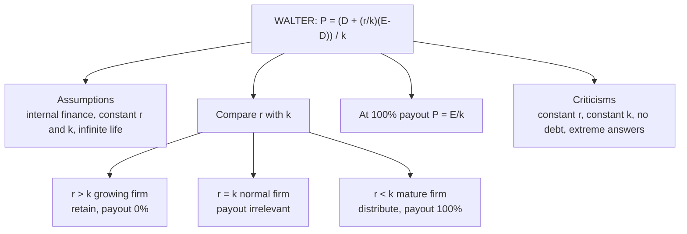

# DV-3: Walter Model

Covers: the Walter idea and assumptions, the correct formula, the three-case decision rule with the class firm types, a full price table, a worked exam answer, and the criticisms. The theory and firm types are **(class)**; the assumptions, table and criticisms are **(textbook)**.

## Correction to your class note

> Your note has `P = D + (r//ko)(E-D)/Ko`. As written, the brackets are missing, so the division by Ko applies only to the last term. Correct is
> **P = [ D + (r/k)(E − D) ] / k**
> because the *whole* numerator is divided by k. Use one symbol for the cost of capital (k, Ko or Ke) throughout an answer.

## The idea (class)

Compare the firm's **IRR (r)** with its **cost of capital (k, your Ko)**. The right payout depends on whether retained money earns more or less than shareholders could earn elsewhere. Dividend policy is therefore **relevant**.

- r > k: invest and grow, retain.
- r < k: distribute the profits.

**Types of firm (class)**

| Class term | Condition | What to do | Walter optimal payout |
|---|---|---|---|
| Growing firm | r > k | Retain, do not pay dividends | 0% |
| "Stabling" (normal) firm | r = k | Pay or invest, no difference | Irrelevant |
| Mature (declining) firm | r < k | Give back as dividends | 100% |

## Assumptions (textbook)

1. All financing is internal (retained earnings only). No new debt or equity.
2. r and k are constant.
3. All earnings are either distributed or reinvested immediately.
4. E and D are constant forever; the firm has an infinite life.
5. Investment opportunities are unlimited at rate r.

## Formula

**P = [ D + (r/k)(E − D) ] / k**

P = market price per share; D = DPS; E = EPS; (E − D) = retained earnings per share; r = IRR; k = cost of capital.

Read it as two parts: **D/k** (present value of the dividend stream) plus **(r/k)(E − D)/k** (present value of the extra income earned on retained money). At 50% payout with E = 10, k = 10%, r = 15%: D/k = 5 ÷ 0.10 = 50; retained part = (1.5 × 5) ÷ 0.10 = 75; P = **125**.

## Price table: E = ₹10, k = 10% (same data for all three firms)

| Payout | D | Growth r = 15% | Normal r = 10% | Declining r = 8% |
|---|---|---|---|---|
| 0% | ₹0 | **₹150.00** | ₹100.00 | ₹80.00 |
| 25% | ₹2.50 | ₹137.50 | ₹100.00 | ₹85.00 |
| 50% | ₹5.00 | ₹125.00 | ₹100.00 | ₹90.00 |
| 75% | ₹7.50 | ₹112.50 | ₹100.00 | ₹95.00 |
| 100% | ₹10.00 | ₹100.00 | ₹100.00 | **₹100.00** |

Each extra ₹2.50 of dividend costs the growth firm ₹12.50 of price and adds ₹5 to the declining firm. At 100% payout every firm is worth E/k = 10 ÷ 0.10 = ₹100, because with nothing retained the reinvestment term vanishes.

## Worked example, laid out as the exam answer

**Question:** Three firms each have EPS ₹10 and k = 10%. Their returns on investment are 15%, 10% and 8%. Using Walter's model, find the price at 0%, 40% and 100% payout and recommend a payout for each.

1. Formula: P = [D + (r/k)(E − D)] ÷ k.
2. Classify: r = 15% > k (growth); r = 10% = k (normal); r = 8% < k (declining).
3. Compute (40% payout: D = ₹4, E − D = ₹6):
   - Growth: [4 + 1.5 × 6] ÷ 0.10 = 13 ÷ 0.10 = **₹130**.
   - Normal: [4 + 1.0 × 6] ÷ 0.10 = **₹100**.
   - Declining: [4 + 0.8 × 6] ÷ 0.10 = 8.8 ÷ 0.10 = **₹88**.

| Payout | Growth (r 15%) | Normal (r 10%) | Declining (r 8%) |
|---|---|---|---|
| 0% (D = 0) | 150 | 100 | 80 |
| 40% (D = 4) | 130 | 100 | 88 |
| 100% (D = 10) | 100 | 100 | 100 |

**Decision line and interpretation:** growth firm, retain everything (price falls from 150 to 100 as payout rises); normal firm, payout is irrelevant (price stays 100); declining firm, pay out everything (price rises from 80 to 100). The rule in one sentence: **retain only when the firm can reinvest at more than its shareholders' required return.** Add one line of caution: the answer is extreme (0% or 100%) because r is assumed constant, which is unrealistic.

## Criticisms (textbook)

- Constant r is unrealistic: as a firm invests more, r falls because good projects run out.
- Constant k ignores that risk changes with the payout and with the investment mix.
- All-equity financing excludes debt, which is how real firms fund growth.
- The result is extreme (0% or 100%), rarely seen in practice.

## What to remember

- Correct formula: P = [D + (r/k)(E − D)] / k. Brackets matter.
- r > k retain (0% payout); r = k irrelevant; r < k pay out (100%).
- Class names: growing, stabling (normal), mature. Assumptions: internal finance, constant r and k, infinite life.
- At 100% payout P = E/k for every firm (₹100 here).
- Table: growth firm 150, 137.50, 125, 112.50, 100 as payout rises from 0 to 100%.
- Criticise constant r and k, and the all-equity assumption.

## Concept map

## Flashcards
Q: What is the correct Walter formula?
A: P = [D + (r/k)(E − D)] / k. The whole numerator is divided by k.

Q: What do r and k stand for in Walter's model?
A: r = the firm's return (IRR) on retained funds; k (Ko) = the cost of capital.

Q: Walter rule when r > k?
A: Growing firm, retain; the optimal payout is 0%.

Q: Walter rule when r = k?
A: Normal ("stabling") firm; payout is irrelevant and price is E/k at every payout.

Q: Walter rule when r < k?
A: Mature (declining) firm, distribute everything; optimal payout 100%.

Q: Walter price, E ₹10, k 10%, r 15%, payout 0%?
A: ₹150. It falls to ₹100 at 100% payout.

Q: Walter price, E ₹10, k 10%, r 15%, payout 40%?
A: [4 + 1.5 × 6] ÷ 0.10 = ₹130.

Q: Walter price, E ₹10, k 10%, r 8%, payout 40%?
A: [4 + 0.8 × 6] ÷ 0.10 = ₹88.

Q: State three Walter assumptions.
A: All financing internal; constant r and k; all earnings distributed or reinvested immediately; E and D constant forever; infinite life.

Q: Two criticisms of Walter's model?
A: Constant r and k are unrealistic (r falls as investment rises), and it ignores external financing, giving extreme 0% or 100% answers.

Q: Why is the price at 100% payout the same for every firm?
A: With nothing retained, the reinvestment term vanishes and P = E/k.

## Sources
- Student class note: Dividend Policy (Walter's Theory)
- Vault note: `SFM CIA3 - Unit II Dividend Theory and Policy` (section 3)
- Next node: [[SFM Unit 2 - DV-4 Gordon Model]]
- [[SFM Unit 2 - Dividend Policy MOC (Node Map)]]
