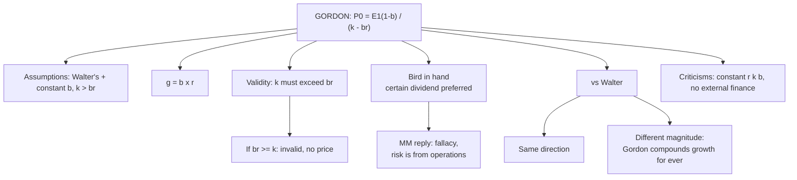

# DV-4: Gordon Model

Covers: Gordon's idea and extra assumptions, the formula, a full price table including the invalid cells, how to read it against Walter, the bird-in-hand argument, a worked exam answer, and criticisms. The class notes do not cover Gordon, so this node is **(textbook)**; if your faculty used a different notation, follow the faculty.

## The idea

The value of a share is the present value of a **growing dividend stream**. Retaining more raises growth but lowers current dividends. Dividend policy is **relevant**.

## Assumptions (Walter's, plus)

1. Retention ratio b is constant, so growth **g = b × r** is constant.
2. **k > g = br.** If not, the formula gives a meaningless (negative or infinite) price.
3. The firm uses only equity, has perpetual life and raises no new external finance.

## Formula

**P0 = E1(1 − b) / (k − br) = D1 / (k − g)**

b = retention ratio; (1 − b) = payout ratio; D1 = E1(1 − b).

Check: if r = k, then P0 = E(1 − b) / (k(1 − b)) = E/k, so a normal firm is worth E/k at every payout, as in Walter.

## Price table: E = ₹10, k = 10% (same data as the Walter table)

| Payout | b | D | Growth r = 15%: k − br, P0 | Normal r = 10%: k − br, P0 | Declining r = 8%: k − br, P0 |
|---|---|---|---|---|---|
| 0% | 1.00 | ₹0 | -0.050, **invalid** | 0.000, **invalid** | 0.020, ₹0 (no dividend) |
| 25% | 0.75 | ₹2.50 | -0.0125, **invalid** | 0.025, ₹100.00 | 0.040, ₹62.50 |
| 50% | 0.50 | ₹5.00 | 0.025, ₹200.00 | 0.050, ₹100.00 | 0.060, ₹83.33 |
| 75% | 0.25 | ₹7.50 | 0.0625, ₹120.00 | 0.075, ₹100.00 | 0.080, ₹93.75 |
| 100% | 0 | ₹10.00 | 0.100, ₹100.00 | 0.100, ₹100.00 | 0.100, ₹100.00 |

**How to read it**
- **Growth firm:** price climbs as payout falls (100, 120, 200) until br gets close to k, then the model breaks. At 25% and 0% payout br ≥ k, so the formula is invalid. State "invalid" in those cells; do not write a price.
- **Normal firm:** ₹100 wherever the model is valid. At 0% payout the formula is 0 ÷ 0, undefined. Same verdict as Walter.
- **Declining firm:** price rises with payout, 100% is best. Same direction as Walter.
- **Magnitude differs from Walter.** At 50% payout the growth firm is ₹200 under Gordon against ₹125 under Walter. The models agree on direction but not size. Clarification: Walter holds E and D constant (retained money earns r on the current retention only), whereas Gordon lets dividends grow at g = br for ever, so the retention compounds. Gordon's value therefore explodes as br approaches k.

## Bird-in-hand argument

Gordon (and Lintner) argued investors prefer a **certain dividend today** over an uncertain capital gain tomorrow. As retention rises, the future gain becomes riskier, so investors raise k as b rises. Result: a higher payout can raise price even when r > k. In the exam, say this is the economic reason dividends matter even when the textbook algebra says retain.

**MM's reply:** the "bird in hand" fallacy. A firm's risk comes from its business operations, not from how earnings are split between dividend and retention (see DV-5).

## Worked example, laid out as the exam answer

**Question:** A firm has EPS ₹10 and k = 10%. Its return on investment is 15%. Using Gordon's model find the price at payouts of 50%, 75% and 100%, test validity, and compare with Walter.

1. Formula: P0 = E(1 − b) ÷ (k − br).
2. Validity: k must exceed br.
3. Compute:
   - 50% payout: b = 0.50, br = 0.075, k − br = 0.025 (valid). D = ₹5. P0 = 5 ÷ 0.025 = **₹200**.
   - 75% payout: b = 0.25, br = 0.0375, k − br = 0.0625 (valid). D = ₹7.50. P0 = 7.50 ÷ 0.0625 = **₹120**.
   - 100% payout: b = 0, k − br = 0.10. P0 = 10 ÷ 0.10 = **₹100**.

| Payout | b | br | k − br | Valid? | Gordon P0 | Walter P |
|---|---|---|---|---|---|---|
| 50% | 0.50 | 0.075 | 0.025 | Yes | ₹200.00 | ₹125.00 |
| 75% | 0.25 | 0.0375 | 0.0625 | Yes | ₹120.00 | ₹112.50 |
| 100% | 0 | 0 | 0.100 | Yes | ₹100.00 | ₹100.00 |
| 25% | 0.75 | 0.1125 | -0.0125 | **No** | invalid | ₹137.50 |

**Decision line and interpretation:** price rises as payout falls (100 to 120 to 200), so for a growth firm the model also favours retention, the same direction as Walter. But Gordon's value becomes unreliable once br nears k (at 25% payout it fails), so do not recommend a zero payout on the strength of this model. Mention bird in hand as the reason investors may still value a dividend.

## Criticisms (textbook)

- Constant r, k and b are unrealistic, as in Walter.
- k > br is a hard limit that makes the model useless for fast growers.
- It assumes k rises with retention without a measurable link.
- It ignores external financing, taxes and flotation costs.
- MM's reply: bird in hand is a fallacy; risk comes from operations, not the payout split.

## What to remember

- Formula: P0 = E1(1 − b) / (k − br) = D1 / (k − g), with g = b × r.
- The model needs k > br. If not, write "invalid", never a price.
- Growth firm (r 15%): Gordon prices 200, 120, 100 at payouts 50%, 75%, 100%.
- Normal firm: ₹100 where valid. Declining firm: higher payout, higher price.
- Gordon and Walter agree on direction, not on size.
- Bird in hand: certain dividends are valued over uncertain gains; MM calls it a fallacy.

## Concept map

## Flashcards
Q: What is Gordon's formula?
A: P0 = E1(1 − b) / (k − br), which equals D1 / (k − g) with g = br.

Q: What condition must hold for Gordon's formula to be valid?
A: k must exceed br; otherwise the price is negative or infinite.

Q: What is g in Gordon's model?
A: Growth rate = retention ratio × return on investment, g = b × r.

Q: Gordon price, E ₹10, k 10%, r 15%, payout 50%?
A: D = 5, k − br = 0.025, so P0 = ₹200.

Q: Gordon price, E ₹10, k 10%, r 15%, payout 75%?
A: D = 7.50, k − br = 0.0625, so P0 = ₹120.

Q: Gordon price, E ₹10, k 10%, r 15%, payout 25%?
A: Invalid: b = 0.75, br = 0.1125 exceeds k = 0.10.

Q: Gordon price for a declining firm (r 8%), E ₹10, k 10%, payout 50%?
A: k − br = 0.10 − 0.04 = 0.06; P0 = 5 ÷ 0.06 = ₹83.33.

Q: What is the bird-in-hand argument?
A: Investors prefer a certain dividend now to an uncertain future gain, so retention raises the required return and a higher payout can raise price.

Q: MM's reply to bird in hand?
A: It is a fallacy: risk comes from the firm's operations, not from how profit is split.

Q: How do Gordon and Walter differ?
A: Same direction (growth firms retain, declining firms distribute), different magnitude. Gordon compounds growth g = br for ever and adds the k > br limit; Walter keeps E and D constant.

Q: Why does Gordon's value for a normal firm (r = k) equal E/k at every payout?
A: P0 = E(1 − b) ÷ (k(1 − b)) = E/k, since r = k.

## Sources
- Vault note: `SFM CIA3 - Unit II Dividend Theory and Policy` (section 4)
- Textbook method: Prasanna Chandra, I M Pandey
- Next node: [[SFM Unit 2 - DV-5 Modigliani-Miller Irrelevance Approach]]
- [[SFM Unit 2 - Dividend Policy MOC (Node Map)]]
