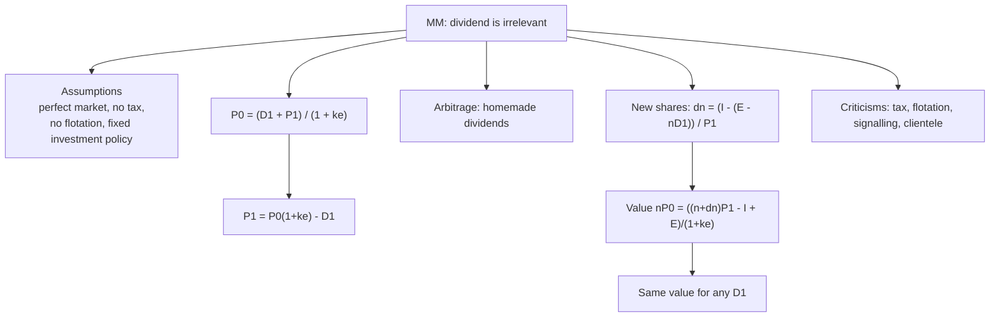

# DV-5: Modigliani-Miller Irrelevance Approach

Covers: the MM claim and assumptions, the arbitrage (homemade dividend) proof, the three formulas, the class ₹80 example tidied, the full firm-value proof with new shares (ICAI style), and the criticisms. The claim, assumptions and ₹80 example are **(class)**; the proof and criticisms are **(textbook)**.

## The claim (class)

Dividend policy is **irrelevant** to market value. The value of the firm is determined by its **earning power and its investment decisions**, not by how profit is split between dividend and retention. Three factors drive value: the firm's future earning power, the return generated by its investments, and the required rate of return. Value ultimately depends on the income-generating capacity of the firm's assets.

## Assumptions

1. **Perfect capital market** (class): investors have access to relevant information, behave rationally, securities are easily bought and sold, no single investor can move prices.
2. **No taxes**, or no difference between tax on dividends and on capital gains.
3. **No flotation or transaction costs.**
4. **Fixed investment policy**: investment decisions are independent of dividend decisions.
5. **Certainty** of future profits and investments (later relaxed with the same conclusion).

## Proof logic: arbitrage and homemade dividends

If a firm pays a lower dividend and retains the rest, the share price rises by the retained amount. An investor who wants cash sells a few shares: a **homemade dividend**. If the firm pays a higher dividend, an investor who prefers growth reinvests the cash in the same shares. Either way the investor ends with the same total wealth, so the market will not pay a premium for either policy. Dividends change only the *form* of return.

## Formulas

- Price today: **P0 = (D1 + P1) / (1 + ke)**, so **P1 = P0(1 + ke) − D1**.
- New shares to fund investment: **Δn = [ I − (E − n × D1) ] / P1**.
- Value of firm: **nP0 = [ (n + Δn) P1 − I + E ] / (1 + ke)**.

n = shares now; I = investment; E = total earnings; n × D1 = total dividend; ke = cost of equity.

## Class example, tidied

P0 = ₹80, ke = 10%, D1 = ₹4.

- With dividend: P1 = 80 × 1.10 − 4 = **₹84**.
- Without dividend: P1 = 80 × 1.10 = **₹88**.
- Shareholder wealth at year end: ₹84 + ₹4 dividend = ₹88; or ₹88 + ₹0 = ₹88. **Identical.**
- Return check: ₹4 dividend + ₹4 gain (80 to 84) = ₹8 = 10% of ₹80. Investors earn ke either way.

**Correction to your class note.** Your note says "if shareholder gets 4 rupees dividend, and new share issue price make CMP 84, therefore existing investors get 4 + 4 rupees 8 total net return". Your ₹8 total return is correct (it is 10% of ₹80), but the cause is muddled. The correct statement: paying ₹4 *lowers the expected year-end price* from ₹88 to ₹84 because ₹4 of value has left the firm; the investor's total (₹84 + ₹4) is unchanged. A new share issue enters only when the firm must replace the paid-out cash to fund investment, as in the next example.

## Worked example, laid out as the exam answer (ICAI style)

**Question:** A firm has n = 1,00,000 shares, P0 = ₹100, ke = 10%, expected earnings E = ₹10,00,000 and planned investment I = ₹20,00,000. Show that firm value is the same whether D1 = ₹5 or D1 = ₹0.

1. P1 = P0(1 + ke) − D1.
2. Δn = [I − (E − nD1)] ÷ P1.
3. Value = [(n + Δn)P1 − I + E] ÷ (1 + ke).

| Step | D1 = ₹5 | D1 = ₹0 |
|---|---|---|
| P1 = 100 × 1.10 − D1 | ₹105 | ₹110 |
| Total dividend n × D1 | ₹5,00,000 | ₹0 |
| Earnings left after dividend, E − nD1 | ₹5,00,000 | ₹10,00,000 |
| Gap to raise, I − (E − nD1) | ₹15,00,000 | ₹10,00,000 |
| New shares Δn = gap ÷ P1 | 14,286 | 9,091 |
| (n + Δn) × P1 | ₹1,20,00,000 | ₹1,20,00,000 |
| Value = [(n+Δn)P1 − I + E] ÷ 1.10 | **₹1,00,00,000** | **₹1,00,00,000** |

Rounding note: Δn is 14,285.71 and 9,090.91 exactly. If you round the shares first, (n + Δn)P1 becomes ₹1,20,00,030 and ₹1,20,00,010 and the value ₹1,00,00,027 and ₹1,00,00,009. Write the fractional shares or note "rounded".

Check: n × P0 = 1,00,000 × 100 = ₹1,00,00,000.

**Decision line and interpretation:** firm value is ₹1 crore under both dividends, so the dividend decision does not change value. The mechanism: a bigger dividend drains cash, so more new shares must be issued at a lower price; a smaller dividend needs fewer new shares at a higher price; the two effects cancel exactly. Value is set by earnings and investment, which are the same in both cases. Add one line on limits: this holds only in a perfect market.

## Criticisms (textbook)

- **Taxes:** dividends and capital gains are taxed differently, and gains are deferred until sale.
- **Flotation costs:** raising new equity is not free, so retaining is cheaper than paying out and re-raising.
- **Transaction costs:** homemade dividends cost brokerage and may not be possible in odd lots.
- **Information content / signalling:** a dividend change tells the market what managers expect, so price moves on the announcement.
- **Uncertainty:** investors do not treat dividends and gains as equivalent under risk (bird in hand).
- **Clientele effect:** investors choose firms by payout, so policy affects who owns the stock.

## What to remember

- MM: value depends on earning power and investment policy, not on payout. Dividend is irrelevant in a perfect market.
- P0 = (D1 + P1) / (1 + ke); P1 = P0(1 + ke) − D1.
- Δn = [I − (E − nD1)] / P1; value nP0 = [(n + Δn)P1 − I + E] / (1 + ke).
- ₹80 example: P1 = 84 with dividend, 88 without; 84 + 4 = 88.
- ICAI example: value ₹1 crore for D1 = ₹5 and D1 = ₹0 (new shares 14,286 versus 9,091).
- Assumptions fail with taxes, flotation costs, signalling and clientele.

## Concept map

## Flashcards
Q: What is MM's core claim on dividends?
A: Firm value depends on earning power and investment policy, not on the payout split. Dividend is irrelevant in a perfect market.

Q: State the MM assumptions.
A: Perfect capital market, no taxes (or no tax difference), no flotation or transaction costs, fixed investment policy, certainty.

Q: MM price formula?
A: P0 = (D1 + P1) / (1 + ke), so P1 = P0(1 + ke) − D1.

Q: MM class example: P0 ₹80, ke 10%, D1 ₹4. P1 with and without dividend?
A: With dividend P1 = ₹84; without dividend P1 = ₹88. Wealth is ₹84 + ₹4 = ₹88 either way.

Q: What is a homemade dividend?
A: An investor sells some shares to create cash when the firm retains. So the firm's payout does not change the investor's wealth.

Q: Formula for new shares needed under MM?
A: Δn = [I − (E − nD1)] ÷ P1.

Q: MM firm-value formula?
A: nP0 = [(n + Δn)P1 − I + E] ÷ (1 + ke).

Q: ICAI example (n 1,00,000; P0 100; ke 10%; E 10,00,000; I 20,00,000): new shares for D1 = ₹5 and ₹0?
A: P1 = 105 and 110; Δn = 15,00,000 ÷ 105 = 14,286 and 10,00,000 ÷ 110 = 9,091.

Q: In the same example, what is firm value in each case?
A: ₹1,00,00,000 for both D1 = ₹5 and D1 = ₹0, equal to n × P0.

Q: Name three MM assumptions that fail in practice.
A: No taxes, no flotation or transaction costs, and perfect information (so no signalling).

Q: Correct your note: what actually makes the year-end price ₹84 in the ₹80 example?
A: Not a new share issue. Paying the ₹4 dividend removes ₹4 of value from the firm, so P1 falls from ₹88 to ₹84. Your ₹8 total return (₹4 + ₹4) is right: it is the 10% return on ₹80, earned either way.

## Sources
- Student class note: MM Approach
- Vault note: `SFM CIA3 - Unit II Dividend Theory and Policy` (section 5)
- Textbook method: ICAI study material, Prasanna Chandra
- Next node: [[SFM Unit 2 - DV-6 Comparing the Models and Is Dividend Policy Irrelevant]]
- [[SFM Unit 2 - Dividend Policy MOC (Node Map)]]
