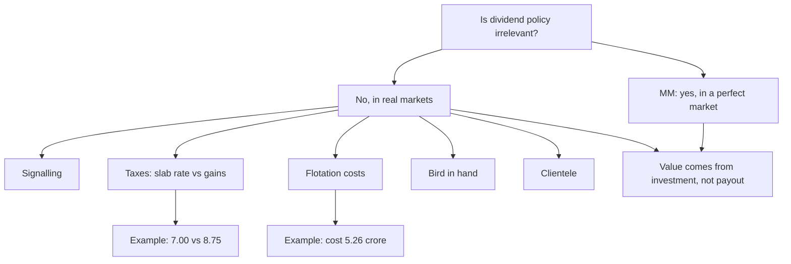

# DV-6: Comparing the Models and Is Dividend Policy Irrelevant

Covers: Walter, Gordon and MM side by side, the five real-world reasons dividend policy matters, and two worked examples (tax clientele and flotation cost) that show where MM's assumptions break. The comparison and the five reasons are **(textbook)**. Tax rates in the example are illustrative **[VERIFY current rates]**.

## Walter vs Gordon vs MM

| | Walter | Gordon | MM |
|---|---|---|---|
| Stance | Relevant | Relevant (bird in hand) | **Irrelevant** |
| Key variable | r versus k | b, r, k (g = br) | Earning power, investment policy |
| Formula | P = [D + (r/k)(E − D)] / k | P0 = E(1 − b) / (k − br) | P0 = (D1 + P1) / (1 + ke) |
| Key assumptions | Internal finance only, constant r and k | As Walter, plus constant b and k > br | Perfect market, no tax, fixed investment policy |
| Optimal policy | Growth: 0%; normal: any; declining: 100% | Same direction; growth retains, declining distributes | None: any payout gives the same value |
| Main weakness | Constant r, extreme answers | k > br limit, constant k | A perfect market is unreal |

**Walter vs MM in four rows (5-mark version):**

| | Walter | MM |
|---|---|---|
| Is dividend relevant? | Yes | No |
| Key driver | r versus k | Earning power and investment policy |
| Market assumption | Internal finance; imperfect-world payout matters | Perfect market, arbitrage |
| Conclusion | Retain if r > k, pay if r < k | Any payout gives the same value |

**Where they agree:** all three accept that value comes from investment returns exceeding the cost of capital. MM's lesson: value is created by investment, not by the payout split.

## Is dividend policy really irrelevant? (5-mark answer)

**Verdict first:** MM is right inside its assumptions and wrong outside them. In real markets dividend policy matters for at least five reasons.

1. **Signalling:** a dividend rise signals management confidence, a cut signals trouble. Prices react, so the policy carries information.
2. **Taxes:** since FY2020-21 Indian dividends are taxed at the shareholder's slab rate, while long-term gains on listed shares are taxed at a lower rate and only on sale. High-bracket investors prefer retention.
3. **Flotation costs:** a firm that pays out and then raises equity wastes money on issue costs, so retention is cheaper.
4. **Bird in hand:** investors treat a cash dividend as safer than a promised gain.
5. **Clientele:** retirees and funds want regular income and buy payers; growth investors do not. A change in policy changes the investor base.

**Indian illustration (qualitative):** investors treat steady payers such as ITC, HUL and Infosys as income stocks, and a surprise cut is read as bad news. That is the signalling and clientele effect at work.

**Close with:** dividend policy is not irrelevant in practice, but MM's value lies in the lesson that value is created by investment, not by the payout split.

## Worked example 1, laid out as the exam answer: tax clientele (illustrative)

**Question (illustrative rates):** A firm earns ₹10 a share. A high-bracket investor pays 30% tax on dividends (slab rate, surcharge and cess ignored) and 12.5% on long-term capital gains **[VERIFY rates]**. Compare paying the whole ₹10 as dividend with retaining it (price rises by ₹10, investor sells later).

1. Dividend route: after-tax cash = 10 × (1 − 0.30) = **₹7.00**.
2. Retention route: gain = ₹10; tax = 10 × 0.125 = ₹1.25; after-tax = **₹8.75**.
3. Difference = 8.75 − 7.00 = **₹1.75 a share** in favour of retention (before any exemption or deferral benefit).

| Route | Pre-tax | Tax | After-tax |
|---|---|---|---|
| Pay ₹10 dividend | ₹10.00 | ₹3.00 | ₹7.00 |
| Retain, sell later | ₹10.00 | ₹1.25 | ₹8.75 |

**Decision line and interpretation:** for this investor retention wins by 25% (1.75 ÷ 7.00). That is a breach of MM's "no tax difference" assumption, and it explains the **clientele effect**: high-bracket investors prefer low-payout firms, while a tax-exempt institution is indifferent. Tax on the gain is also deferred until sale, which adds a time-value benefit. Note the counter-argument: since DDT was abolished, a higher payout is not a tax-efficiency recommendation; if a firm raises payout it must be argued on capital discipline or signalling.

## Worked example 2: flotation cost (illustrative)

A firm pays a ₹100 crore dividend and then needs ₹100 crore of new equity for an investment. Issue costs are 5% of the gross amount raised.

1. Gross issue needed = 100 ÷ (1 − 0.05) = **₹105.26 crore**.
2. Issue cost = 105.26 − 100 = **₹5.26 crore**.

**Interpretation:** paying out and re-raising wastes ₹5.26 crore, so retaining the ₹100 crore would have been cheaper. That breaks MM's "no flotation costs" assumption.

## What to remember

- Walter and Gordon: relevant. MM: irrelevant. Key variable: r vs k (Walter), b, r, k (Gordon), earnings and investment (MM).
- Five reasons policy matters: signalling, taxes, flotation costs, bird in hand, clientele.
- MM is right inside its assumptions; value comes from investment, not the payout split.
- Tax example (illustrative): ₹7.00 dividend versus ₹8.75 gain after tax, retention wins by ₹1.75.
- Flotation example: re-raising ₹100 crore at 5% costs ₹5.26 crore.
- In the exam give the verdict first, then the five points, then one Indian line.

## Concept map

## Flashcards
Q: Walter versus Gordon versus MM in one line each.
A: Walter: payout depends on r versus k. Gordon: value is D1/(k − br) with bird in hand. MM: payout is irrelevant in a perfect market.

Q: Name the five reasons dividend policy matters in practice.
A: Signalling, taxes, flotation costs, bird in hand, clientele.

Q: What does a dividend cut signal?
A: Management expects trouble; prices usually fall on the announcement, so the policy carries information.

Q: What is the clientele effect?
A: Investors choose firms by payout (retirees want income, high-bracket investors prefer gains), so a policy change changes the investor base.

Q: Why do flotation costs break MM?
A: A firm that pays out and then raises equity wastes issue costs, so retention is cheaper than payout and re-raising.

Q: Tax example: ₹10 dividend at 30% versus ₹10 gain at 12.5%. After-tax amounts?
A: Dividend ₹7.00; retained gain ₹8.75. Retention wins by ₹1.75 (illustrative rates).

Q: Flotation example: net ₹100 crore needed, issue cost 5% of gross. Gross and cost?
A: Gross ₹105.26 crore; cost ₹5.26 crore.

Q: What is the useful lesson of MM even though its assumptions fail?
A: Value is created by investment decisions (returns above the cost of capital), not by how profit is split.

Q: Walter versus MM: stance and key driver?
A: Walter: relevant, driven by r versus k. MM: irrelevant, driven by earning power and investment policy.

Q: Which Indian companies illustrate signalling and clientele?
A: ITC, HUL and Infosys are seen as steady income stocks; a surprise cut is read as bad news. Use qualitatively.

## Sources
- Vault note: `SFM CIA3 - Unit II Dividend Theory and Policy` (sections 6 and 7)
- Textbook method: Prasanna Chandra, I M Pandey
- Next node: [[SFM Unit 2 - DV-7 Unit 2 Exam Answers]]
- [[SFM Unit 2 - Dividend Policy MOC (Node Map)]]
