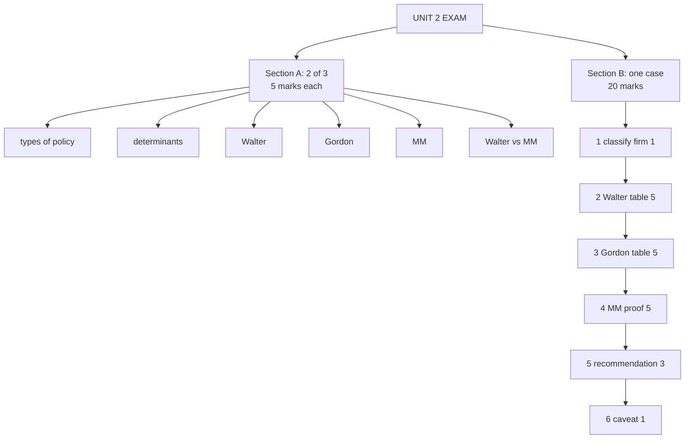

# DV-7: Unit 2 Exam Answers

Covers: what the paper will ask, six 5-mark answer skeletons, the 20-mark dividend case layout with marks, and a full model answer that runs Walter, Gordon and MM on one data set and ends with a recommendation. Numbers come from DV-3 to DV-5. The Walter and MM theory is **(class)**; Gordon and the case layout are **(textbook)**; the case data is illustrative.

## What the paper will ask

The course plan gives a 1-hour, 30-mark paper: Section A, two of three questions at 5 marks; Section B, one 20-mark case. The vault formula sheet records CIA3 as covering Units IV and V only, so Units I and II are more likely tested at the end-semester exam **[VERIFY the date and scope with faculty]**. This unit is a natural 20-marker: the numbers are short and all three models can be run on one data set. Learn the Walter table, the Gordon validity check and the MM proof cold.

## Five-mark answer skeletons

1. **Types of dividend policy (DV-1).** Define dividend policy. Stable, irregular, no dividend, residual: one line each with when a firm uses it. Close with the link to investor preference.
2. **Determinants of dividend policy (DV-2).** Group them: legal, financial (liquidity, earnings stability, growth, covenants), market (capital-market access, clientele, tax), control and inflation. One line of effect per item. One Indian line (no DDT, slab-rate tax on the holder).
3. **Walter model (DV-3).** Assumptions (three points), formula with symbols, the three-case rule (r > k, = k, < k) with firm type, one criticism.
4. **Gordon model (DV-4).** Formula, g = br, condition k > br, bird in hand, one criticism. State clearly how it differs from Walter.
5. **MM hypothesis (DV-5).** Claim, assumptions, formula P0 = (D1 + P1)/(1 + ke), arbitrage argument in two lines, mini-example (₹80, 10%, ₹4: 84 + 4 = 88), criticism.
6. **Walter vs MM (DV-6).** Relevance versus irrelevance, key variable, assumptions on markets, conclusion. Use a four-row table.

Also possible: "Is dividend policy irrelevant?" (DV-6, five reasons) and Lintner in one paragraph (DV-1).

## 20-mark case layout

**Likely prompt:** "A firm has EPS ₹12, cost of capital 12%, and can reinvest at 15%. Payout options are 0%, 25%, 50%, 75% and 100%. (a) Value the share using Walter. (b) Use Gordon. (c) Show MM irrelevance for given n, P0, I. (d) Recommend a payout."

| Block | Marks | Content |
|---|---|---|
| 1 Classify the firm | 1 | r = 15% > k = 12%, so a growth firm. Say it first |
| 2 Walter table | 5 | Formula with brackets, one worked line, then the table |
| 3 Gordon table | 5 | Check k > br first; mark invalid cells |
| 4 MM proof | 5 | P1, Δn and value-of-firm formulas with the case numbers; equal firm value under two dividends; comment that r > k is ignored only because investment policy is fixed |
| 5 Recommendation | 3 | A reasoned payout, with reasons |
| 6 Caveat | 1 | One line that the models rest on constant r and k; MM says none of this matters in a perfect market |

## Model answer, laid out as the exam answer

**Data:** EPS E = ₹12, k = 12%, r = 15%. For part (c) assume (illustrative, since the question will give its own): n = 1,00,000 shares, P0 = ₹100, ke = 12%, total earnings ₹12,00,000, investment I = ₹15,00,000.

**1. Classify.** r = 15% exceeds k = 12%, so this is a **growth firm**. Walter favours retention.

**2. Walter: P = [D + (r/k)(E − D)] ÷ k.** Here r/k = 0.15 ÷ 0.12 = 1.25. Sample at 50% payout: P = [6 + 1.25 × 6] ÷ 0.12 = 13.5 ÷ 0.12 = ₹112.50.

| Payout | D | E − D | Walter P |
|---|---|---|---|
| 0% | ₹0 | ₹12 | ₹125.00 |
| 25% | ₹3 | ₹9 | ₹118.75 |
| 50% | ₹6 | ₹6 | ₹112.50 |
| 75% | ₹9 | ₹3 | ₹106.25 |
| 100% | ₹12 | ₹0 | ₹100.00 |

**3. Gordon: P0 = E(1 − b) ÷ (k − br).** Check validity first.

| Payout | b | br | k − br | Gordon P0 |
|---|---|---|---|---|
| 0% | 1.00 | 0.150 | -0.030 | invalid |
| 25% | 0.75 | 0.1125 | 0.0075 | ₹400.00 (br almost equals k; treat as unreliable) |
| 50% | 0.50 | 0.075 | 0.045 | ₹133.33 |
| 75% | 0.25 | 0.0375 | 0.0825 | ₹109.09 |
| 100% | 0 | 0 | 0.120 | ₹100.00 |

Workings: 25%: 3 ÷ 0.0075 = 400; 50%: 6 ÷ 0.045 = 133.33; 75%: 9 ÷ 0.0825 = 109.09; 100%: 12 ÷ 0.12 = 100.

**4. MM proof** with the assumed data. Compare D1 = ₹6 and D1 = ₹0.

| Step | D1 = ₹6 | D1 = ₹0 |
|---|---|---|
| P1 = 100 × 1.12 − D1 | ₹106 | ₹112 |
| Total dividend n × D1 | ₹6,00,000 | ₹0 |
| Gap = I − (E − nD1) | ₹9,00,000 | ₹3,00,000 |
| New shares Δn = gap ÷ P1 | 8,491 | 2,679 |
| (n + Δn) × P1 | ₹1,15,00,000 | ₹1,15,00,000 |
| Value = [(n+Δn)P1 − I + E] ÷ 1.12 | **₹1,00,00,000** | **₹1,00,00,000** |

Check: n × P0 = ₹1,00,00,000. The value is identical (the exact share counts are 8,490.57 and 2,678.57; rounding them moves the value by under ₹30).

Comment for the marks: MM ignores Walter's r > k advantage only because it holds investment policy fixed (I is the same under both dividends). The growth is financed either way; only who funds it (retained earnings or new shareholders) changes.

**5. Recommendation.** Both Walter and Gordon rank a low payout highest for a growth firm, so recommend **retention-led, low payout, about 25% to 50%**, not 0%. Reasons: (i) zero payout is an extreme that depends on r staying at 15% on every rupee reinvested, which fails as projects run out; (ii) Gordon becomes unreliable near br ≈ k (it fails at 0% and is distorted at 25%); (iii) shareholders want some signal and income (bird in hand, clientele); (iv) a stable low payout with a later increase fits Lintner smoothing. Add: for a firm with r < k the answer flips to distribute.

**6. Caveat.** The models assume constant r and k and internal finance. MM says none of this matters in a perfect market; the recommendation therefore rests on taxes, flotation costs and signalling being real.

**Decision line:** retain most earnings and pay a modest, stable dividend (25% to 50% payout) because the firm earns 15% against a 12% cost of capital.

## Time rule

If time runs short: classify the firm, give the Walter table, write the Gordon validity check with two rows, show the MM table for one dividend, then write the recommendation. Method marks are given even if the arithmetic slips.

## What to remember

- Section A: pick two of three. Models: assumptions, formula with symbols, rule, one criticism.
- Case order: classify, Walter, Gordon (check validity), MM proof, recommendation, caveat.
- Walter table for E 12, k 12%, r 15%: 125.00, 118.75, 112.50, 106.25, 100.00 at 0, 25, 50, 75, 100% payout.
- Gordon for the same data: invalid, 400 (unreliable), 133.33, 109.09, 100.
- MM: firm value ₹1 crore for D1 = ₹6 or ₹0 (illustrative), new shares 8,491 vs 2,679.
- Recommend 25% to 50% payout, not 0%, and say why.

## Concept map

## Flashcards
Q: What is the probable format of the Unit II paper (assumption, scope unconfirmed)?
A: If Unit II is tested in the course-plan format: 1 hour, 30 marks: Section A two of three questions at 5 marks, Section B one 20-mark case. Confirm the date and scope with faculty.

Q: How are the 20 marks split in the dividend case?
A: Classify 1, Walter table 5, Gordon table 5, MM proof 5, recommendation 3, caveat 1.

Q: First thing to write in the dividend case?
A: Classify the firm by comparing r with k (r = 15% > k = 12% is a growth firm).

Q: Walter price for E ₹12, k 12%, r 15%, payout 50%?
A: [6 + (0.15/0.12) × 6] ÷ 0.12 = 13.5 ÷ 0.12 = ₹112.50.

Q: Walter prices for that firm at 0%, 25%, 50%, 75%, 100% payout?
A: ₹125.00, ₹118.75, ₹112.50, ₹106.25, ₹100.00.

Q: Gordon price for that firm at 50% payout, and what must be checked first?
A: k − br = 0.12 − 0.075 = 0.045, so P0 = 6 ÷ 0.045 = ₹133.33. Check k > br first.

Q: Why is Gordon invalid at 0% payout for that firm?
A: b = 1, br = 0.15 exceeds k = 0.12, so k − br is negative.

Q: What does your recommendation say for a growth firm, and why not 0%?
A: A low payout (about 25% to 50%). Zero is extreme: it depends on constant r, Gordon fails near br ≈ k, and investors want some income and signal.

Q: MM proof: how do you show firm value is the same for two dividends?
A: Compute P1 = P0(1 + ke) − D1, Δn = [I − (E − nD1)] ÷ P1, then value = [(n + Δn)P1 − I + E] ÷ (1 + ke) for each dividend and show they are equal.

Q: What if time runs short in the dividend case?
A: Classify, give the Walter table, check Gordon validity with two rows, show one MM column, write the recommendation.

Q: Skeleton for "Walter vs MM" in 5 marks?
A: Four-row table (relevance, key variable, market assumption, conclusion) plus a closing line that MM holds only in a perfect market.

## Sources
- Course plan exam pattern; vault note `SFM CIA3 - MOC and Formula Sheet`
- Vault note: `SFM CIA3 - Unit II Dividend Theory and Policy` (sections 8 and 9)
- [[SFM Unit 2 - Dividend Policy MOC (Node Map)]]
